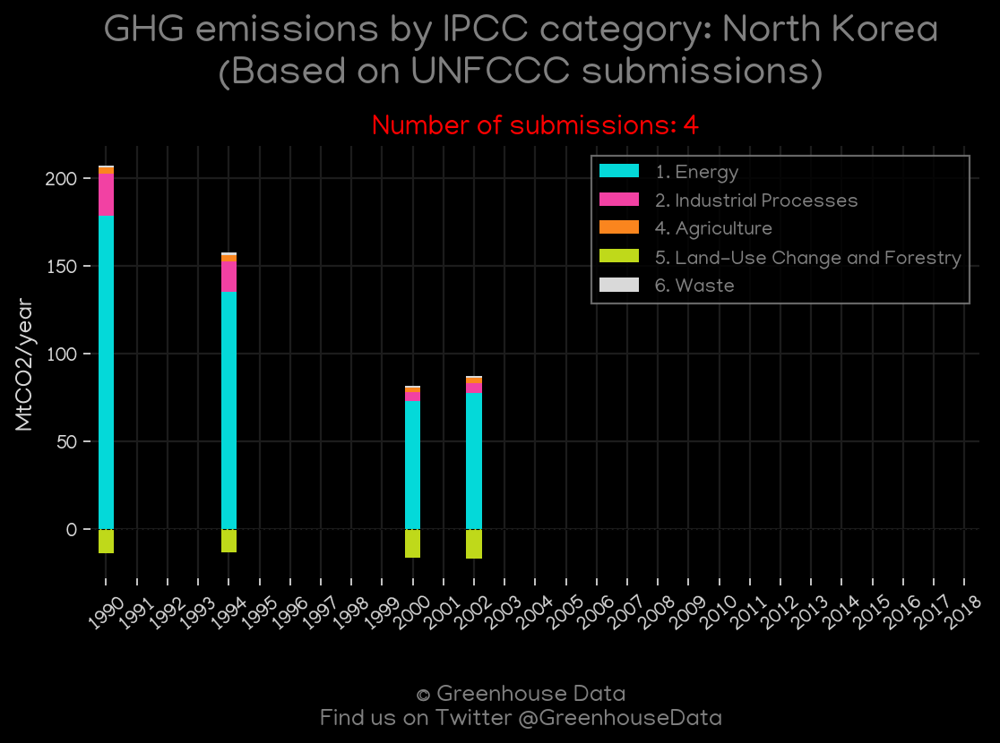
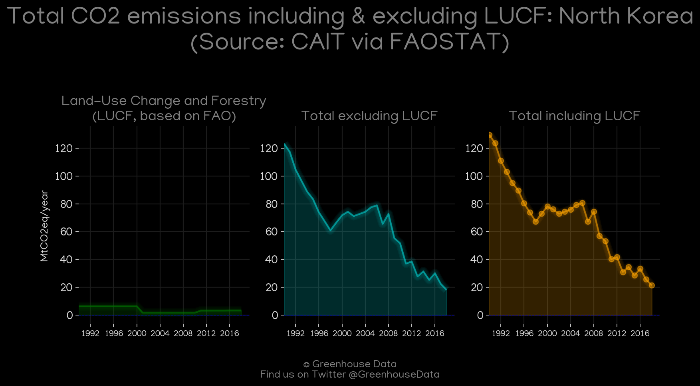
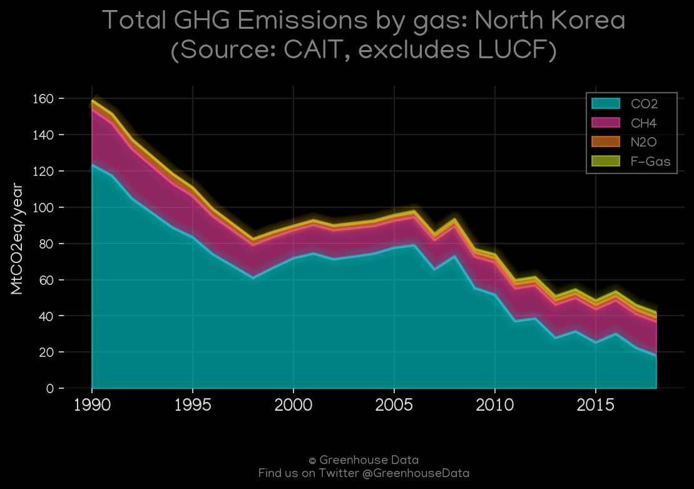
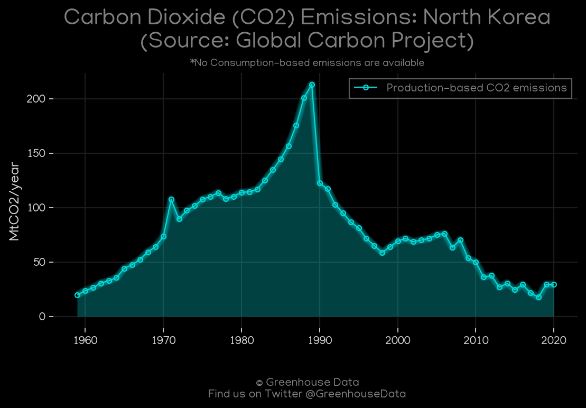
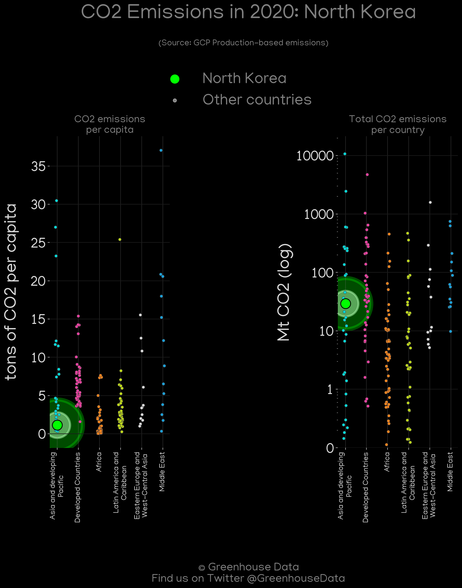
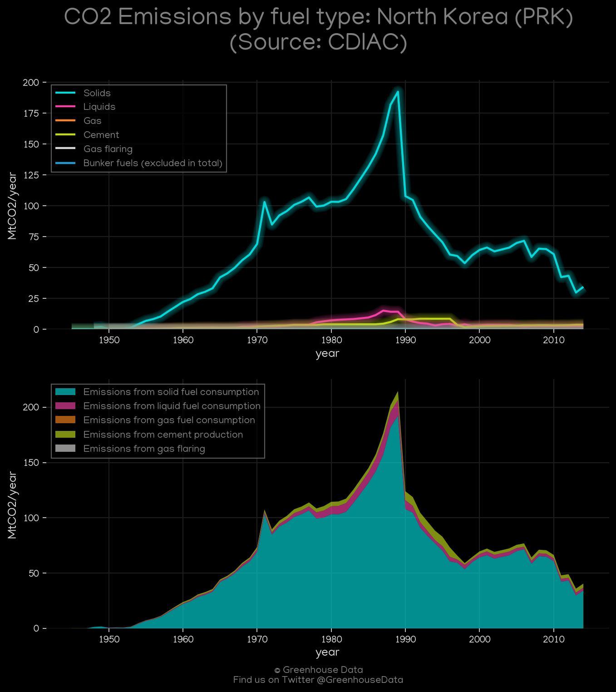
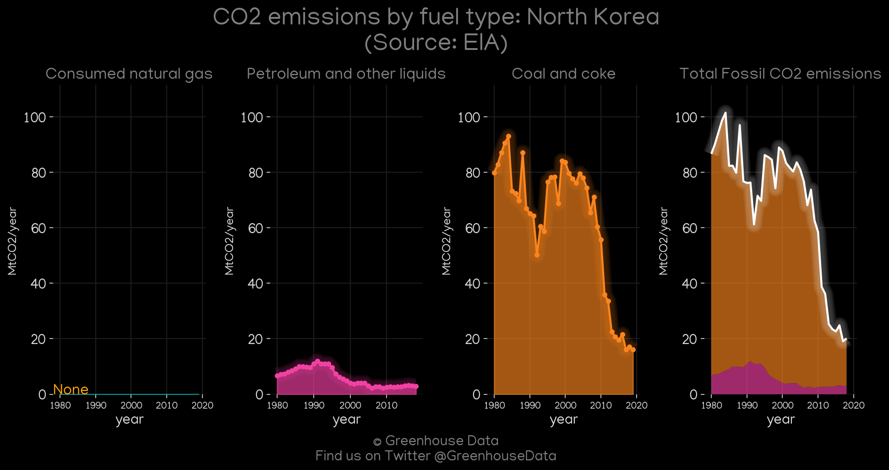
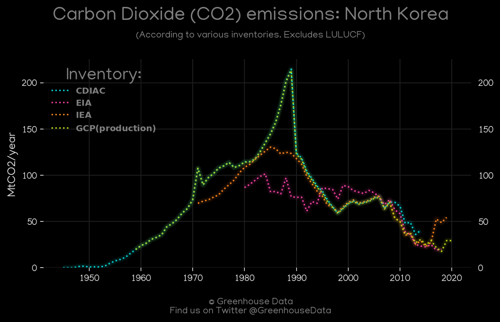
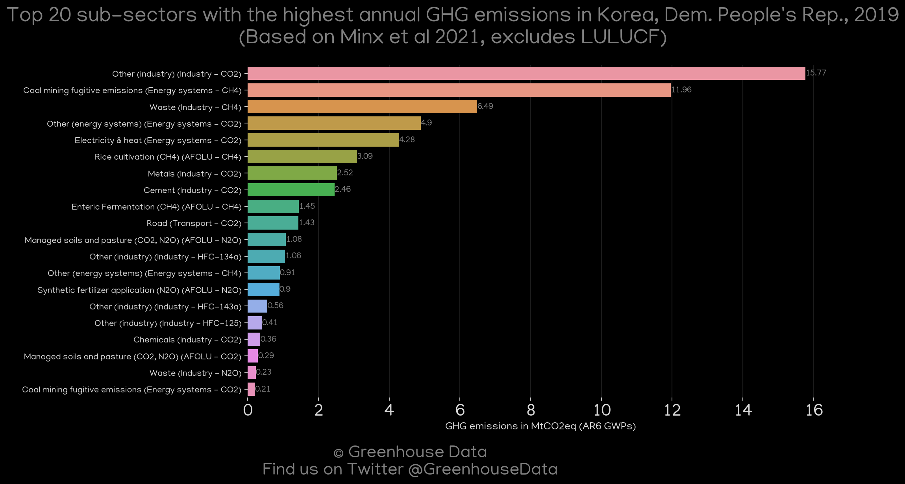

<h1 align="center">
🇰🇵🇰🇵🇰🇵🇰🇵🇰🇵
 
North Korea
 
🇰🇵🇰🇵🇰🇵🇰🇵🇰🇵
</h1>
<h2>Datasets:</h2>

<a href="https://github.com/dquintani/GreenhouseData/tree/master/country_data/PRK_North Korea/data">View on Github</a>
 

<a href="data/PRK_GCP_consupmption.csv">GCP_consupmption</a> || <a href="data/PRK_PRIMAP-hist.csv">PRIMAP-hist</a> || <a href="data/PRK_GCP.csv">GCP</a> || <a href="data/PRK_EDGAR.csv">EDGAR</a> || <a href="data/PRK_Minx_2021.csv">Minx_2021</a> || <a href="data/PRK_EPA.csv">EPA</a> || <a href="data/PRK_CAIT.csv">CAIT</a> || <a href="data/PRK_EIA.csv">EIA</a> || <a href="data/PRK_FAO.csv">FAO</a> || <a href="data/PRK_IEA.csv">IEA</a> || <a href="data/PRK_CDIAC.csv">CDIAC</a>

 

<h1>Figures:</h1><h2>#1 (PRK_UNFCCC_NAI_1)</h2>

<h2>#2 (PRK_CAIT_lucf_vs_nolucf)</h2>

<h2>#3 (PRK_CAIT_gases_1)</h2>

<h2>#4 (PRK_GCP_1)</h2>

<h2>#5 (PRK_IEA_1)</h2>

<h2>#6 (PRK_GCP_Country_Highlight)</h2>

<h2>#7 (PRK_relative_totals)</h2>

<h2>#8 (PRK_CDIAC_1)</h2>

<h2>#9 (PRK_EIA_1)</h2>

<h2>#10 (PRK_CO2_totals)</h2>

<h2>#11 (PRK_Minx_top20_subsectors)</h2>

