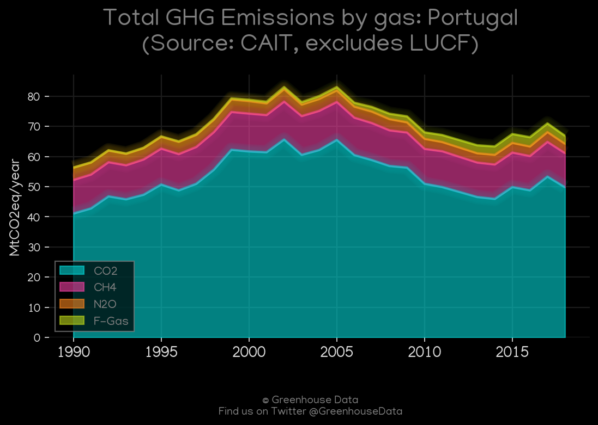
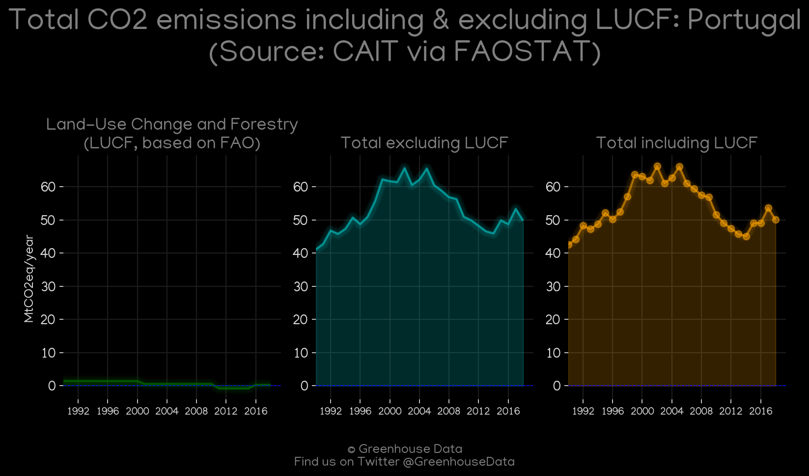
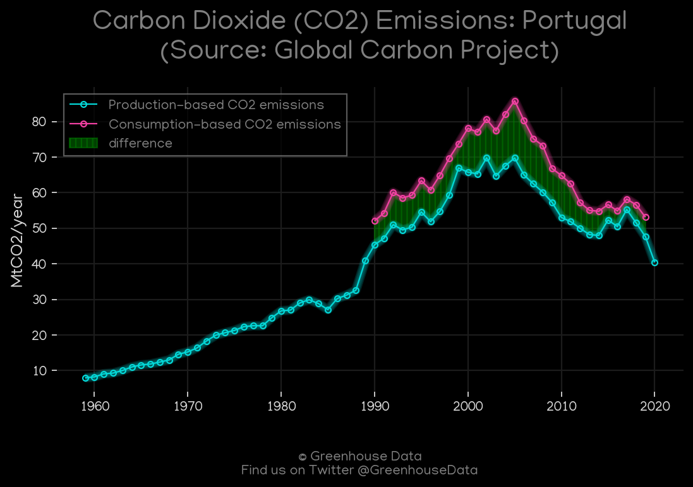
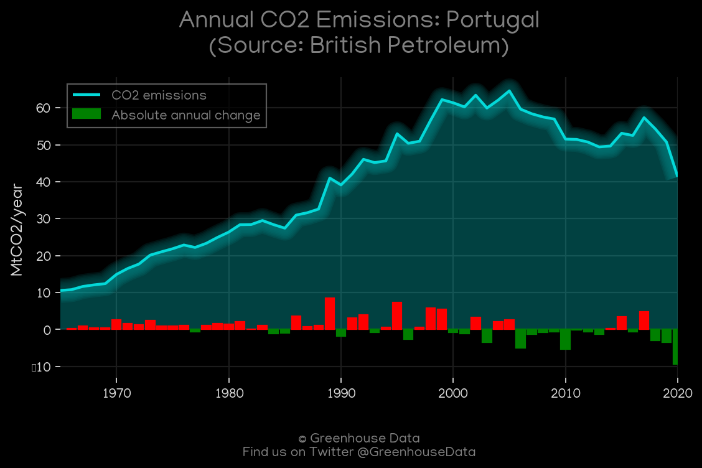
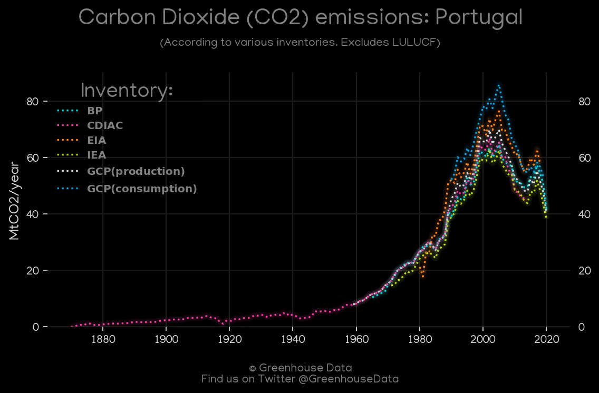
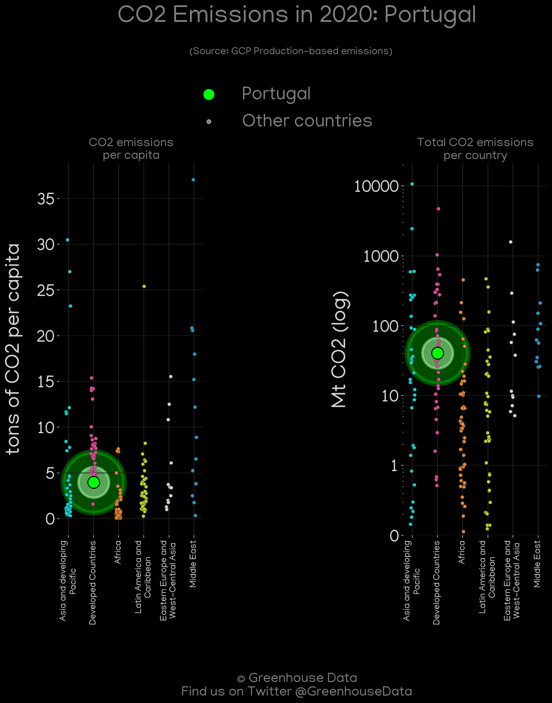
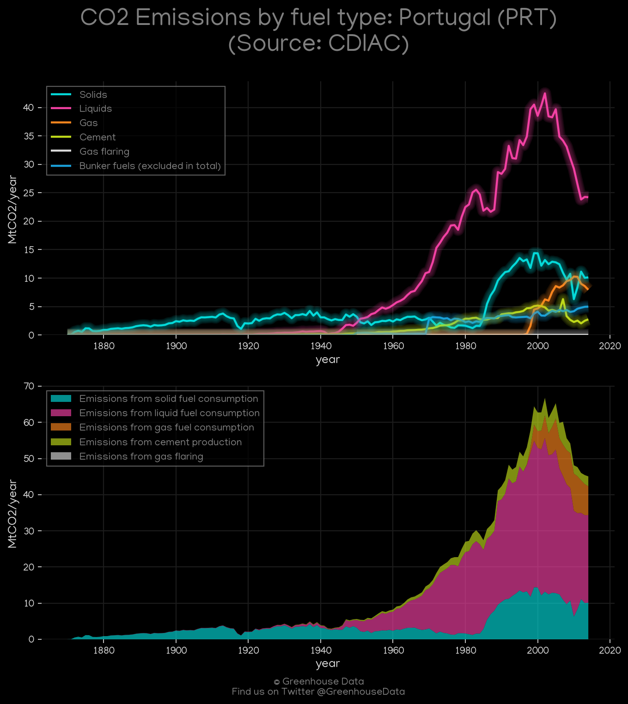

<h1 align="center">
🇵🇹🇵🇹🇵🇹🇵🇹🇵🇹
 
Portugal
 
🇵🇹🇵🇹🇵🇹🇵🇹🇵🇹
</h1>
<h2>Datasets:</h2>

<a href="https://github.com/dquintani/GreenhouseData/tree/master/country_data/PRT_Portugal/data">View on Github</a>
 

<a href="data/PRT_IEA.csv">IEA</a> || <a href="data/PRT_GCP.csv">GCP</a> || <a href="data/PRT_PRIMAP-hist.csv">PRIMAP-hist</a> || <a href="data/PRT_EPA.csv">EPA</a> || <a href="data/PRT_GCP_consupmption.csv">GCP_consupmption</a> || <a href="data/PRT_EIA.csv">EIA</a> || <a href="data/PRT_EDGAR.csv">EDGAR</a> || <a href="data/PRT_BP.csv">BP</a> || <a href="data/PRT_CAIT.csv">CAIT</a> || <a href="data/PRT_CDIAC.csv">CDIAC</a> || <a href="data/PRT_FAO.csv">FAO</a> || <a href="data/PRT_Minx_2021.csv">Minx_2021</a>

 

<h1>Figures:</h1><h2>#1 (PRT_CAIT_gases_1)</h2>

<h2>#2 (PRT_CAIT_lucf_vs_nolucf)</h2>

<h2>#3 (PRT_IEA_1)</h2>

<h2>#4 (PRT_GCP_1)</h2>

<h2>#5 (PRT_EIA_1)</h2>

<h2>#6 (PRT_BP_1)</h2>

<h2>#7 (PRT_CO2_totals)</h2>

<h2>#8 (PRT_GCP_Country_Highlight)</h2>

<h2>#9 (PRT_Minx_top20_subsectors)</h2>

<h2>#10 (PRT_UNFCCC_AI_1)</h2>

<h2>#11 (PRT_CDIAC_1)</h2>

