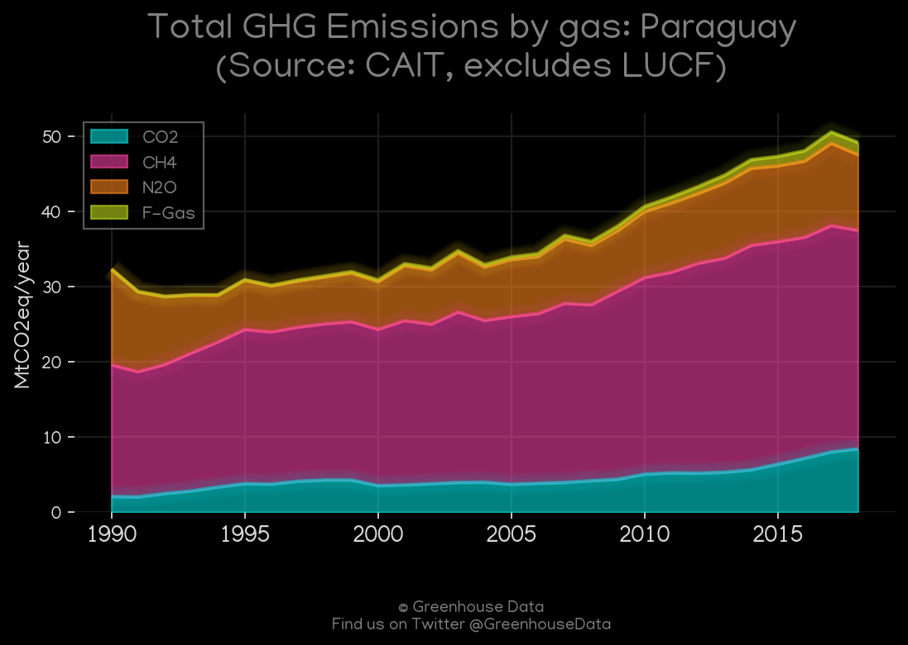
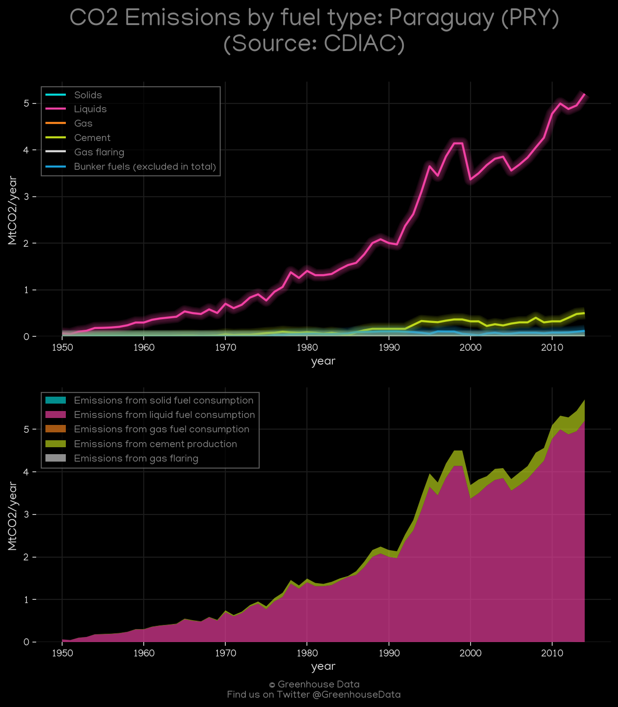
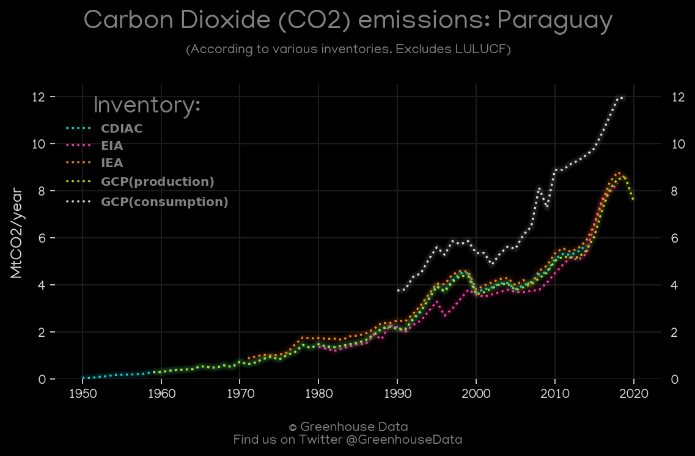
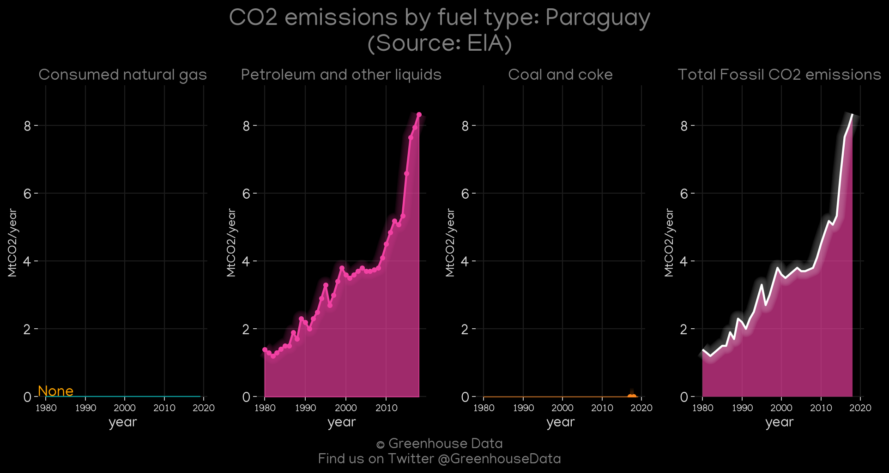
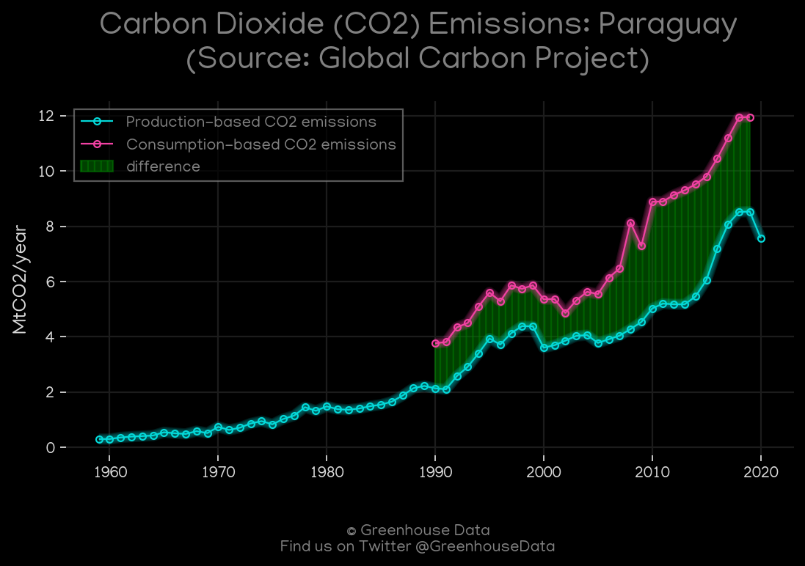
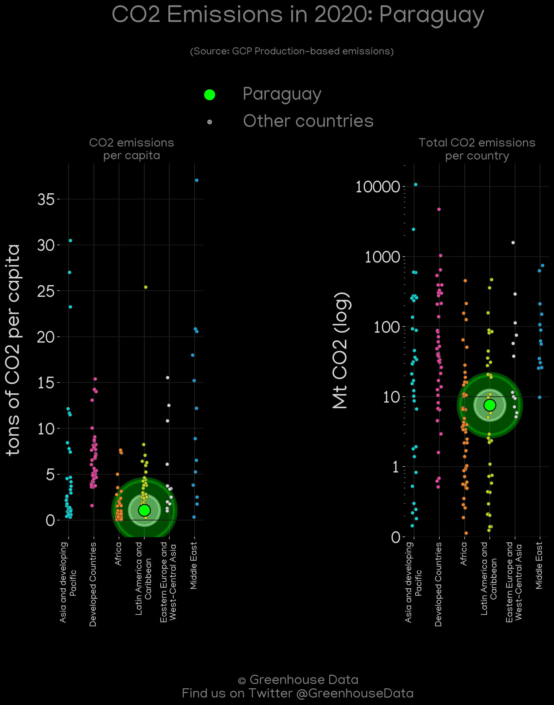
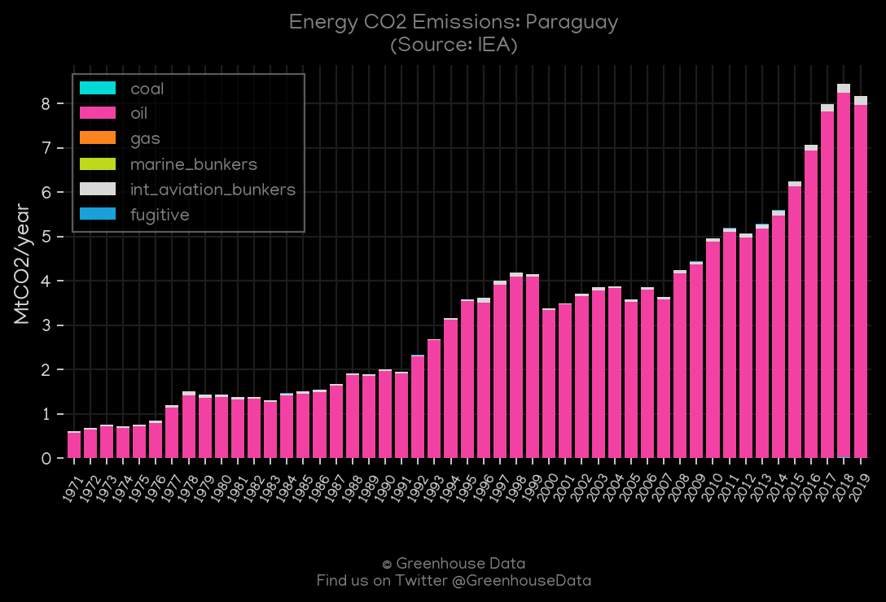
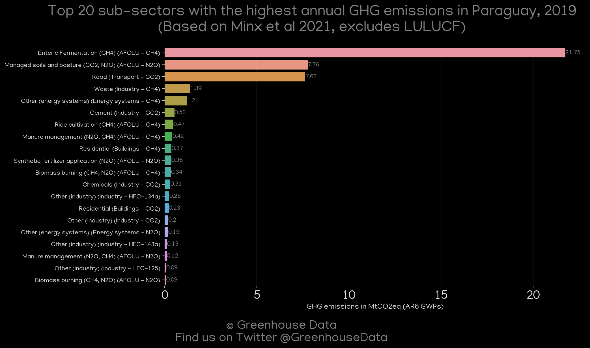
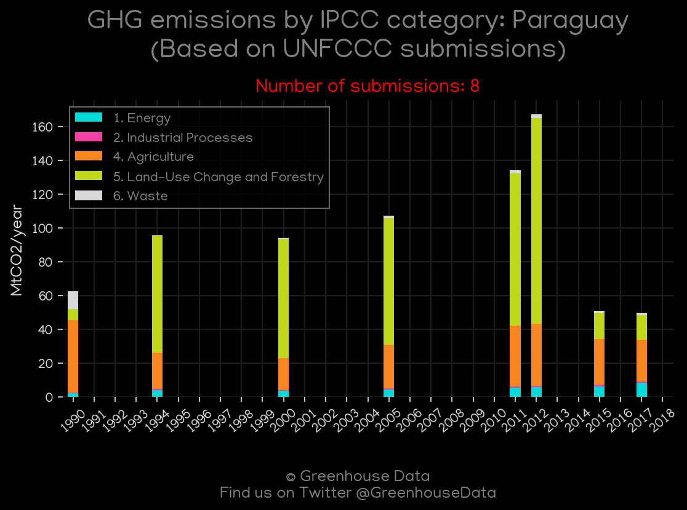

<h1 align="center">
🇵🇾🇵🇾🇵🇾🇵🇾🇵🇾
 
Paraguay
 
🇵🇾🇵🇾🇵🇾🇵🇾🇵🇾
</h1>
<h2>Datasets:</h2>

<a href="https://github.com/dquintani/GreenhouseData/tree/master/country_data/PRY_Paraguay/data">View on Github</a>
 

<a href="data/PRY_CAIT.csv">CAIT</a> || <a href="data/PRY_CDIAC.csv">CDIAC</a> || <a href="data/PRY_EDGAR.csv">EDGAR</a> || <a href="data/PRY_EIA.csv">EIA</a> || <a href="data/PRY_EPA.csv">EPA</a> || <a href="data/PRY_FAO.csv">FAO</a> || <a href="data/PRY_GCP.csv">GCP</a> || <a href="data/PRY_GCP_consupmption.csv">GCP_consupmption</a> || <a href="data/PRY_IEA.csv">IEA</a> || <a href="data/PRY_Minx_2021.csv">Minx_2021</a> || <a href="data/PRY_PRIMAP-hist.csv">PRIMAP-hist</a>

 

<h1>Figures:</h1><h2>#1 (PRY_CAIT_gases_1)</h2>

<h2>#2 (PRY_CAIT_lucf_vs_nolucf)</h2>

<h2>#3 (PRY_CDIAC_1)</h2>

<h2>#4 (PRY_CO2_totals)</h2>

<h2>#5 (PRY_EIA_1)</h2>

<h2>#6 (PRY_GCP_1)</h2>

<h2>#7 (PRY_GCP_Country_Highlight)</h2>

<h2>#8 (PRY_IEA_1)</h2>

<h2>#9 (PRY_Minx_top20_subsectors)</h2>

<h2>#10 (PRY_relative_totals)</h2>

<h2>#11 (PRY_UNFCCC_NAI_1)</h2>

