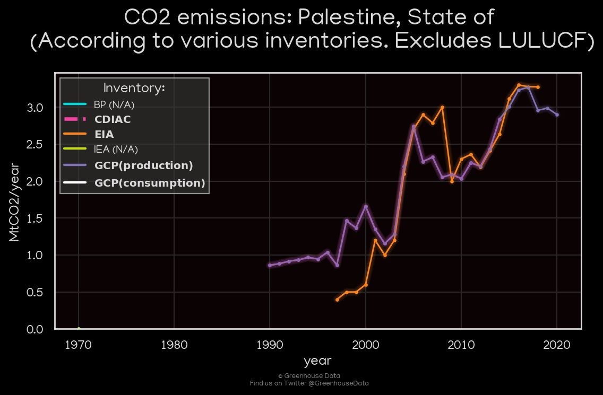
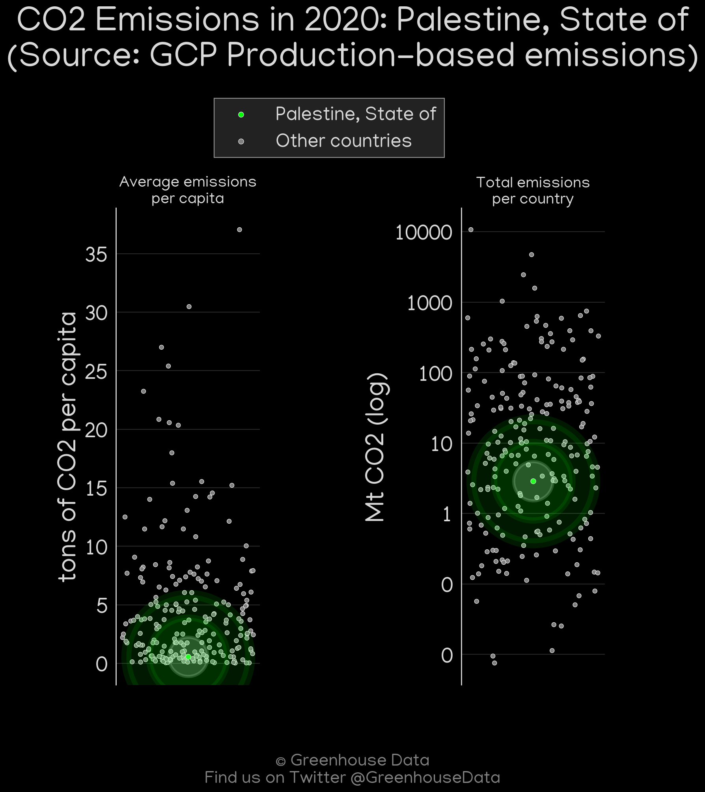
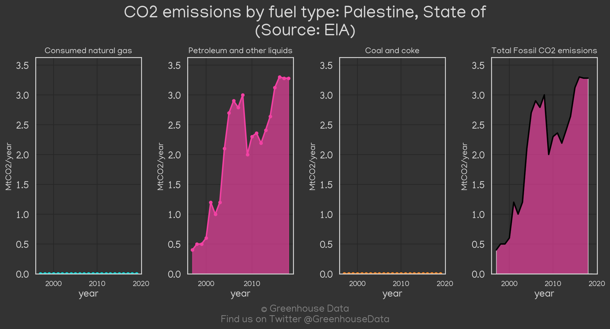
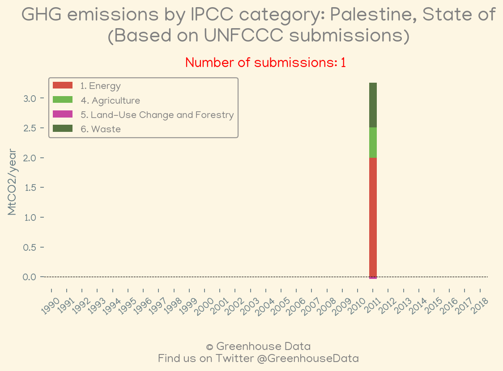
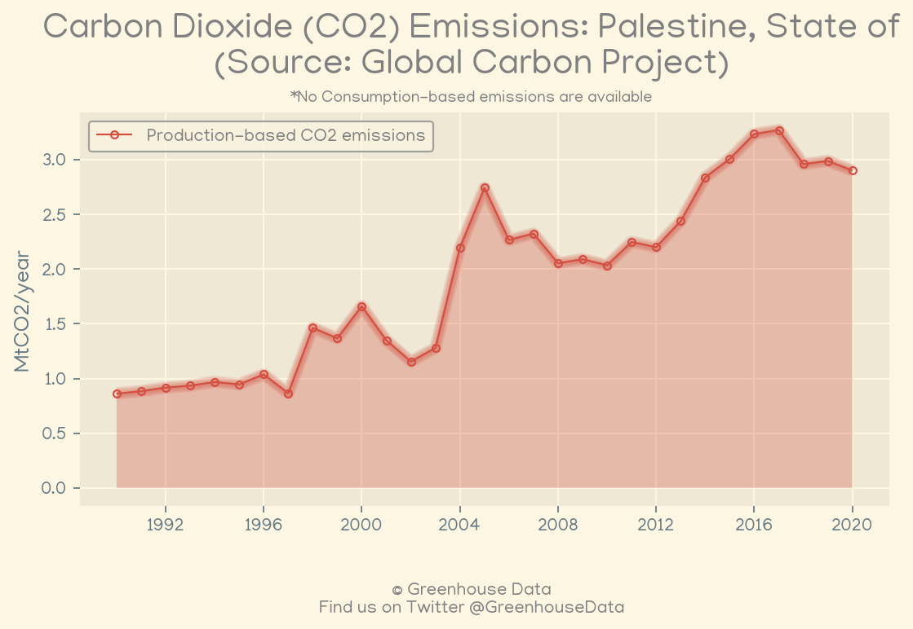
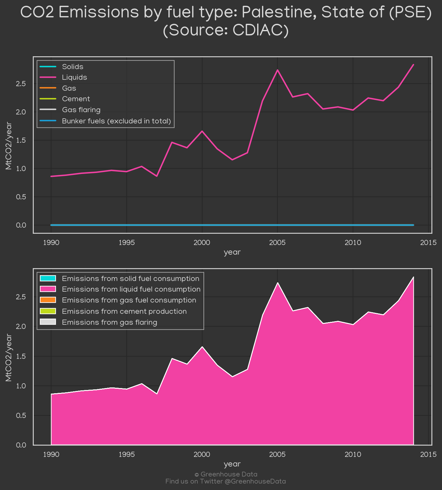

<h1 align="center">
🇵🇸🇵🇸🇵🇸🇵🇸🇵🇸
 
Palestine, State of
 
🇵🇸🇵🇸🇵🇸🇵🇸🇵🇸
</h1>
<h2>Datasets:</h2>

<a href="https://github.com/dquintani/GreenhouseData/tree/master/country_data/PSE_Palestine, State of/data">View on Github</a>
 

<a href="data/PSE_FAO.csv">FAO</a> || <a href="data/PSE_GCP.csv">GCP</a> || <a href="data/PSE_CDIAC.csv">CDIAC</a> || <a href="data/PSE_EIA.csv">EIA</a> || <a href="data/PSE_GCP_consupmption.csv">GCP_consupmption</a>

 

<h1>Figures:</h1><h2>#1 (PSE_CO2_totals)</h2>

<h2>#2 (PSE_GCP_Country_Highlight)</h2>

<h2>#3 (PSE_EIA_1)</h2>

<h2>#4 (PSE_UNFCCC_NAI_1)</h2>

<h2>#5 (PSE_GCP_1)</h2>

<h2>#6 (PSE_CDIAC_1)</h2>

