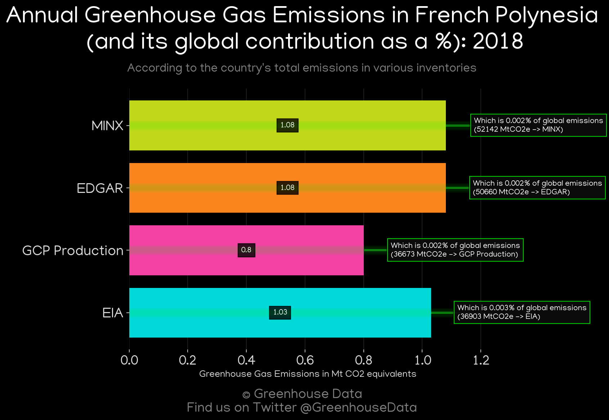
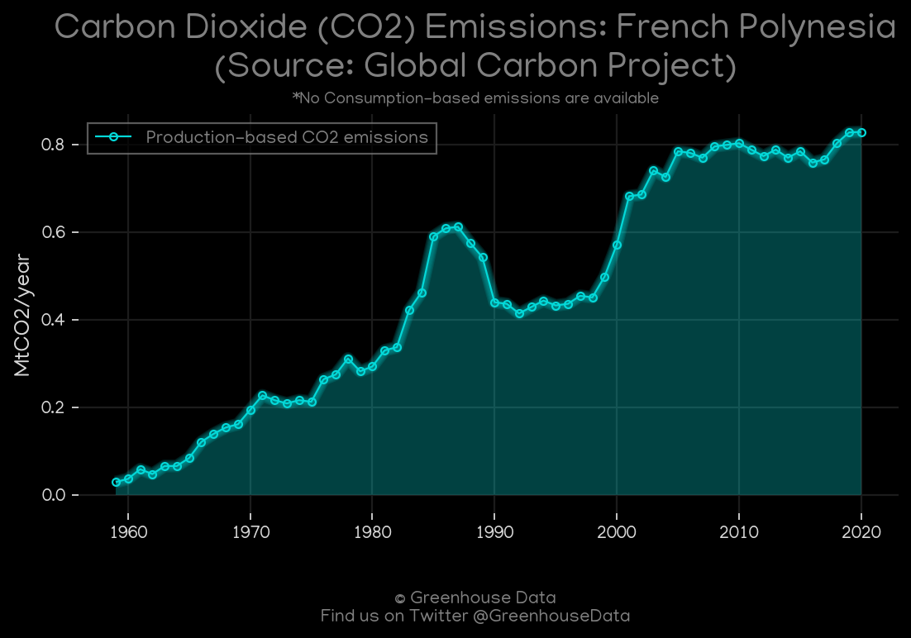
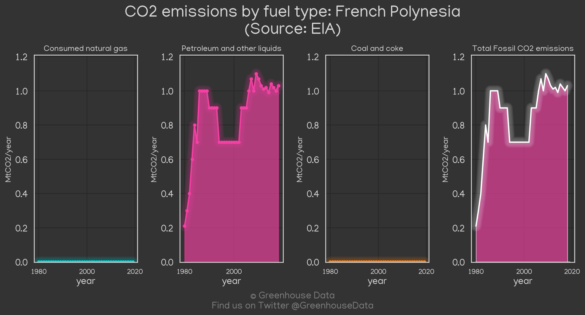
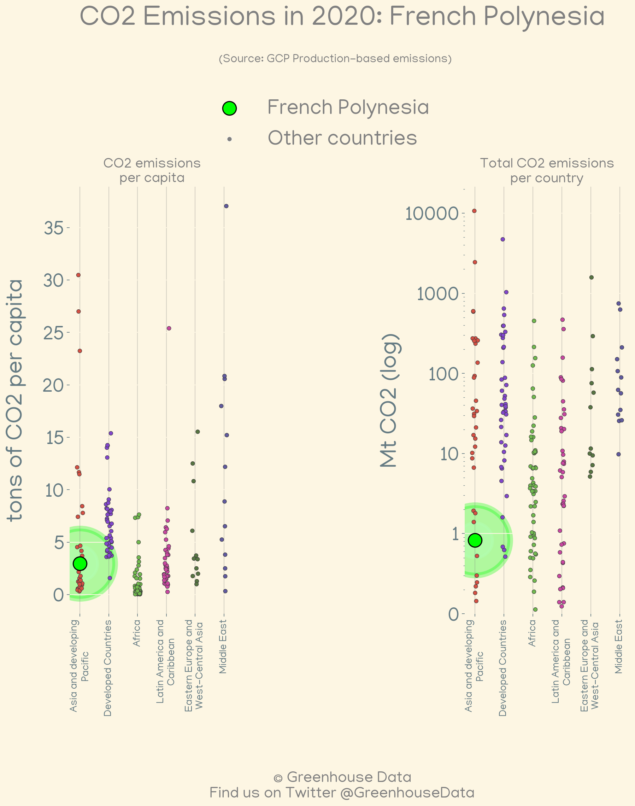
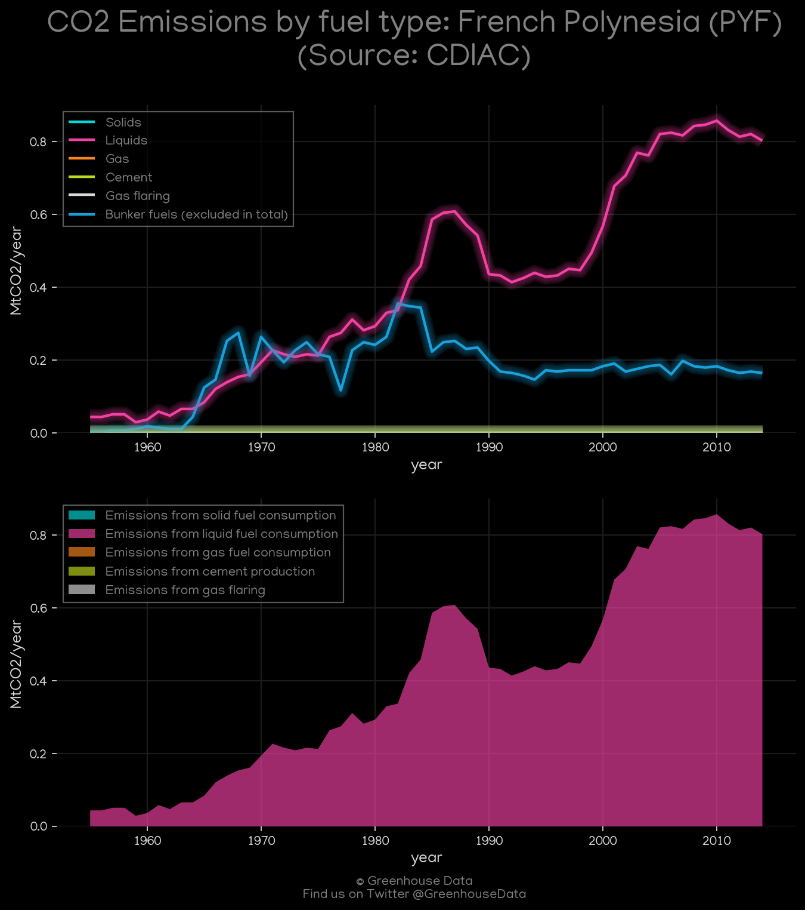
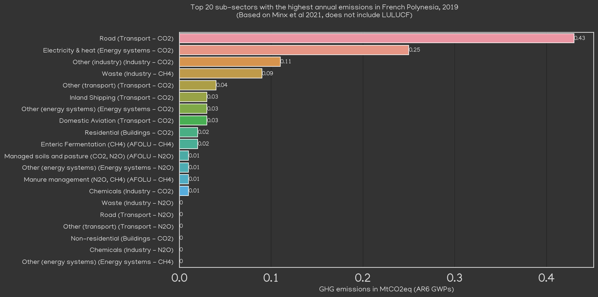
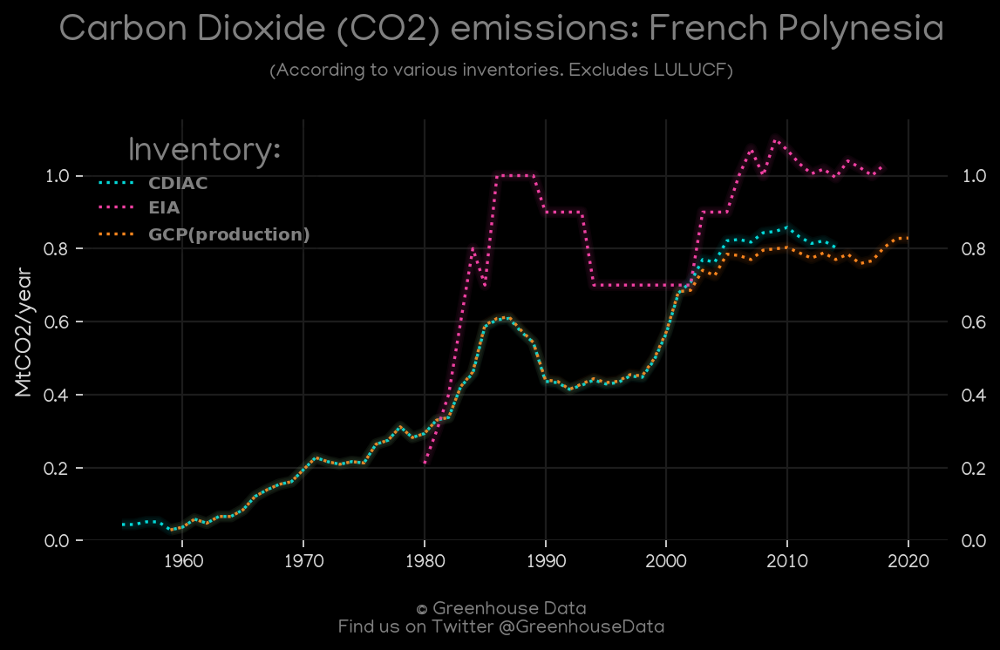

<h1 align="center">
🇵🇫🇵🇫🇵🇫🇵🇫🇵🇫
 
French Polynesia
 
🇵🇫🇵🇫🇵🇫🇵🇫🇵🇫
</h1>
<h2>Datasets:</h2>

<a href="https://github.com/dquintani/GreenhouseData/tree/master/country_data/PYF_French Polynesia/data">View on Github</a>
 

<a href="data/PYF_EDGAR.csv">EDGAR</a> || <a href="data/PYF_GCP_consupmption.csv">GCP_consupmption</a> || <a href="data/PYF_GCP.csv">GCP</a> || <a href="data/PYF_Minx_2021.csv">Minx_2021</a> || <a href="data/PYF_CDIAC.csv">CDIAC</a> || <a href="data/PYF_FAO.csv">FAO</a> || <a href="data/PYF_EIA.csv">EIA</a>

 

<h1>Figures:</h1><h2>#1 (PYF_relative_totals)</h2>

<h2>#2 (PYF_GCP_1)</h2>

<h2>#3 (PYF_EIA_1)</h2>

<h2>#4 (PYF_GCP_Country_Highlight)</h2>

<h2>#5 (PYF_CDIAC_1)</h2>

<h2>#6 (PYF_Minx_top20_subsectors)</h2>

<h2>#7 (PYF_CO2_totals)</h2>

