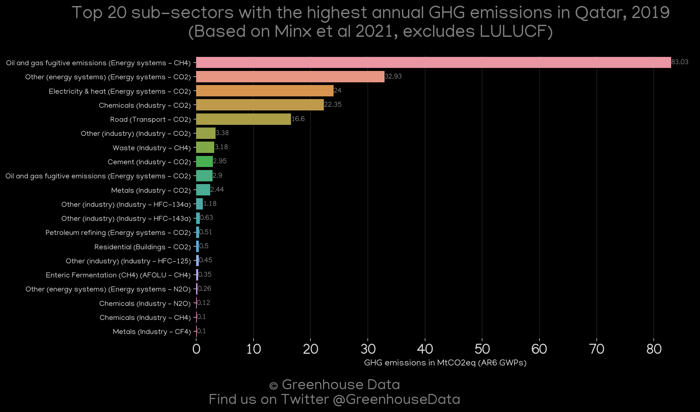
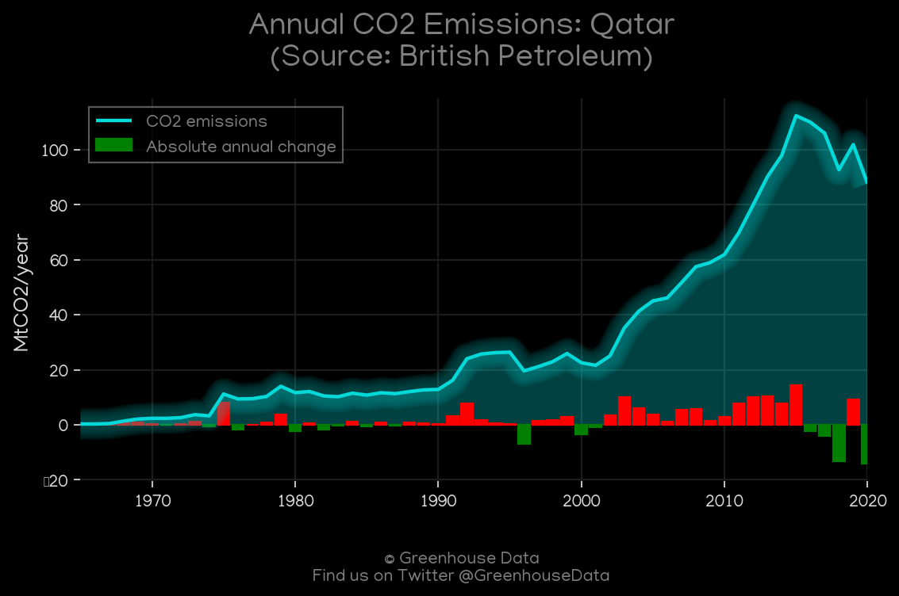
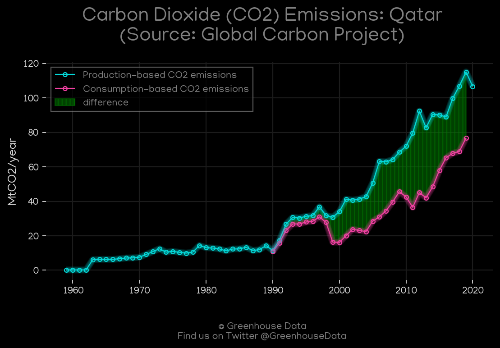
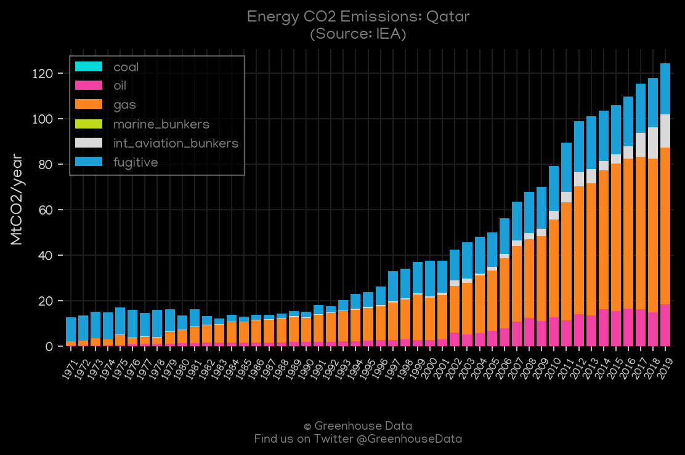
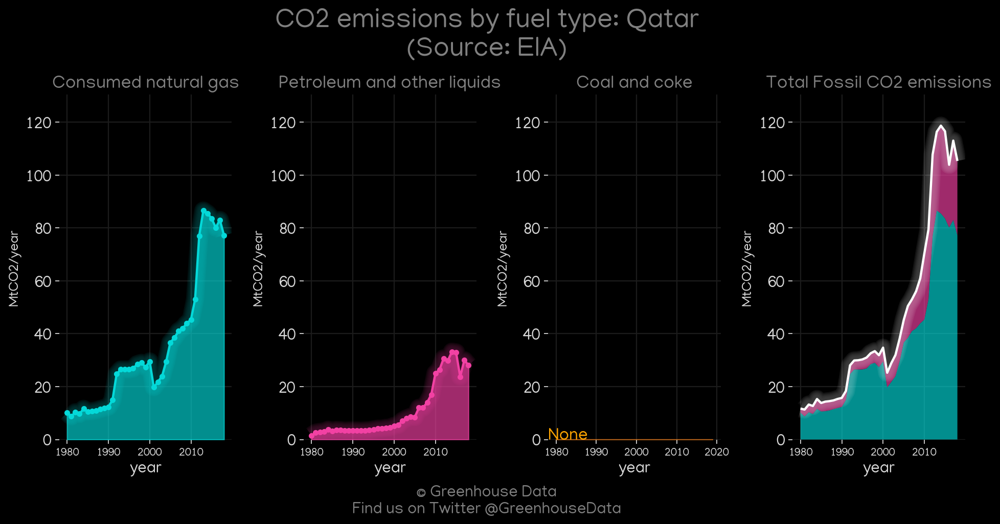
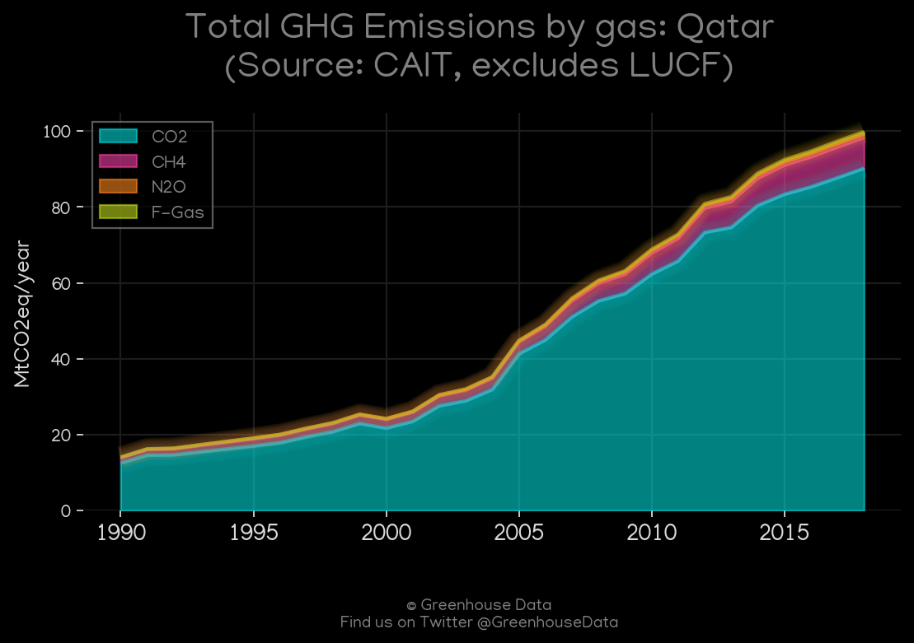
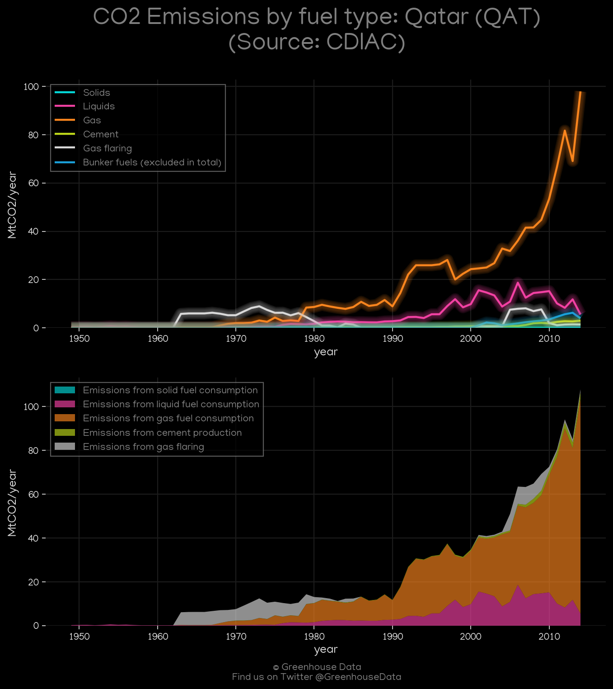

<h1 align="center">
🇶🇦🇶🇦🇶🇦🇶🇦🇶🇦
 
Qatar
 
🇶🇦🇶🇦🇶🇦🇶🇦🇶🇦
</h1>
<h2>Datasets:</h2>

<a href="https://github.com/dquintani/GreenhouseData/tree/master/country_data/QAT_Qatar/data">View on Github</a>
 

<a href="data/QAT_IEA.csv">IEA</a> || <a href="data/QAT_GCP.csv">GCP</a> || <a href="data/QAT_FAO.csv">FAO</a> || <a href="data/QAT_CDIAC.csv">CDIAC</a> || <a href="data/QAT_Minx_2021.csv">Minx_2021</a> || <a href="data/QAT_CAIT.csv">CAIT</a> || <a href="data/QAT_PRIMAP-hist.csv">PRIMAP-hist</a> || <a href="data/QAT_BP.csv">BP</a> || <a href="data/QAT_GCP_consupmption.csv">GCP_consupmption</a> || <a href="data/QAT_EDGAR.csv">EDGAR</a> || <a href="data/QAT_EPA.csv">EPA</a> || <a href="data/QAT_EIA.csv">EIA</a>

 

<h1>Figures:</h1><h2>#1 (QAT_Minx_top20_subsectors)</h2>

<h2>#2 (QAT_CAIT_lucf_vs_nolucf)</h2>

<h2>#3 (QAT_BP_1)</h2>

<h2>#4 (QAT_GCP_1)</h2>

<h2>#5 (QAT_UNFCCC_NAI_1)</h2>

<h2>#6 (QAT_IEA_1)</h2>

<h2>#7 (QAT_EIA_1)</h2>

<h2>#8 (QAT_CAIT_gases_1)</h2>

<h2>#9 (QAT_CO2_totals)</h2>

<h2>#10 (QAT_CDIAC_1)</h2>

