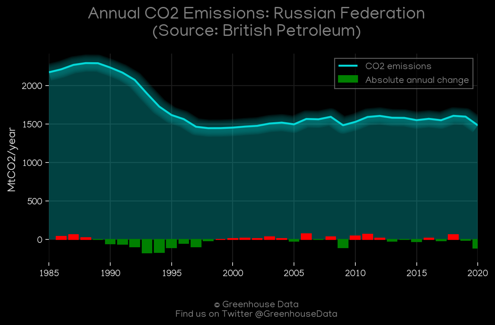
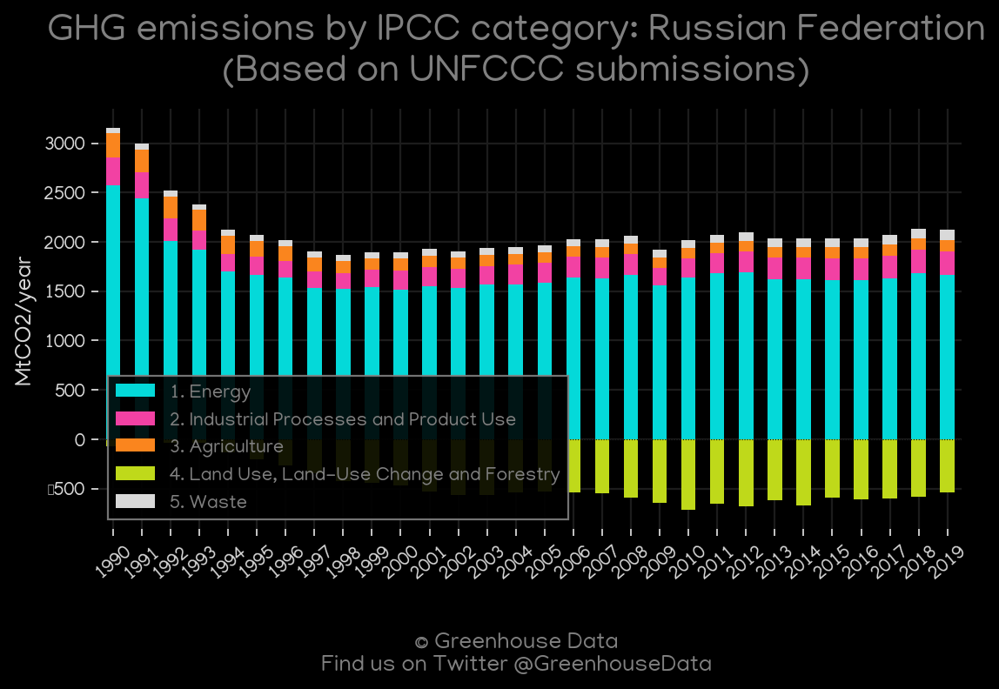
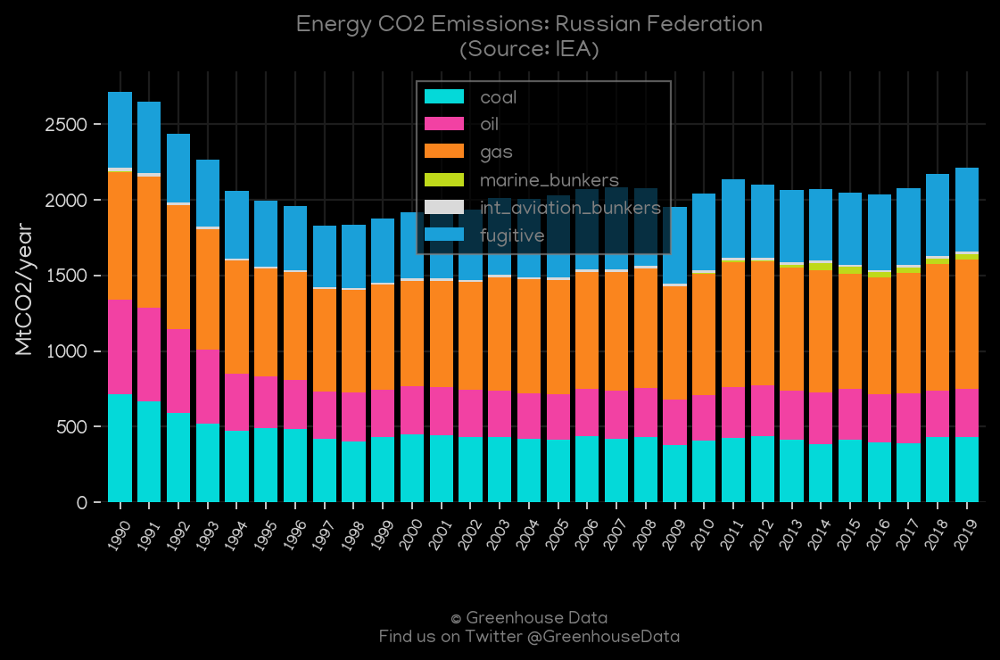
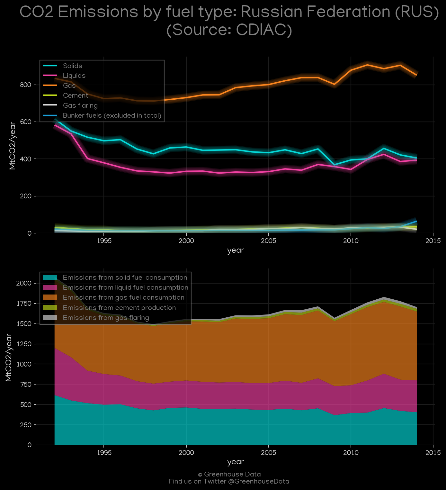
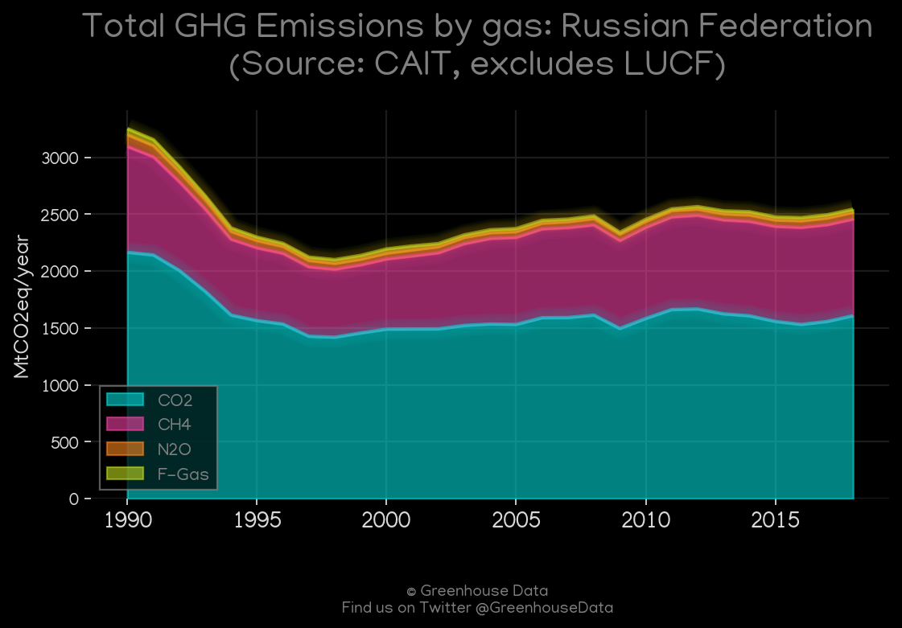
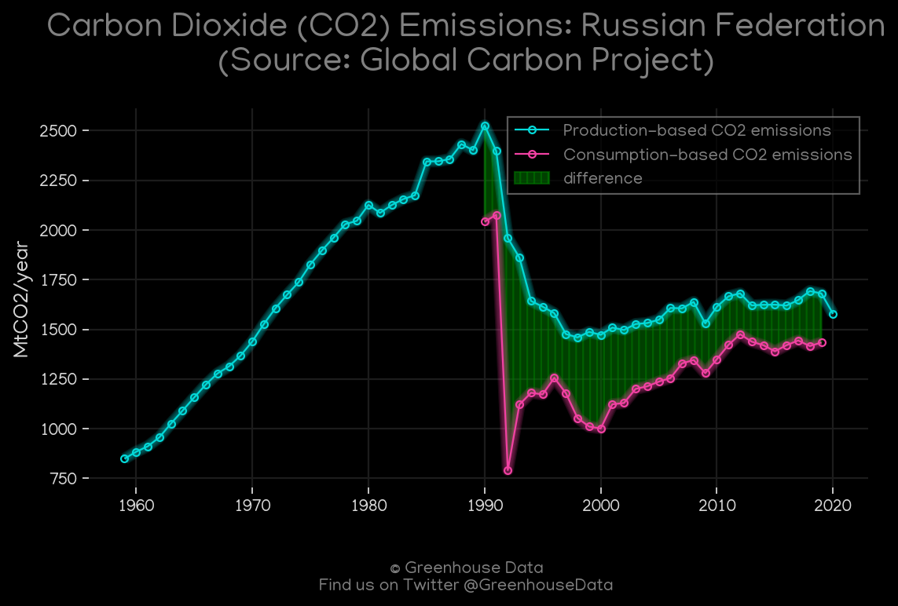

<h1 align="center">
🇷🇺🇷🇺🇷🇺🇷🇺🇷🇺
 
Russian Federation
 
🇷🇺🇷🇺🇷🇺🇷🇺🇷🇺
</h1>
<h2>Datasets:</h2>

<a href="https://github.com/dquintani/GreenhouseData/tree/master/country_data/RUS_Russian Federation/data">View on Github</a>
 

<a href="data/RUS_GCP_cons.csv">GCP_cons</a> || <a href="data/RUS_EIA.csv">EIA</a> || <a href="data/RUS_CDIAC.csv">CDIAC</a> || <a href="data/RUS_GCP_consupmption.csv">GCP_consupmption</a> || <a href="data/RUS_IEA.csv">IEA</a> || <a href="data/RUS_GCP.csv">GCP</a> || <a href="data/RUS_EDGAR.csv">EDGAR</a> || <a href="data/RUS_PRIMAP-hist.csv">PRIMAP-hist</a> || <a href="data/RUS_Minx_2021.csv">Minx_2021</a> || <a href="data/RUS_EPA.csv">EPA</a> || <a href="data/RUS_BP.csv">BP</a> || <a href="data/RUS_FAO.csv">FAO</a> || <a href="data/RUS_CAIT.csv">CAIT</a>

 

<h1>Figures:</h1><h2>#1 (RUS_BP_1)</h2>

<h2>#2 (RUS_EIA_1)</h2>

<h2>#3 (RUS_UNFCCC_AI_1)</h2>

<h2>#4 (RUS_IEA_1)</h2>

<h2>#5 (RUS_CO2_totals)</h2>

<h2>#6 (RUS_CDIAC_1)</h2>

<h2>#7 (RUS_Minx_top20_subsectors)</h2>

<h2>#8 (RUS_CAIT_gases_1)</h2>

<h2>#9 (RUS_GCP_1)</h2>

