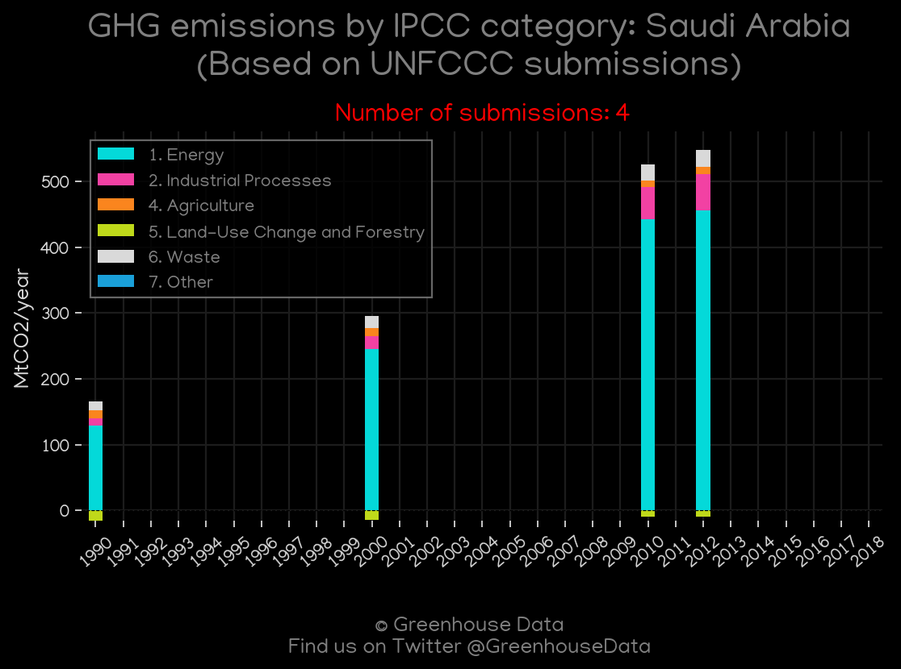
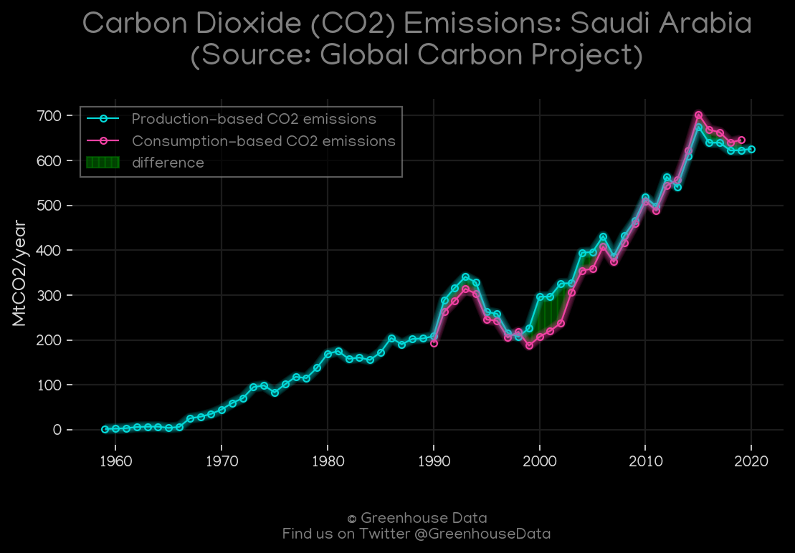
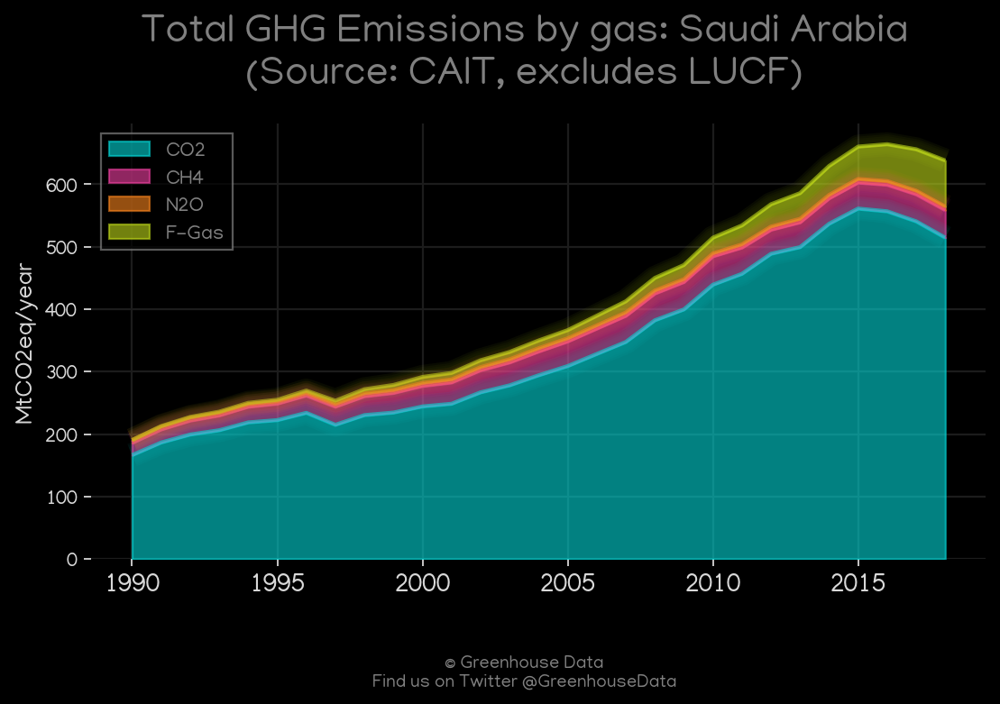
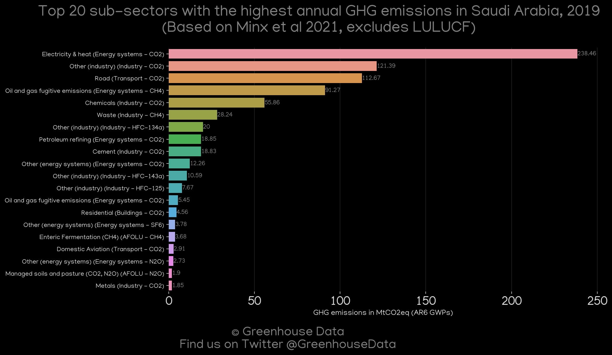
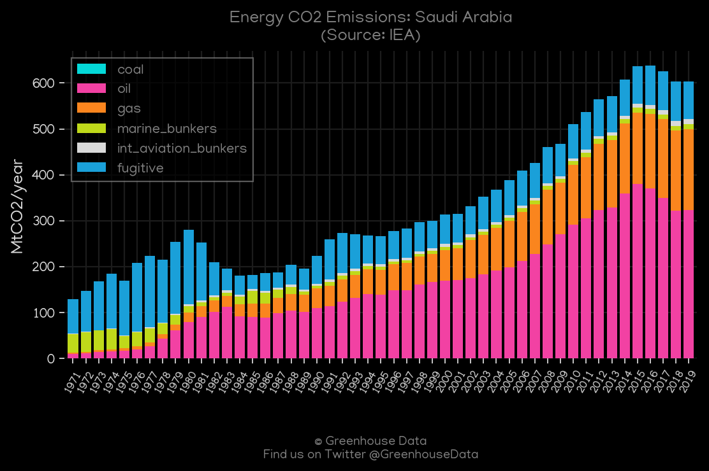
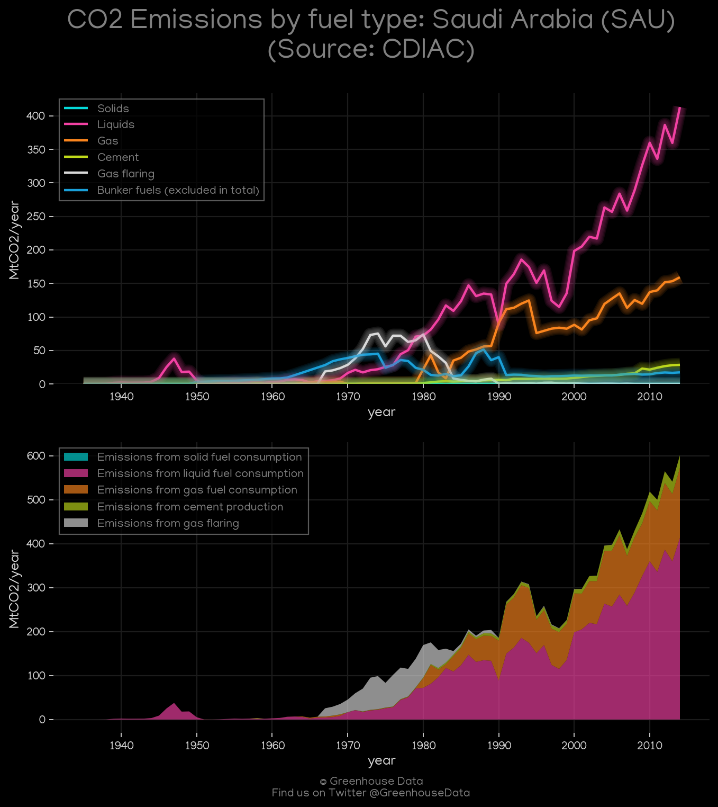
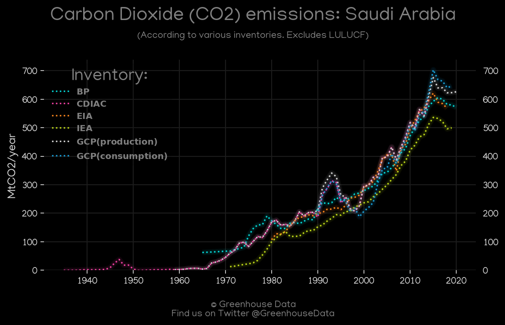

<h1 align="center">
🇸🇦🇸🇦🇸🇦🇸🇦🇸🇦
 
Saudi Arabia
 
🇸🇦🇸🇦🇸🇦🇸🇦🇸🇦
</h1>
<h2>Datasets:</h2>

<a href="https://github.com/dquintani/GreenhouseData/tree/master/country_data/SAU_Saudi Arabia/data">View on Github</a>
 

<a href="data/SAU_EIA.csv">EIA</a> || <a href="data/SAU_Minx_2021.csv">Minx_2021</a> || <a href="data/SAU_EPA.csv">EPA</a> || <a href="data/SAU_GCP_consupmption.csv">GCP_consupmption</a> || <a href="data/SAU_CDIAC.csv">CDIAC</a> || <a href="data/SAU_BP.csv">BP</a> || <a href="data/SAU_IEA.csv">IEA</a> || <a href="data/SAU_CAIT.csv">CAIT</a> || <a href="data/SAU_PRIMAP-hist.csv">PRIMAP-hist</a> || <a href="data/SAU_EDGAR.csv">EDGAR</a> || <a href="data/SAU_GCP.csv">GCP</a> || <a href="data/SAU_FAO.csv">FAO</a>

 

<h1>Figures:</h1><h2>#1 (SAU_CAIT_lucf_vs_nolucf)</h2>

<h2>#2 (SAU_BP_1)</h2>

<h2>#3 (SAU_UNFCCC_NAI_1)</h2>

<h2>#4 (SAU_GCP_1)</h2>

<h2>#5 (SAU_CAIT_gases_1)</h2>

<h2>#6 (SAU_Minx_top20_subsectors)</h2>

<h2>#7 (SAU_IEA_1)</h2>

<h2>#8 (SAU_CDIAC_1)</h2>

<h2>#9 (SAU_EIA_1)</h2>

<h2>#10 (SAU_CO2_totals)</h2>

