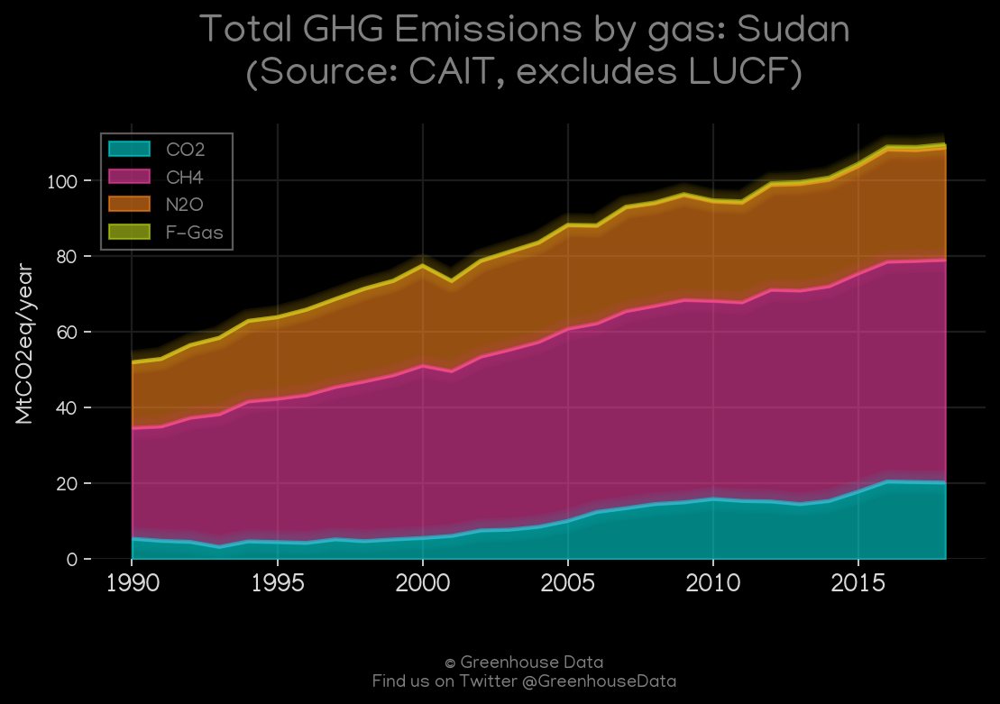
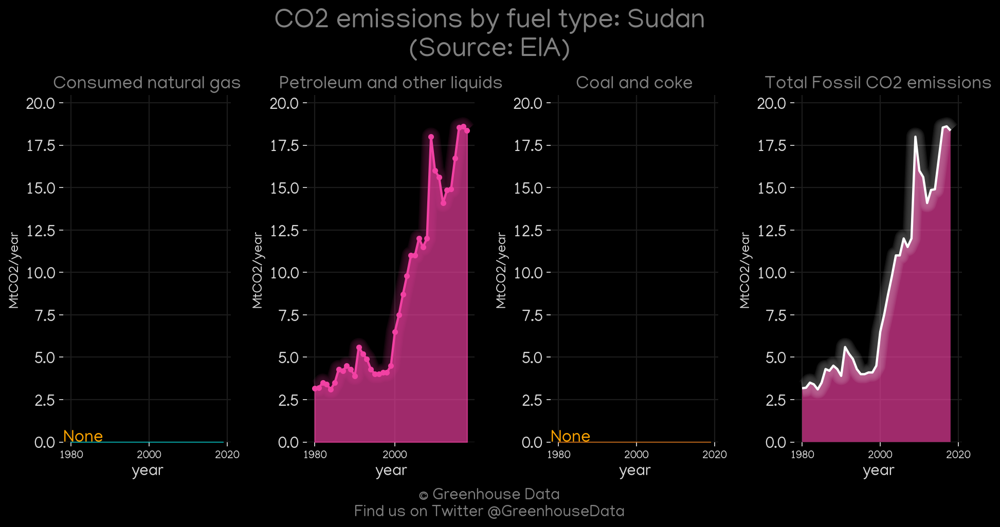
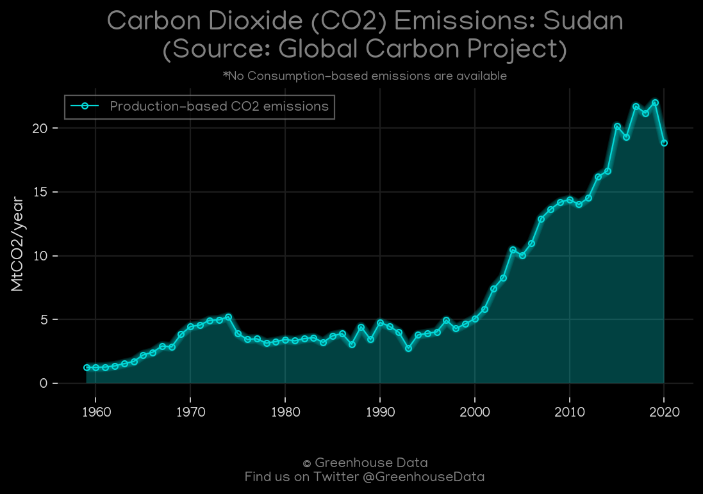
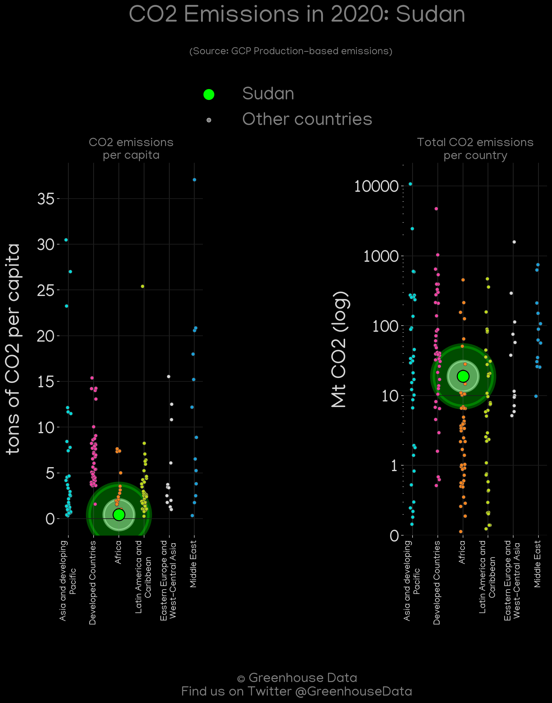
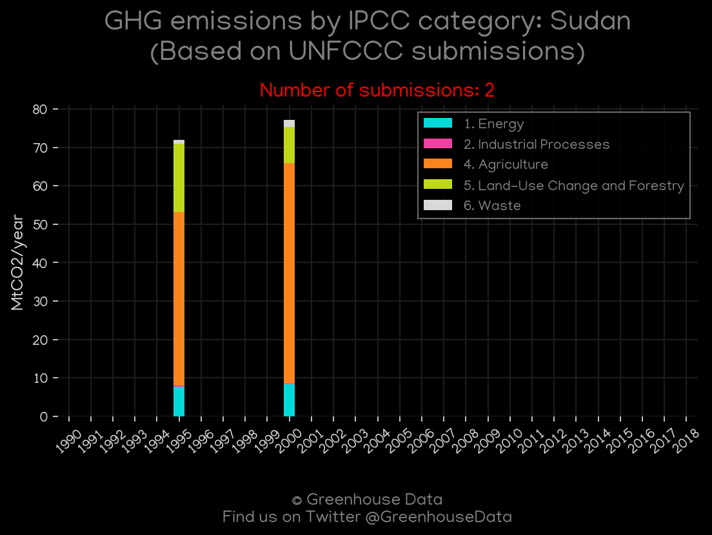
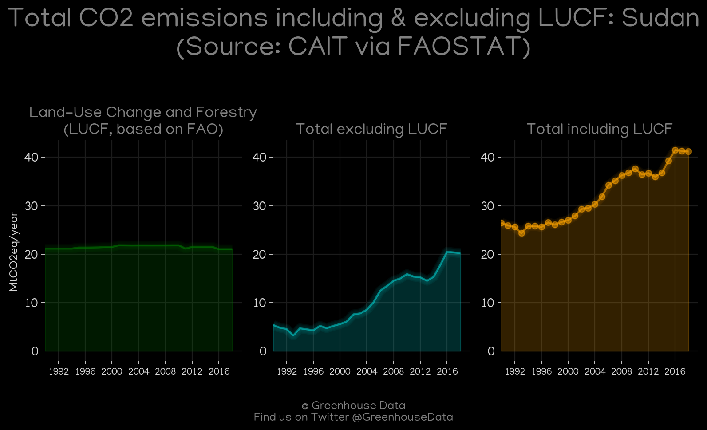
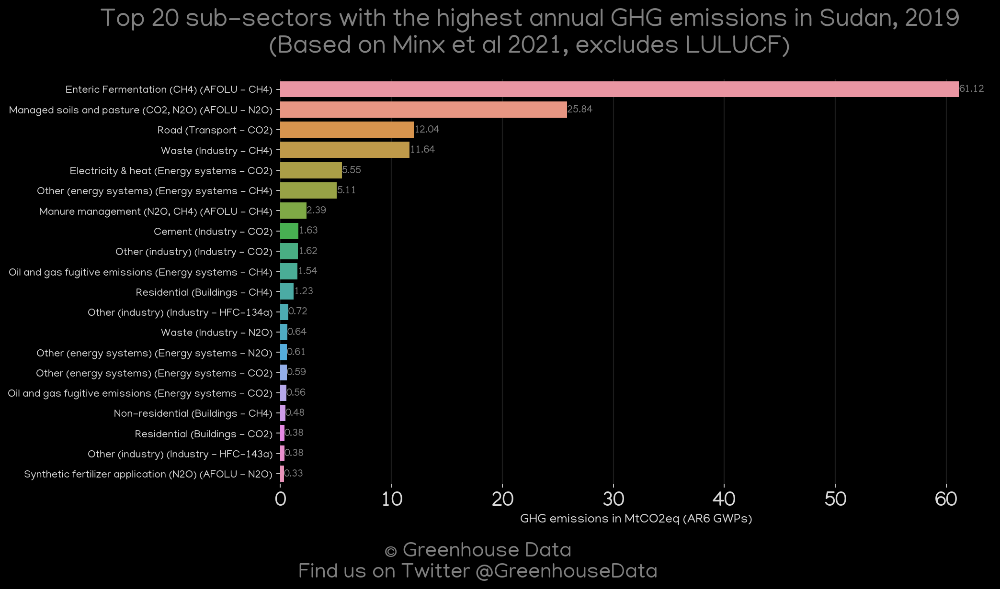
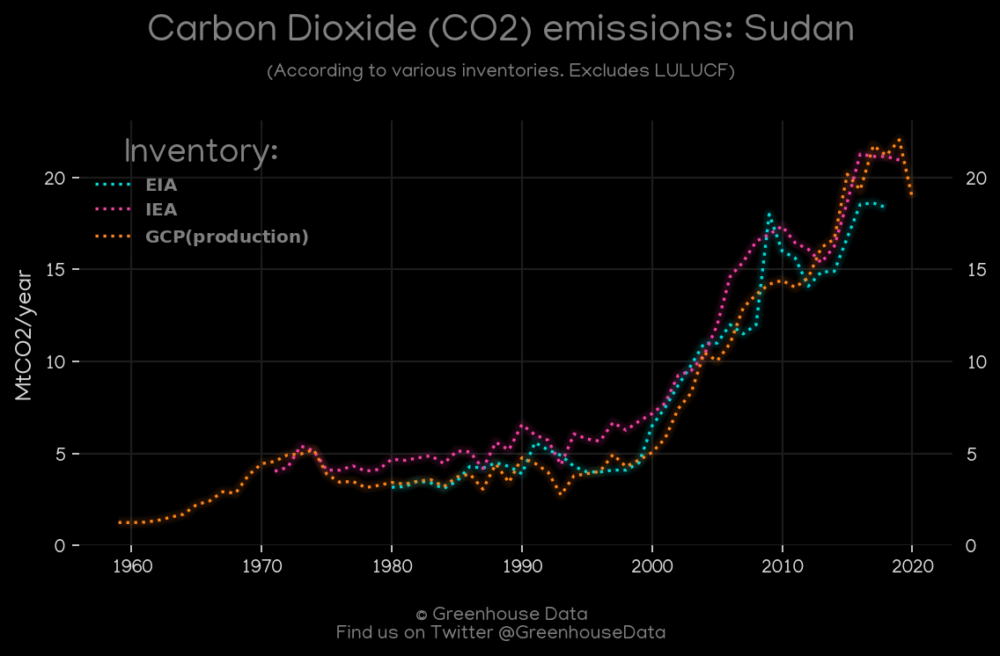
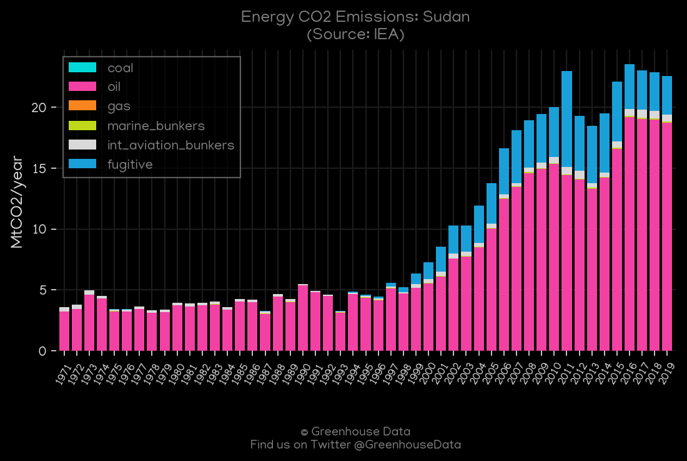

<h1 align="center">
🇸🇩🇸🇩🇸🇩🇸🇩🇸🇩
 
Sudan
 
🇸🇩🇸🇩🇸🇩🇸🇩🇸🇩
</h1>
<h2>Datasets:</h2>

<a href="https://github.com/dquintani/GreenhouseData/tree/master/country_data/SDN_Sudan/data">View on Github</a>
 

<a href="data/SDN_IEA.csv">IEA</a> || <a href="data/SDN_EPA.csv">EPA</a> || <a href="data/SDN_GCP.csv">GCP</a> || <a href="data/SDN_GCP_consupmption.csv">GCP_consupmption</a> || <a href="data/SDN_EDGAR.csv">EDGAR</a> || <a href="data/SDN_PRIMAP-hist.csv">PRIMAP-hist</a> || <a href="data/SDN_FAO.csv">FAO</a> || <a href="data/SDN_Minx_2021.csv">Minx_2021</a> || <a href="data/SDN_EIA.csv">EIA</a> || <a href="data/SDN_CAIT.csv">CAIT</a>

 

<h1>Figures:</h1><h2>#1 (SDN_CAIT_gases_1)</h2>

<h2>#2 (SDN_EIA_1)</h2>

<h2>#3 (SDN_GCP_1)</h2>

<h2>#4 (SDN_GCP_Country_Highlight)</h2>

<h2>#5 (SDN_UNFCCC_NAI_1)</h2>

<h2>#6 (SDN_CAIT_lucf_vs_nolucf)</h2>

<h2>#7 (SDN_Minx_top20_subsectors)</h2>

<h2>#8 (SDN_CO2_totals)</h2>

<h2>#9 (SDN_IEA_1)</h2>

