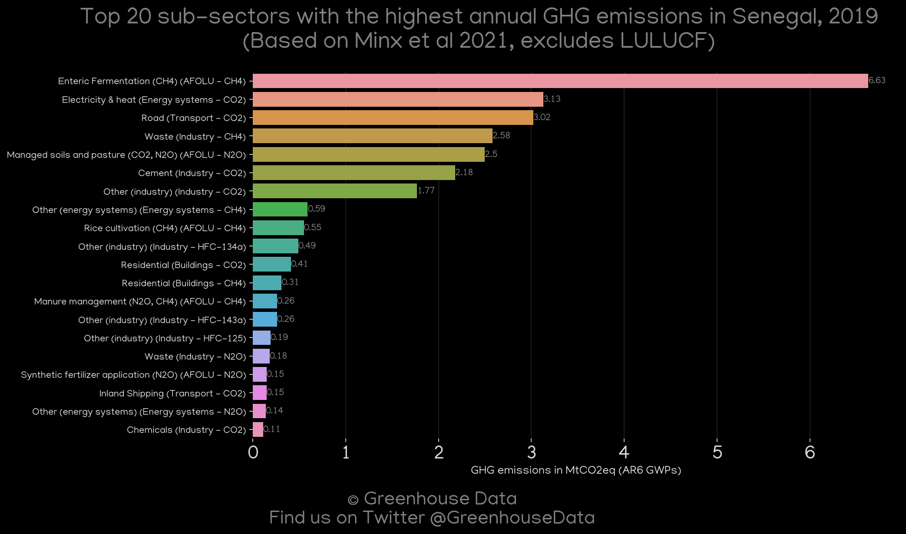
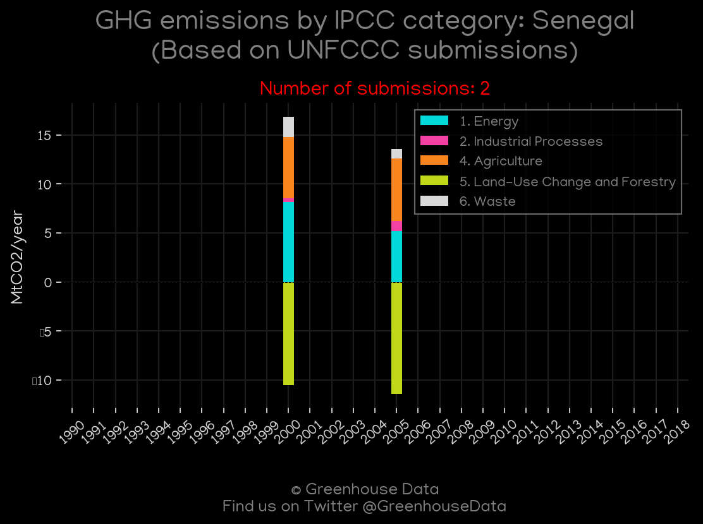
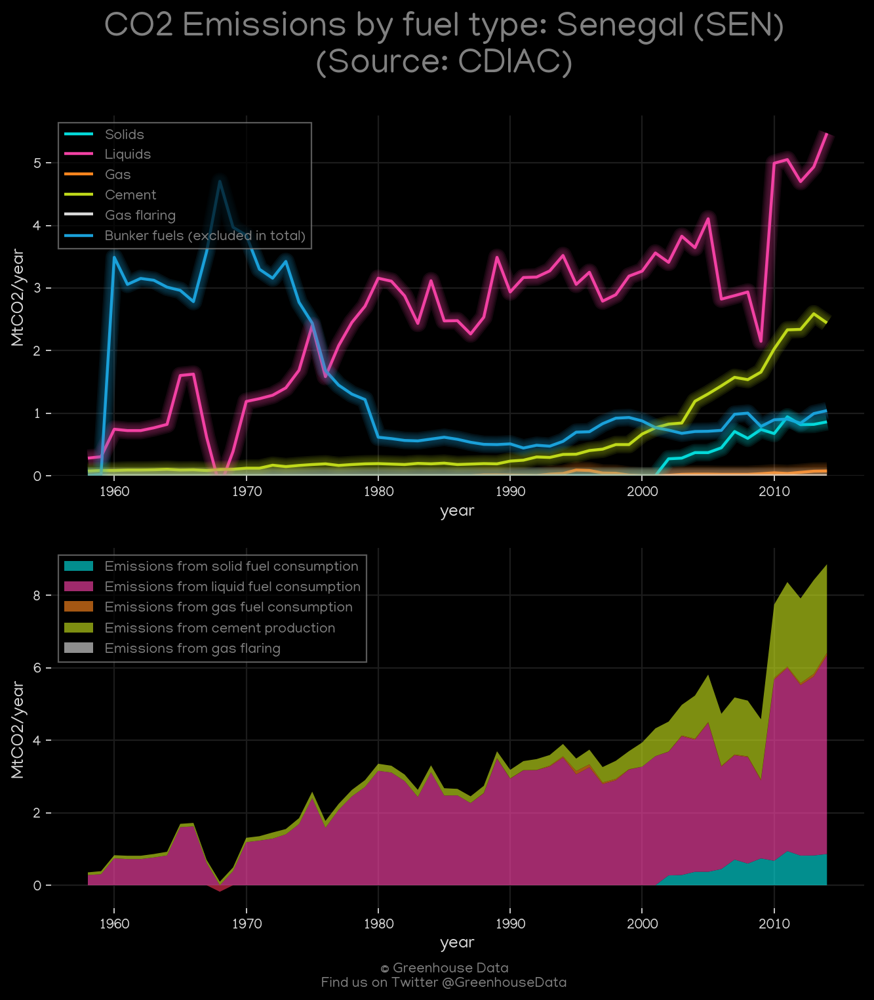
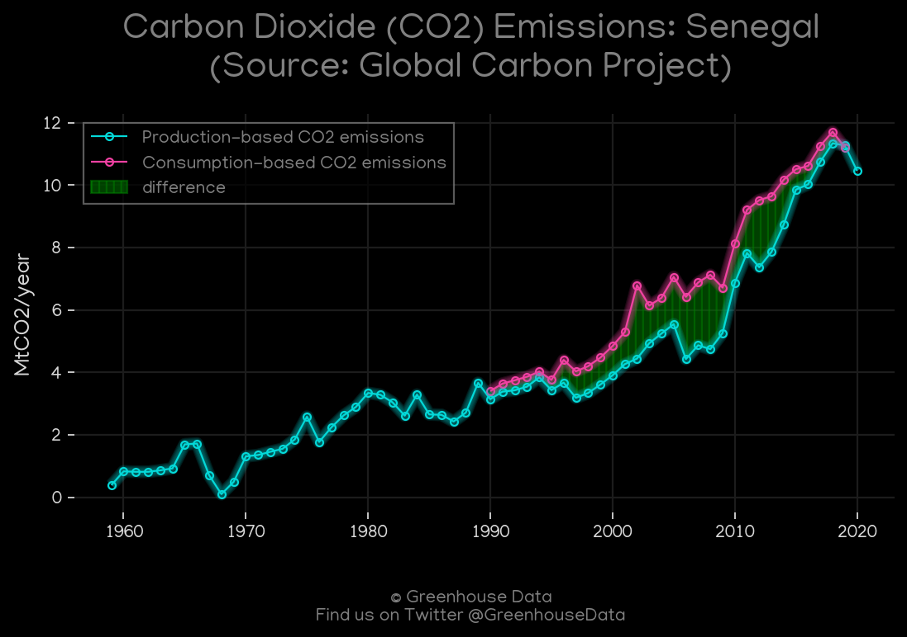
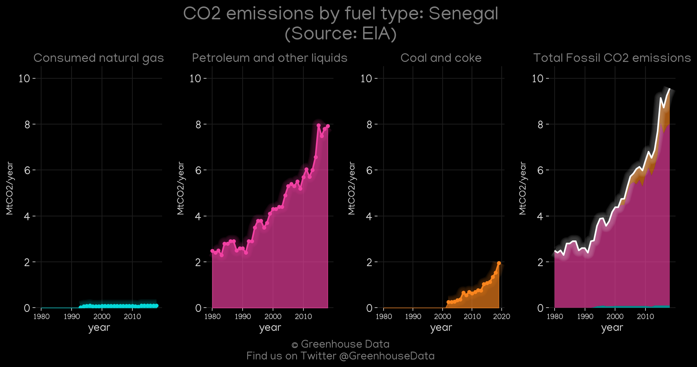
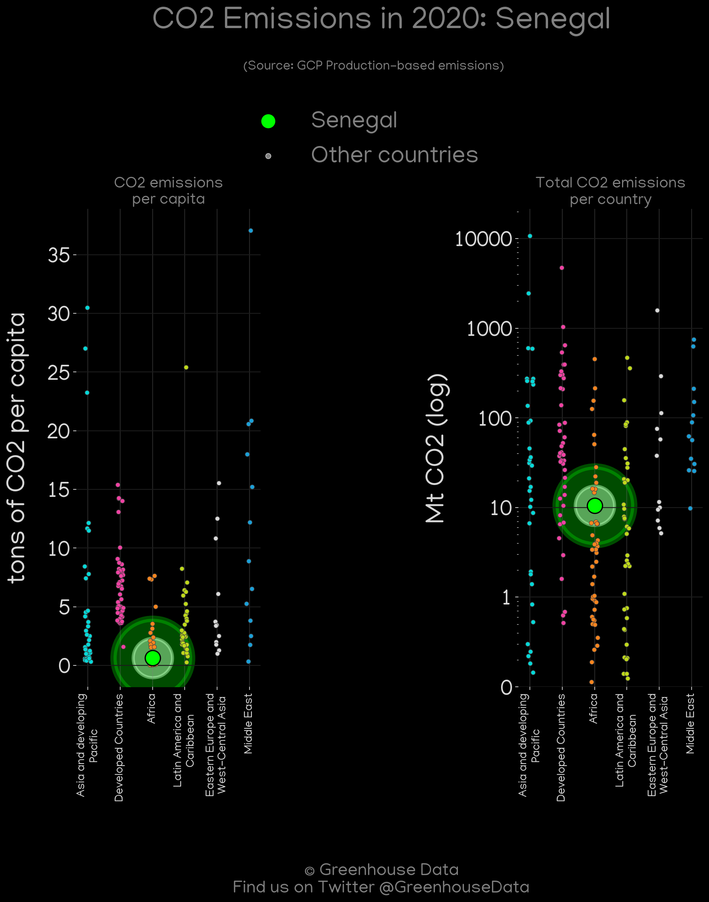

<h1 align="center">
🇸🇳🇸🇳🇸🇳🇸🇳🇸🇳
 
Senegal
 
🇸🇳🇸🇳🇸🇳🇸🇳🇸🇳
</h1>
<h2>Datasets:</h2>

<a href="https://github.com/dquintani/GreenhouseData/tree/master/country_data/SEN_Senegal/data">View on Github</a>
 

<a href="data/SEN_PRIMAP-hist.csv">PRIMAP-hist</a> || <a href="data/SEN_FAO.csv">FAO</a> || <a href="data/SEN_GCP.csv">GCP</a> || <a href="data/SEN_Minx_2021.csv">Minx_2021</a> || <a href="data/SEN_EIA.csv">EIA</a> || <a href="data/SEN_IEA.csv">IEA</a> || <a href="data/SEN_CAIT.csv">CAIT</a> || <a href="data/SEN_GCP_consupmption.csv">GCP_consupmption</a> || <a href="data/SEN_EPA.csv">EPA</a> || <a href="data/SEN_CDIAC.csv">CDIAC</a> || <a href="data/SEN_EDGAR.csv">EDGAR</a>

 

<h1>Figures:</h1><h2>#1 (SEN_CAIT_gases_1)</h2>

<h2>#2 (SEN_IEA_1)</h2>

<h2>#3 (SEN_relative_totals)</h2>

<h2>#4 (SEN_CO2_totals)</h2>

<h2>#5 (SEN_Minx_top20_subsectors)</h2>

<h2>#6 (SEN_UNFCCC_NAI_1)</h2>

<h2>#7 (SEN_CDIAC_1)</h2>

<h2>#8 (SEN_CAIT_lucf_vs_nolucf)</h2>

<h2>#9 (SEN_GCP_1)</h2>

<h2>#10 (SEN_EIA_1)</h2>

<h2>#11 (SEN_GCP_Country_Highlight)</h2>

