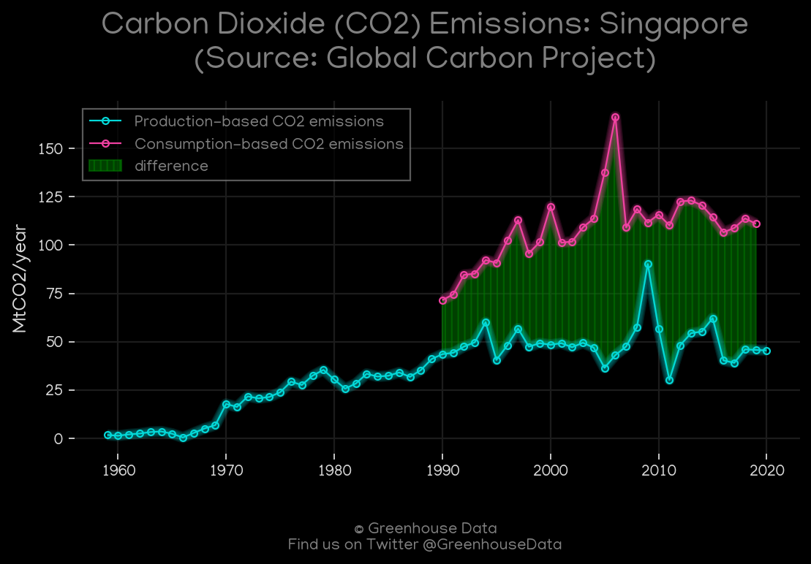
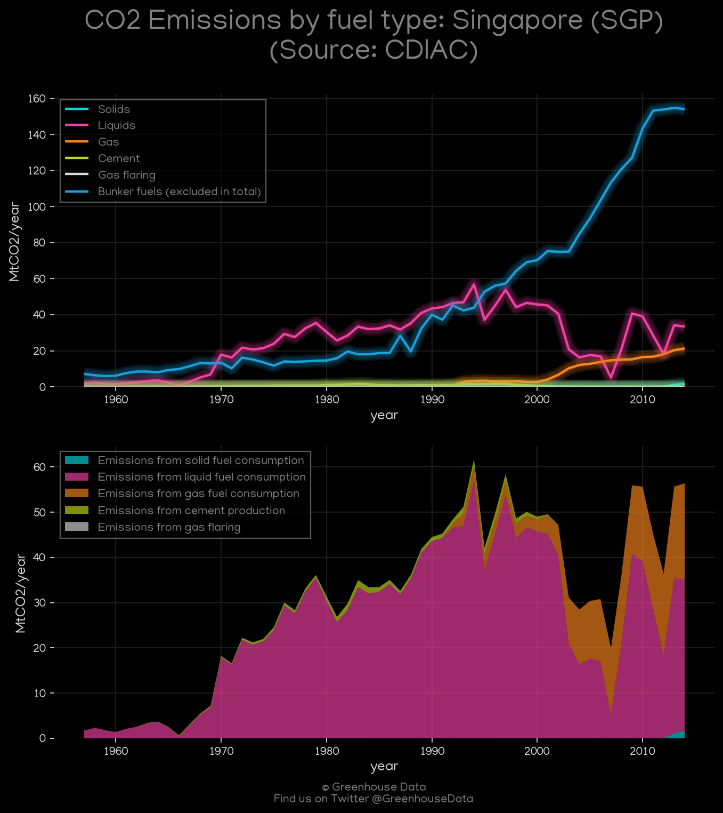
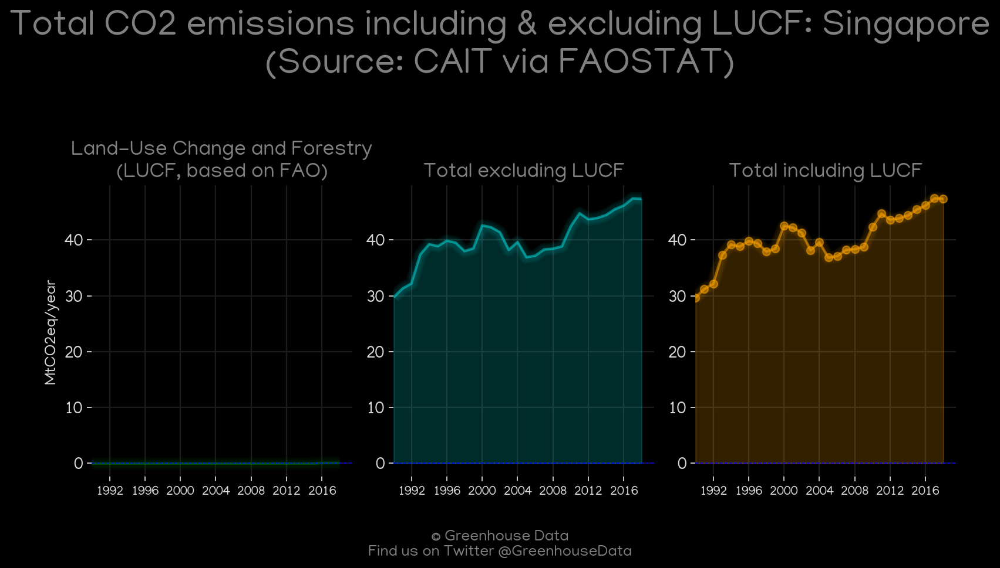
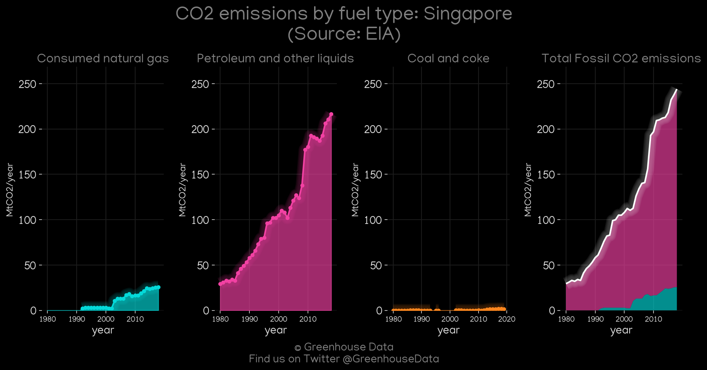
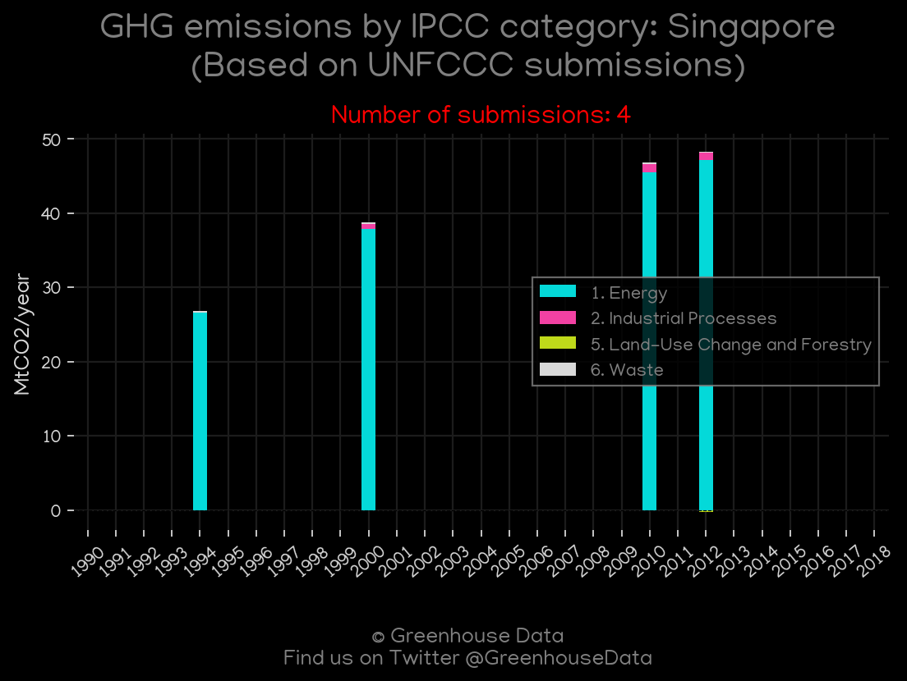
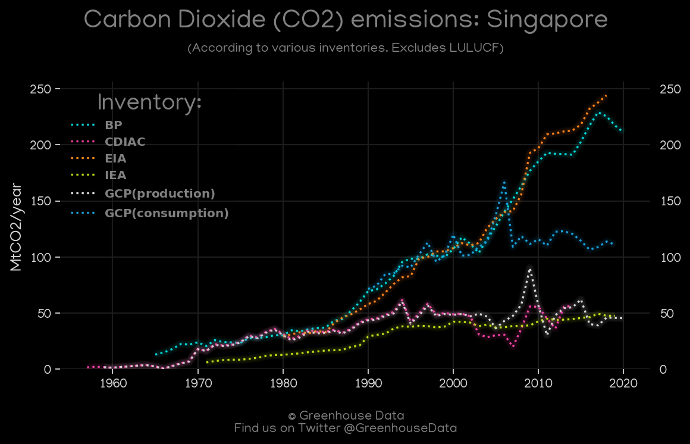
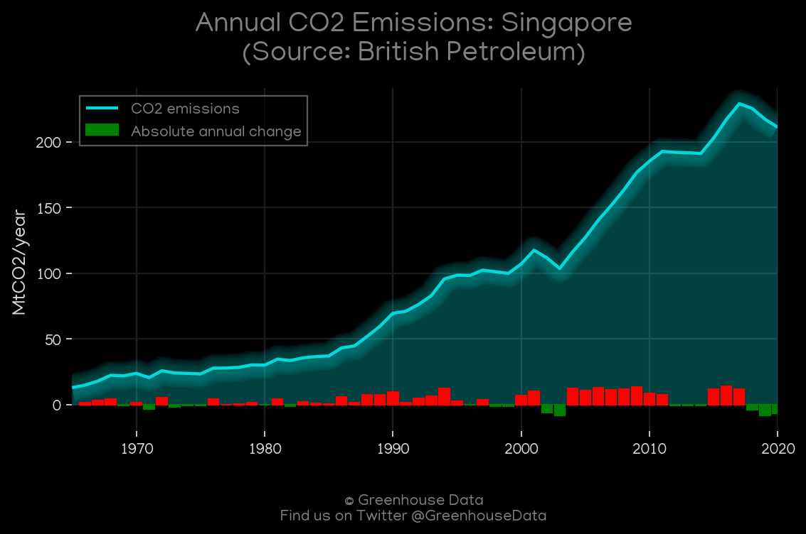
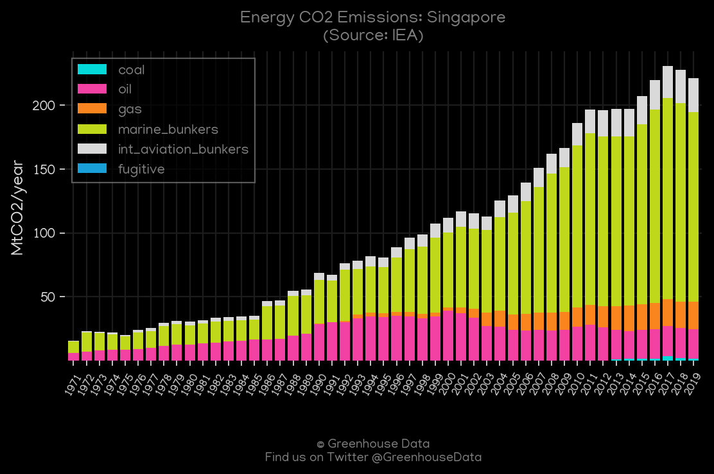
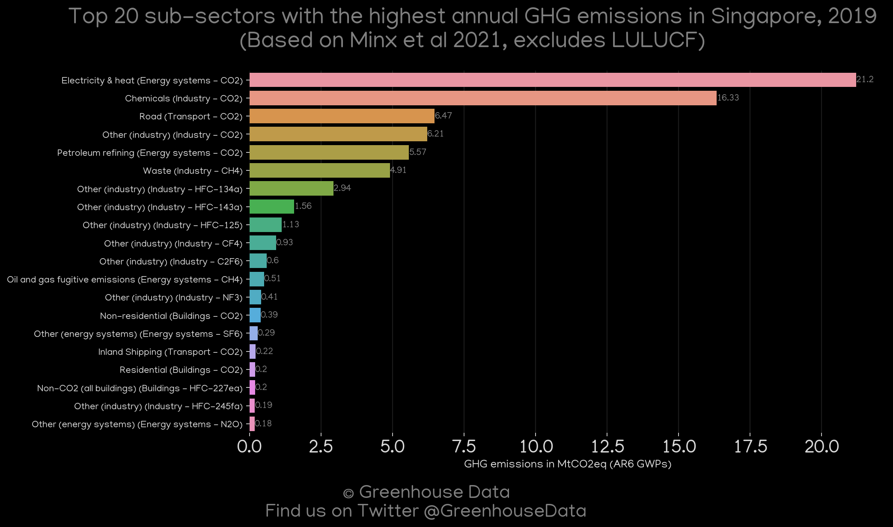

<h1 align="center">
🇸🇬🇸🇬🇸🇬🇸🇬🇸🇬
 
Singapore
 
🇸🇬🇸🇬🇸🇬🇸🇬🇸🇬
</h1>
<h2>Datasets:</h2>

<a href="https://github.com/dquintani/GreenhouseData/tree/master/country_data/SGP_Singapore/data">View on Github</a>
 

<a href="data/SGP_CAIT.csv">CAIT</a> || <a href="data/SGP_EIA.csv">EIA</a> || <a href="data/SGP_FAO.csv">FAO</a> || <a href="data/SGP_CDIAC.csv">CDIAC</a> || <a href="data/SGP_IEA.csv">IEA</a> || <a href="data/SGP_GCP_consupmption.csv">GCP_consupmption</a> || <a href="data/SGP_PRIMAP-hist.csv">PRIMAP-hist</a> || <a href="data/SGP_EPA.csv">EPA</a> || <a href="data/SGP_GCP.csv">GCP</a> || <a href="data/SGP_BP.csv">BP</a> || <a href="data/SGP_Minx_2021.csv">Minx_2021</a> || <a href="data/SGP_EDGAR.csv">EDGAR</a>

 

<h1>Figures:</h1><h2>#1 (SGP_GCP_1)</h2>

<h2>#2 (SGP_CDIAC_1)</h2>

<h2>#3 (SGP_CAIT_lucf_vs_nolucf)</h2>

<h2>#4 (SGP_EIA_1)</h2>

<h2>#5 (SGP_UNFCCC_NAI_1)</h2>

<h2>#6 (SGP_CO2_totals)</h2>

<h2>#7 (SGP_BP_1)</h2>

<h2>#8 (SGP_CAIT_gases_1)</h2>

<h2>#9 (SGP_IEA_1)</h2>

<h2>#10 (SGP_Minx_top20_subsectors)</h2>

