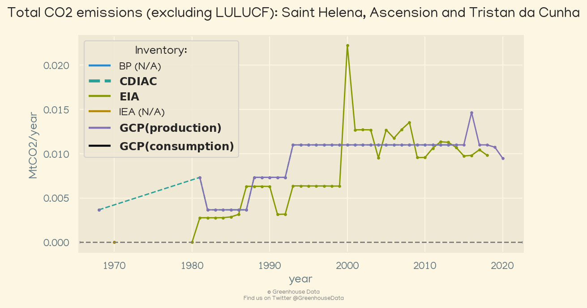
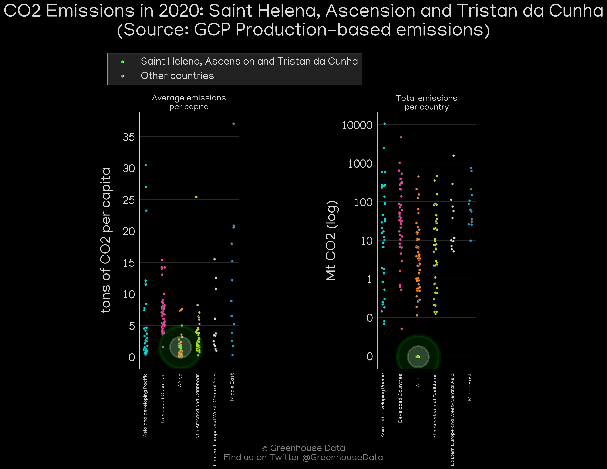
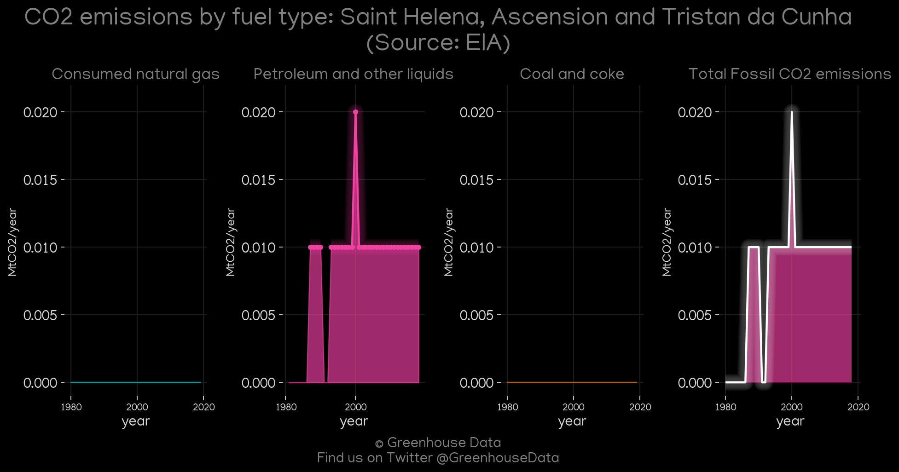
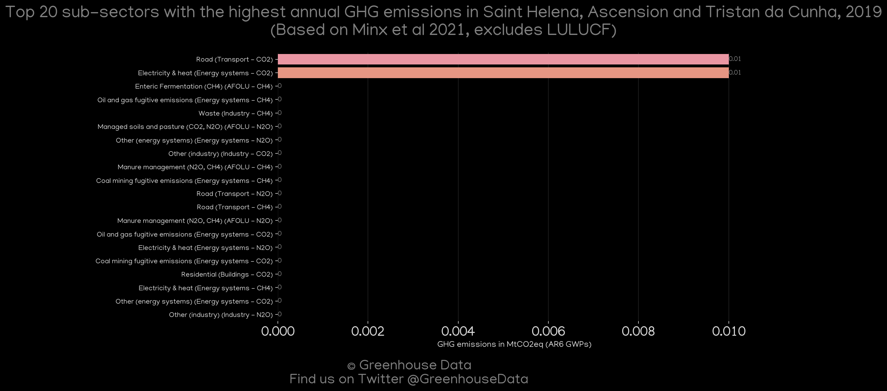
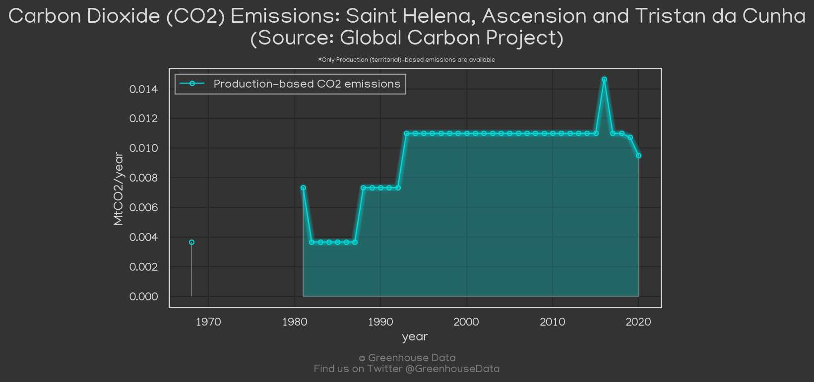
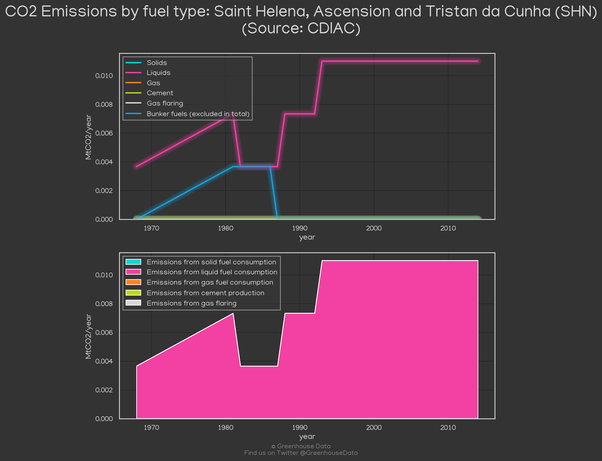

<h1 align="center">
🇸🇭🇸🇭🇸🇭🇸🇭🇸🇭
 
Saint Helena, Ascension and Tristan da Cunha
 
🇸🇭🇸🇭🇸🇭🇸🇭🇸🇭
</h1>
<h2>Datasets:</h2>

<a href="https://github.com/dquintani/GreenhouseData/tree/master/country_data/SHN_Saint Helena, Ascension and Tristan da Cunha/data">View on Github</a>
 

<a href="data/SHN_EIA.csv">EIA</a> || <a href="data/SHN_Minx_2021.csv">Minx_2021</a> || <a href="data/SHN_PRIMAP-hist.csv">PRIMAP-hist</a> || <a href="data/SHN_CDIAC.csv">CDIAC</a> || <a href="data/SHN_EDGAR.csv">EDGAR</a> || <a href="data/SHN_FAO.csv">FAO</a> || <a href="data/SHN_GCP_consupmption.csv">GCP_consupmption</a> || <a href="data/SHN_GCP.csv">GCP</a>

 

<h1>Figures:</h1><h2>#1 (SHN_CO2_totals)</h2>

<h2>#2 (SHN_GCP_Country_Highlight)</h2>

<h2>#3 (SHN_EIA_1)</h2>

<h2>#4 (SHN_Minx_top20_subsectors)</h2>

<h2>#5 (SHN_GCP_1)</h2>

<h2>#6 (SHN_CDIAC_1)</h2>

