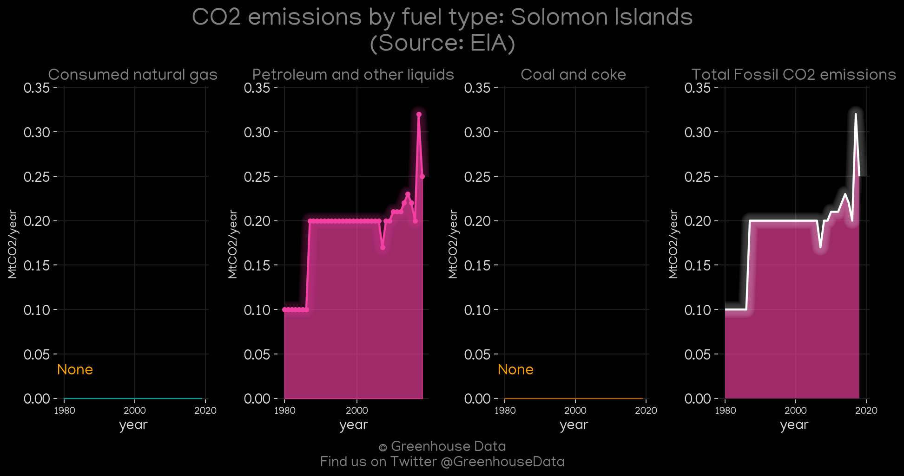
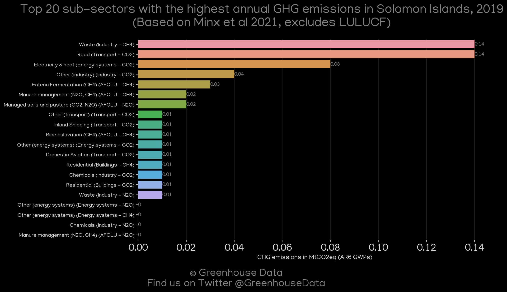
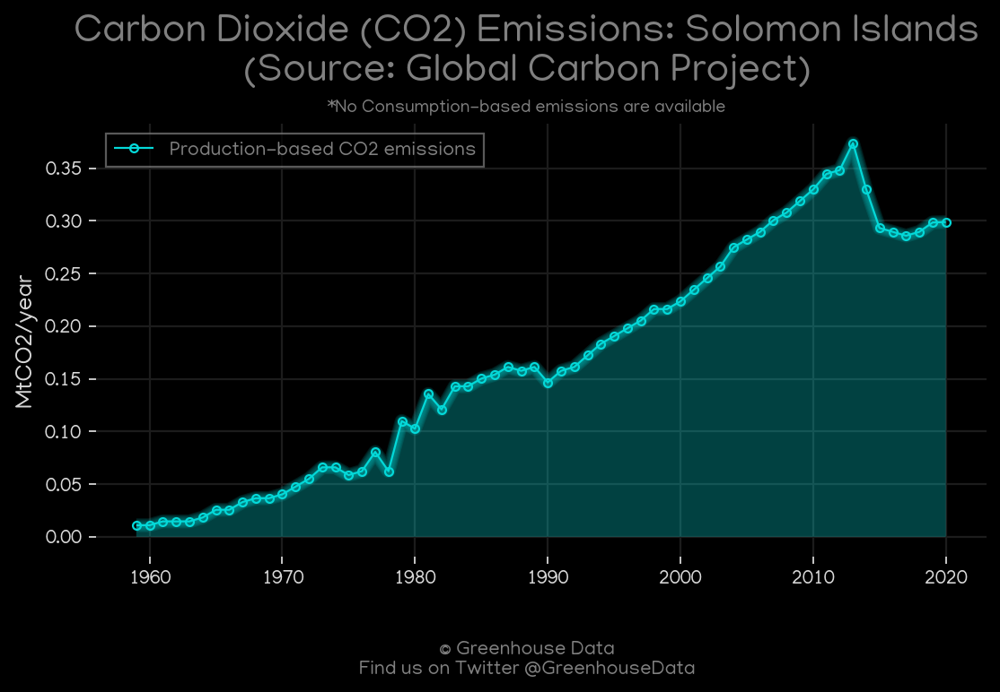
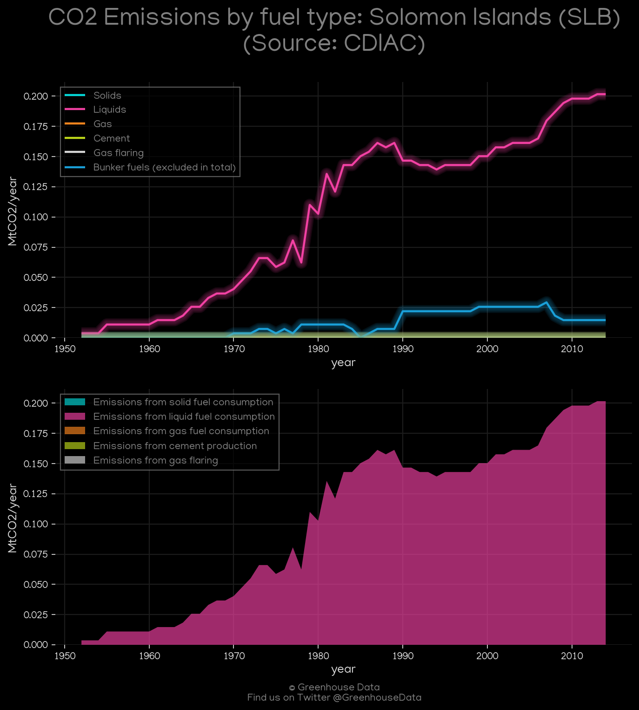
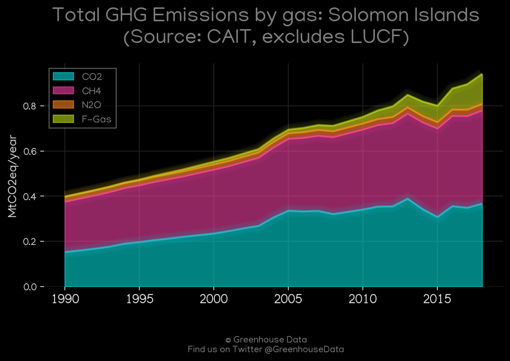
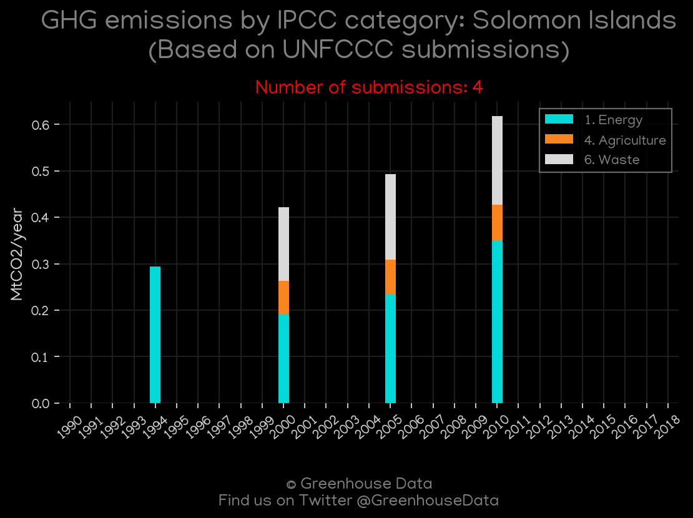

<h1 align="center">
🇸🇧🇸🇧🇸🇧🇸🇧🇸🇧
 
Solomon Islands
 
🇸🇧🇸🇧🇸🇧🇸🇧🇸🇧
</h1>
<h2>Datasets:</h2>

<a href="https://github.com/dquintani/GreenhouseData/tree/master/country_data/SLB_Solomon Islands/data">View on Github</a>
 

<a href="data/SLB_Minx_2021.csv">Minx_2021</a> || <a href="data/SLB_PRIMAP-hist.csv">PRIMAP-hist</a> || <a href="data/SLB_EDGAR.csv">EDGAR</a> || <a href="data/SLB_GCP_cons.csv">GCP_cons</a> || <a href="data/SLB_GCP_consupmption.csv">GCP_consupmption</a> || <a href="data/SLB_GCP.csv">GCP</a> || <a href="data/SLB_EPA.csv">EPA</a> || <a href="data/SLB_CDIAC.csv">CDIAC</a> || <a href="data/SLB_CAIT.csv">CAIT</a> || <a href="data/SLB_FAO.csv">FAO</a> || <a href="data/SLB_EIA.csv">EIA</a>

 

<h1>Figures:</h1><h2>#1 (SLB_EIA_1)</h2>

<h2>#2 (SLB_Minx_top20_subsectors)</h2>

<h2>#3 (SLB_GCP_1)</h2>

<h2>#4 (SLB_CO2_totals)</h2>

<h2>#5 (SLB_CDIAC_1)</h2>

<h2>#6 (SLB_CAIT_gases_1)</h2>

<h2>#7 (SLB_UNFCCC_NAI_1)</h2>

<h2>#8 (SLB_BP_1)</h2>

