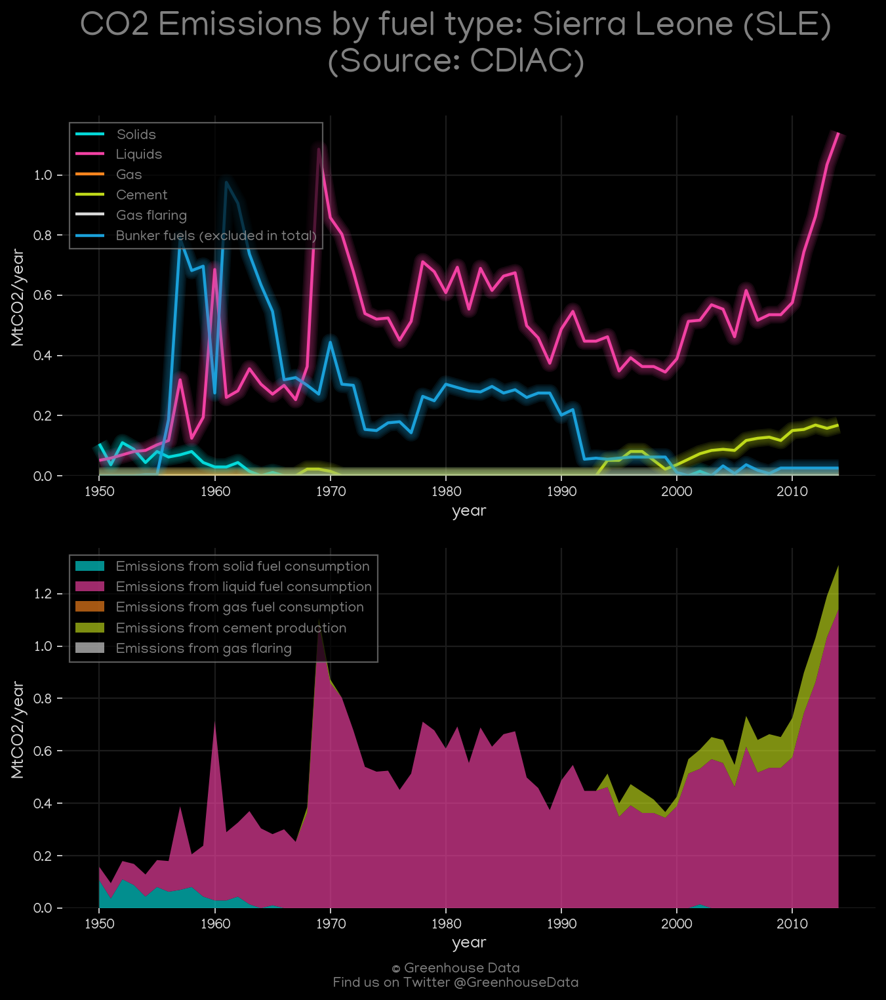
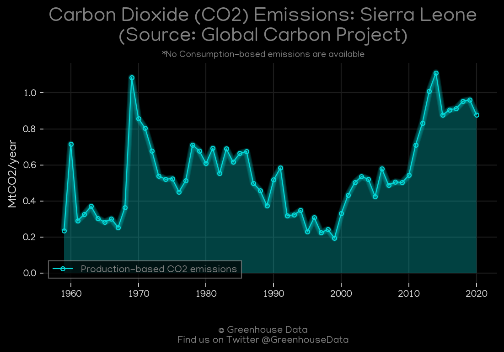
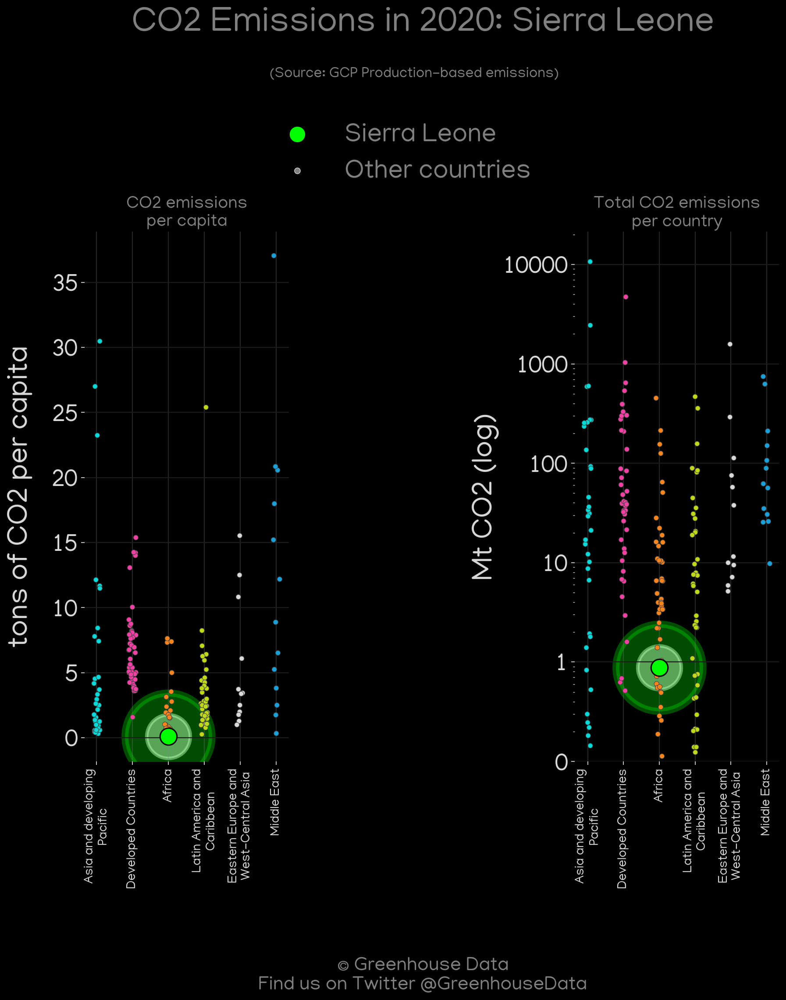
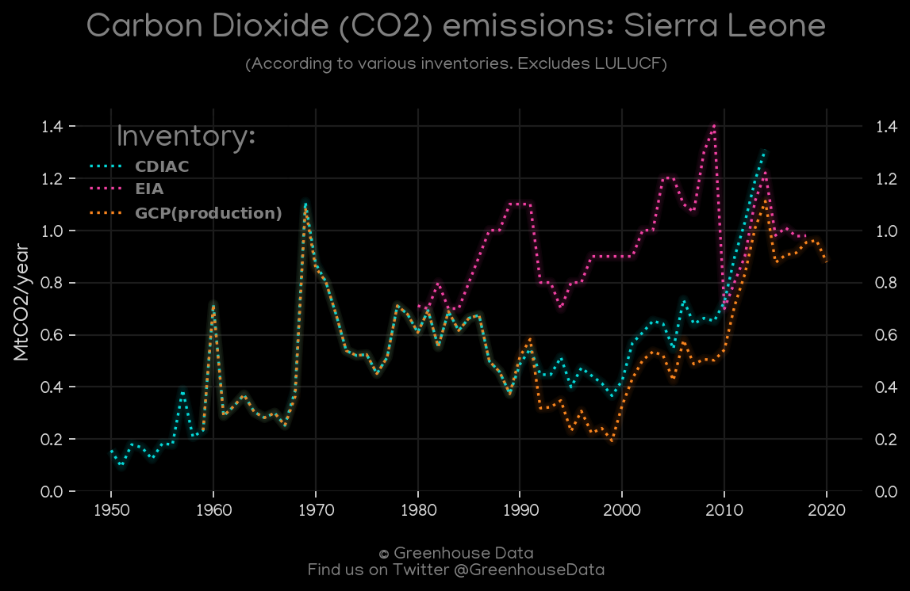
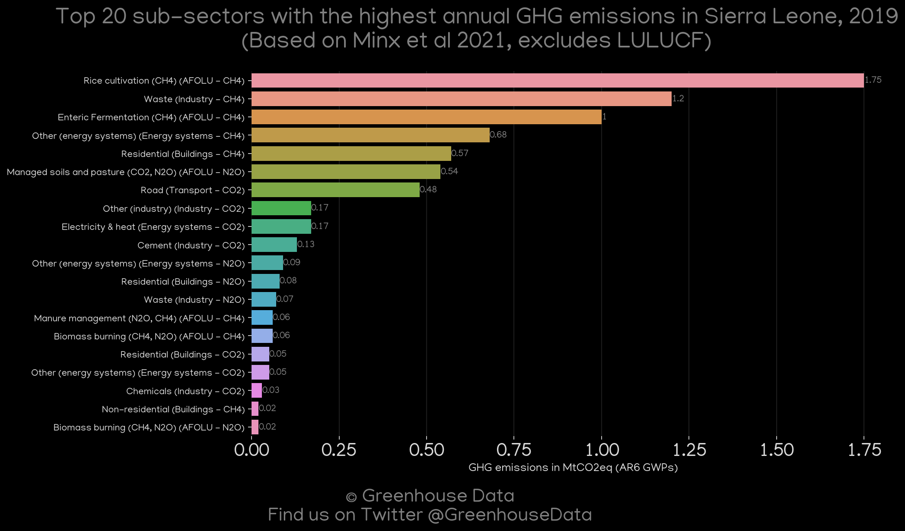
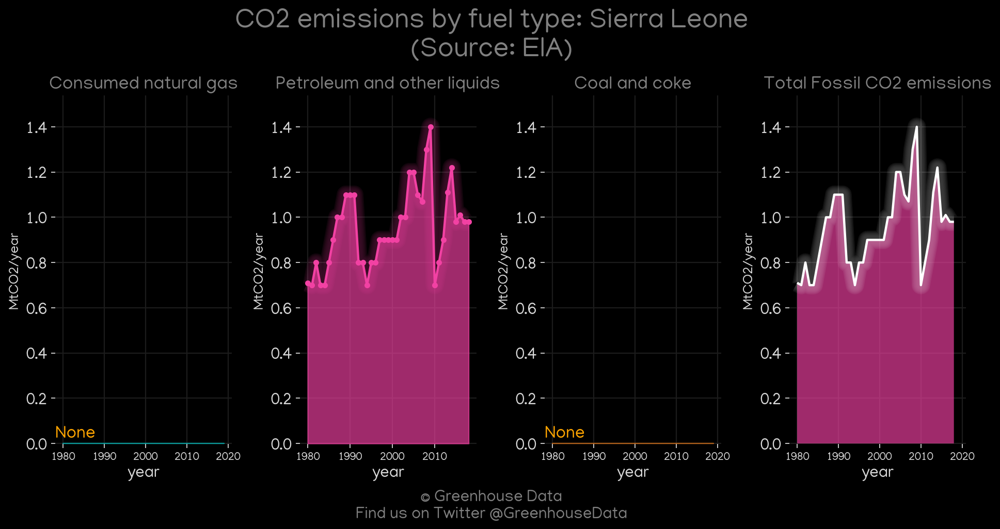
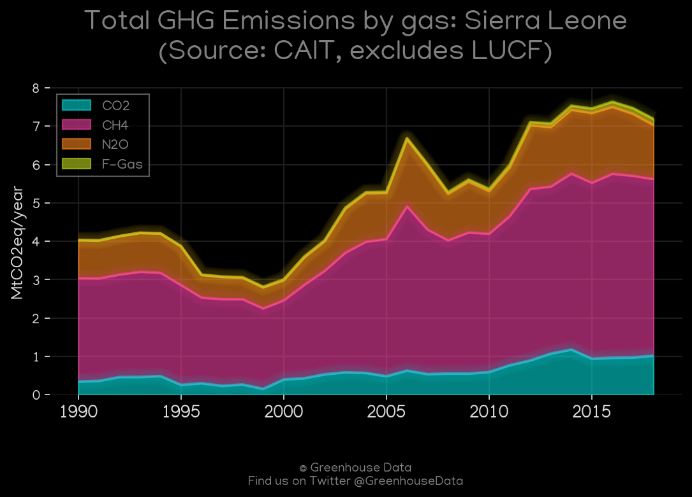

<h1 align="center">
🇸🇱🇸🇱🇸🇱🇸🇱🇸🇱
 
Sierra Leone
 
🇸🇱🇸🇱🇸🇱🇸🇱🇸🇱
</h1>
<h2>Datasets:</h2>

<a href="https://github.com/dquintani/GreenhouseData/tree/master/country_data/SLE_Sierra Leone/data">View on Github</a>
 

<a href="data/SLE_Minx_2021.csv">Minx_2021</a> || <a href="data/SLE_CDIAC.csv">CDIAC</a> || <a href="data/SLE_GCP_consupmption.csv">GCP_consupmption</a> || <a href="data/SLE_CAIT.csv">CAIT</a> || <a href="data/SLE_PRIMAP-hist.csv">PRIMAP-hist</a> || <a href="data/SLE_FAO.csv">FAO</a> || <a href="data/SLE_EPA.csv">EPA</a> || <a href="data/SLE_EIA.csv">EIA</a> || <a href="data/SLE_GCP.csv">GCP</a> || <a href="data/SLE_EDGAR.csv">EDGAR</a>

 

<h1>Figures:</h1><h2>#1 (SLE_CDIAC_1)</h2>

<h2>#2 (SLE_GCP_1)</h2>

<h2>#3 (SLE_CAIT_lucf_vs_nolucf)</h2>

<h2>#4 (SLE_relative_totals)</h2>

<h2>#5 (SLE_GCP_Country_Highlight)</h2>

<h2>#6 (SLE_CO2_totals)</h2>

<h2>#7 (SLE_Minx_top20_subsectors)</h2>

<h2>#8 (SLE_EIA_1)</h2>

<h2>#9 (SLE_CAIT_gases_1)</h2>

