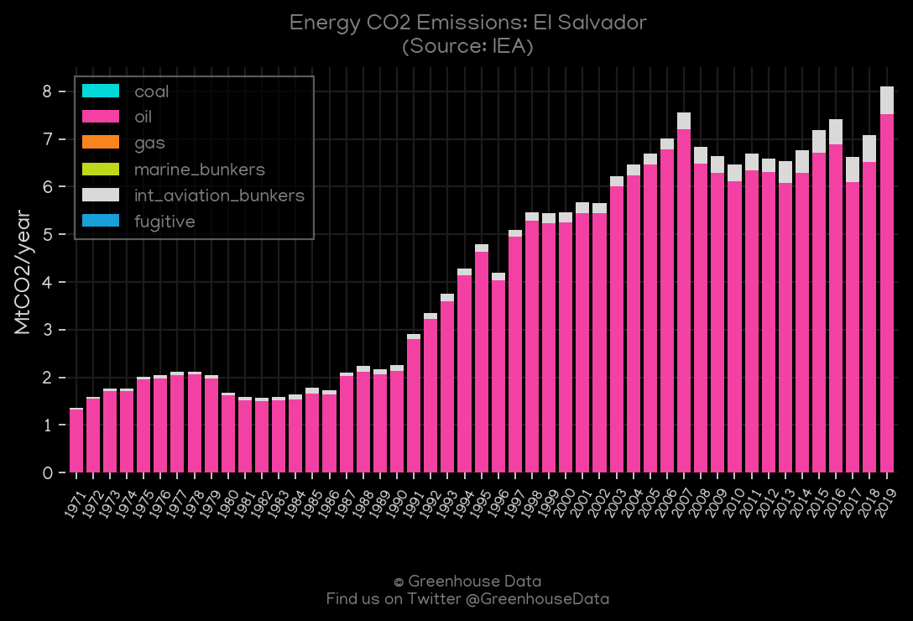
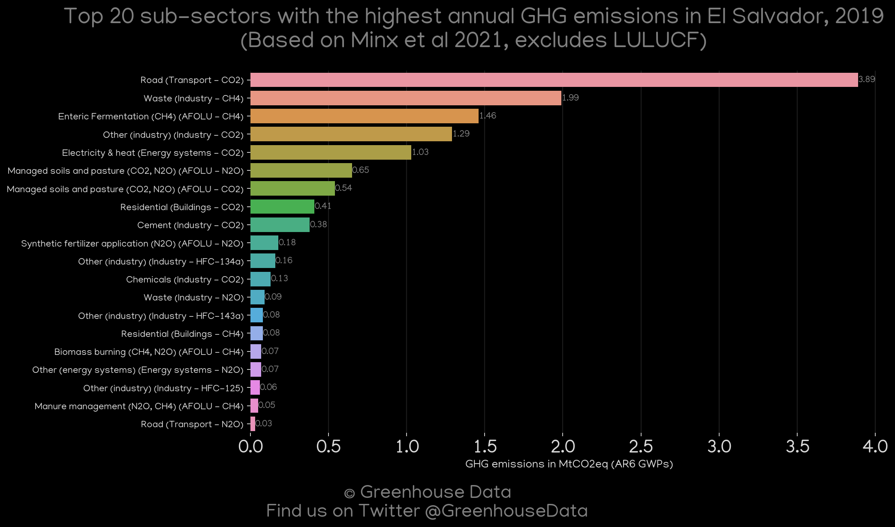
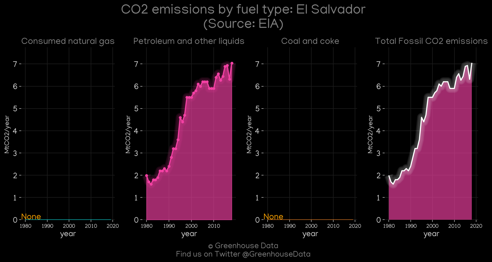
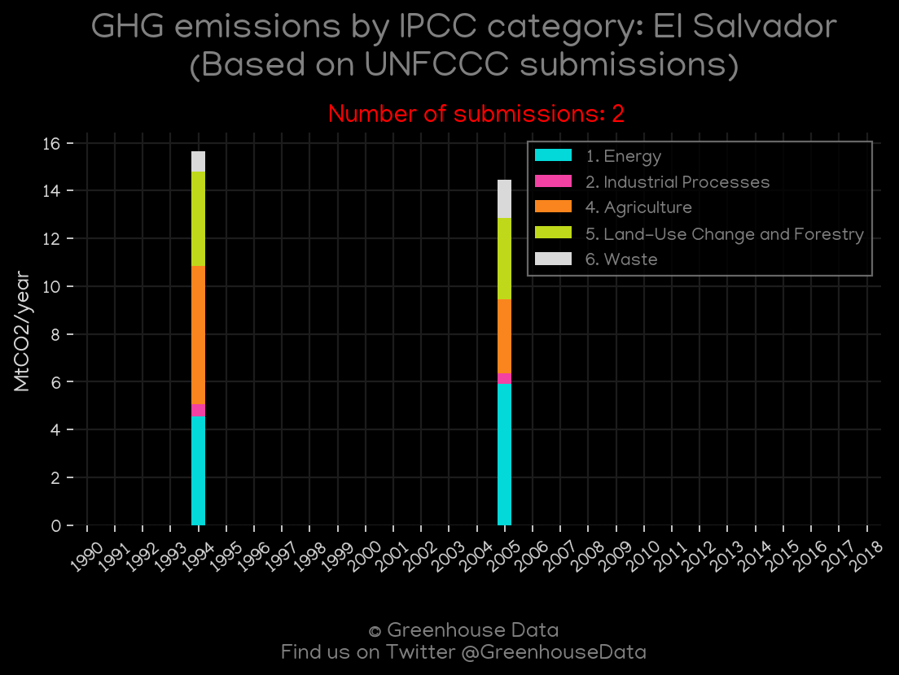
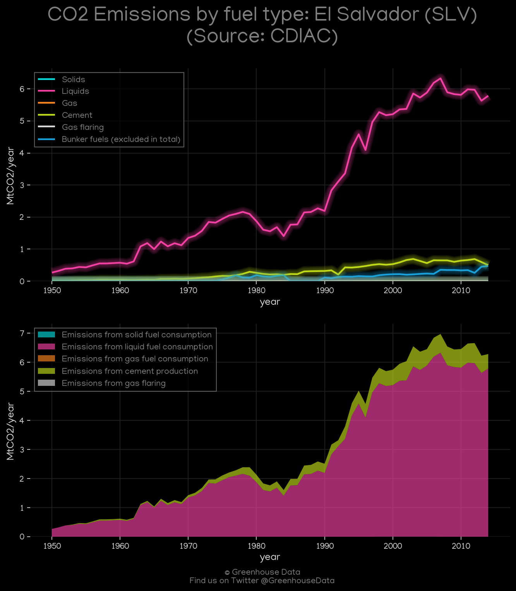
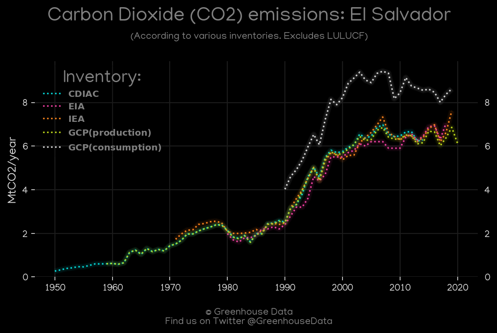
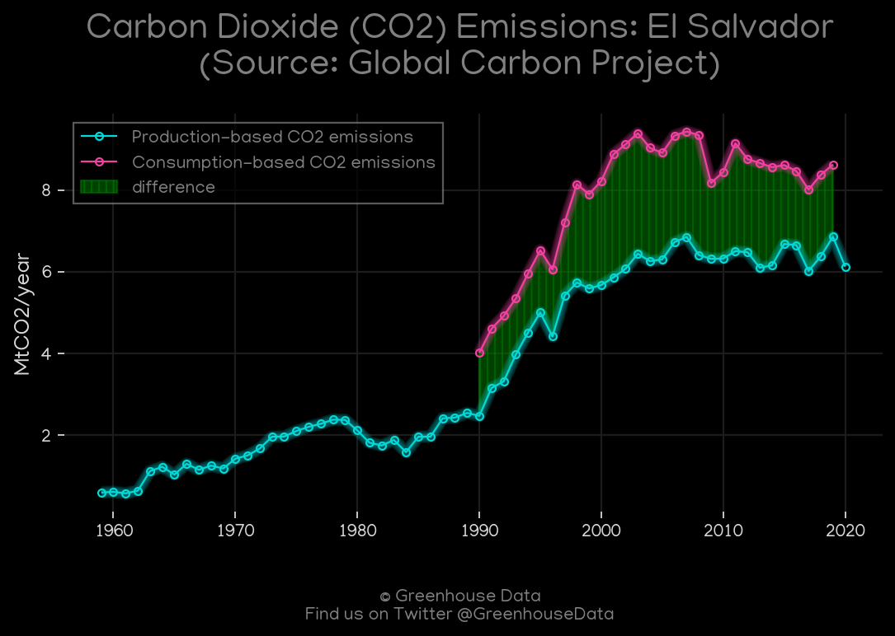

<h1 align="center">
🇸🇻🇸🇻🇸🇻🇸🇻🇸🇻
 
El Salvador
 
🇸🇻🇸🇻🇸🇻🇸🇻🇸🇻
</h1>
<h2>Datasets:</h2>

<a href="https://github.com/dquintani/GreenhouseData/tree/master/country_data/SLV_El Salvador/data">View on Github</a>
 

<a href="data/SLV_EIA.csv">EIA</a> || <a href="data/SLV_GCP.csv">GCP</a> || <a href="data/SLV_IEA.csv">IEA</a> || <a href="data/SLV_GCP_consupmption.csv">GCP_consupmption</a> || <a href="data/SLV_CDIAC.csv">CDIAC</a> || <a href="data/SLV_CAIT.csv">CAIT</a> || <a href="data/SLV_FAO.csv">FAO</a> || <a href="data/SLV_EPA.csv">EPA</a> || <a href="data/SLV_PRIMAP-hist.csv">PRIMAP-hist</a> || <a href="data/SLV_Minx_2021.csv">Minx_2021</a> || <a href="data/SLV_EDGAR.csv">EDGAR</a>

 

<h1>Figures:</h1><h2>#1 (SLV_IEA_1)</h2>

<h2>#2 (SLV_Minx_top20_subsectors)</h2>

<h2>#3 (SLV_EIA_1)</h2>

<h2>#4 (SLV_UNFCCC_NAI_1)</h2>

<h2>#5 (SLV_CDIAC_1)</h2>

<h2>#6 (SLV_CO2_totals)</h2>

<h2>#7 (SLV_GCP_1)</h2>

<h2>#8 (SLV_CAIT_gases_1)</h2>

