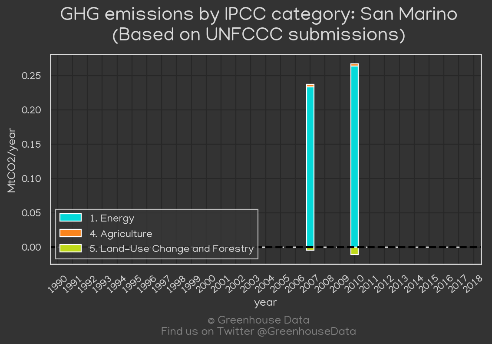
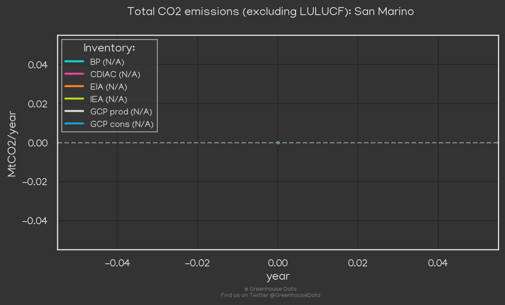

<h1 align="center">
🇸🇲🇸🇲🇸🇲🇸🇲🇸🇲
 
San Marino
 
🇸🇲🇸🇲🇸🇲🇸🇲🇸🇲
</h1>
<h2>Datasets:</h2>

<a href="https://github.com/dquintani/Greenhouse-Data/tree/master/country_data/SMR_San Marino/data">View on Github</a>
 

<a href="data/SMR_FAO.csv">FAO</a> || <a href="data/SMR_EPA.csv">EPA</a> || <a href="data/SMR_PRIMAP-hist.csv">PRIMAP-hist</a>

 

<h1>Figures:</h1><h2>#1 (SMR_UNFCCC_NAI_1)</h2>

<h2>#2 (SMR_CO2_totals)</h2>

