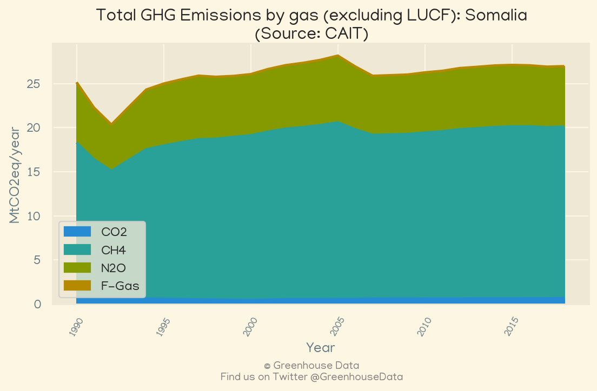
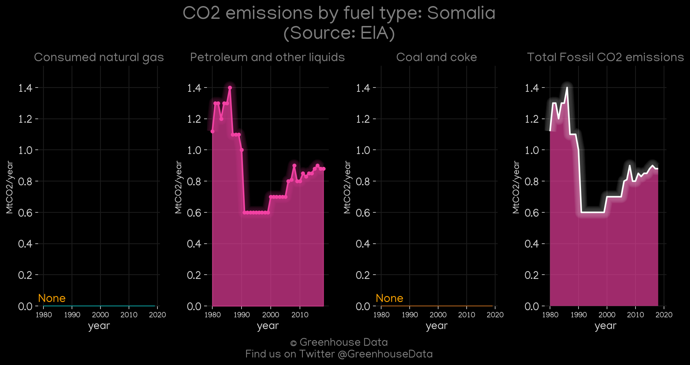
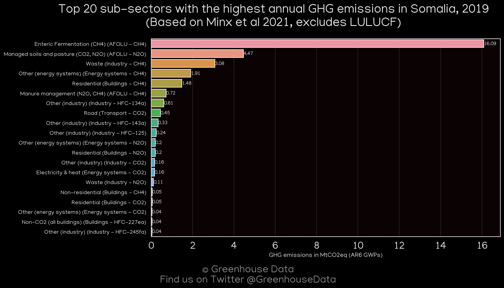
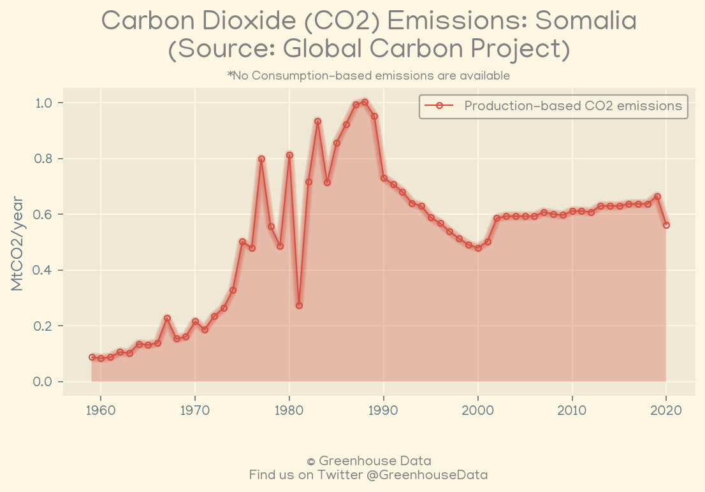
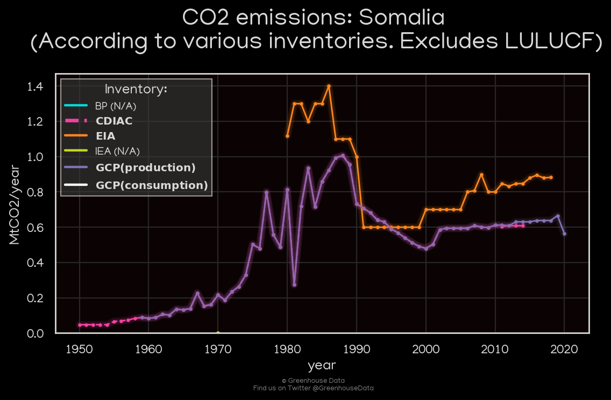
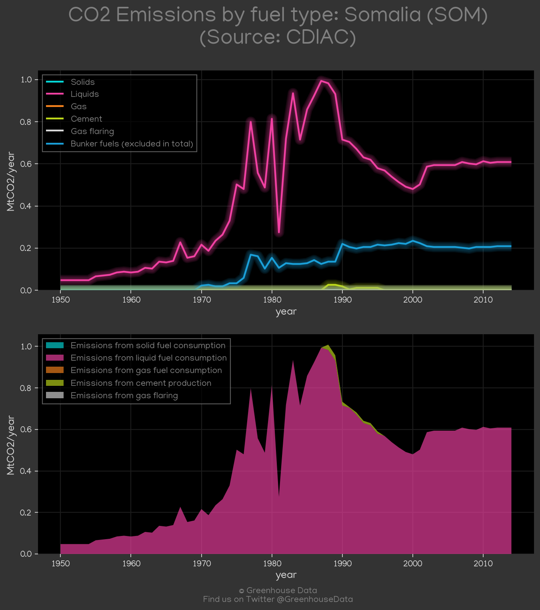

<h1 align="center">
🇸🇴🇸🇴🇸🇴🇸🇴🇸🇴
 
Somalia
 
🇸🇴🇸🇴🇸🇴🇸🇴🇸🇴
</h1>
<h2>Datasets:</h2>

<a href="https://github.com/dquintani/GreenhouseData/tree/master/country_data/SOM_Somalia/data">View on Github</a>
 

<a href="data/SOM_EDGAR.csv">EDGAR</a> || <a href="data/SOM_GCP_consupmption.csv">GCP_consupmption</a> || <a href="data/SOM_GCP.csv">GCP</a> || <a href="data/SOM_CDIAC.csv">CDIAC</a> || <a href="data/SOM_FAO.csv">FAO</a> || <a href="data/SOM_CAIT.csv">CAIT</a> || <a href="data/SOM_PRIMAP-hist.csv">PRIMAP-hist</a> || <a href="data/SOM_EPA.csv">EPA</a> || <a href="data/SOM_EIA.csv">EIA</a> || <a href="data/SOM_Minx_2021.csv">Minx_2021</a> || <a href="data/SOM_GCP_cons.csv">GCP_cons</a>

 

<h1>Figures:</h1><h2>#1 (SOM_CAIT_gases_1)</h2>

<h2>#2 (SOM_EIA_1)</h2>

<h2>#3 (SOM_Minx_top20_subsectors)</h2>

<h2>#4 (SOM_GCP_1)</h2>

<h2>#5 (SOM_CO2_totals)</h2>

<h2>#6 (SOM_CDIAC_1)</h2>

