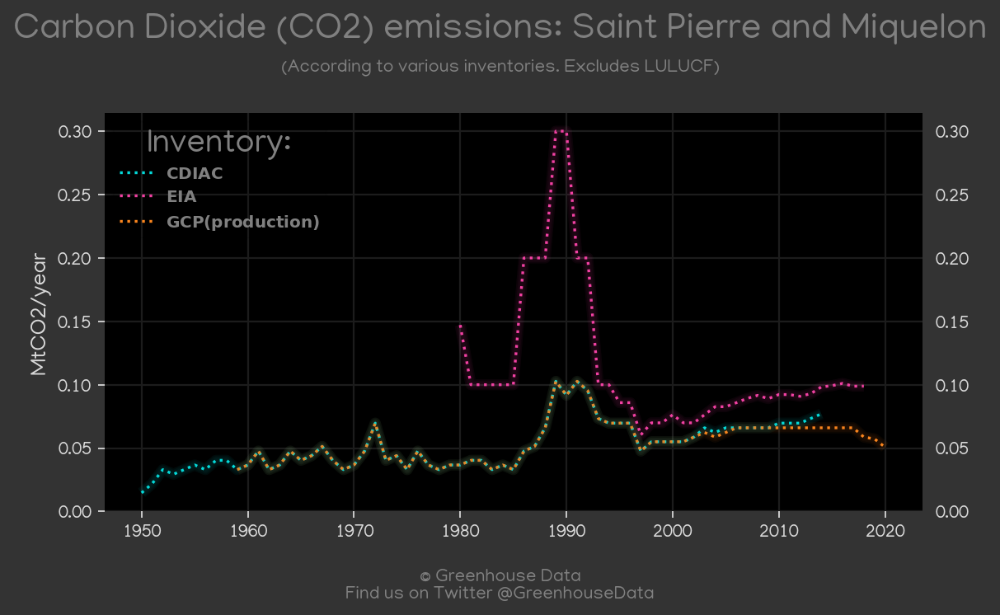
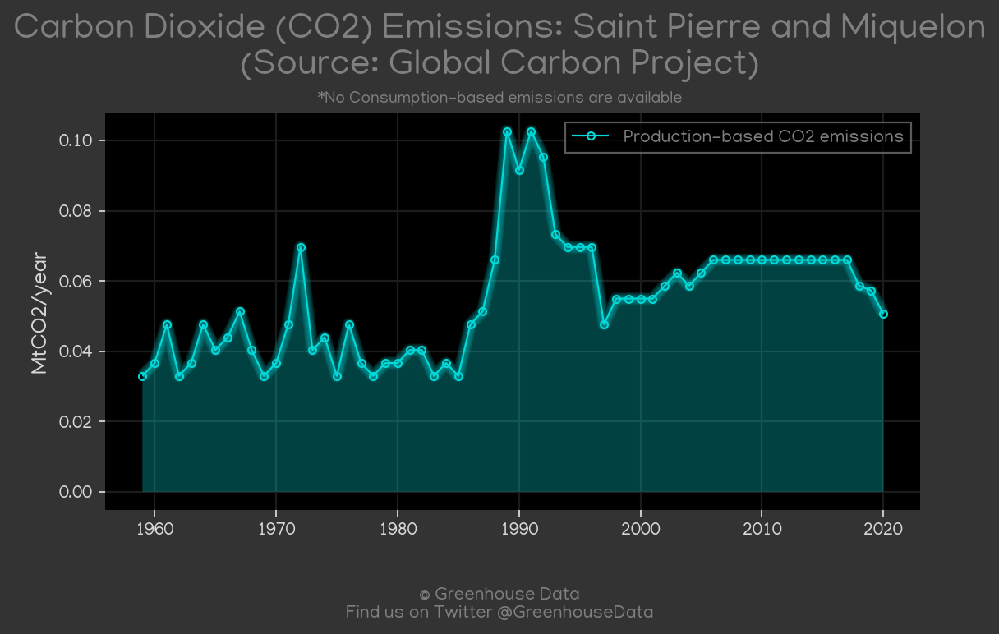
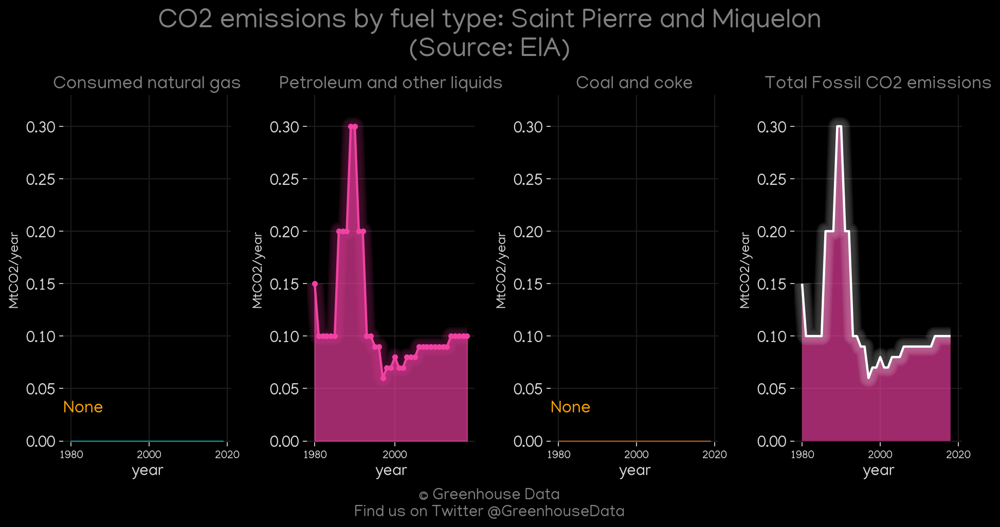
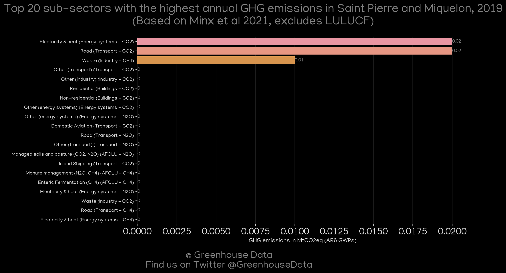
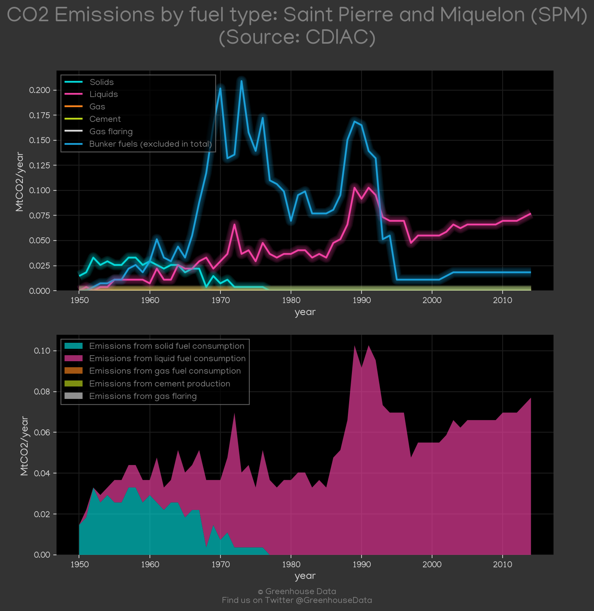

<h1 align="center">
🇵🇲🇵🇲🇵🇲🇵🇲🇵🇲
 
Saint Pierre and Miquelon
 
🇵🇲🇵🇲🇵🇲🇵🇲🇵🇲
</h1>
<h2>Datasets:</h2>

<a href="https://github.com/dquintani/GreenhouseData/tree/master/country_data/SPM_Saint Pierre and Miquelon/data">View on Github</a>
 

<a href="data/SPM_EIA.csv">EIA</a> || <a href="data/SPM_GCP.csv">GCP</a> || <a href="data/SPM_CDIAC.csv">CDIAC</a> || <a href="data/SPM_EDGAR.csv">EDGAR</a> || <a href="data/SPM_FAO.csv">FAO</a> || <a href="data/SPM_Minx_2021.csv">Minx_2021</a> || <a href="data/SPM_GCP_consupmption.csv">GCP_consupmption</a>

 

<h1>Figures:</h1><h2>#1 (SPM_CO2_totals)</h2>

<h2>#2 (SPM_GCP_1)</h2>

<h2>#3 (SPM_EIA_1)</h2>

<h2>#4 (SPM_Minx_top20_subsectors)</h2>

<h2>#5 (SPM_CDIAC_1)</h2>

