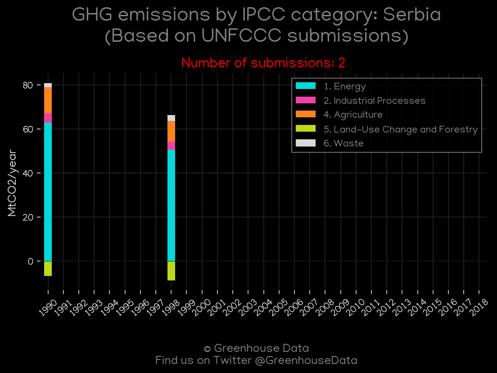
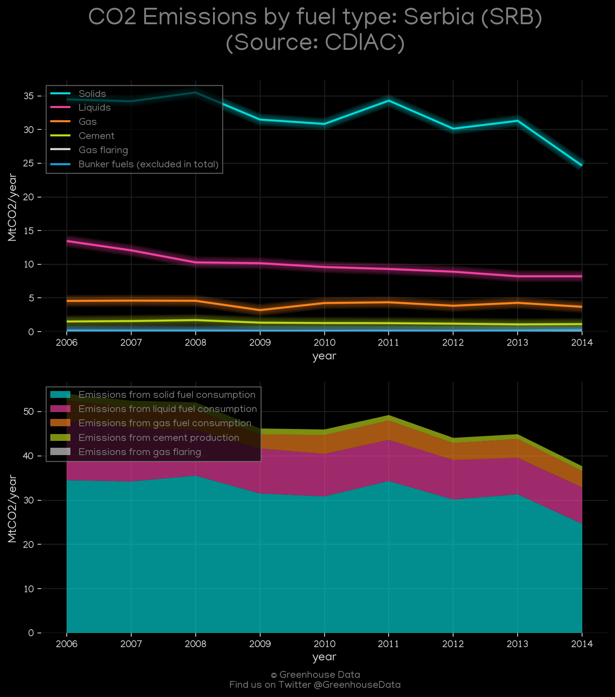
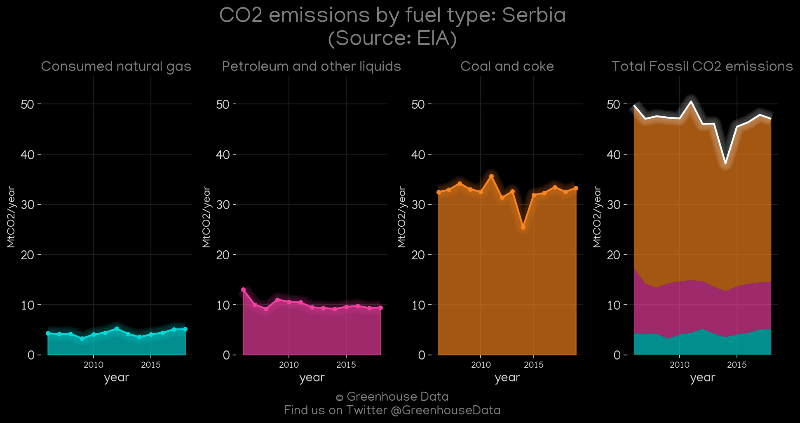
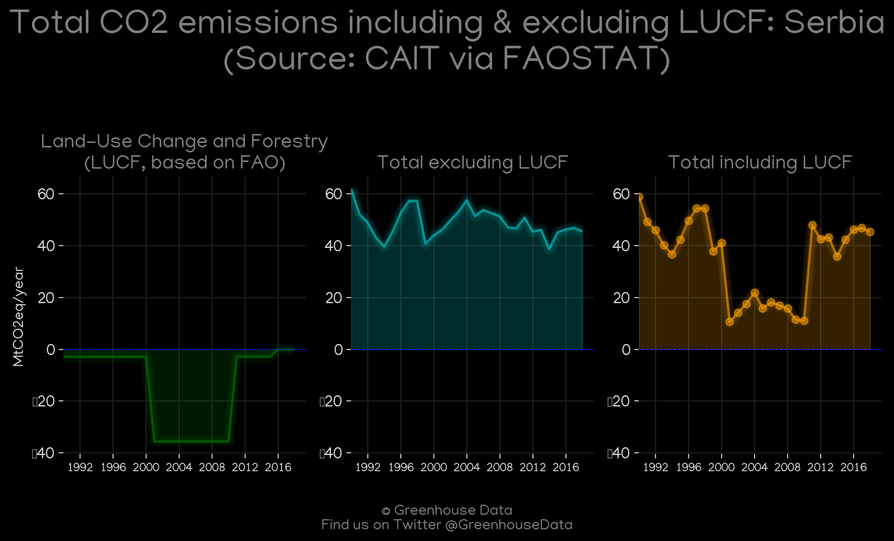
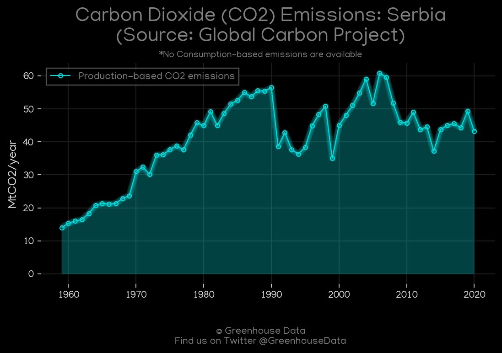
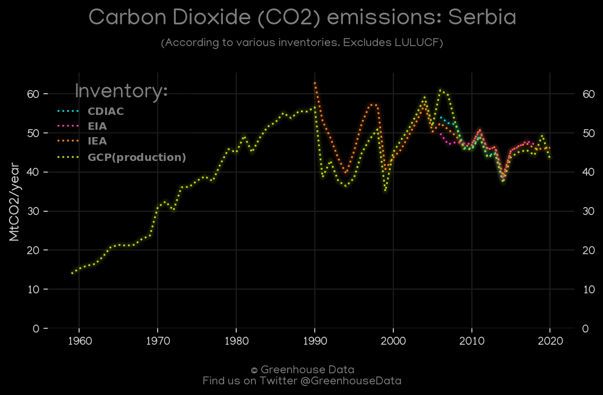
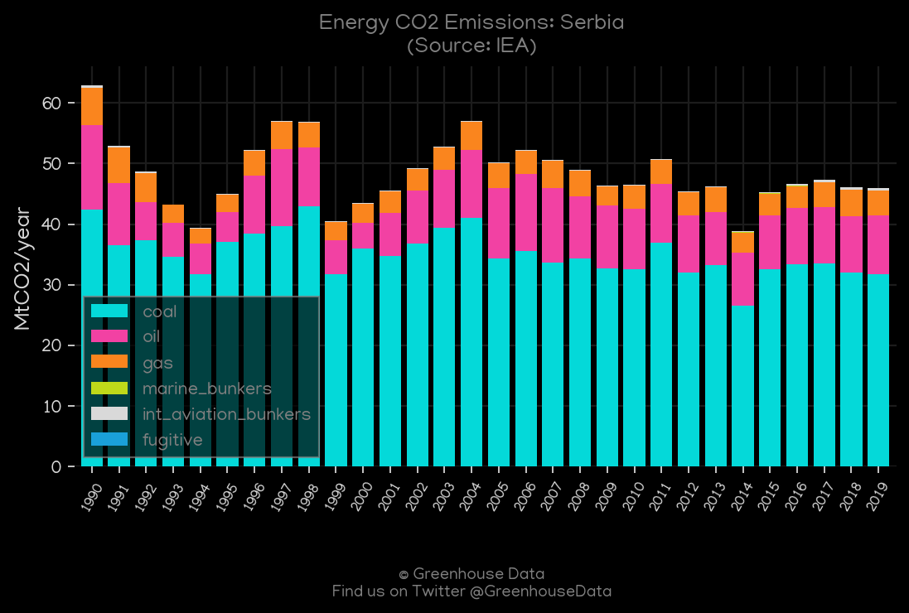

<h1 align="center">
🇷🇸🇷🇸🇷🇸🇷🇸🇷🇸
 
Serbia
 
🇷🇸🇷🇸🇷🇸🇷🇸🇷🇸
</h1>
<h2>Datasets:</h2>

<a href="https://github.com/dquintani/GreenhouseData/tree/master/country_data/SRB_Serbia/data">View on Github</a>
 

<a href="data/SRB_EIA.csv">EIA</a> || <a href="data/SRB_FAO.csv">FAO</a> || <a href="data/SRB_CAIT.csv">CAIT</a> || <a href="data/SRB_CDIAC.csv">CDIAC</a> || <a href="data/SRB_EPA.csv">EPA</a> || <a href="data/SRB_PRIMAP-hist.csv">PRIMAP-hist</a> || <a href="data/SRB_GCP.csv">GCP</a> || <a href="data/SRB_IEA.csv">IEA</a> || <a href="data/SRB_GCP_consupmption.csv">GCP_consupmption</a>

 

<h1>Figures:</h1><h2>#1 (SRB_UNFCCC_NAI_1)</h2>

<h2>#2 (SRB_CDIAC_1)</h2>

<h2>#3 (SRB_relative_totals)</h2>

<h2>#4 (SRB_GCP_Country_Highlight)</h2>

<h2>#5 (SRB_CAIT_gases_1)</h2>

<h2>#6 (SRB_EIA_1)</h2>

<h2>#7 (SRB_CAIT_lucf_vs_nolucf)</h2>

<h2>#8 (SRB_GCP_1)</h2>

<h2>#9 (SRB_CO2_totals)</h2>

<h2>#10 (SRB_IEA_1)</h2>

