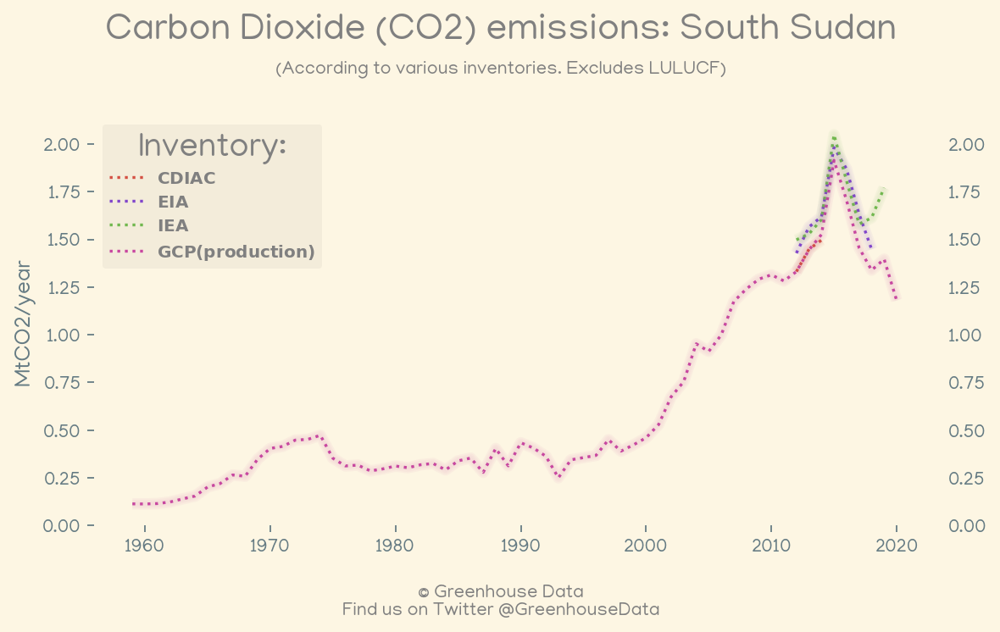
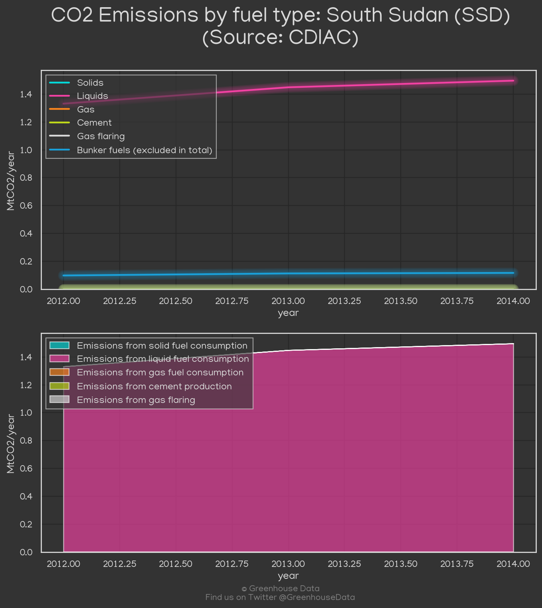
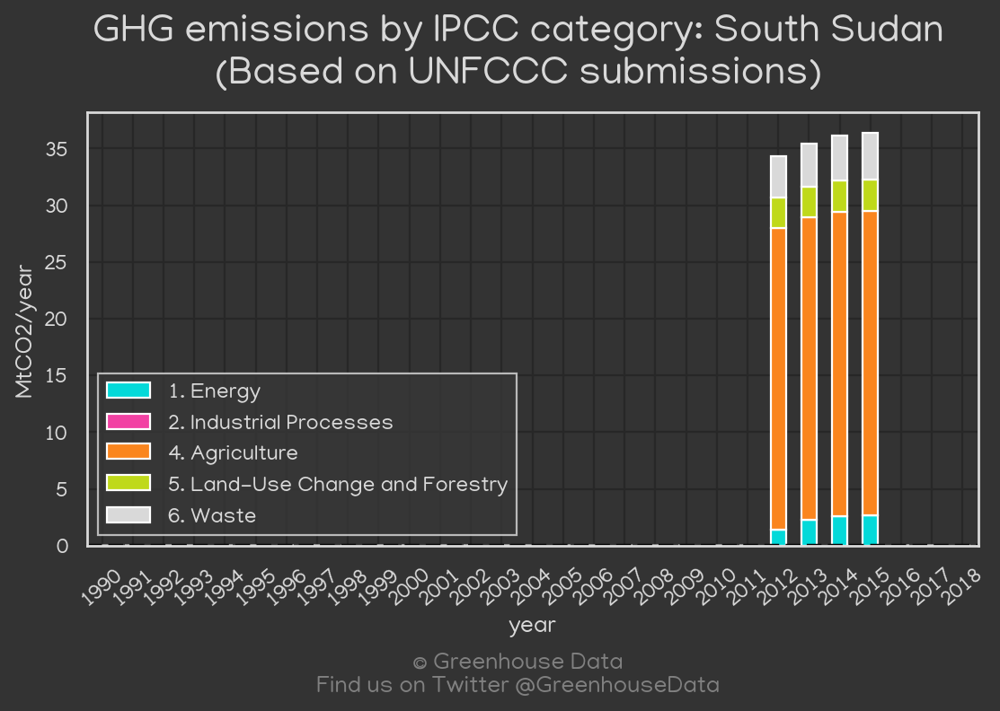
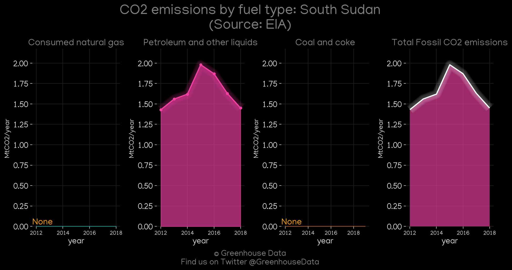
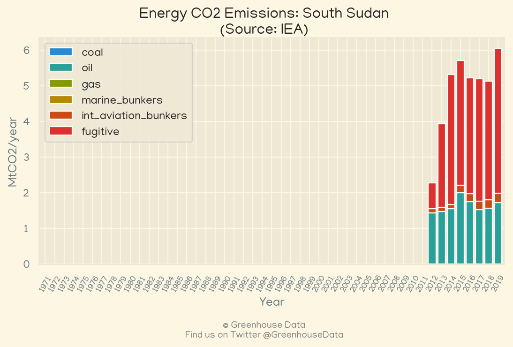
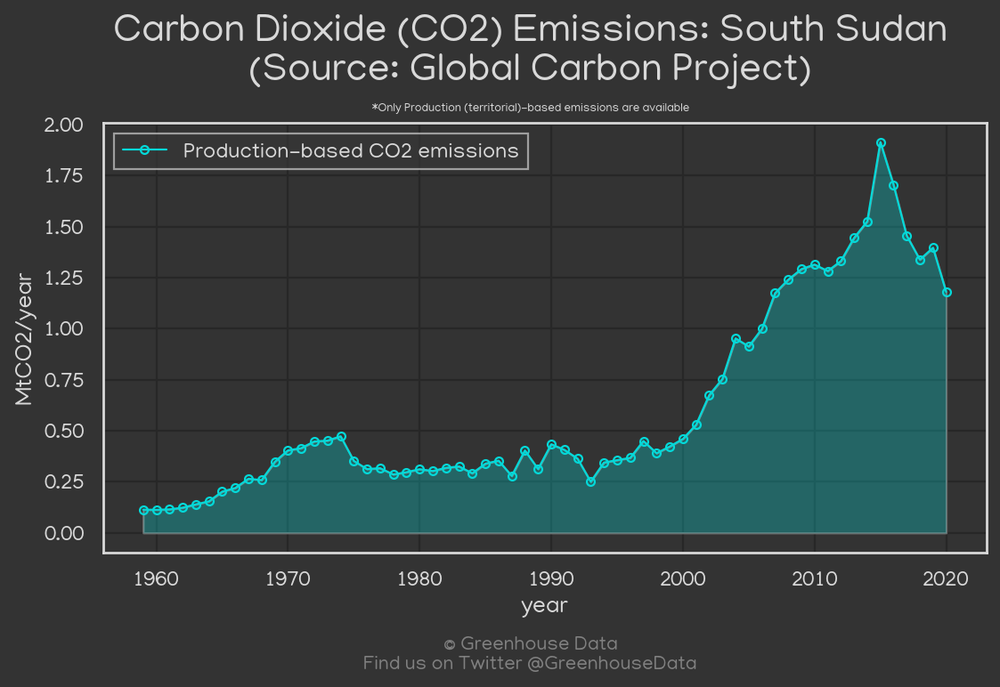

<h1 align="center">
🇸🇸🇸🇸🇸🇸🇸🇸🇸🇸
 
South Sudan
 
🇸🇸🇸🇸🇸🇸🇸🇸🇸🇸
</h1>
<h2>Datasets:</h2>

<a href="https://github.com/dquintani/GreenhouseData/tree/master/country_data/SSD_South Sudan/data">View on Github</a>
 

<a href="data/SSD_GCP.csv">GCP</a> || <a href="data/SSD_GCP_consupmption.csv">GCP_consupmption</a> || <a href="data/SSD_EIA.csv">EIA</a> || <a href="data/SSD_EPA.csv">EPA</a> || <a href="data/SSD_PRIMAP-hist.csv">PRIMAP-hist</a> || <a href="data/SSD_CDIAC.csv">CDIAC</a> || <a href="data/SSD_CAIT.csv">CAIT</a> || <a href="data/SSD_FAO.csv">FAO</a> || <a href="data/SSD_IEA.csv">IEA</a>

 

<h1>Figures:</h1><h2>#1 (SSD_CO2_totals)</h2>

<h2>#2 (SSD_CAIT_gases_1)</h2>

<h2>#3 (SSD_CDIAC_1)</h2>

<h2>#4 (SSD_UNFCCC_NAI_1)</h2>

<h2>#5 (SSD_EIA_1)</h2>

<h2>#6 (SSD_IEA_1)</h2>

<h2>#7 (SSD_GCP_1)</h2>

