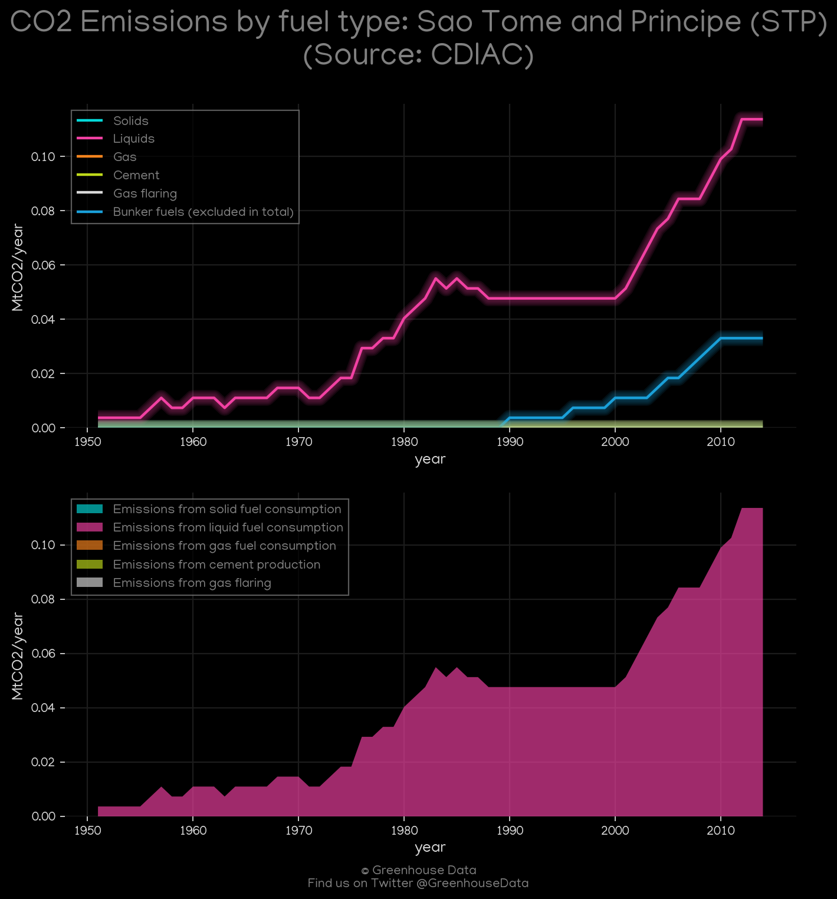
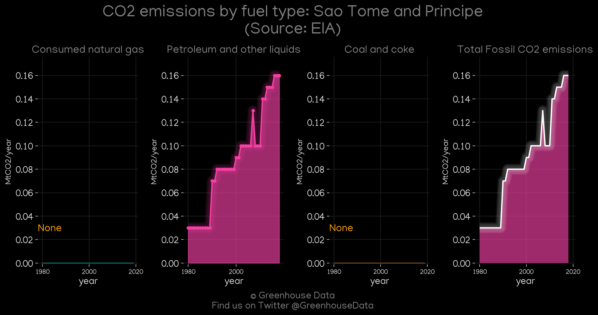
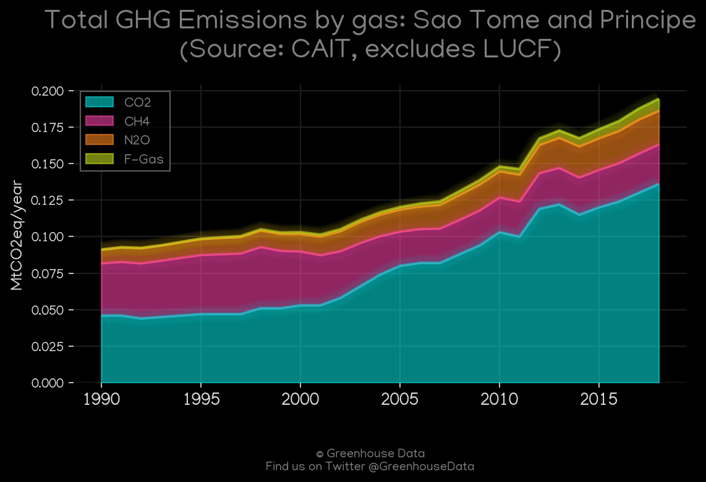
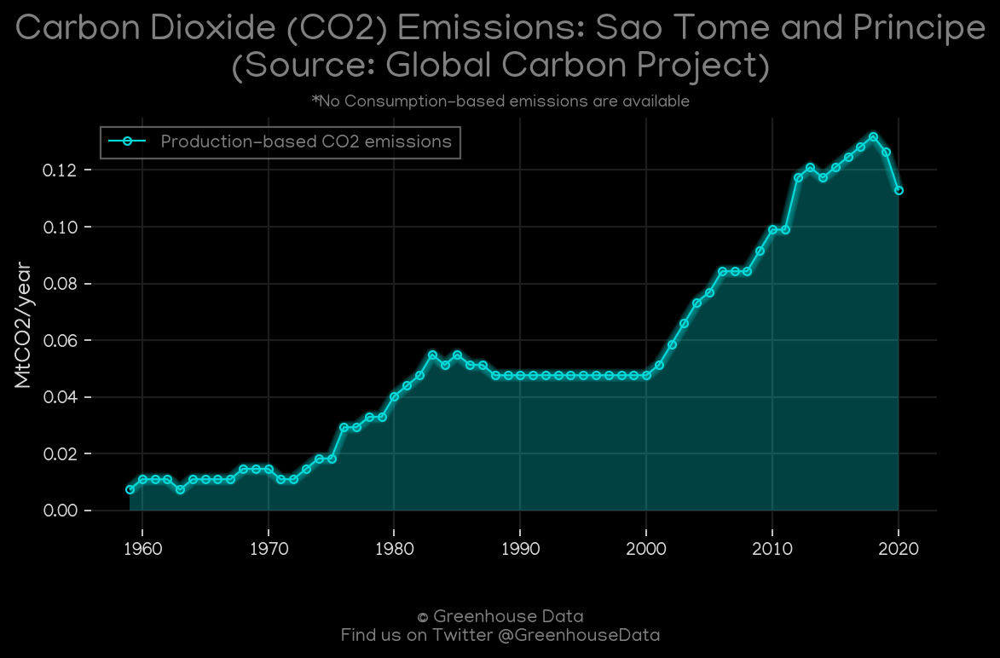
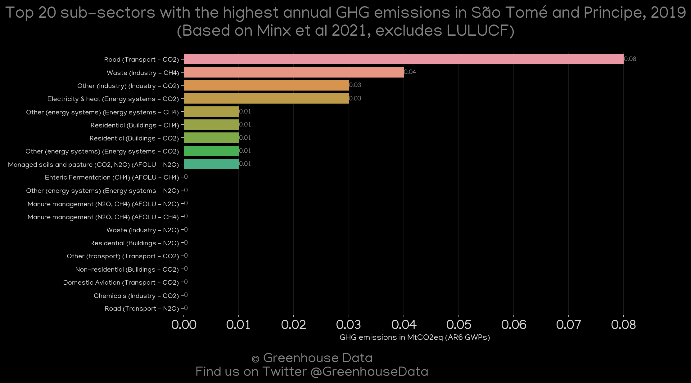
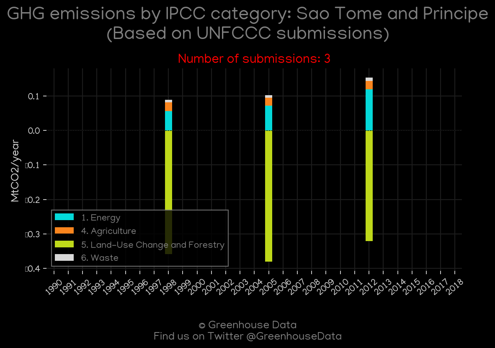

<h1 align="center">
🇸🇹🇸🇹🇸🇹🇸🇹🇸🇹
 
Sao Tome and Principe
 
🇸🇹🇸🇹🇸🇹🇸🇹🇸🇹
</h1>
<h2>Datasets:</h2>

<a href="https://github.com/dquintani/GreenhouseData/tree/master/country_data/STP_Sao Tome and Principe/data">View on Github</a>
 

<a href="data/STP_EDGAR.csv">EDGAR</a> || <a href="data/STP_EPA.csv">EPA</a> || <a href="data/STP_GCP_cons.csv">GCP_cons</a> || <a href="data/STP_CAIT.csv">CAIT</a> || <a href="data/STP_FAO.csv">FAO</a> || <a href="data/STP_PRIMAP-hist.csv">PRIMAP-hist</a> || <a href="data/STP_Minx_2021.csv">Minx_2021</a> || <a href="data/STP_EIA.csv">EIA</a> || <a href="data/STP_GCP.csv">GCP</a> || <a href="data/STP_GCP_consupmption.csv">GCP_consupmption</a> || <a href="data/STP_CDIAC.csv">CDIAC</a>

 

<h1>Figures:</h1><h2>#1 (STP_CDIAC_1)</h2>

<h2>#2 (STP_EIA_1)</h2>

<h2>#3 (STP_CAIT_gases_1)</h2>

<h2>#4 (STP_GCP_1)</h2>

<h2>#5 (STP_Minx_top20_subsectors)</h2>

<h2>#6 (STP_CO2_totals)</h2>

<h2>#7 (STP_UNFCCC_NAI_1)</h2>

