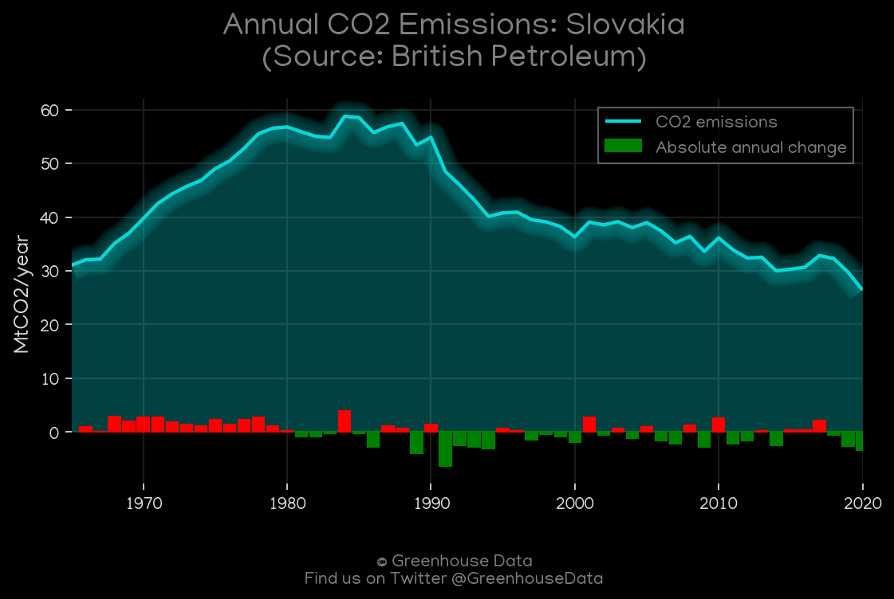
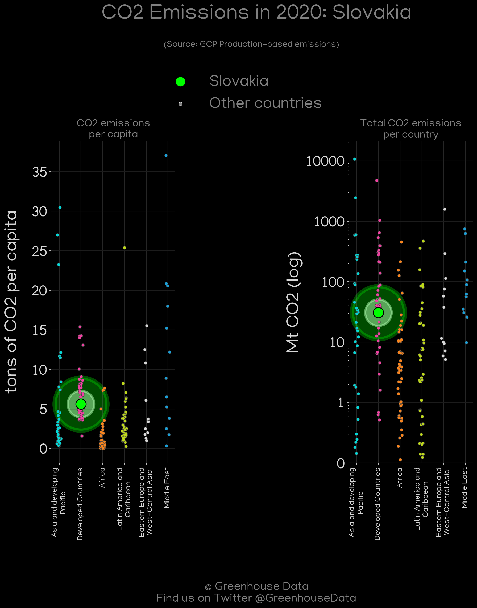
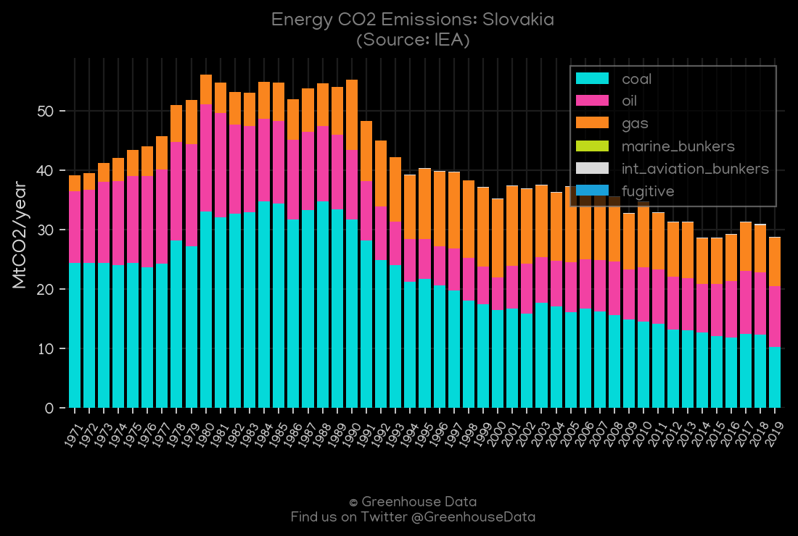
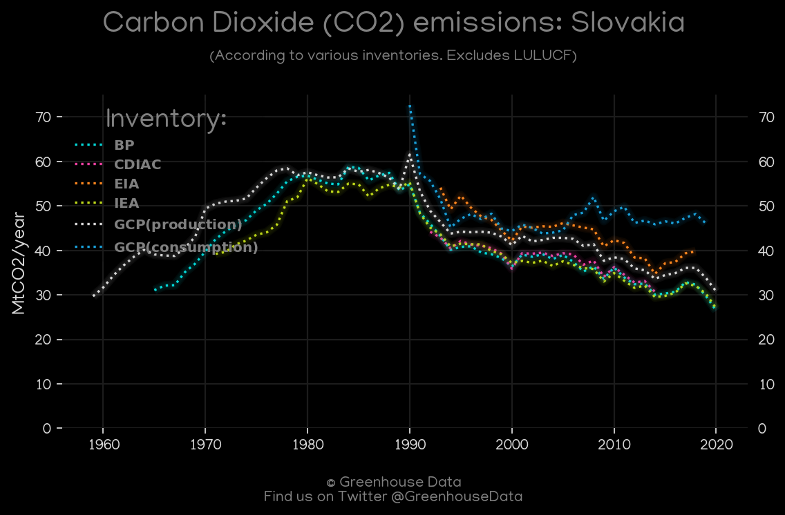
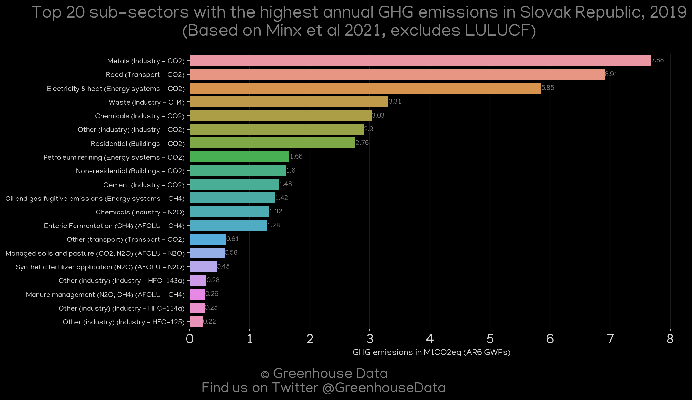
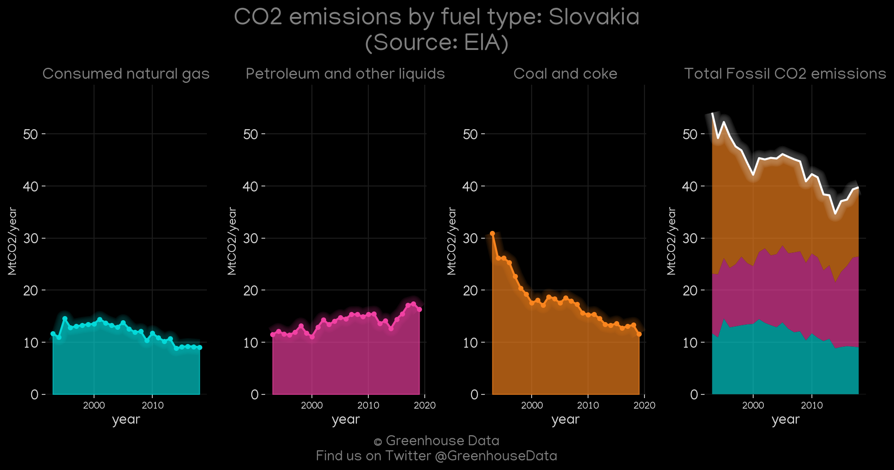
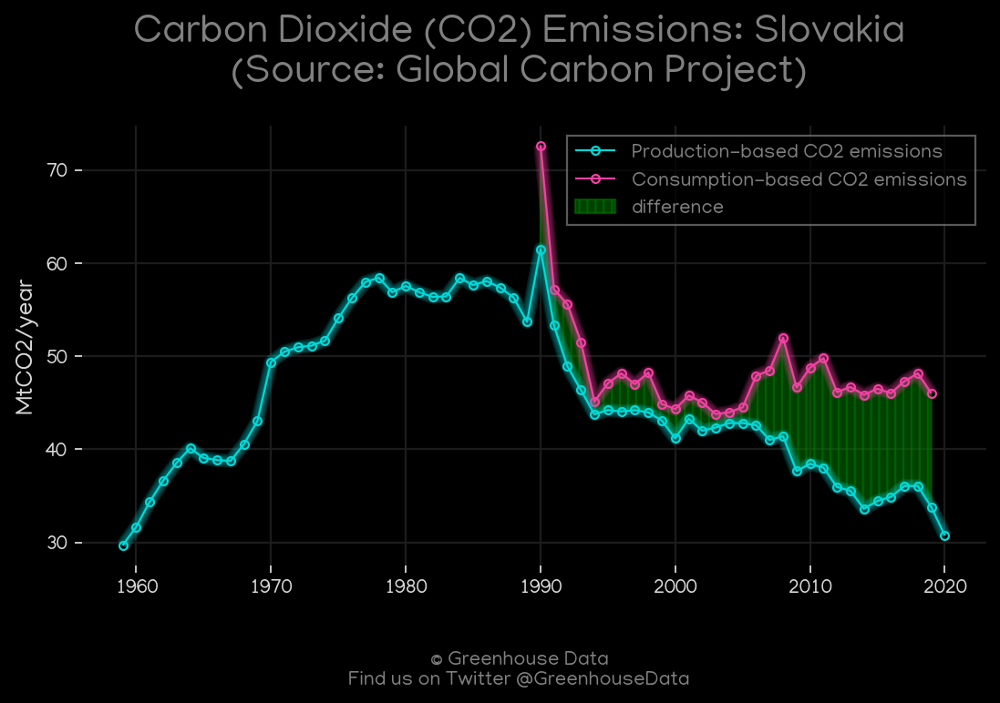
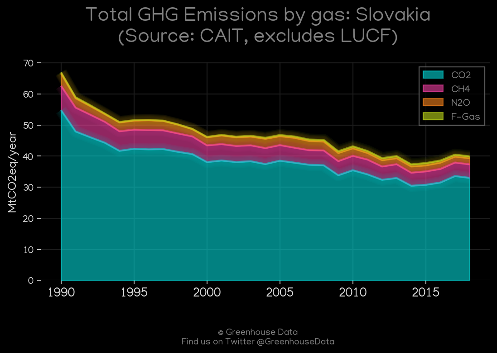
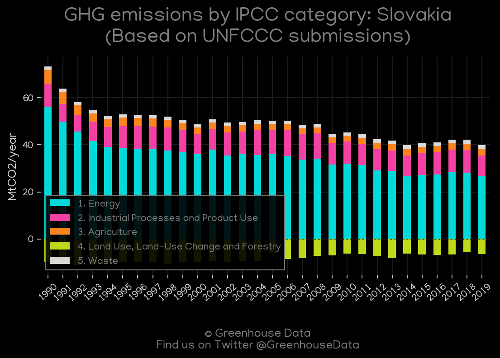

<h1 align="center">
🇸🇰🇸🇰🇸🇰🇸🇰🇸🇰
 
Slovakia
 
🇸🇰🇸🇰🇸🇰🇸🇰🇸🇰
</h1>
<h2>Datasets:</h2>

<a href="https://github.com/dquintani/GreenhouseData/tree/master/country_data/SVK_Slovakia/data">View on Github</a>
 

<a href="data/SVK_FAO.csv">FAO</a> || <a href="data/SVK_Minx_2021.csv">Minx_2021</a> || <a href="data/SVK_IEA.csv">IEA</a> || <a href="data/SVK_EPA.csv">EPA</a> || <a href="data/SVK_PRIMAP-hist.csv">PRIMAP-hist</a> || <a href="data/SVK_GCP.csv">GCP</a> || <a href="data/SVK_CAIT.csv">CAIT</a> || <a href="data/SVK_EIA.csv">EIA</a> || <a href="data/SVK_BP.csv">BP</a> || <a href="data/SVK_GCP_consupmption.csv">GCP_consupmption</a> || <a href="data/SVK_CDIAC.csv">CDIAC</a> || <a href="data/SVK_EDGAR.csv">EDGAR</a>

 

<h1>Figures:</h1><h2>#1 (SVK_BP_1)</h2>

<h2>#2 (SVK_GCP_Country_Highlight)</h2>

<h2>#3 (SVK_IEA_1)</h2>

<h2>#4 (SVK_CO2_totals)</h2>

<h2>#5 (SVK_relative_totals)</h2>

<h2>#6 (SVK_Minx_top20_subsectors)</h2>

<h2>#7 (SVK_EIA_1)</h2>

<h2>#8 (SVK_GCP_1)</h2>

<h2>#9 (SVK_CAIT_gases_1)</h2>

<h2>#10 (SVK_CAIT_lucf_vs_nolucf)</h2>

<h2>#11 (SVK_CDIAC_1)</h2>

<h2>#12 (SVK_UNFCCC_AI_1)</h2>

