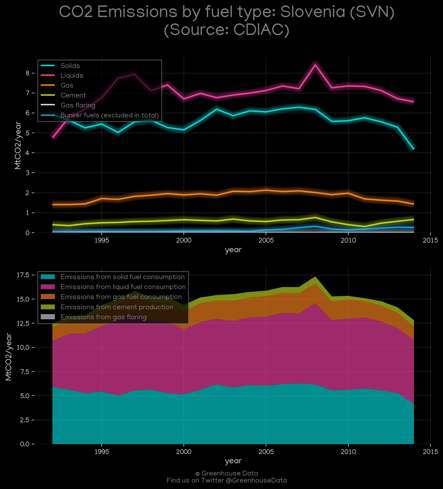
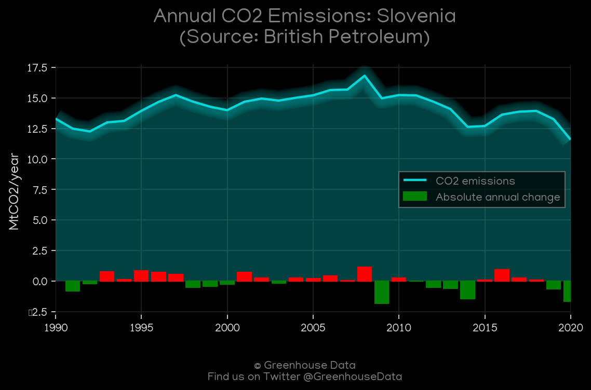
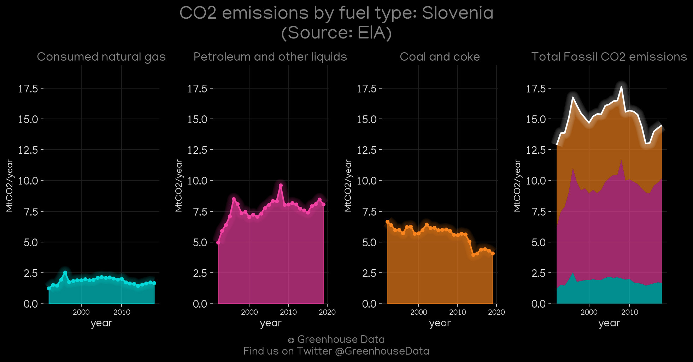
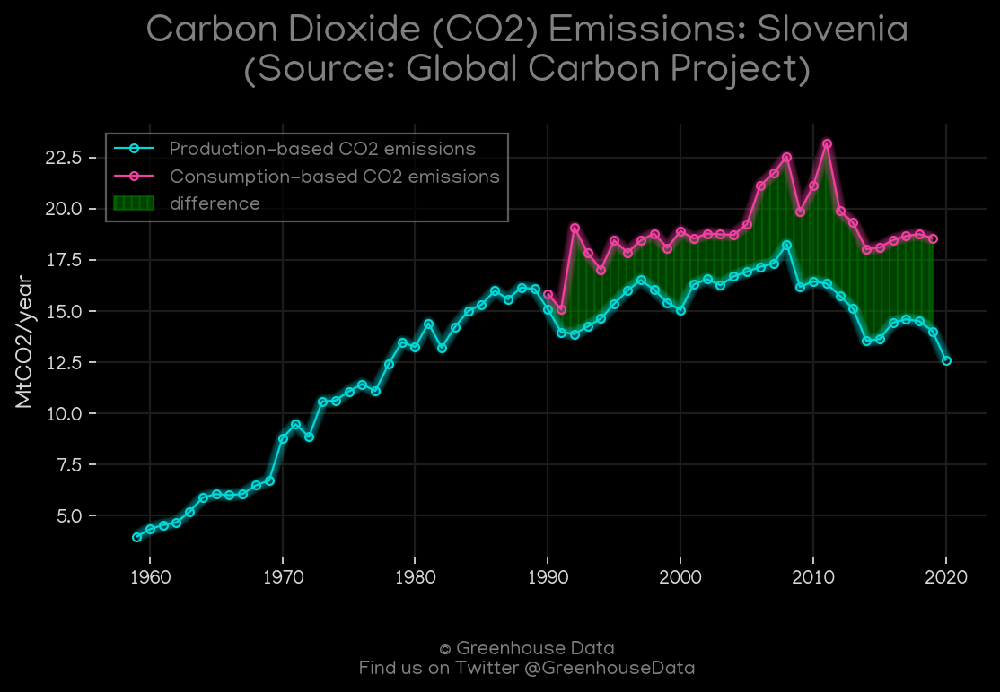
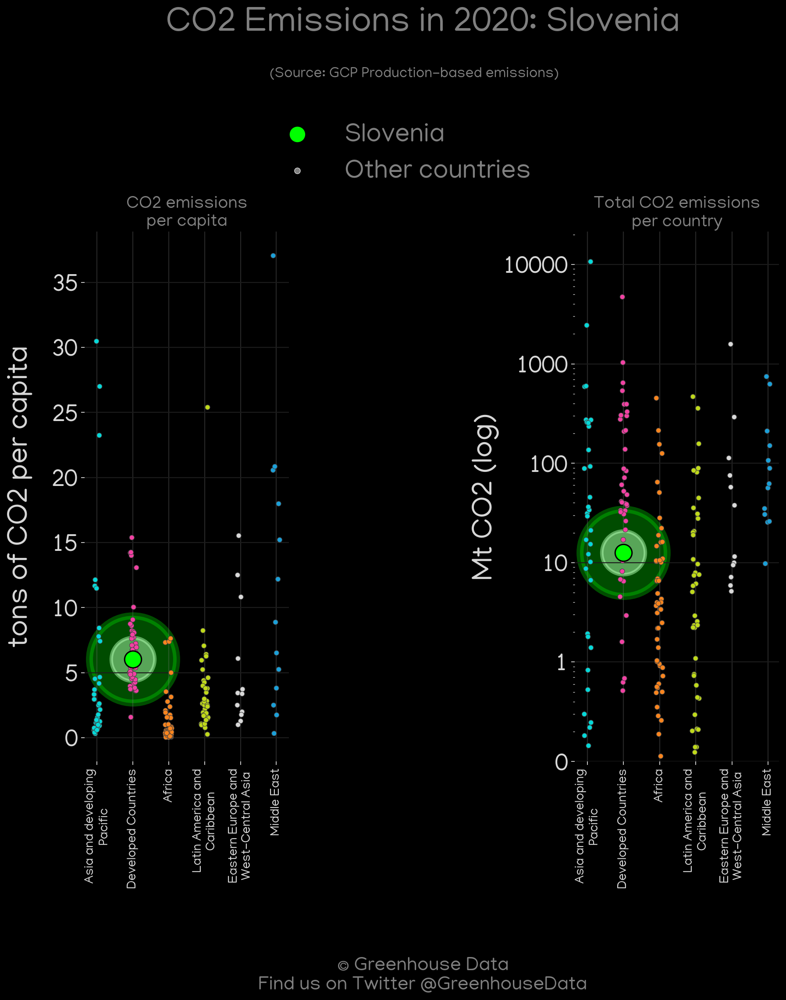
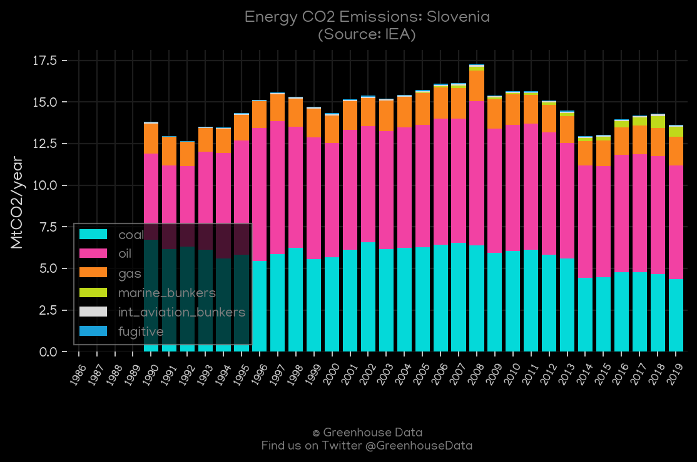
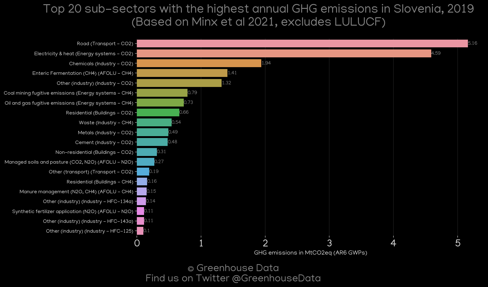
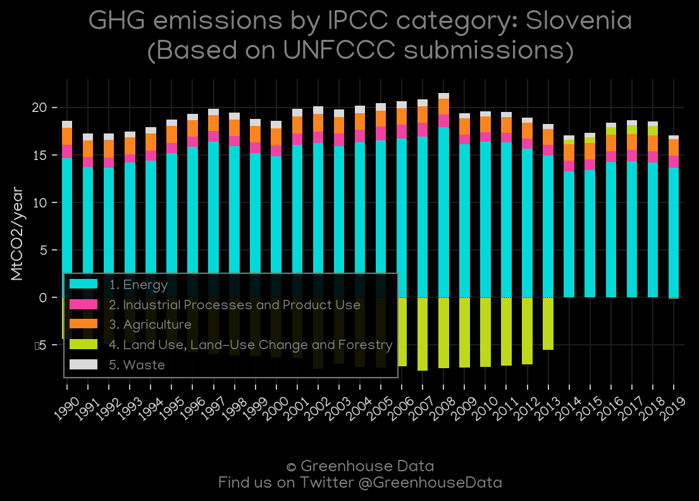
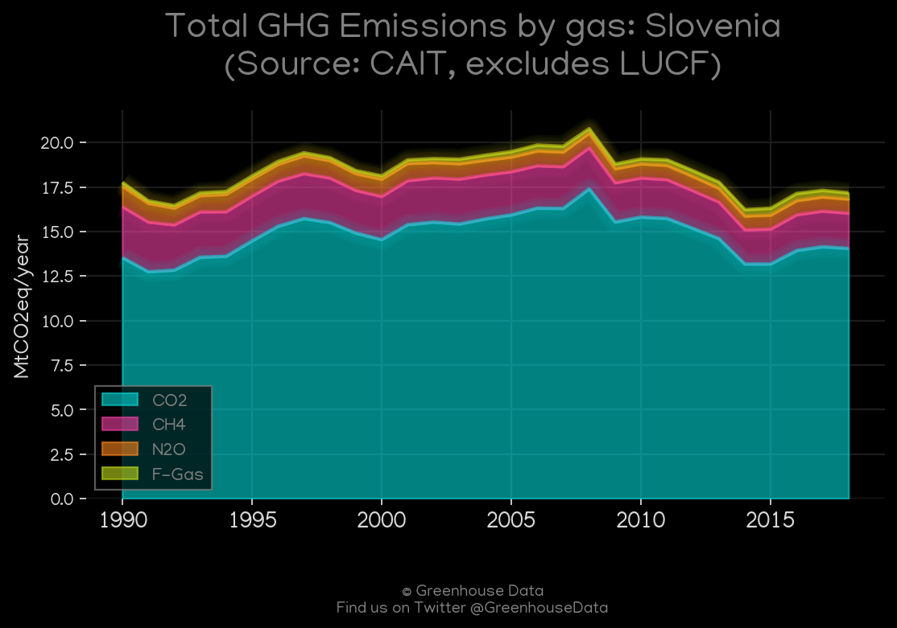

<h1 align="center">
🇸🇮🇸🇮🇸🇮🇸🇮🇸🇮
 
Slovenia
 
🇸🇮🇸🇮🇸🇮🇸🇮🇸🇮
</h1>
<h2>Datasets:</h2>

<a href="https://github.com/dquintani/GreenhouseData/tree/master/country_data/SVN_Slovenia/data">View on Github</a>
 

<a href="data/SVN_CDIAC.csv">CDIAC</a> || <a href="data/SVN_BP.csv">BP</a> || <a href="data/SVN_Minx_2021.csv">Minx_2021</a> || <a href="data/SVN_CAIT.csv">CAIT</a> || <a href="data/SVN_GCP.csv">GCP</a> || <a href="data/SVN_IEA.csv">IEA</a> || <a href="data/SVN_PRIMAP-hist.csv">PRIMAP-hist</a> || <a href="data/SVN_GCP_consupmption.csv">GCP_consupmption</a> || <a href="data/SVN_FAO.csv">FAO</a> || <a href="data/SVN_EDGAR.csv">EDGAR</a> || <a href="data/SVN_EIA.csv">EIA</a> || <a href="data/SVN_EPA.csv">EPA</a>

 

<h1>Figures:</h1><h2>#1 (SVN_CO2_totals)</h2>

<h2>#2 (SVN_CDIAC_1)</h2>

<h2>#3 (SVN_BP_1)</h2>

<h2>#4 (SVN_EIA_1)</h2>

<h2>#5 (SVN_GCP_1)</h2>

<h2>#6 (SVN_GCP_Country_Highlight)</h2>

<h2>#7 (SVN_IEA_1)</h2>

<h2>#8 (SVN_Minx_top20_subsectors)</h2>

<h2>#9 (SVN_CAIT_lucf_vs_nolucf)</h2>

<h2>#10 (SVN_UNFCCC_AI_1)</h2>

<h2>#11 (SVN_CAIT_gases_1)</h2>

