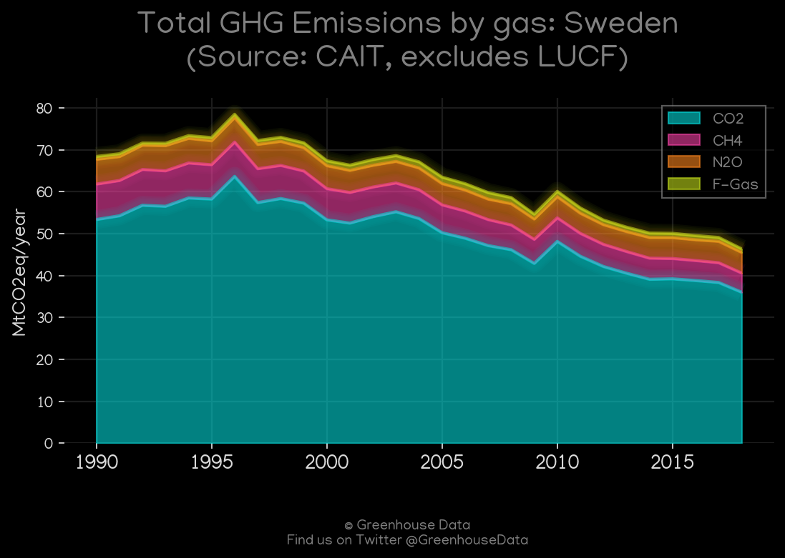
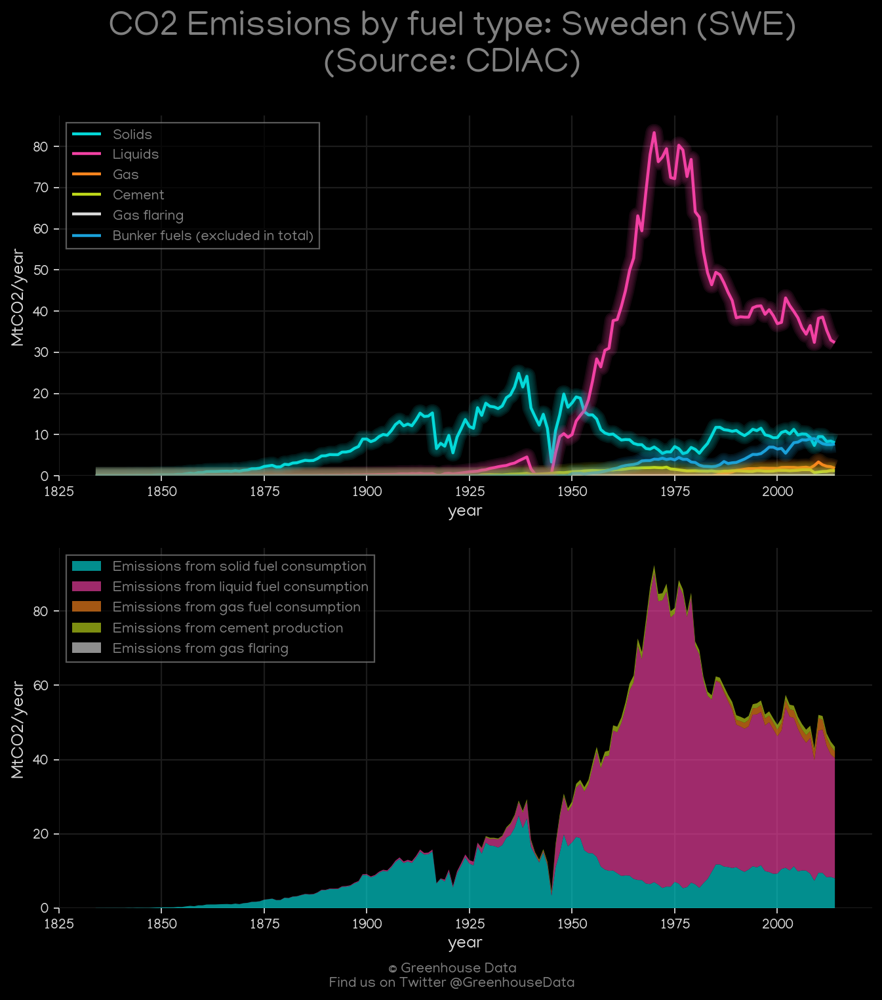
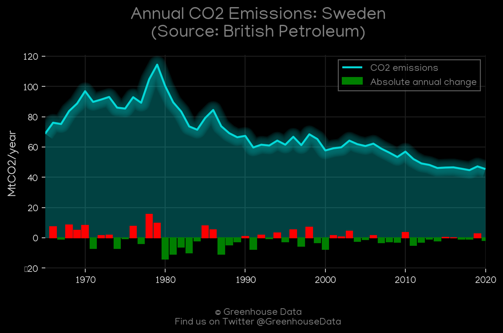
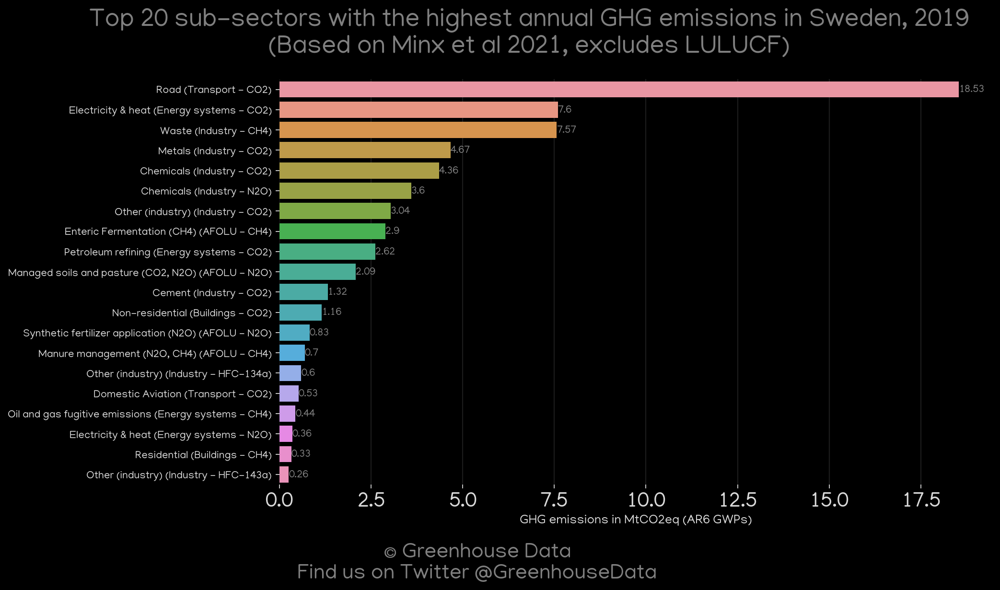
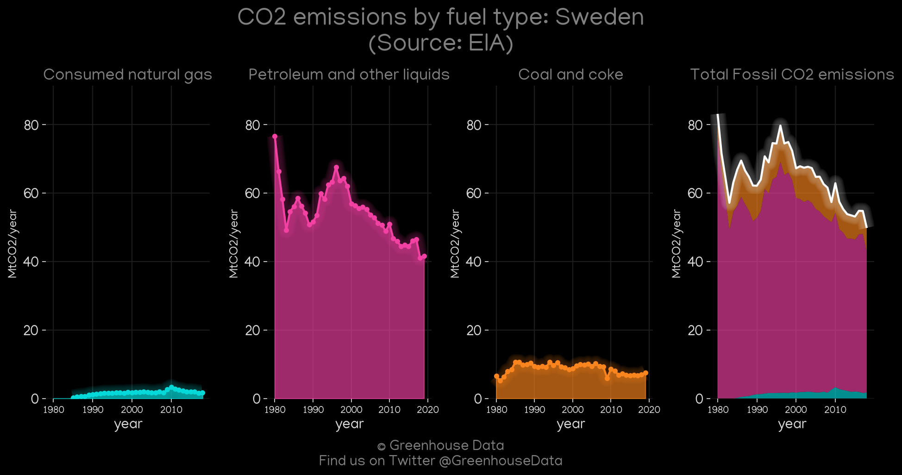
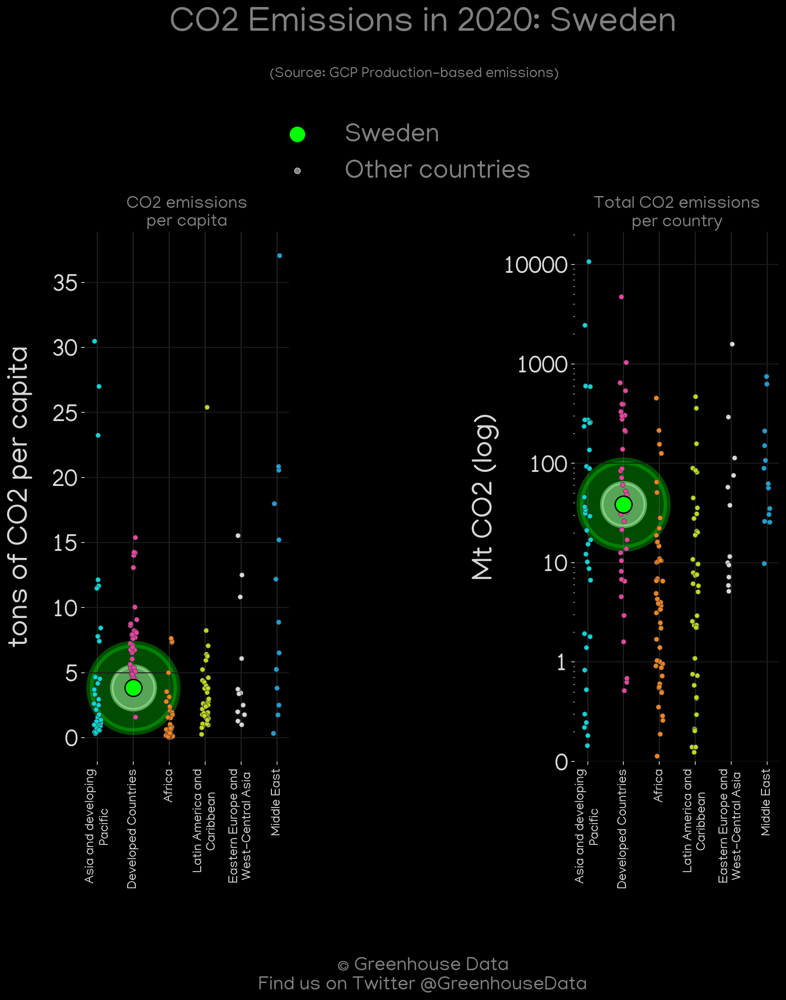
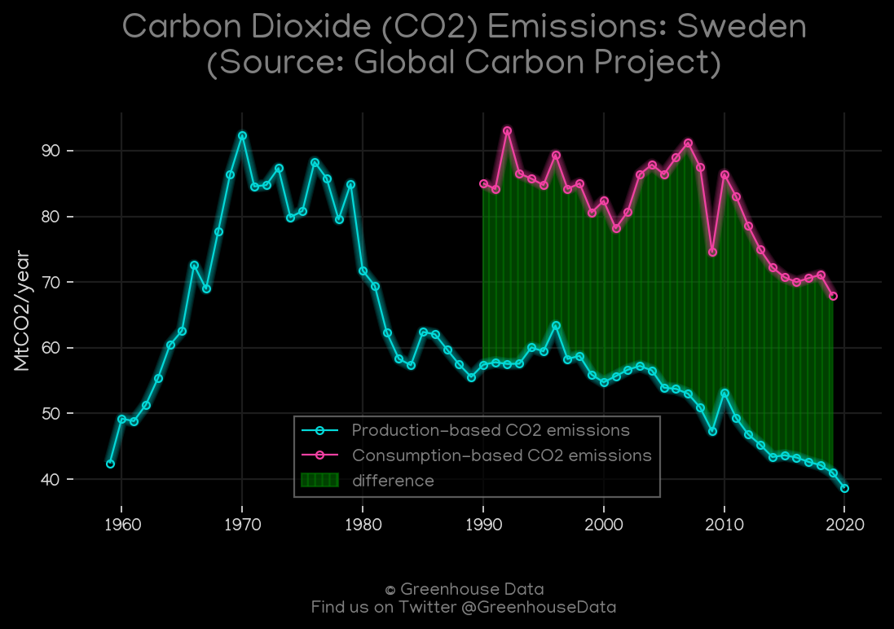
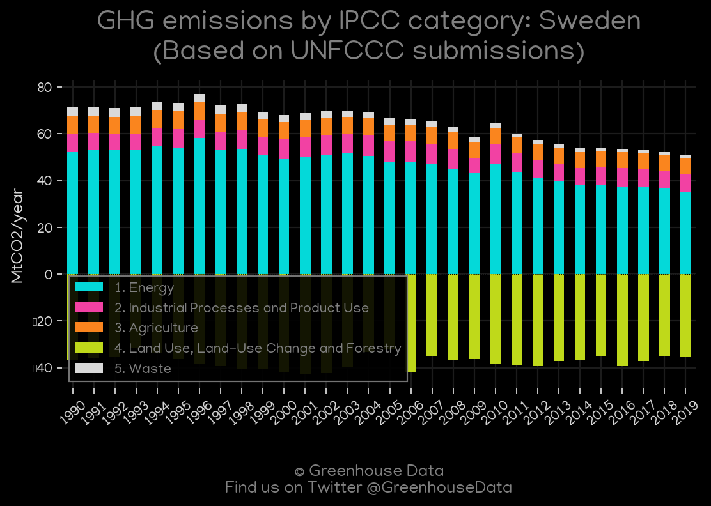
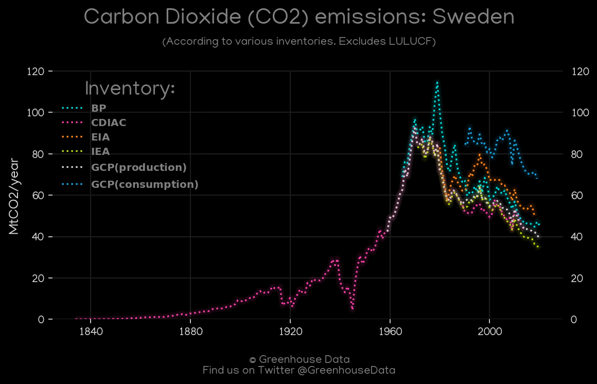
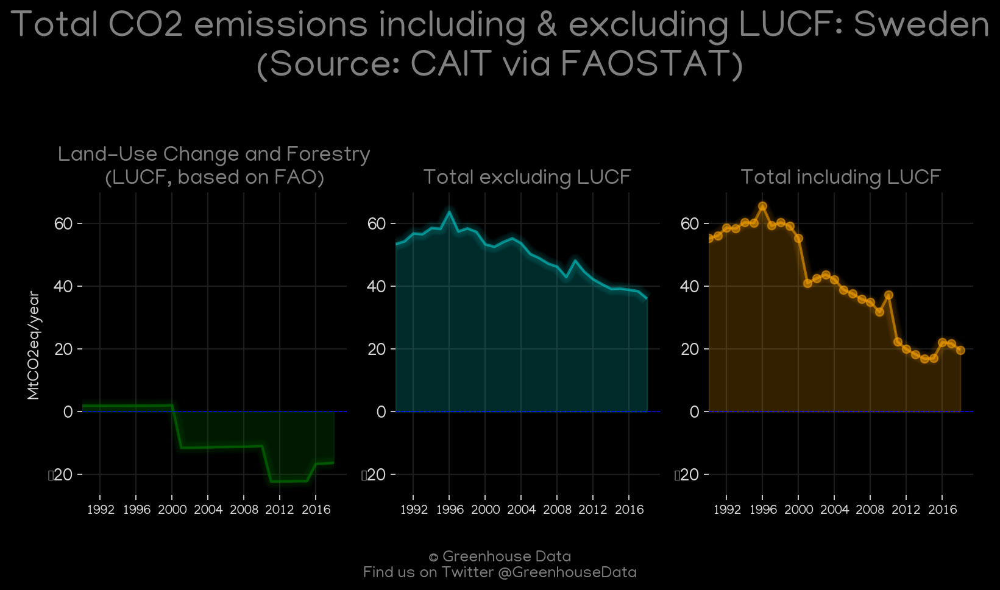

<h1 align="center">
🇸🇪🇸🇪🇸🇪🇸🇪🇸🇪
 
Sweden
 
🇸🇪🇸🇪🇸🇪🇸🇪🇸🇪
</h1>
<h2>Datasets:</h2>

<a href="https://github.com/dquintani/GreenhouseData/tree/master/country_data/SWE_Sweden/data">View on Github</a>
 

<a href="data/SWE_EDGAR.csv">EDGAR</a> || <a href="data/SWE_CAIT.csv">CAIT</a> || <a href="data/SWE_GCP_consupmption.csv">GCP_consupmption</a> || <a href="data/SWE_EIA.csv">EIA</a> || <a href="data/SWE_EPA.csv">EPA</a> || <a href="data/SWE_FAO.csv">FAO</a> || <a href="data/SWE_CDIAC.csv">CDIAC</a> || <a href="data/SWE_IEA.csv">IEA</a> || <a href="data/SWE_Minx_2021.csv">Minx_2021</a> || <a href="data/SWE_BP.csv">BP</a> || <a href="data/SWE_PRIMAP-hist.csv">PRIMAP-hist</a> || <a href="data/SWE_GCP.csv">GCP</a>

 

<h1>Figures:</h1><h2>#1 (SWE_CAIT_gases_1)</h2>

<h2>#2 (SWE_CDIAC_1)</h2>

<h2>#3 (SWE_BP_1)</h2>

<h2>#4 (SWE_Minx_top20_subsectors)</h2>

<h2>#5 (SWE_IEA_1)</h2>

<h2>#6 (SWE_EIA_1)</h2>

<h2>#7 (SWE_GCP_Country_Highlight)</h2>

<h2>#8 (SWE_GCP_1)</h2>

<h2>#9 (SWE_UNFCCC_AI_1)</h2>

<h2>#10 (SWE_CO2_totals)</h2>

<h2>#11 (SWE_CAIT_lucf_vs_nolucf)</h2>

