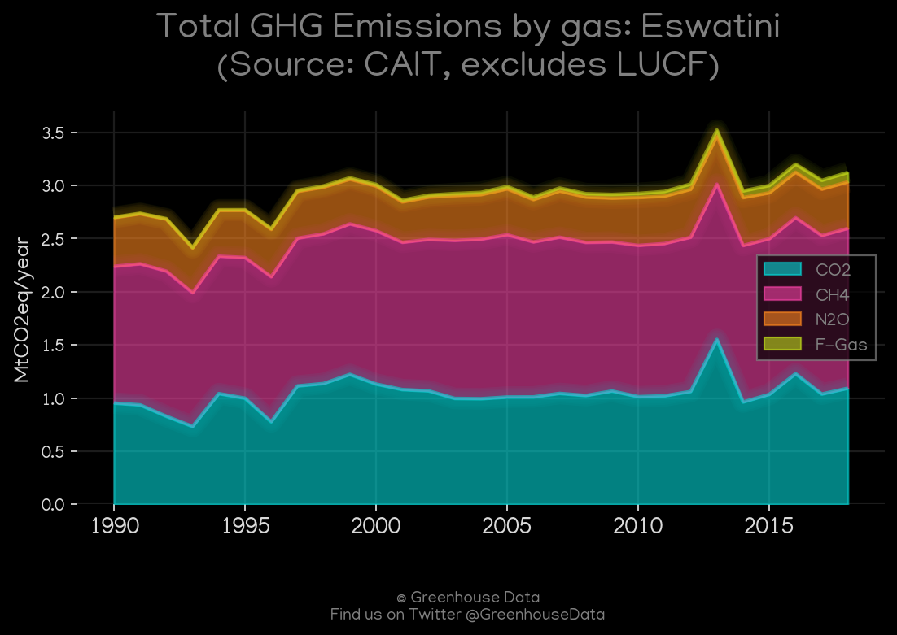
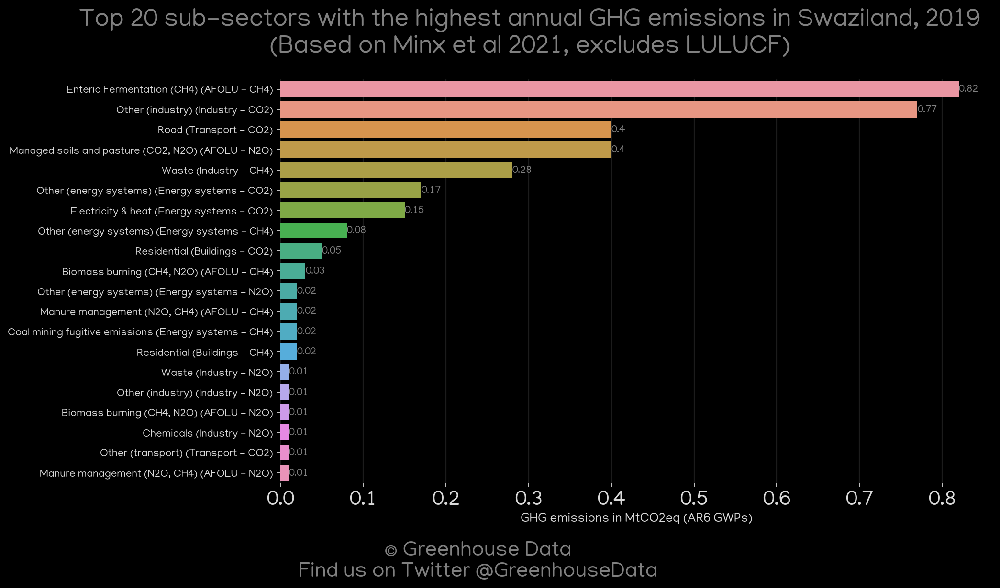
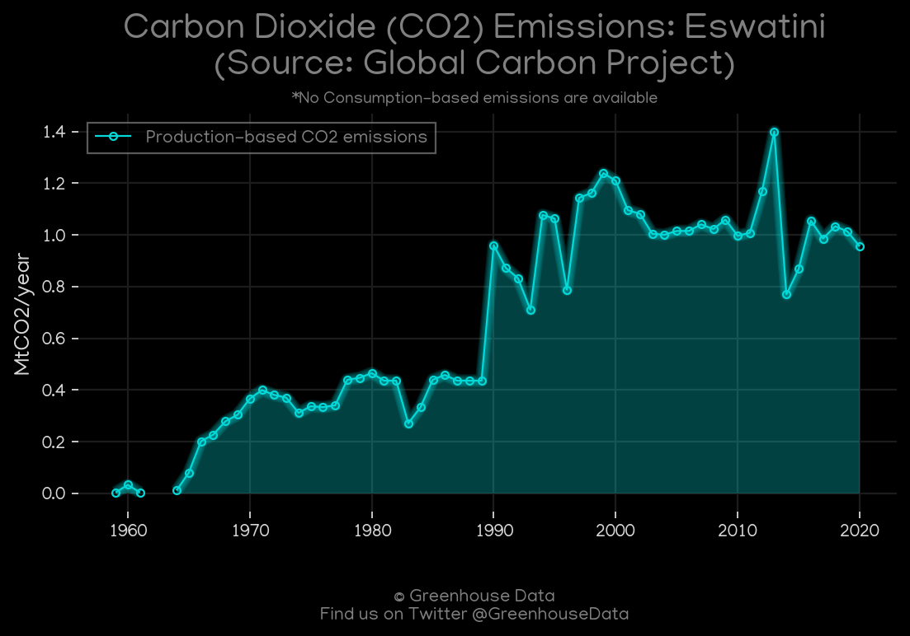
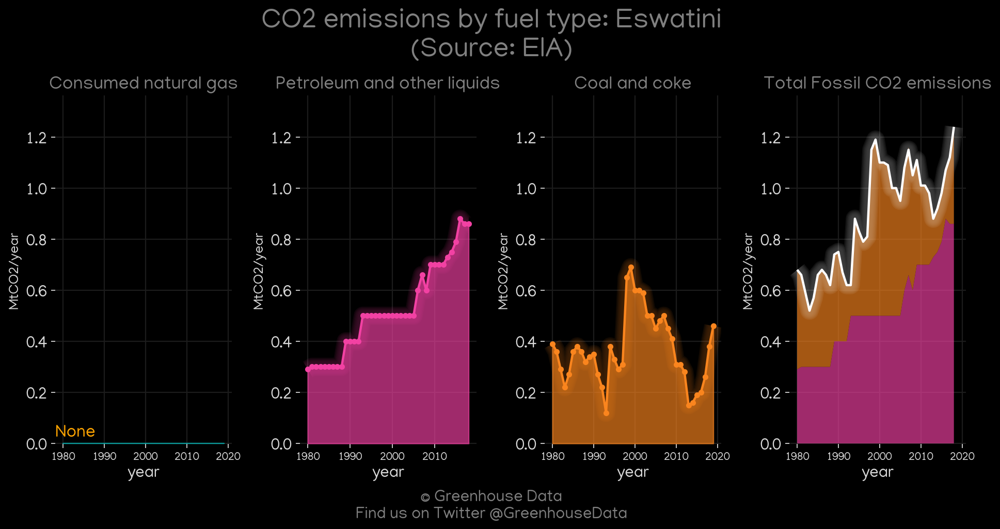
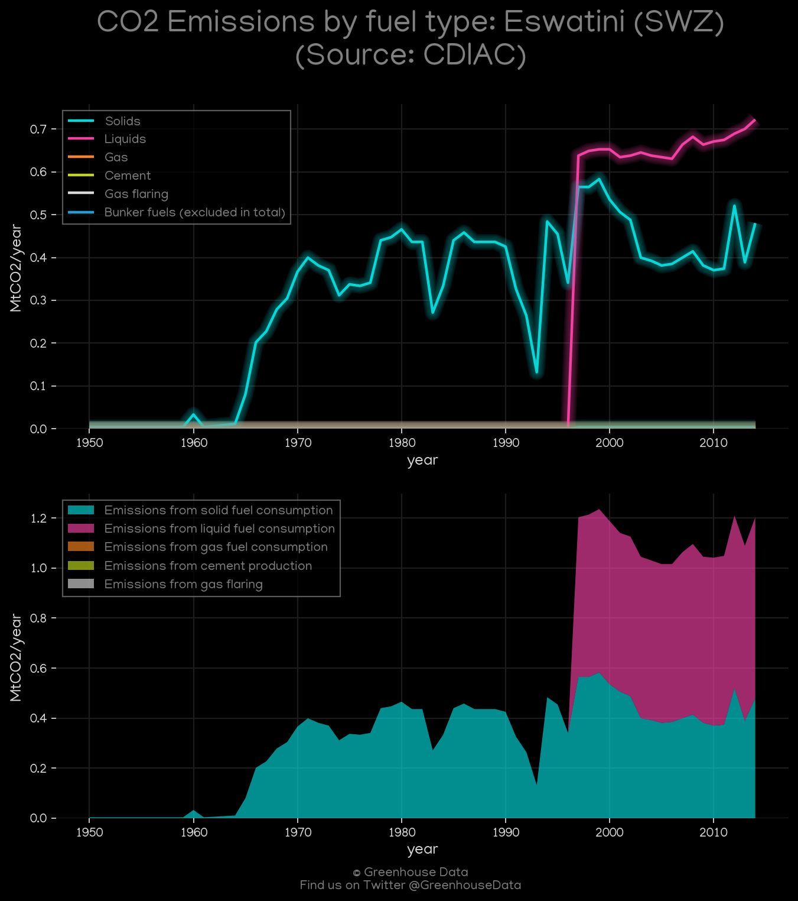
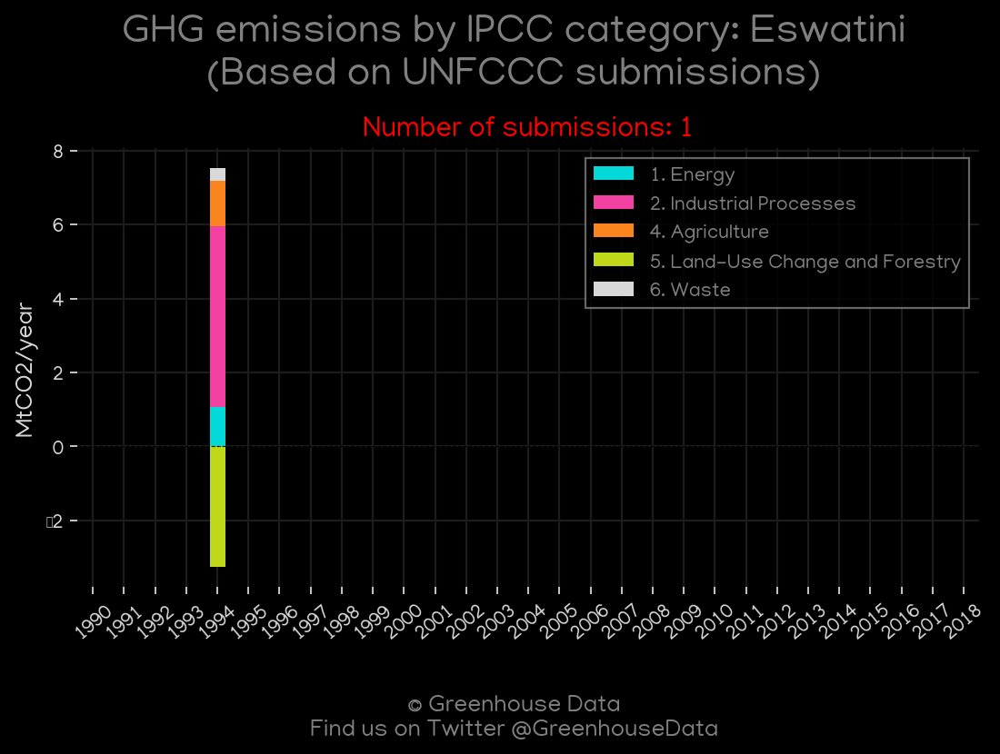
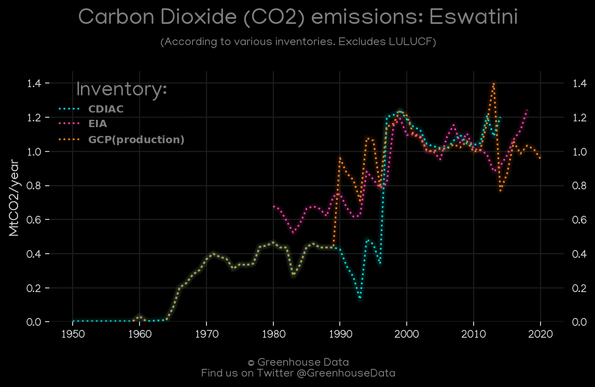

<h1 align="center">
🇸🇿🇸🇿🇸🇿🇸🇿🇸🇿
 
Eswatini
 
🇸🇿🇸🇿🇸🇿🇸🇿🇸🇿
</h1>
<h2>Datasets:</h2>

<a href="https://github.com/dquintani/Greenhouse-Data/tree/master/country_data/SWZ_Eswatini/data">View on Github</a>
 

<a href="data/SWZ_PRIMAP-hist.csv">PRIMAP-hist</a> || <a href="data/SWZ_GCP_cons.csv">GCP_cons</a> || <a href="data/SWZ_EPA.csv">EPA</a> || <a href="data/SWZ_EDGAR.csv">EDGAR</a> || <a href="data/SWZ_FAO.csv">FAO</a> || <a href="data/SWZ_EIA.csv">EIA</a> || <a href="data/SWZ_Minx_2021.csv">Minx_2021</a> || <a href="data/SWZ_CAIT.csv">CAIT</a> || <a href="data/SWZ_CDIAC.csv">CDIAC</a> || <a href="data/SWZ_GCP.csv">GCP</a> || <a href="data/SWZ_GCP_consupmption.csv">GCP_consupmption</a>

 

<h1>Figures:</h1><h2>#1 (SWZ_CAIT_gases_1)</h2>

<h2>#2 (SWZ_Minx_top20_subsectors)</h2>

<h2>#3 (SWZ_GCP_1)</h2>

<h2>#4 (SWZ_EIA_1)</h2>

<h2>#5 (SWZ_CDIAC_1)</h2>

<h2>#6 (SWZ_UNFCCC_NAI_1)</h2>

<h2>#7 (SWZ_BP_1)</h2>

<h2>#8 (SWZ_CO2_totals)</h2>

