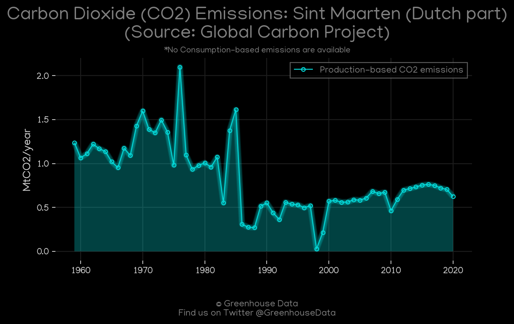
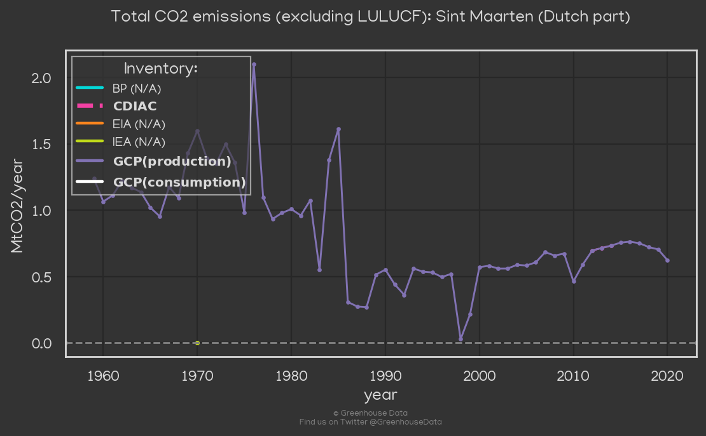
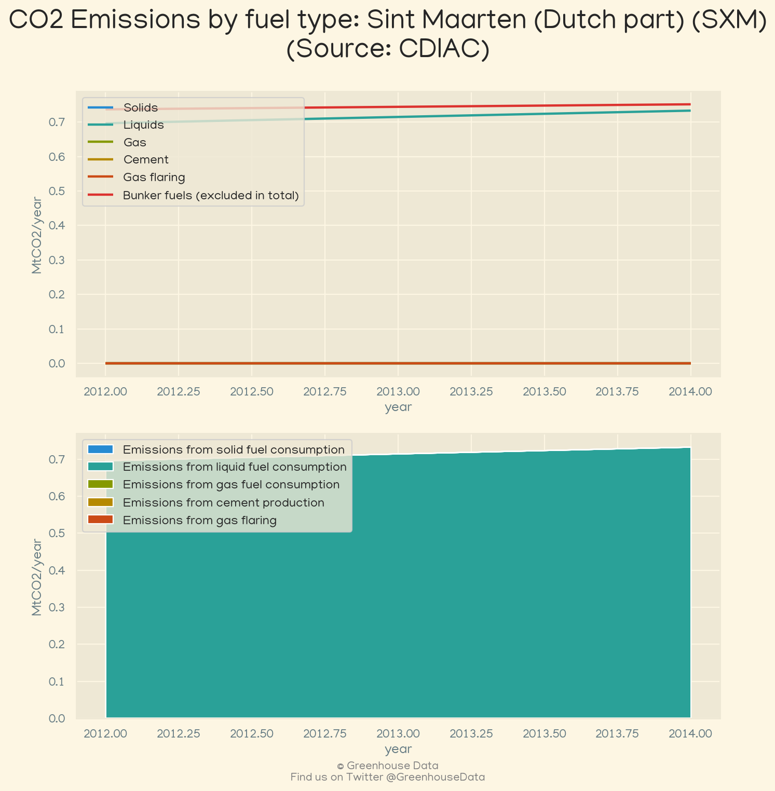
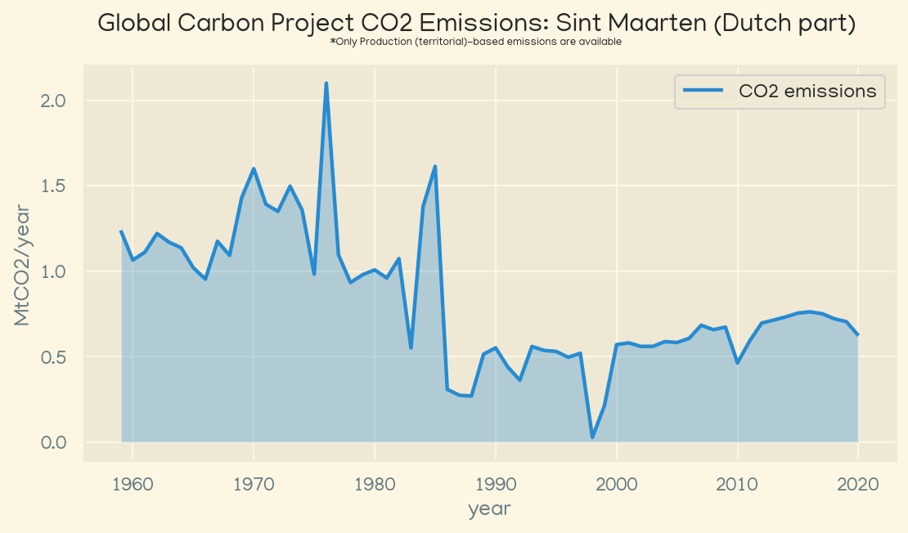

<h1 align="center">
🇸🇽🇸🇽🇸🇽🇸🇽🇸🇽
 
Sint Maarten (Dutch part)
 
🇸🇽🇸🇽🇸🇽🇸🇽🇸🇽
</h1>
<h2>Datasets:</h2>

<a href="https://github.com/dquintani/GreenhouseData/tree/master/country_data/SXM_Sint Maarten (Dutch part)/data">View on Github</a>
 

<a href="data/SXM_GCP_consupmption.csv">GCP_consupmption</a> || <a href="data/SXM_GCP.csv">GCP</a> || <a href="data/SXM_CDIAC.csv">CDIAC</a> || <a href="data/SXM_GCP_cons.csv">GCP_cons</a>

 

<h1>Figures:</h1><h2>#1 (SXM_GCP_1)</h2>

<h2>#2 (SXM_CO2_totals)</h2>

<h2>#3 (SXM_CDIAC_1)</h2>

<h2>#4 (SXM_BP_1)</h2>

