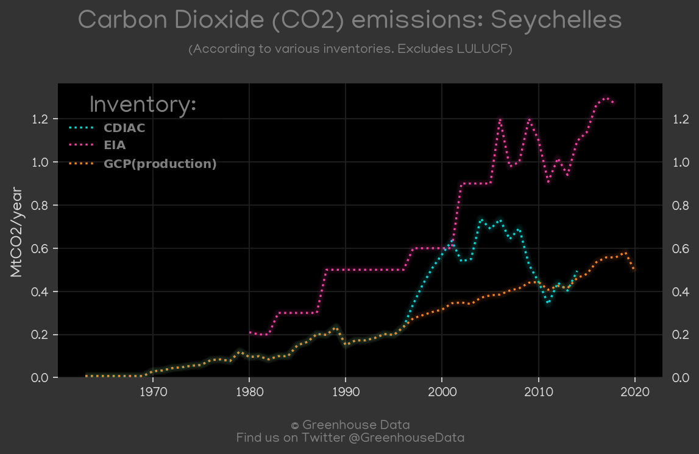
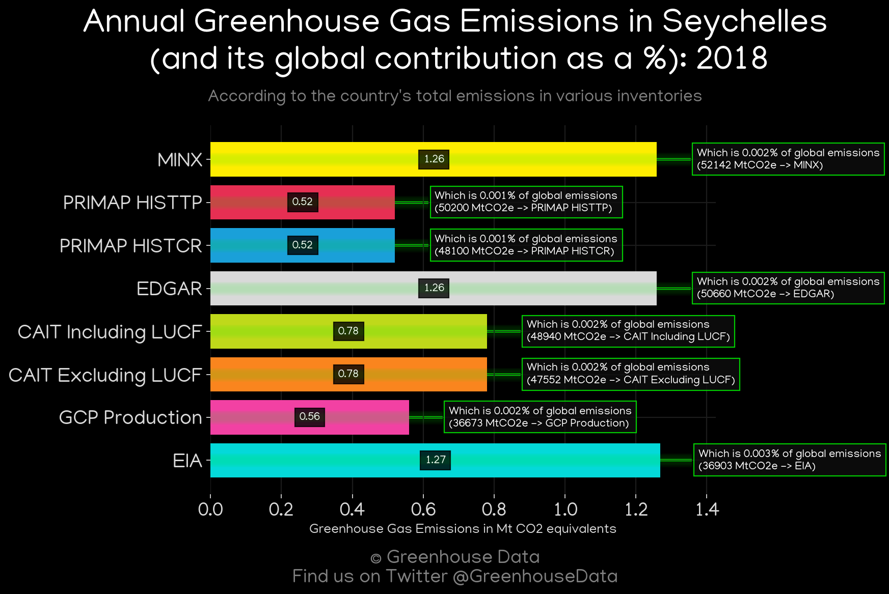
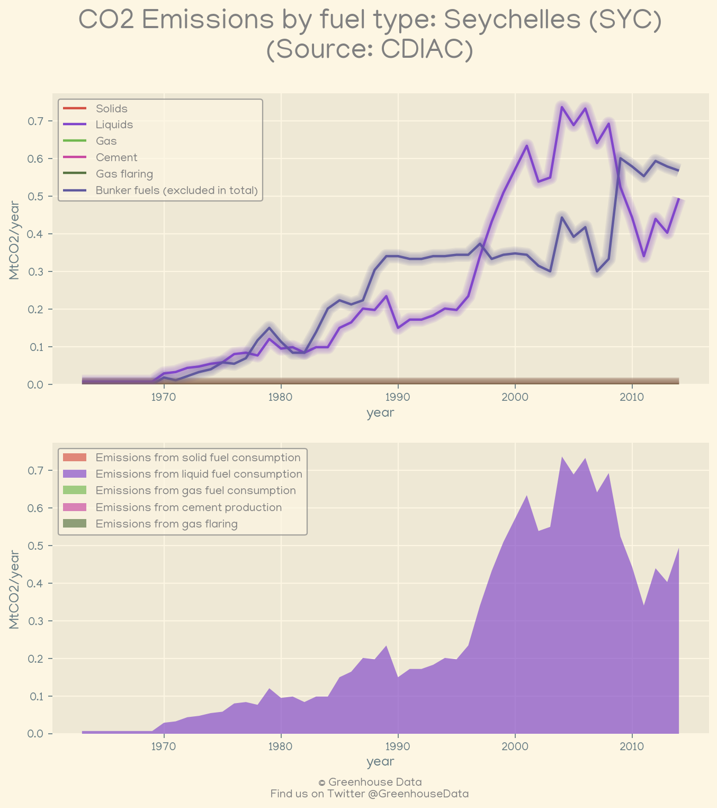
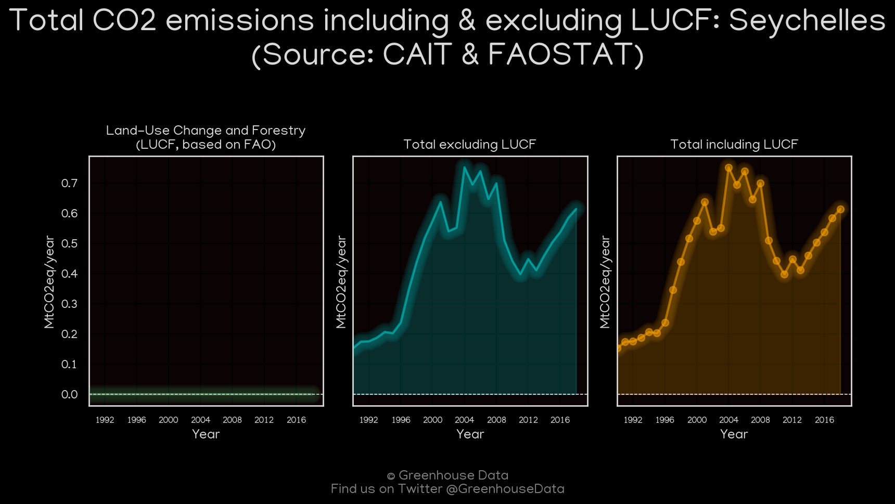
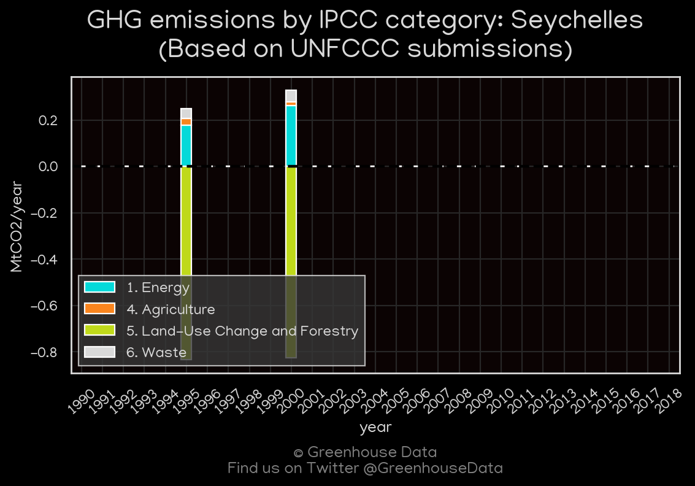
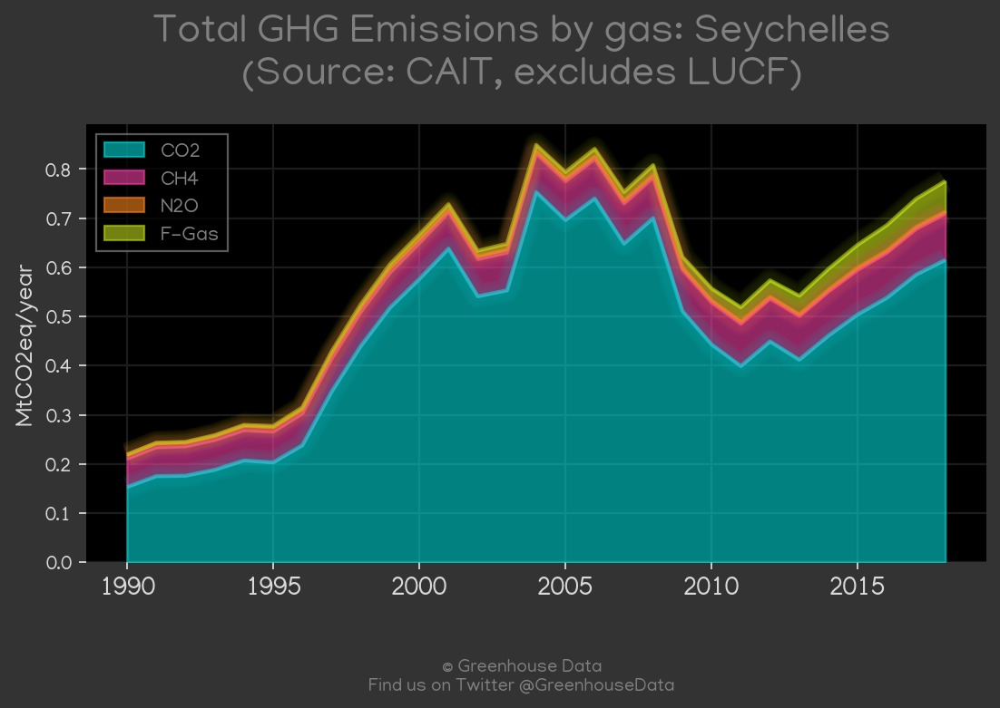
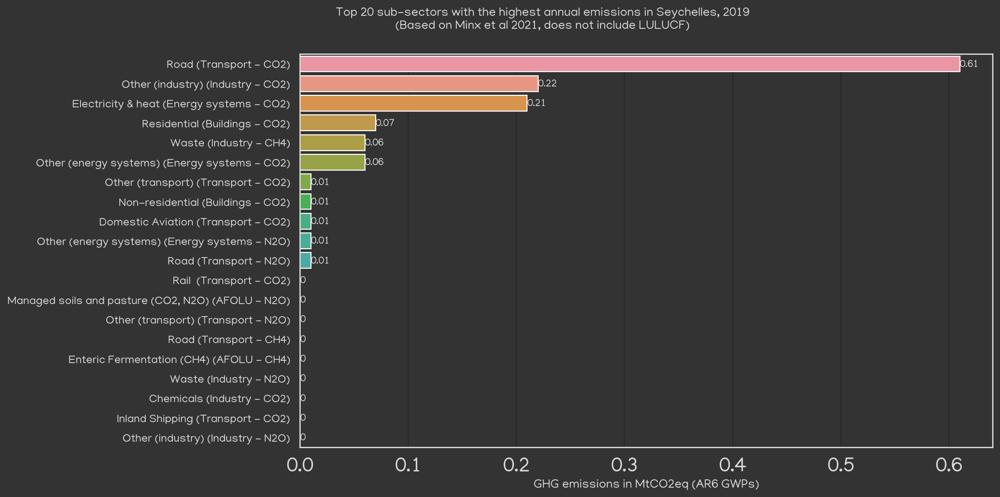
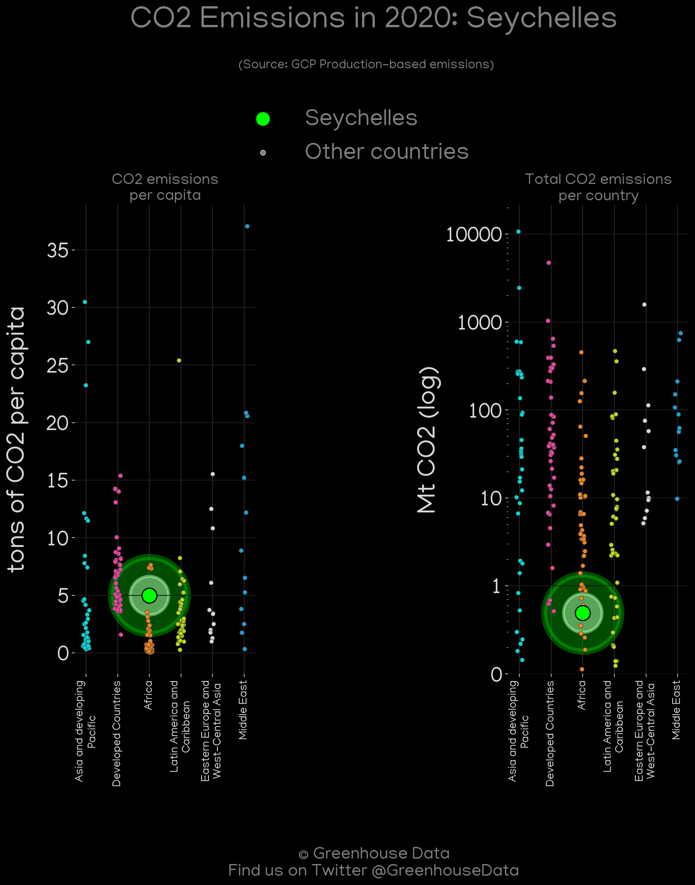
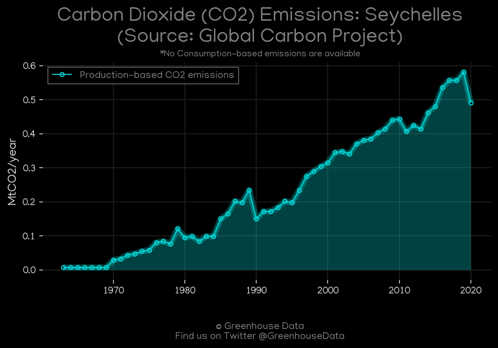

<h1 align="center">
🇸🇨🇸🇨🇸🇨🇸🇨🇸🇨
 
Seychelles
 
🇸🇨🇸🇨🇸🇨🇸🇨🇸🇨
</h1>
<h2>Datasets:</h2>

<a href="https://github.com/dquintani/GreenhouseData/tree/master/country_data/SYC_Seychelles/data">View on Github</a>
 

<a href="data/SYC_GCP_consupmption.csv">GCP_consupmption</a> || <a href="data/SYC_EIA.csv">EIA</a> || <a href="data/SYC_EPA.csv">EPA</a> || <a href="data/SYC_PRIMAP-hist.csv">PRIMAP-hist</a> || <a href="data/SYC_CDIAC.csv">CDIAC</a> || <a href="data/SYC_EDGAR.csv">EDGAR</a> || <a href="data/SYC_FAO.csv">FAO</a> || <a href="data/SYC_GCP.csv">GCP</a> || <a href="data/SYC_Minx_2021.csv">Minx_2021</a> || <a href="data/SYC_CAIT.csv">CAIT</a>

 

<h1>Figures:</h1><h2>#1 (SYC_EIA_1)</h2>

<h2>#2 (SYC_CO2_totals)</h2>

<h2>#3 (SYC_relative_totals)</h2>

<h2>#4 (SYC_CDIAC_1)</h2>

<h2>#5 (SYC_CAIT_lucf_vs_nolucf)</h2>

<h2>#6 (SYC_UNFCCC_NAI_1)</h2>

<h2>#7 (SYC_CAIT_gases_1)</h2>

<h2>#8 (SYC_Minx_top20_subsectors)</h2>

<h2>#9 (SYC_GCP_Country_Highlight)</h2>

<h2>#10 (SYC_GCP_1)</h2>

