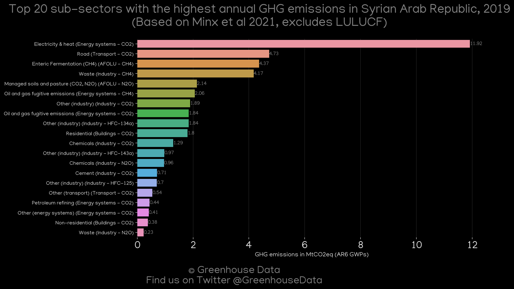
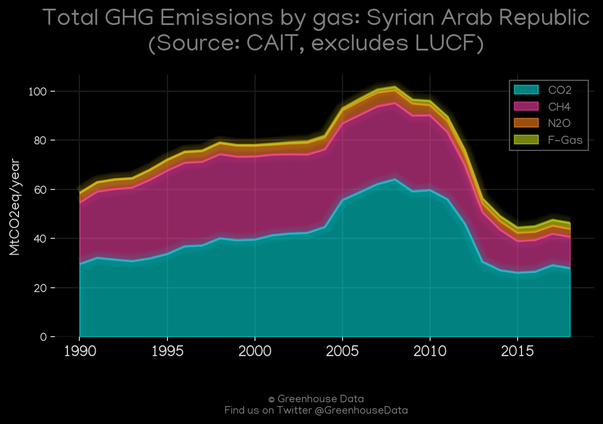
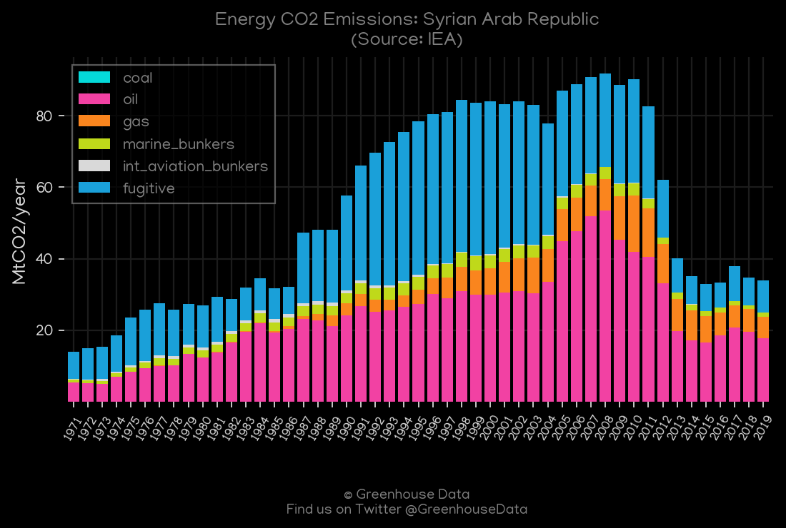
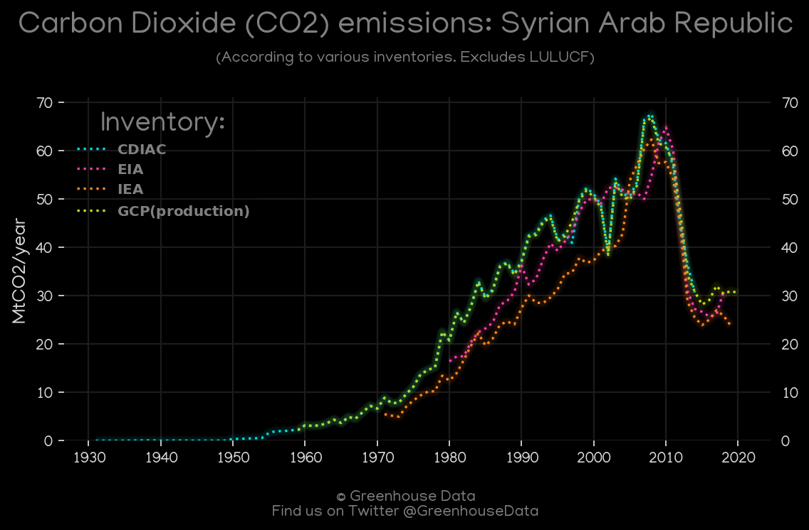
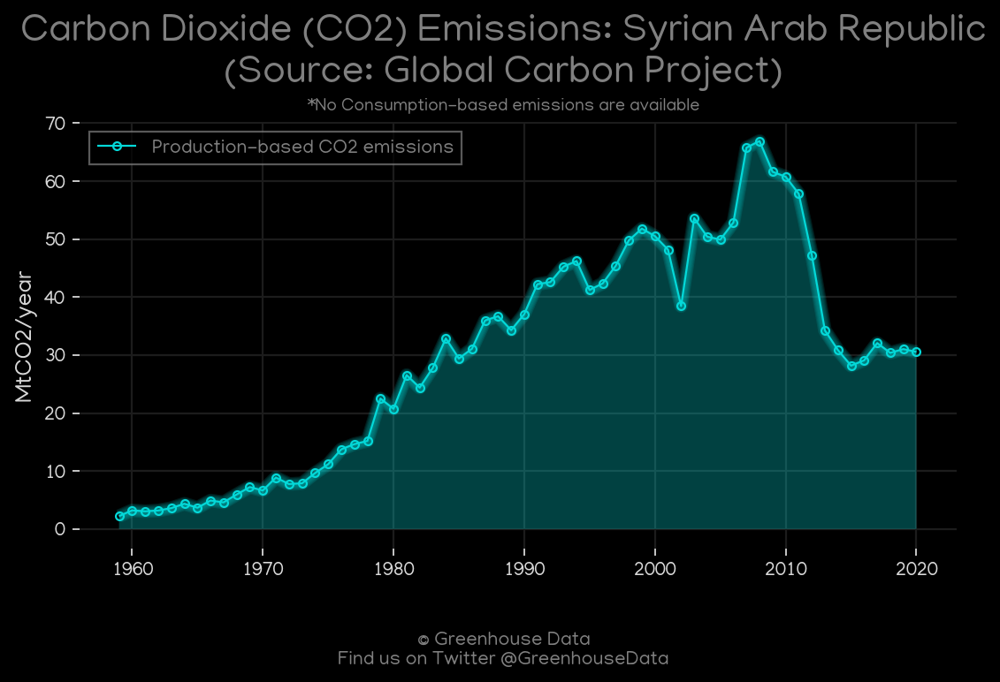
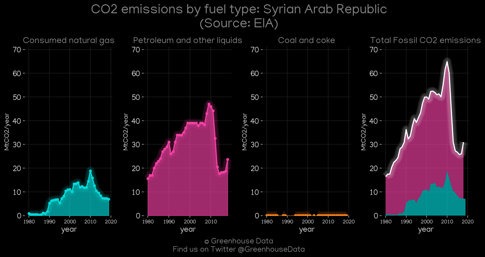
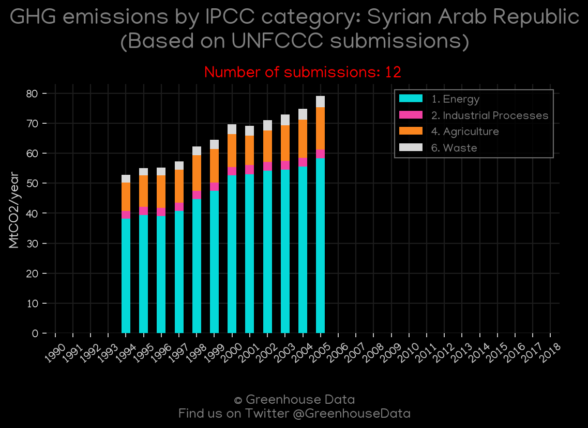

<h1 align="center">
🇸🇾🇸🇾🇸🇾🇸🇾🇸🇾
 
Syrian Arab Republic
 
🇸🇾🇸🇾🇸🇾🇸🇾🇸🇾
</h1>
<h2>Datasets:</h2>

<a href="https://github.com/dquintani/GreenhouseData/tree/master/country_data/SYR_Syrian Arab Republic/data">View on Github</a>
 

<a href="data/SYR_GCP.csv">GCP</a> || <a href="data/SYR_Minx_2021.csv">Minx_2021</a> || <a href="data/SYR_CDIAC.csv">CDIAC</a> || <a href="data/SYR_CAIT.csv">CAIT</a> || <a href="data/SYR_IEA.csv">IEA</a> || <a href="data/SYR_EIA.csv">EIA</a> || <a href="data/SYR_EPA.csv">EPA</a> || <a href="data/SYR_EDGAR.csv">EDGAR</a> || <a href="data/SYR_PRIMAP-hist.csv">PRIMAP-hist</a> || <a href="data/SYR_FAO.csv">FAO</a> || <a href="data/SYR_GCP_consupmption.csv">GCP_consupmption</a>

 

<h1>Figures:</h1><h2>#1 (SYR_Minx_top20_subsectors)</h2>

<h2>#2 (SYR_CAIT_gases_1)</h2>

<h2>#3 (SYR_IEA_1)</h2>

<h2>#4 (SYR_CO2_totals)</h2>

<h2>#5 (SYR_GCP_1)</h2>

<h2>#6 (SYR_CDIAC_1)</h2>

<h2>#7 (SYR_EIA_1)</h2>

<h2>#8 (SYR_UNFCCC_NAI_1)</h2>

