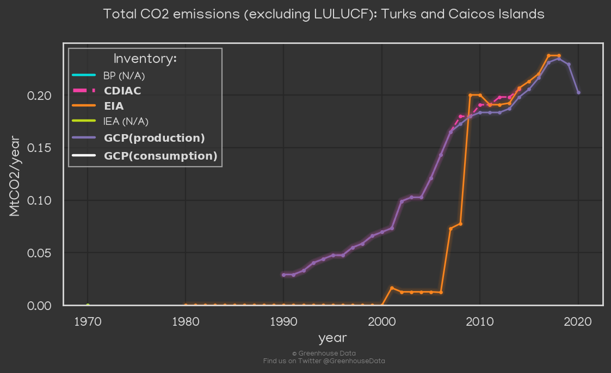
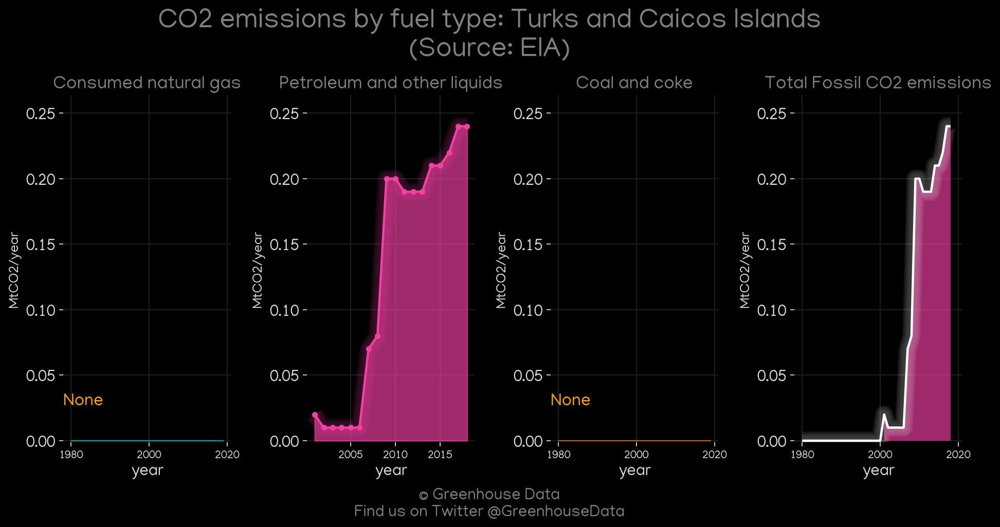
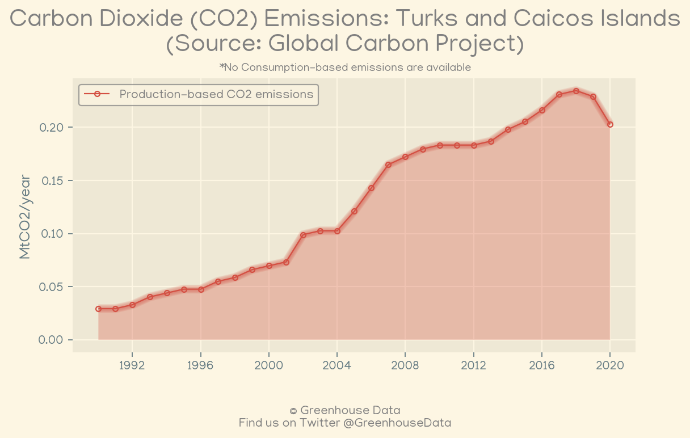
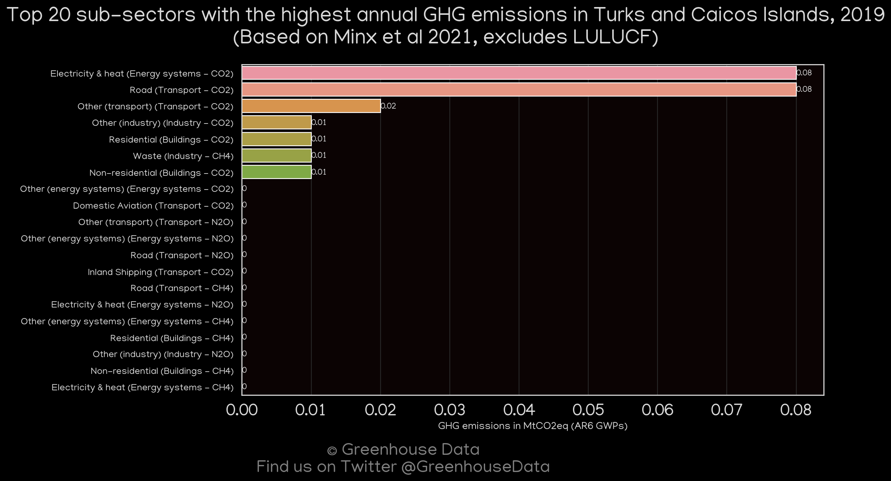
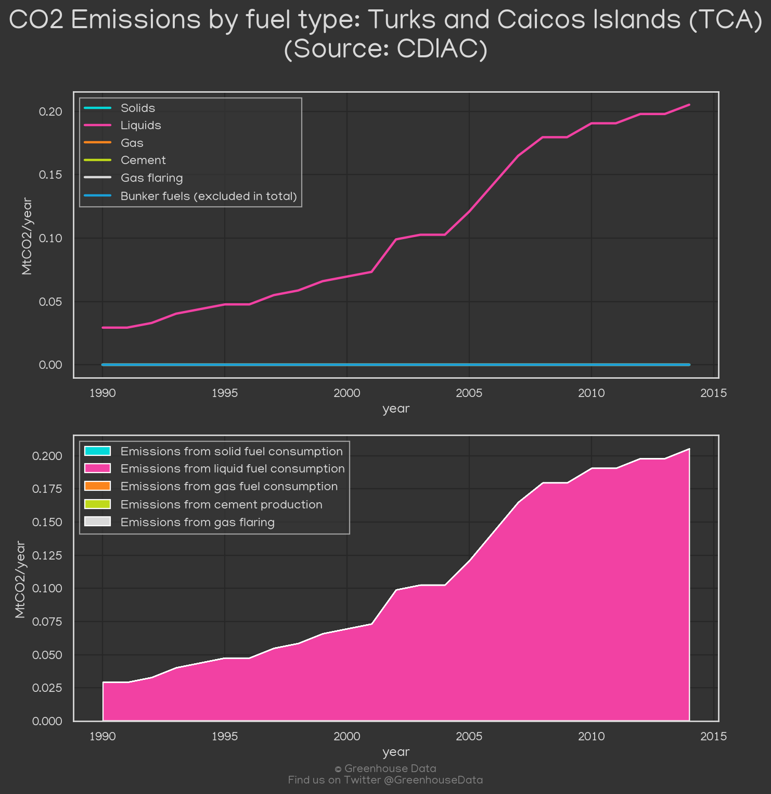
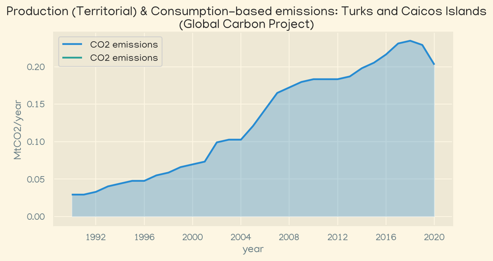

<h1 align="center">
🇹🇨🇹🇨🇹🇨🇹🇨🇹🇨
 
Turks and Caicos Islands
 
🇹🇨🇹🇨🇹🇨🇹🇨🇹🇨
</h1>
<h2>Datasets:</h2>

<a href="https://github.com/dquintani/GreenhouseData/tree/master/country_data/TCA_Turks and Caicos Islands/data">View on Github</a>
 

<a href="data/TCA_Minx_2021.csv">Minx_2021</a> || <a href="data/TCA_EIA.csv">EIA</a> || <a href="data/TCA_CDIAC.csv">CDIAC</a> || <a href="data/TCA_FAO.csv">FAO</a> || <a href="data/TCA_EDGAR.csv">EDGAR</a> || <a href="data/TCA_PRIMAP-hist.csv">PRIMAP-hist</a> || <a href="data/TCA_GCP_consupmption.csv">GCP_consupmption</a> || <a href="data/TCA_GCP_cons.csv">GCP_cons</a> || <a href="data/TCA_GCP.csv">GCP</a>

 

<h1>Figures:</h1><h2>#1 (TCA_CO2_totals)</h2>

<h2>#2 (TCA_EIA_1)</h2>

<h2>#3 (TCA_GCP_1)</h2>

<h2>#4 (TCA_Minx_top20_subsectors)</h2>

<h2>#5 (TCA_CDIAC_1)</h2>

<h2>#6 (TCA_BP_1)</h2>

