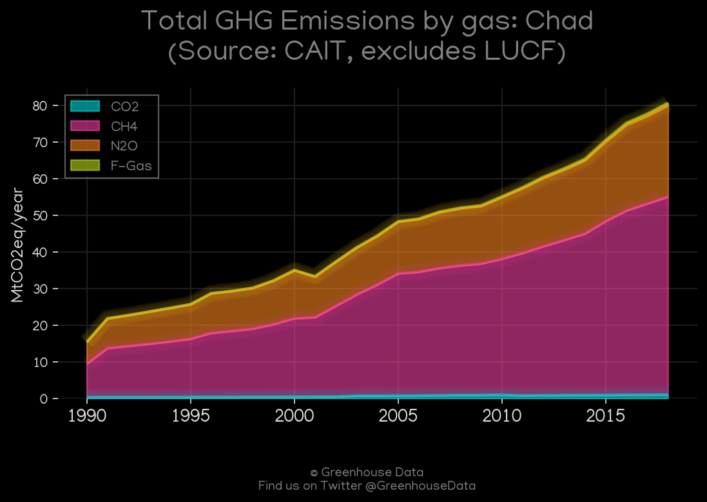
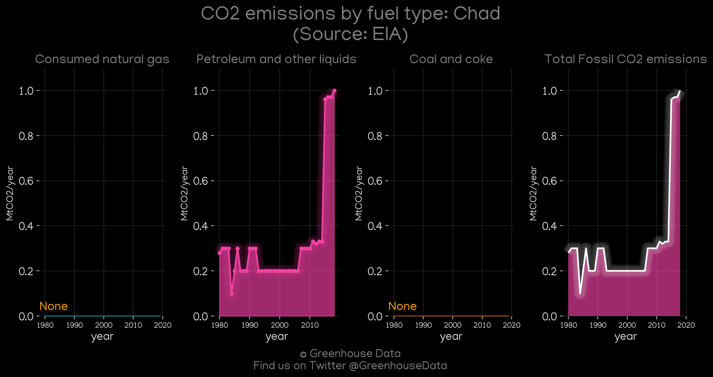
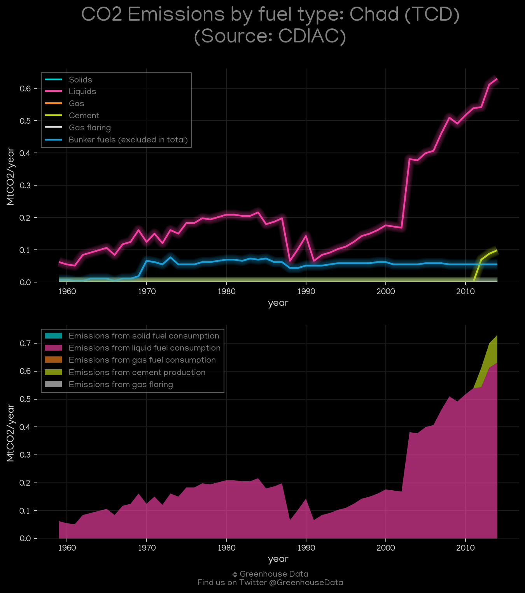
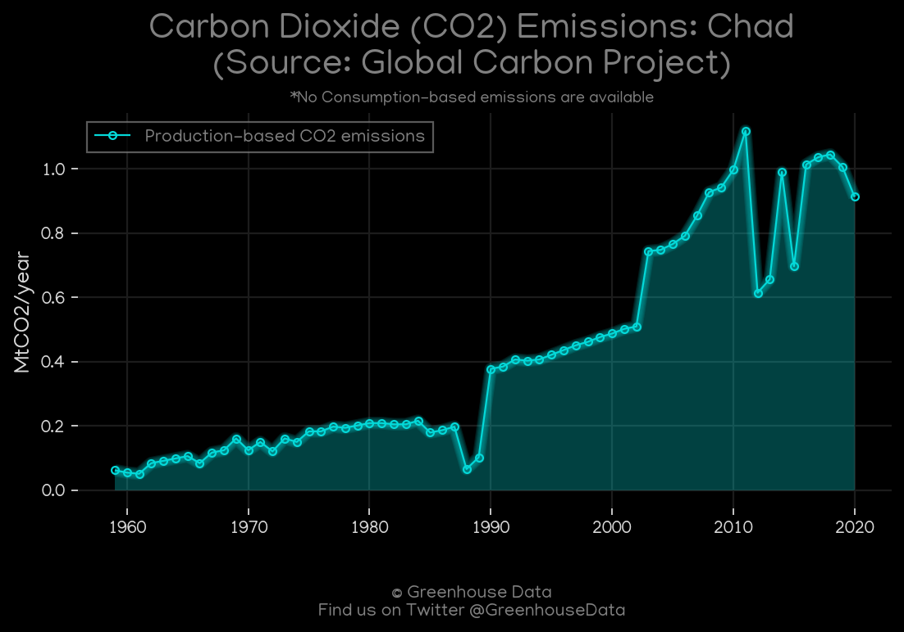
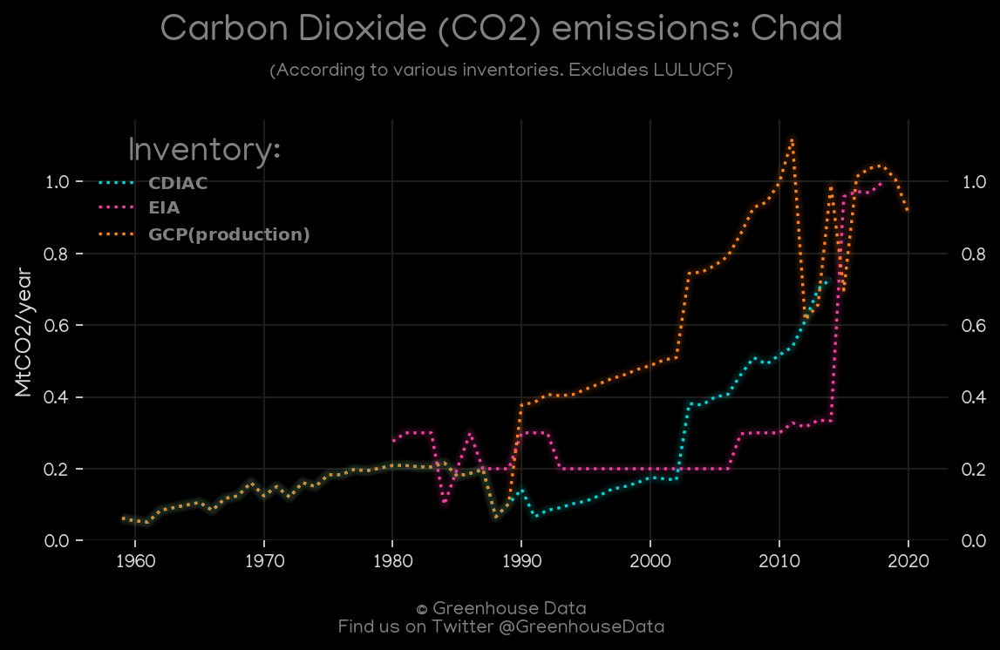
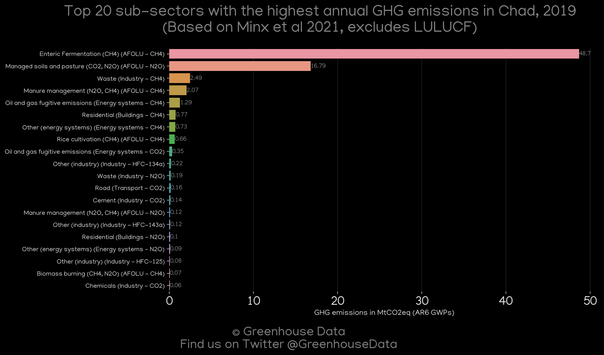

<h1 align="center">
🇹🇩🇹🇩🇹🇩🇹🇩🇹🇩
 
Chad
 
🇹🇩🇹🇩🇹🇩🇹🇩🇹🇩
</h1>
<h2>Datasets:</h2>

<a href="https://github.com/dquintani/GreenhouseData/tree/master/country_data/TCD_Chad/data">View on Github</a>
 

<a href="data/TCD_GCP_consupmption.csv">GCP_consupmption</a> || <a href="data/TCD_FAO.csv">FAO</a> || <a href="data/TCD_PRIMAP-hist.csv">PRIMAP-hist</a> || <a href="data/TCD_EDGAR.csv">EDGAR</a> || <a href="data/TCD_GCP.csv">GCP</a> || <a href="data/TCD_CDIAC.csv">CDIAC</a> || <a href="data/TCD_EIA.csv">EIA</a> || <a href="data/TCD_CAIT.csv">CAIT</a> || <a href="data/TCD_EPA.csv">EPA</a> || <a href="data/TCD_Minx_2021.csv">Minx_2021</a>

 

<h1>Figures:</h1><h2>#1 (TCD_UNFCCC_NAI_1)</h2>

<h2>#2 (TCD_CAIT_gases_1)</h2>

<h2>#3 (TCD_EIA_1)</h2>

<h2>#4 (TCD_CDIAC_1)</h2>

<h2>#5 (TCD_GCP_1)</h2>

<h2>#6 (TCD_CO2_totals)</h2>

<h2>#7 (TCD_Minx_top20_subsectors)</h2>

