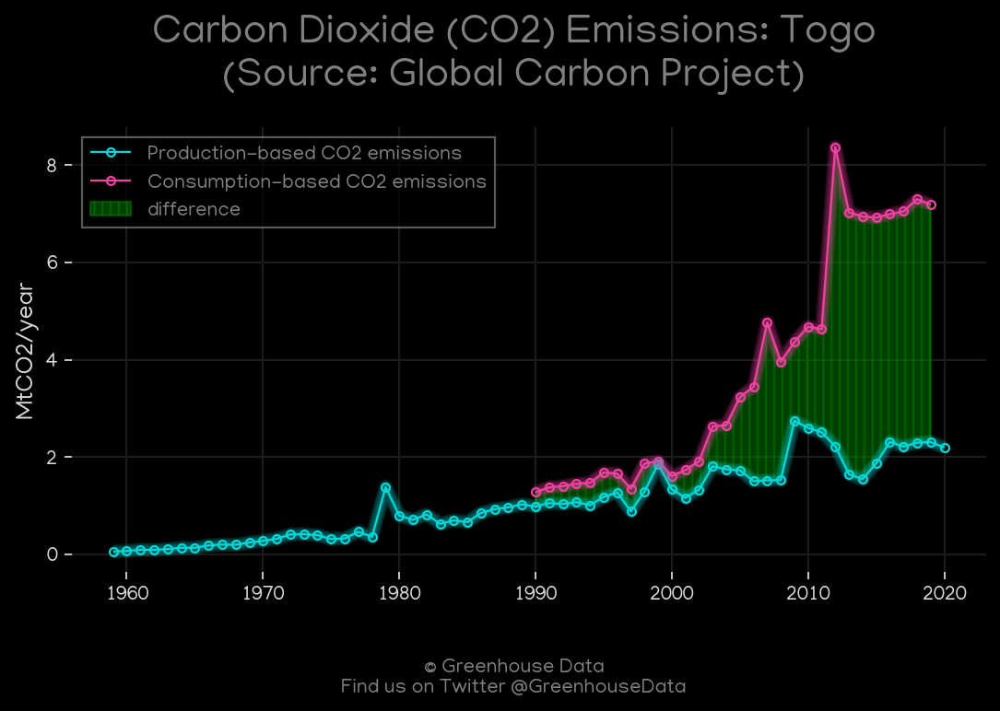
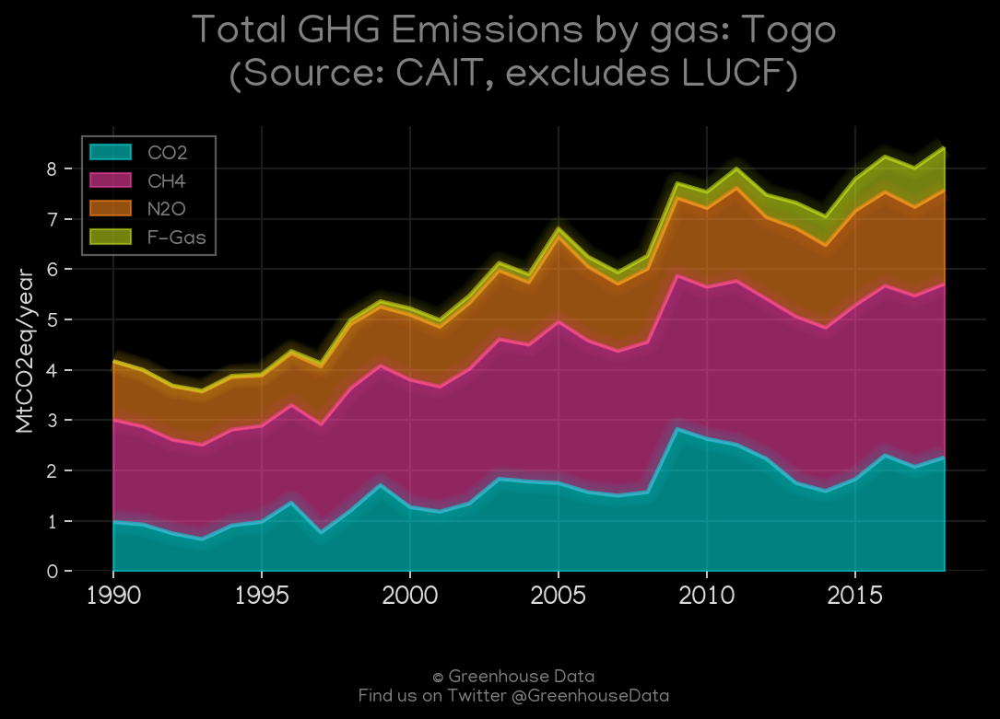
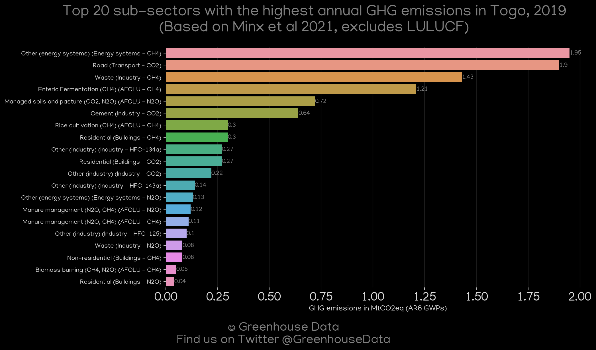
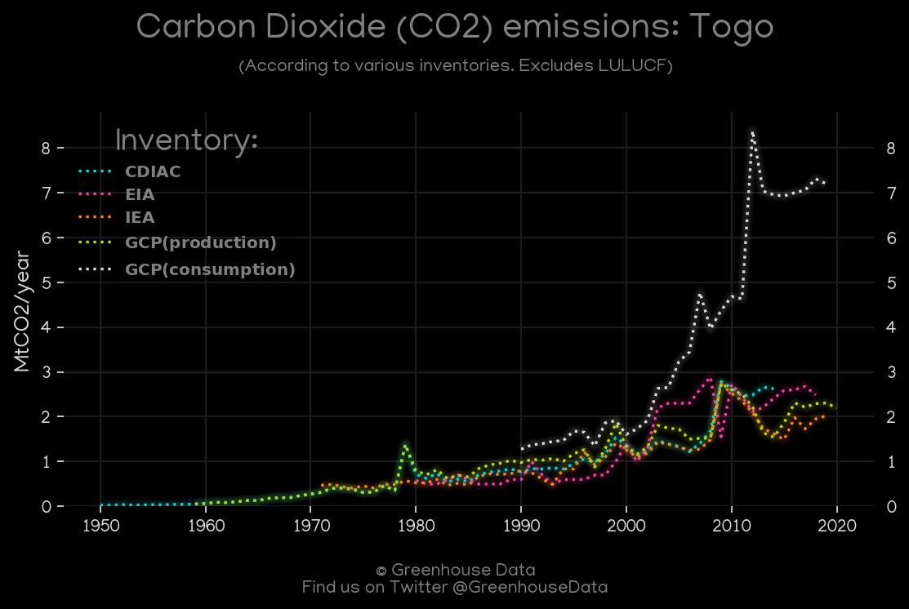
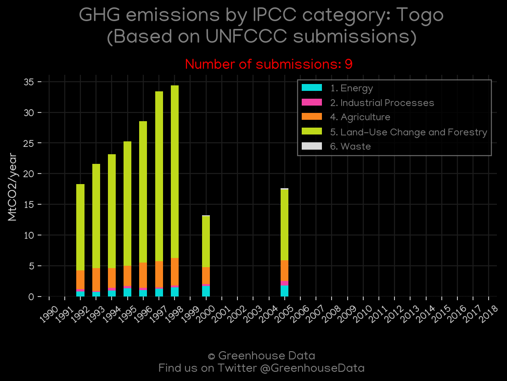
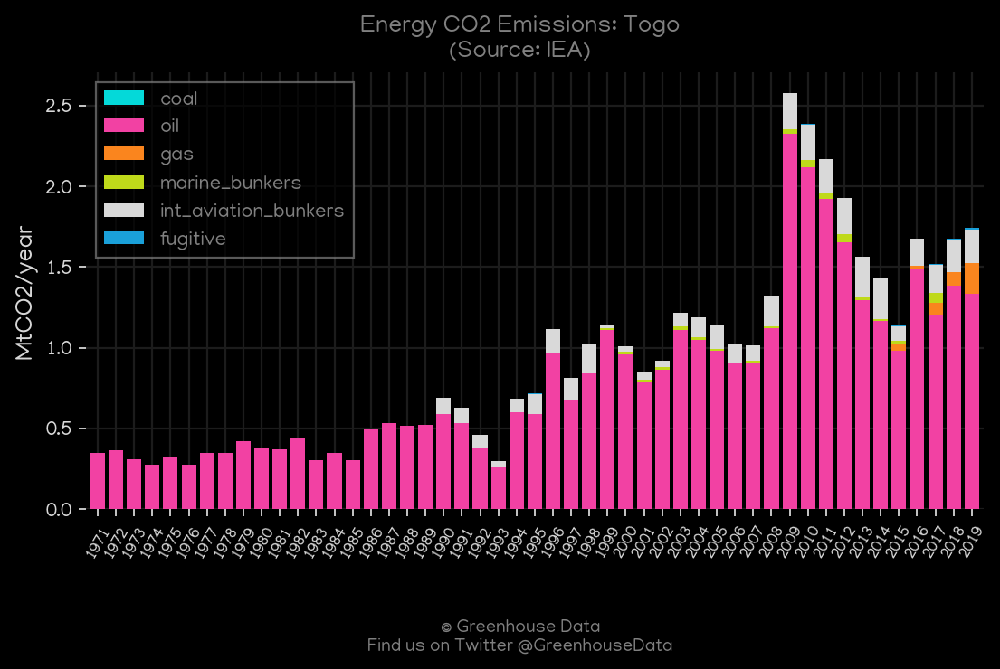
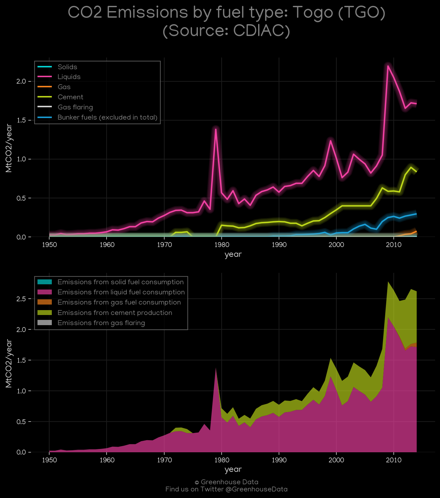

<h1 align="center">
🇹🇬🇹🇬🇹🇬🇹🇬🇹🇬
 
Togo
 
🇹🇬🇹🇬🇹🇬🇹🇬🇹🇬
</h1>
<h2>Datasets:</h2>

<a href="https://github.com/dquintani/GreenhouseData/tree/master/country_data/TGO_Togo/data">View on Github</a>
 

<a href="data/TGO_Minx_2021.csv">Minx_2021</a> || <a href="data/TGO_IEA.csv">IEA</a> || <a href="data/TGO_FAO.csv">FAO</a> || <a href="data/TGO_GCP_consupmption.csv">GCP_consupmption</a> || <a href="data/TGO_CDIAC.csv">CDIAC</a> || <a href="data/TGO_EPA.csv">EPA</a> || <a href="data/TGO_CAIT.csv">CAIT</a> || <a href="data/TGO_EIA.csv">EIA</a> || <a href="data/TGO_EDGAR.csv">EDGAR</a> || <a href="data/TGO_GCP.csv">GCP</a> || <a href="data/TGO_PRIMAP-hist.csv">PRIMAP-hist</a>

 

<h1>Figures:</h1><h2>#1 (TGO_GCP_1)</h2>

<h2>#2 (TGO_EIA_1)</h2>

<h2>#3 (TGO_CAIT_gases_1)</h2>

<h2>#4 (TGO_Minx_top20_subsectors)</h2>

<h2>#5 (TGO_CO2_totals)</h2>

<h2>#6 (TGO_UNFCCC_NAI_1)</h2>

<h2>#7 (TGO_IEA_1)</h2>

<h2>#8 (TGO_CDIAC_1)</h2>

