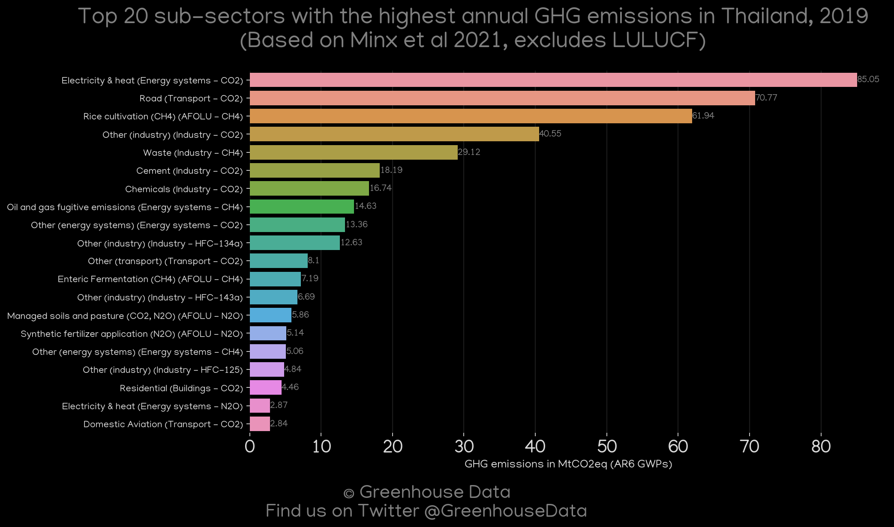
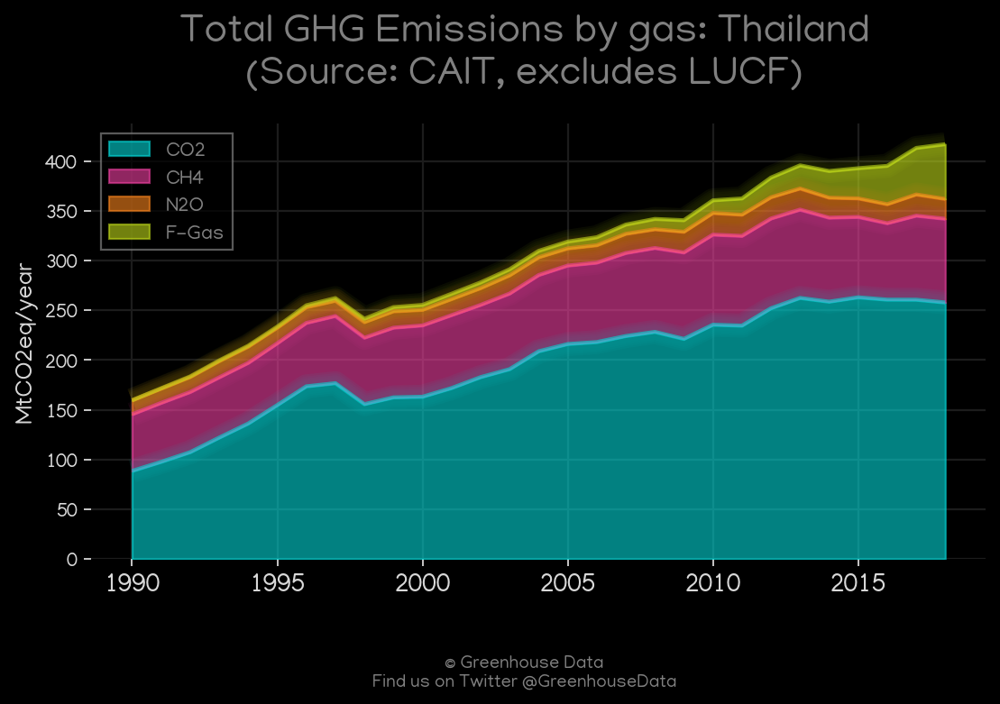
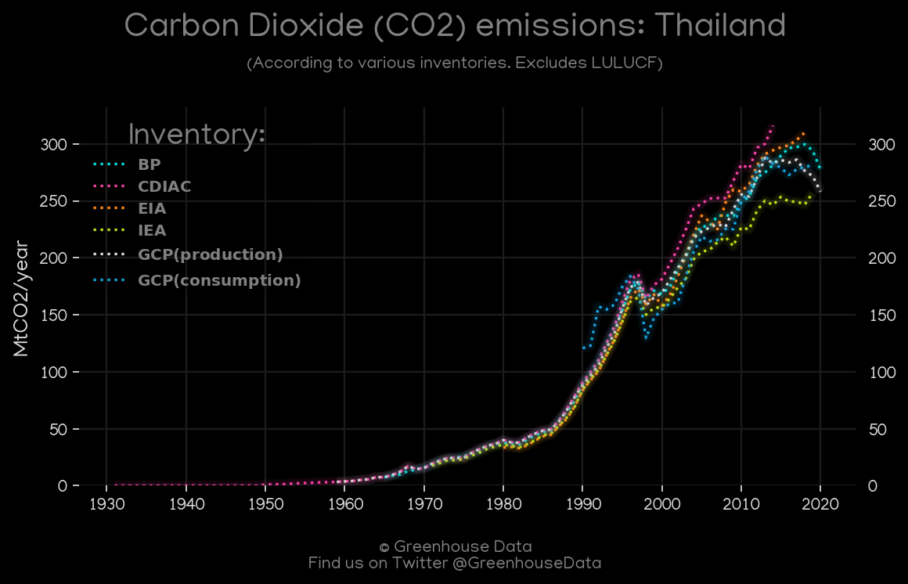
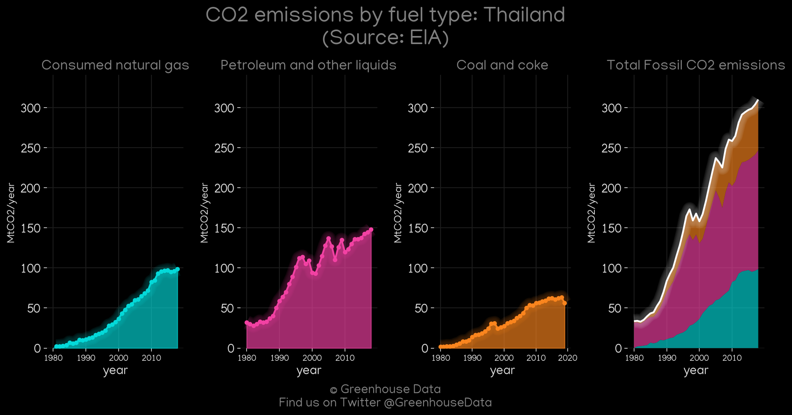
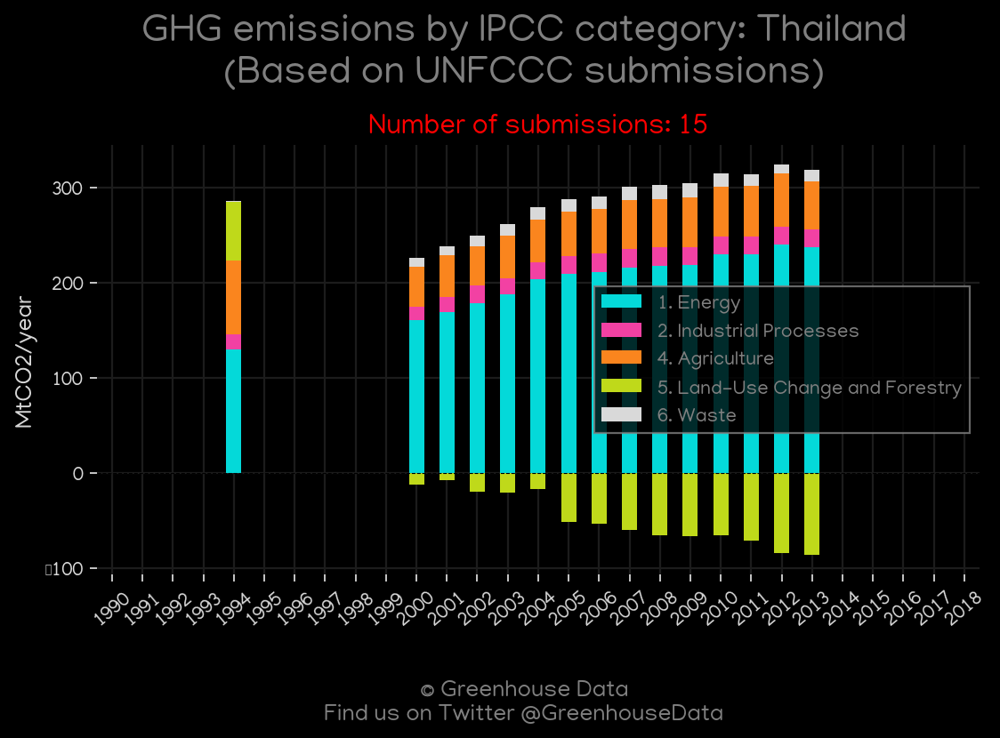
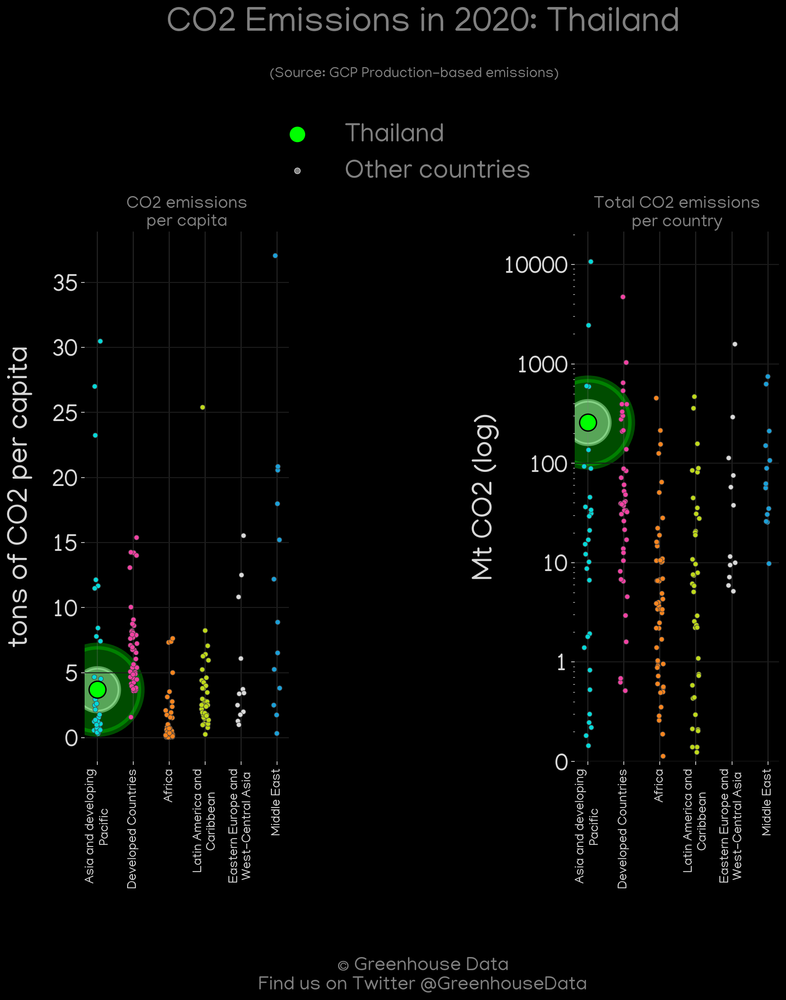
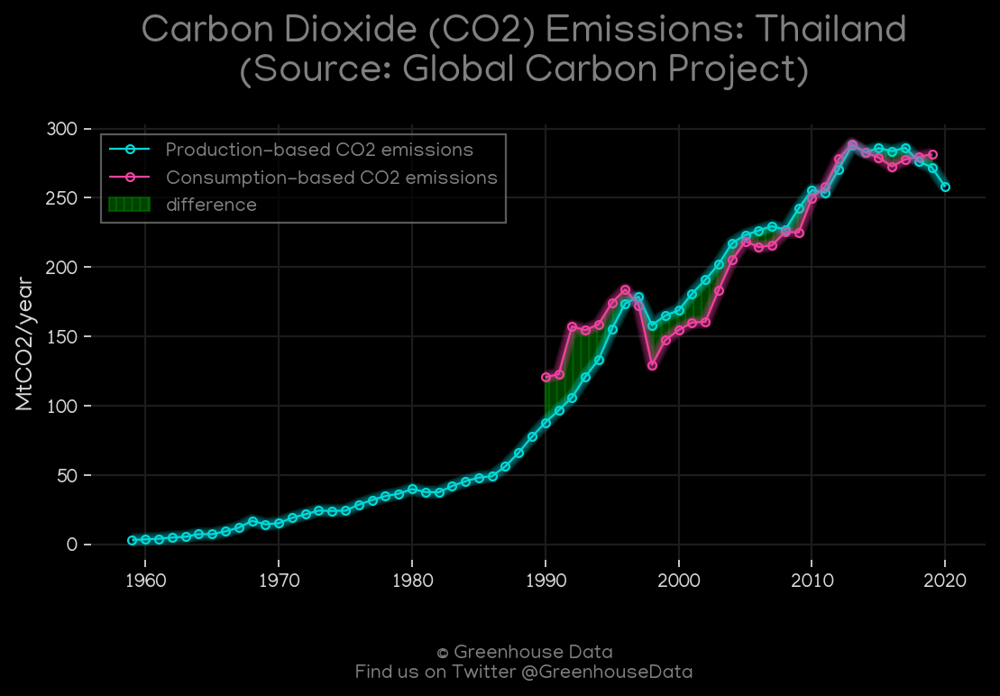
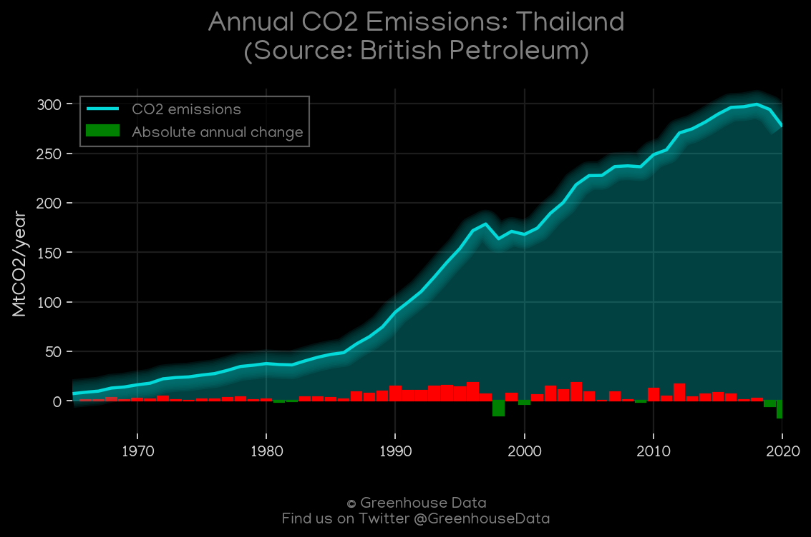

<h1 align="center">
🇹🇭🇹🇭🇹🇭🇹🇭🇹🇭
 
Thailand
 
🇹🇭🇹🇭🇹🇭🇹🇭🇹🇭
</h1>
<h2>Datasets:</h2>

<a href="https://github.com/dquintani/GreenhouseData/tree/master/country_data/THA_Thailand/data">View on Github</a>
 

<a href="data/THA_EDGAR.csv">EDGAR</a> || <a href="data/THA_EPA.csv">EPA</a> || <a href="data/THA_FAO.csv">FAO</a> || <a href="data/THA_CAIT.csv">CAIT</a> || <a href="data/THA_IEA.csv">IEA</a> || <a href="data/THA_BP.csv">BP</a> || <a href="data/THA_CDIAC.csv">CDIAC</a> || <a href="data/THA_GCP_consupmption.csv">GCP_consupmption</a> || <a href="data/THA_Minx_2021.csv">Minx_2021</a> || <a href="data/THA_EIA.csv">EIA</a> || <a href="data/THA_PRIMAP-hist.csv">PRIMAP-hist</a> || <a href="data/THA_GCP.csv">GCP</a>

 

<h1>Figures:</h1><h2>#1 (THA_CDIAC_1)</h2>

<h2>#2 (THA_relative_totals)</h2>

<h2>#3 (THA_Minx_top20_subsectors)</h2>

<h2>#4 (THA_CAIT_gases_1)</h2>

<h2>#5 (THA_CO2_totals)</h2>

<h2>#6 (THA_EIA_1)</h2>

<h2>#7 (THA_IEA_1)</h2>

<h2>#8 (THA_UNFCCC_NAI_1)</h2>

<h2>#9 (THA_GCP_Country_Highlight)</h2>

<h2>#10 (THA_GCP_1)</h2>

<h2>#11 (THA_BP_1)</h2>

<h2>#12 (THA_CAIT_lucf_vs_nolucf)</h2>

