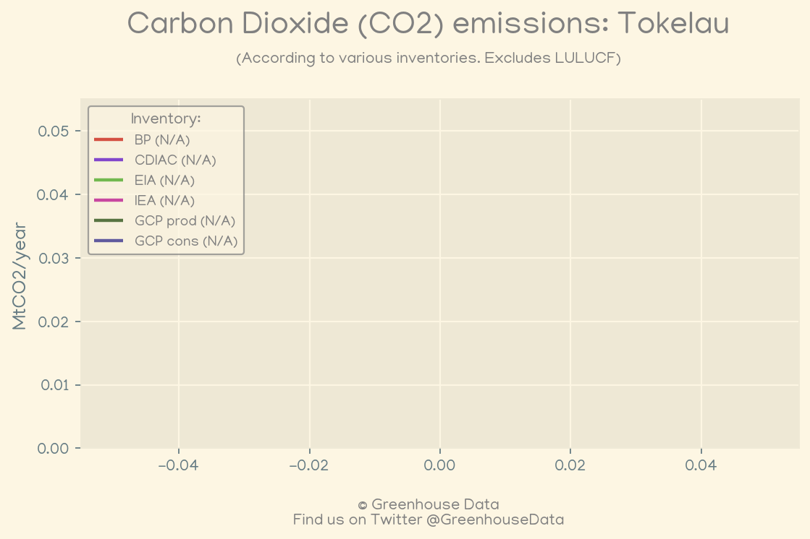
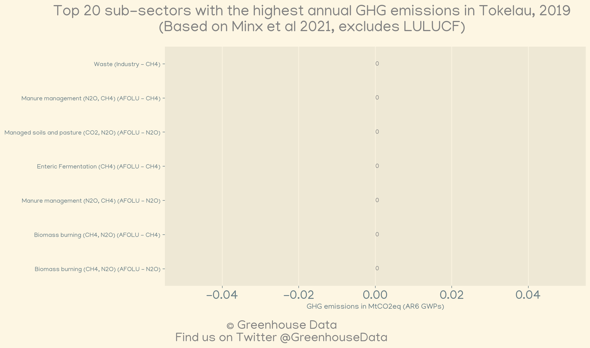

<h1 align="center">
🇹🇰🇹🇰🇹🇰🇹🇰🇹🇰
 
Tokelau
 
🇹🇰🇹🇰🇹🇰🇹🇰🇹🇰
</h1>
<h2>Datasets:</h2>

<a href="https://github.com/dquintani/GreenhouseData/tree/master/country_data/TKL_Tokelau/data">View on Github</a>
 

<a href="data/TKL_EDGAR.csv">EDGAR</a> || <a href="data/TKL_PRIMAP-hist.csv">PRIMAP-hist</a> || <a href="data/TKL_FAO.csv">FAO</a> || <a href="data/TKL_Minx_2021.csv">Minx_2021</a>

 

<h1>Figures:</h1><h2>#1 (TKL_CO2_totals)</h2>

<h2>#2 (TKL_Minx_top20_subsectors)</h2>

