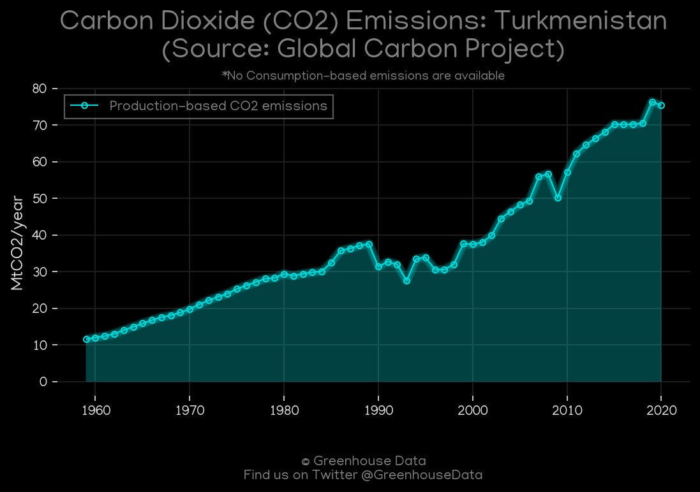
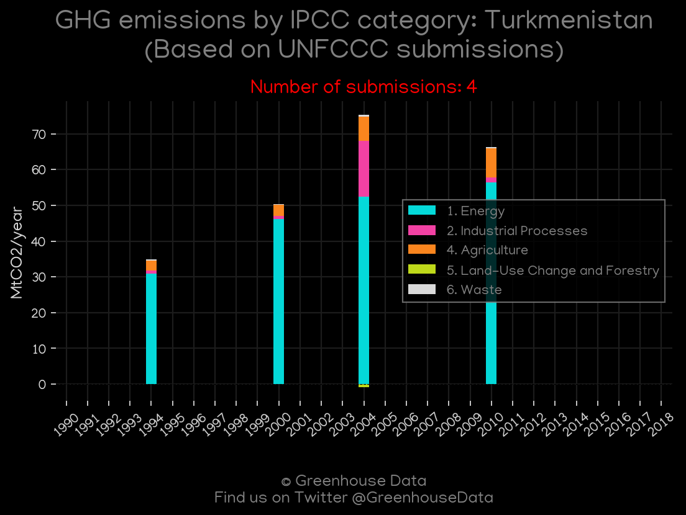
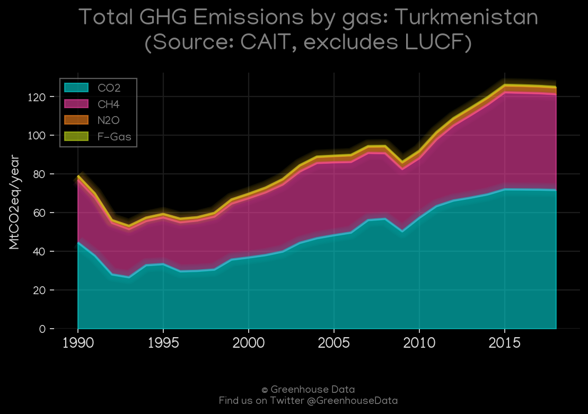
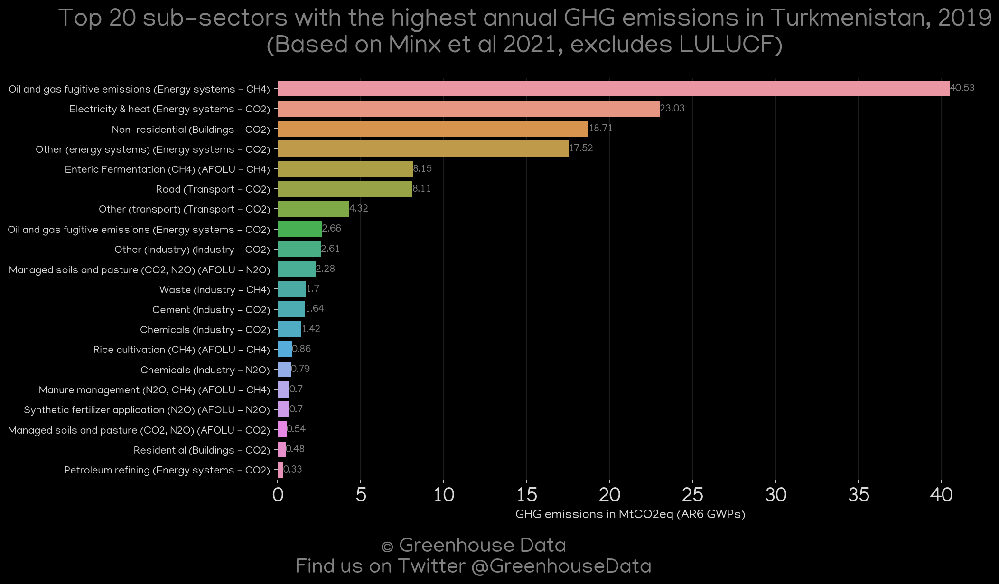
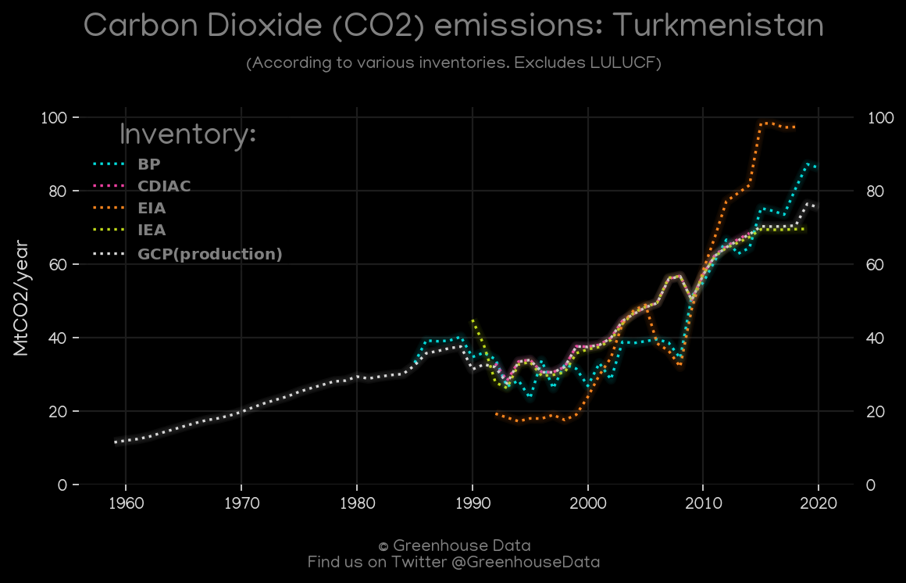
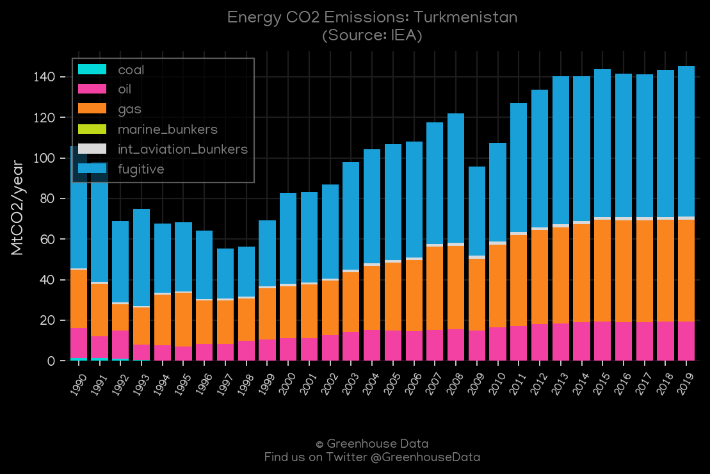
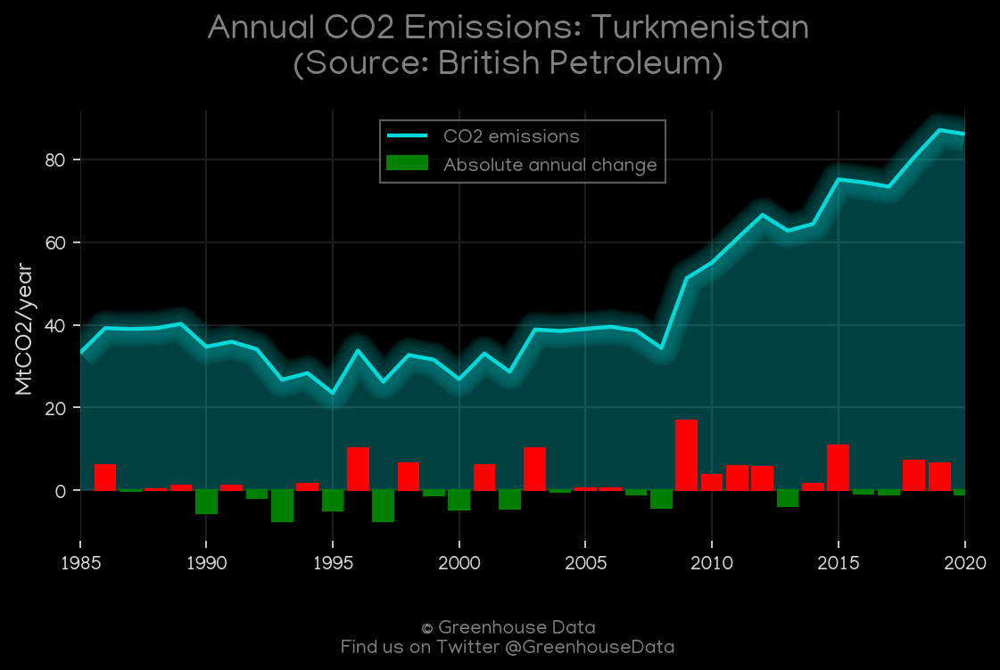
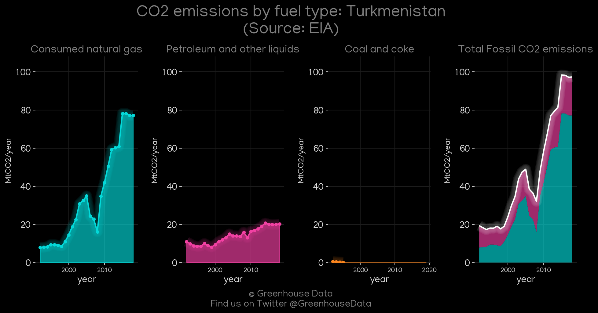

<h1 align="center">
🇹🇲🇹🇲🇹🇲🇹🇲🇹🇲
 
Turkmenistan
 
🇹🇲🇹🇲🇹🇲🇹🇲🇹🇲
</h1>
<h2>Datasets:</h2>

<a href="https://github.com/dquintani/GreenhouseData/tree/master/country_data/TKM_Turkmenistan/data">View on Github</a>
 

<a href="data/TKM_IEA.csv">IEA</a> || <a href="data/TKM_GCP_cons.csv">GCP_cons</a> || <a href="data/TKM_PRIMAP-hist.csv">PRIMAP-hist</a> || <a href="data/TKM_EPA.csv">EPA</a> || <a href="data/TKM_CDIAC.csv">CDIAC</a> || <a href="data/TKM_GCP_consupmption.csv">GCP_consupmption</a> || <a href="data/TKM_CAIT.csv">CAIT</a> || <a href="data/TKM_FAO.csv">FAO</a> || <a href="data/TKM_Minx_2021.csv">Minx_2021</a> || <a href="data/TKM_EIA.csv">EIA</a> || <a href="data/TKM_BP.csv">BP</a> || <a href="data/TKM_GCP.csv">GCP</a> || <a href="data/TKM_EDGAR.csv">EDGAR</a>

 

<h1>Figures:</h1><h2>#1 (TKM_GCP_1)</h2>

<h2>#2 (TKM_UNFCCC_NAI_1)</h2>

<h2>#3 (TKM_CAIT_gases_1)</h2>

<h2>#4 (TKM_Minx_top20_subsectors)</h2>

<h2>#5 (TKM_CO2_totals)</h2>

<h2>#6 (TKM_IEA_1)</h2>

<h2>#7 (TKM_BP_1)</h2>

<h2>#8 (TKM_CDIAC_1)</h2>

<h2>#9 (TKM_EIA_1)</h2>

