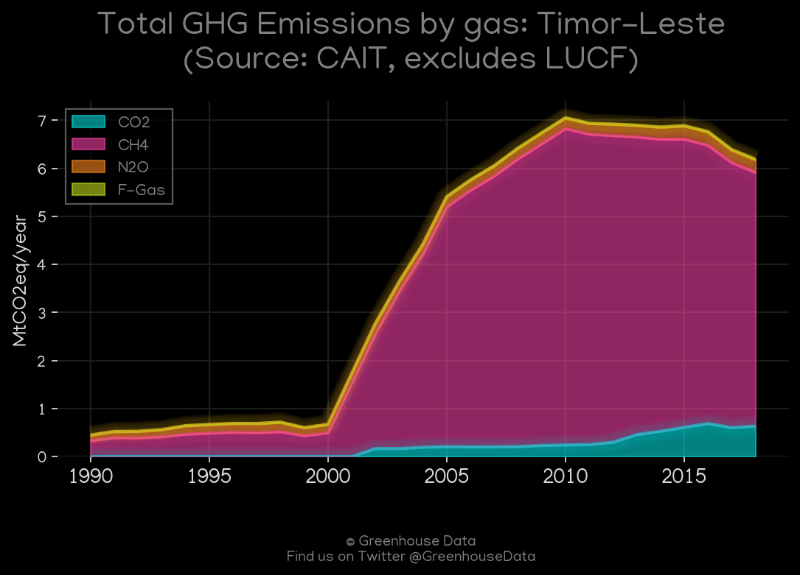
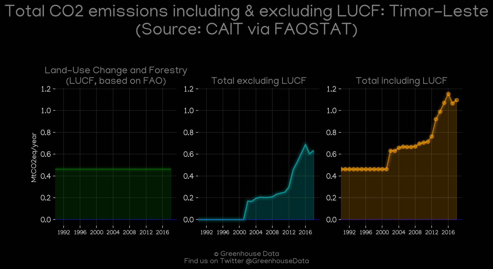
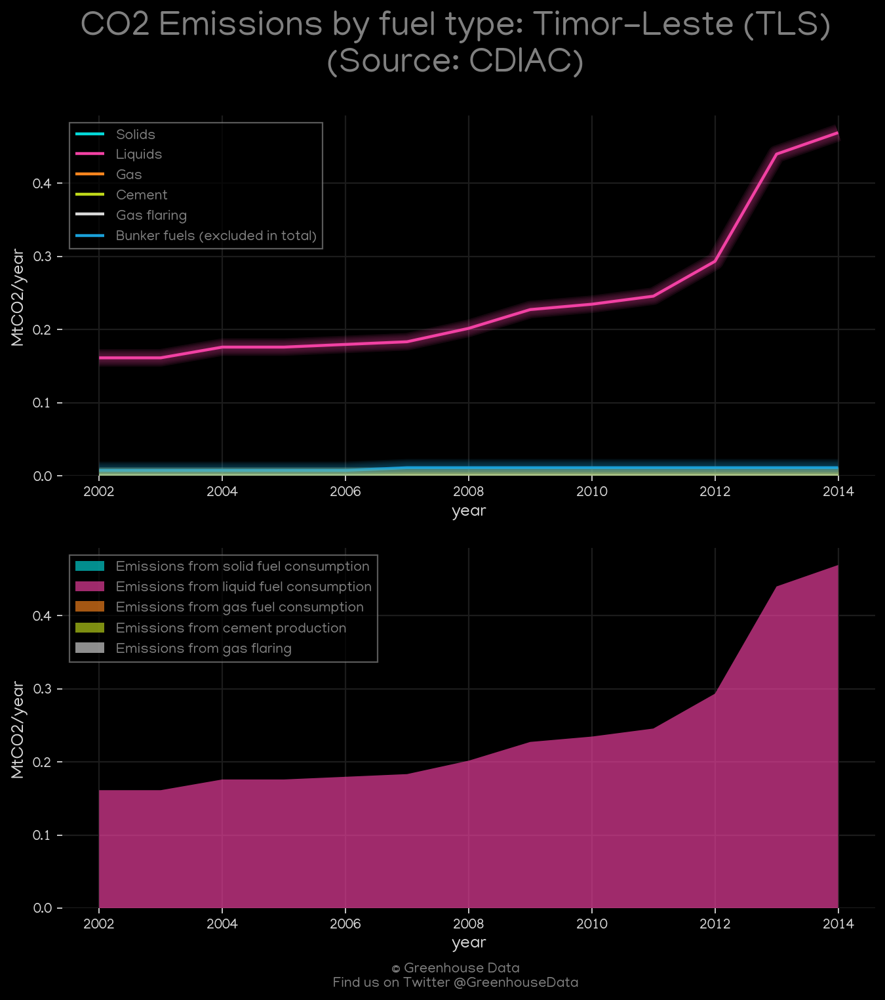
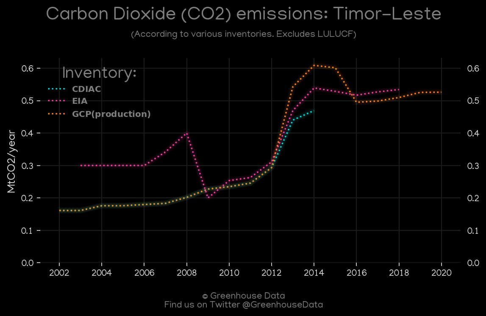
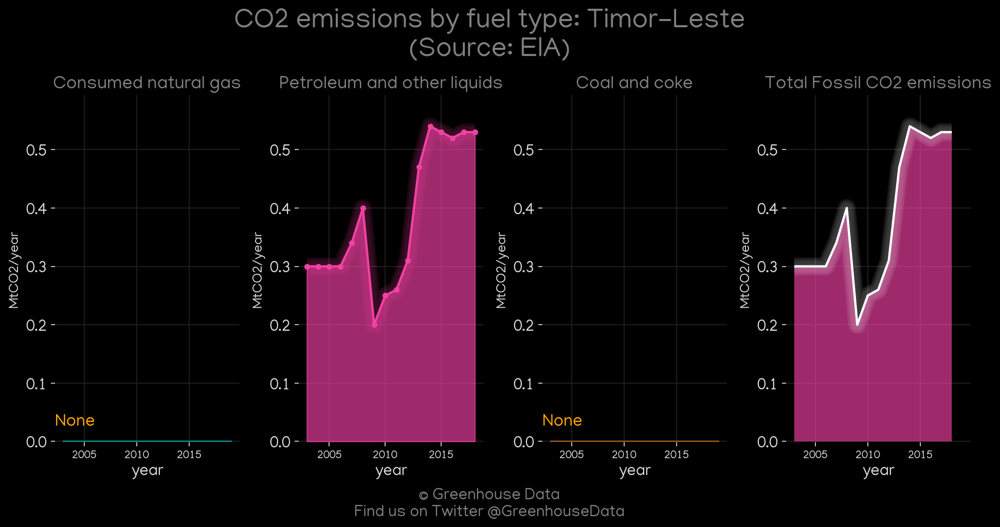
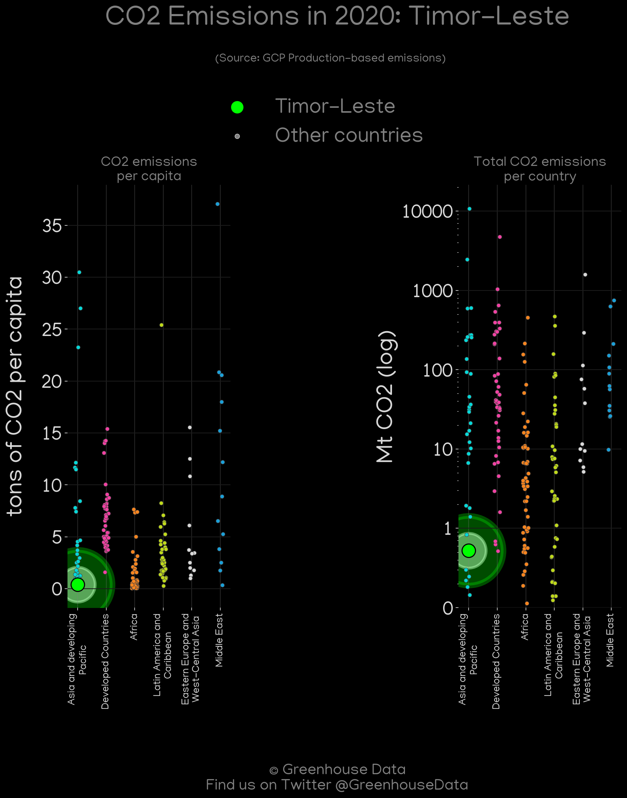
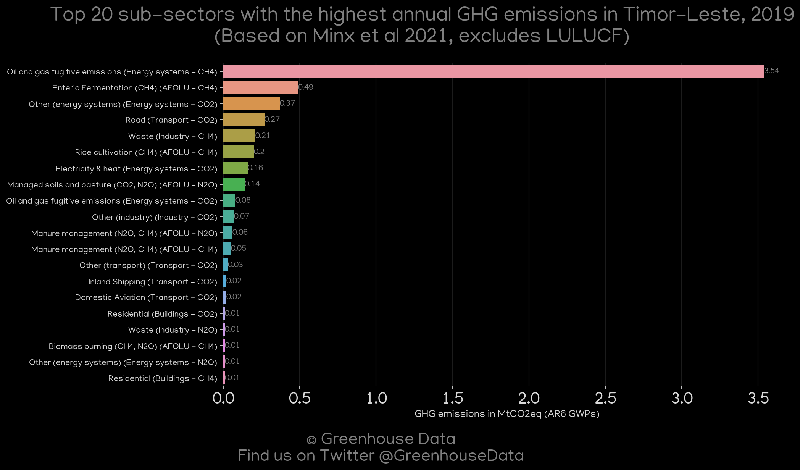
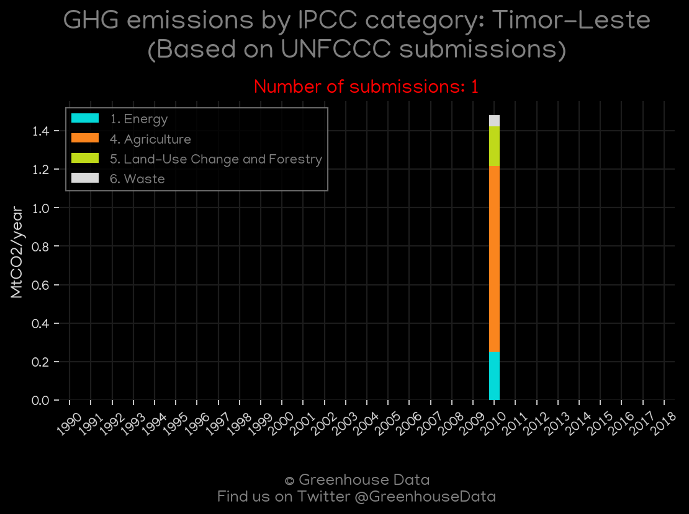

<h1 align="center">
🇹🇱🇹🇱🇹🇱🇹🇱🇹🇱
 
Timor-Leste
 
🇹🇱🇹🇱🇹🇱🇹🇱🇹🇱
</h1>
<h2>Datasets:</h2>

<a href="https://github.com/dquintani/GreenhouseData/tree/master/country_data/TLS_Timor-Leste/data">View on Github</a>
 

<a href="data/TLS_CAIT.csv">CAIT</a> || <a href="data/TLS_CDIAC.csv">CDIAC</a> || <a href="data/TLS_EDGAR.csv">EDGAR</a> || <a href="data/TLS_EIA.csv">EIA</a> || <a href="data/TLS_EPA.csv">EPA</a> || <a href="data/TLS_FAO.csv">FAO</a> || <a href="data/TLS_GCP.csv">GCP</a> || <a href="data/TLS_GCP_consupmption.csv">GCP_consupmption</a> || <a href="data/TLS_Minx_2021.csv">Minx_2021</a> || <a href="data/TLS_PRIMAP-hist.csv">PRIMAP-hist</a>

 

<h1>Figures:</h1><h2>#1 (TLS_CAIT_gases_1)</h2>

<h2>#2 (TLS_CAIT_lucf_vs_nolucf)</h2>

<h2>#3 (TLS_CDIAC_1)</h2>

<h2>#4 (TLS_CO2_totals)</h2>

<h2>#5 (TLS_EIA_1)</h2>

<h2>#6 (TLS_GCP_1)</h2>

<h2>#7 (TLS_GCP_Country_Highlight)</h2>

<h2>#8 (TLS_Minx_top20_subsectors)</h2>

<h2>#9 (TLS_relative_totals)</h2>

<h2>#10 (TLS_UNFCCC_NAI_1)</h2>

