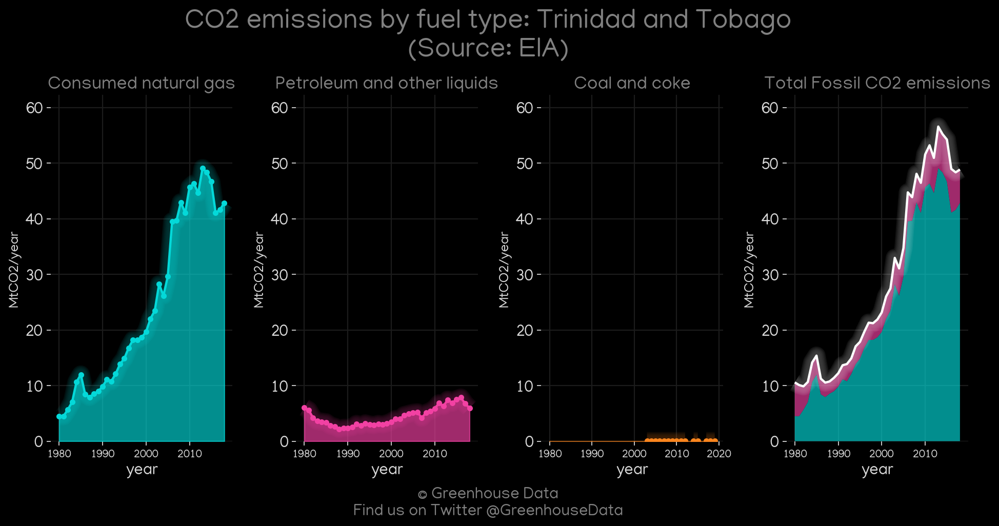
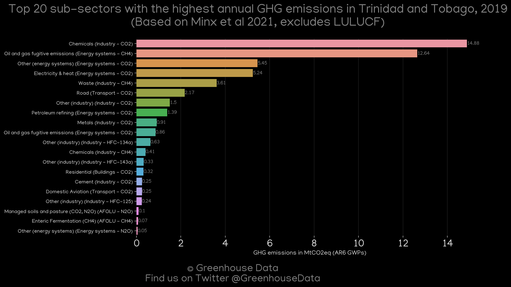
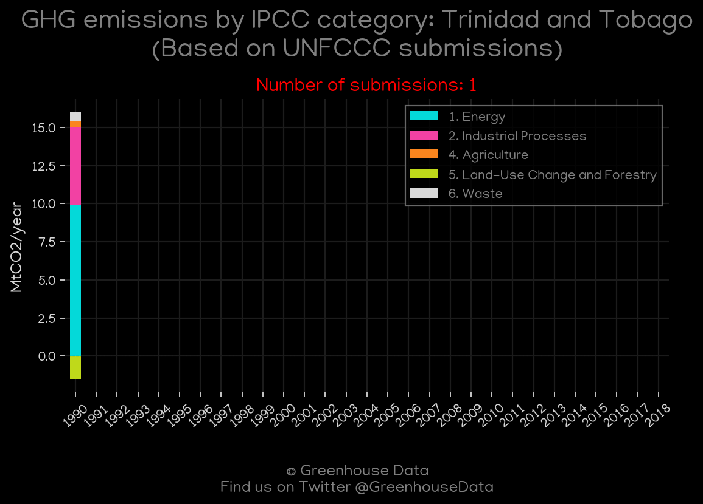
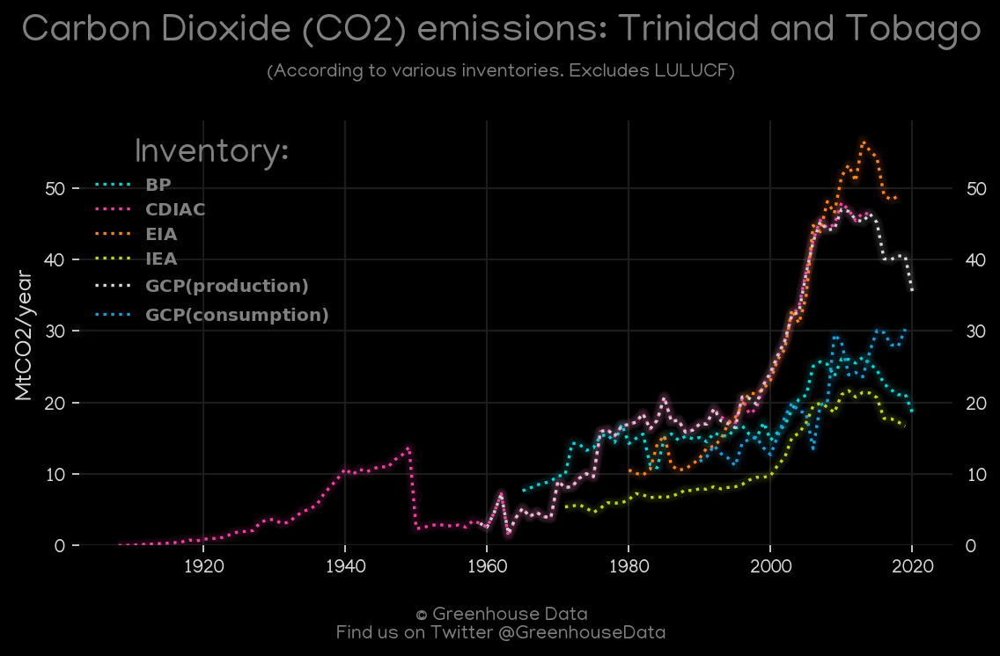
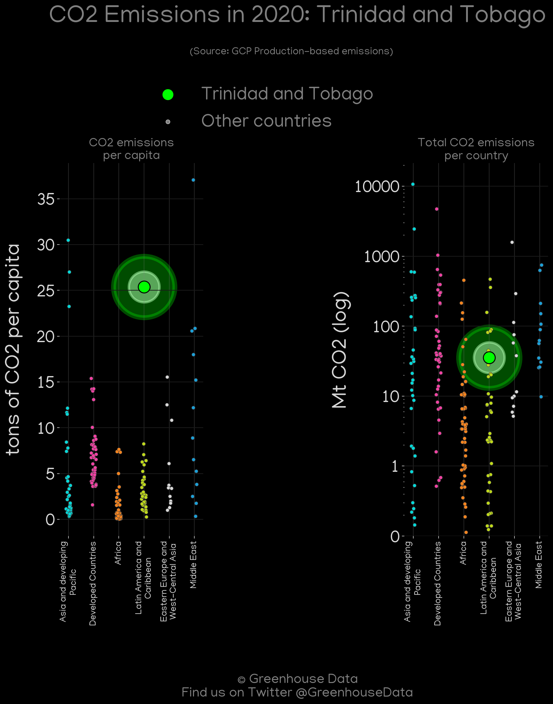
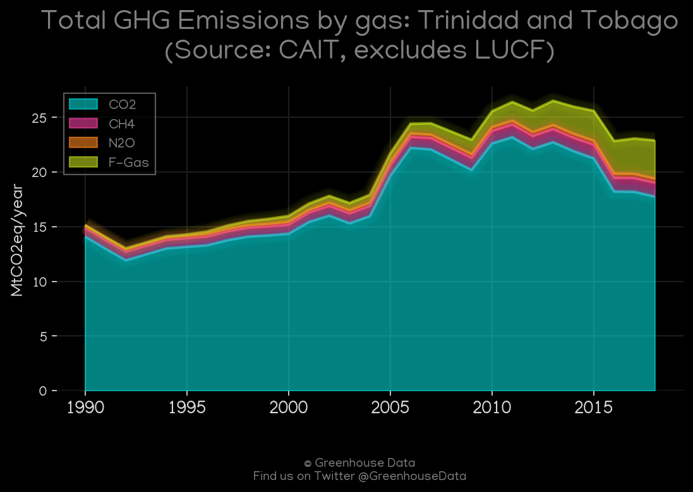
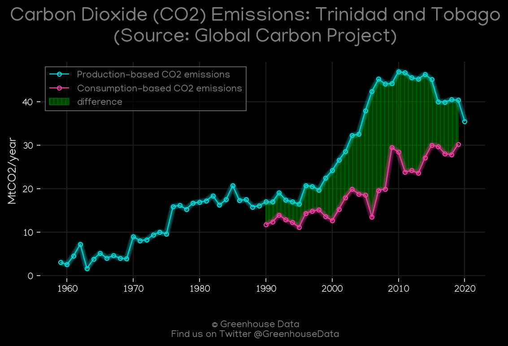
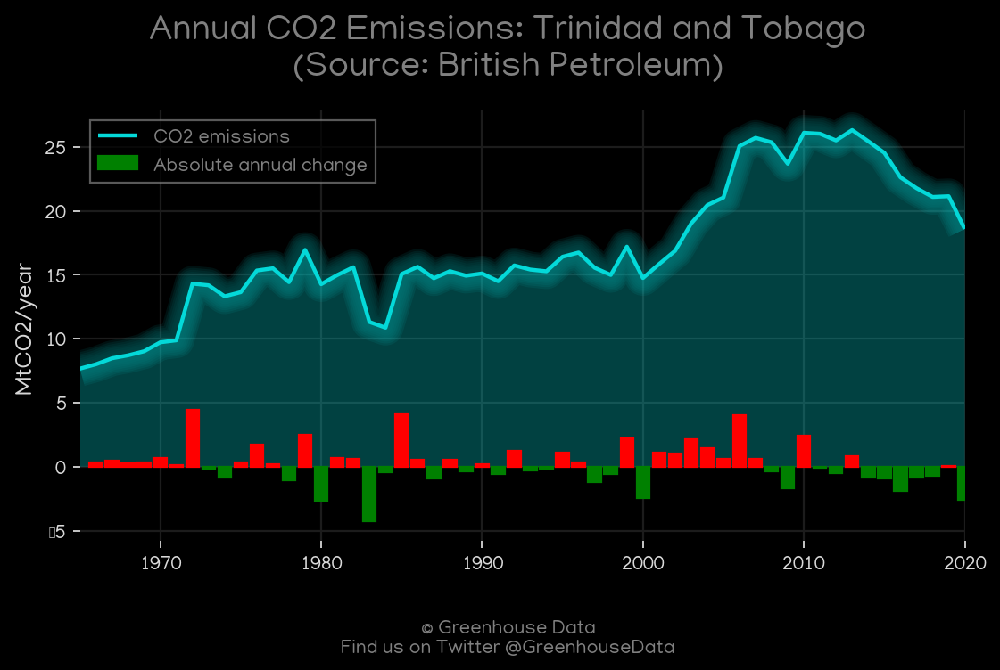
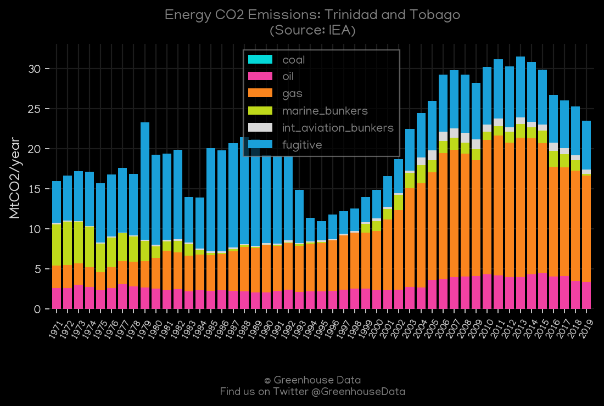
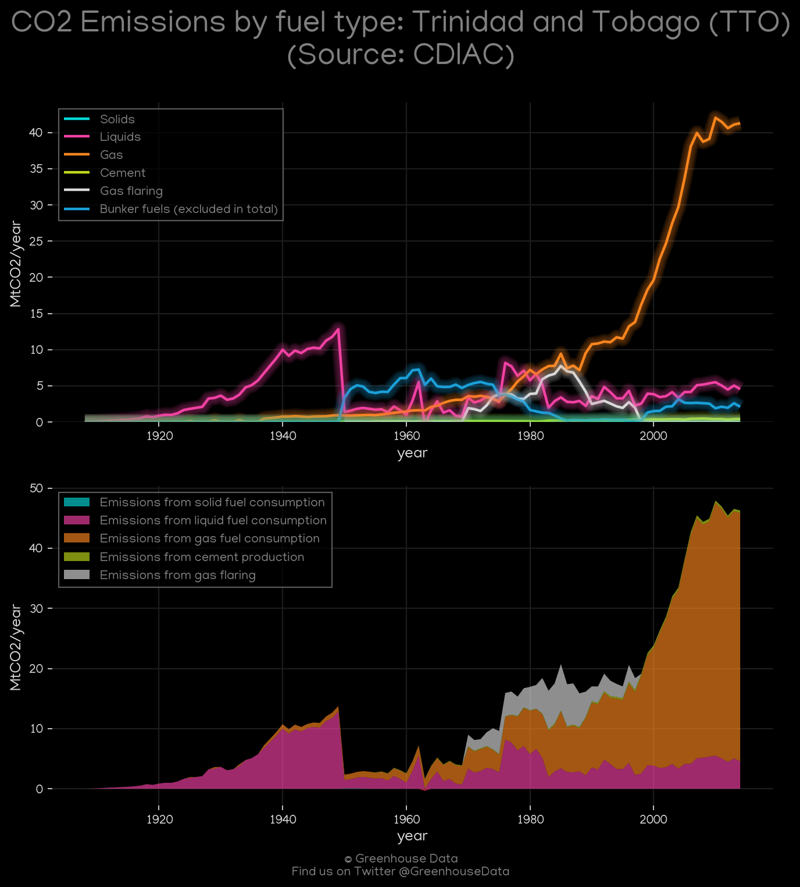

<h1 align="center">
🇹🇹🇹🇹🇹🇹🇹🇹🇹🇹
 
Trinidad and Tobago
 
🇹🇹🇹🇹🇹🇹🇹🇹🇹🇹
</h1>
<h2>Datasets:</h2>

<a href="https://github.com/dquintani/GreenhouseData/tree/master/country_data/TTO_Trinidad and Tobago/data">View on Github</a>
 

<a href="data/TTO_EDGAR.csv">EDGAR</a> || <a href="data/TTO_CDIAC.csv">CDIAC</a> || <a href="data/TTO_CAIT.csv">CAIT</a> || <a href="data/TTO_IEA.csv">IEA</a> || <a href="data/TTO_BP.csv">BP</a> || <a href="data/TTO_EPA.csv">EPA</a> || <a href="data/TTO_Minx_2021.csv">Minx_2021</a> || <a href="data/TTO_GCP_consupmption.csv">GCP_consupmption</a> || <a href="data/TTO_GCP.csv">GCP</a> || <a href="data/TTO_PRIMAP-hist.csv">PRIMAP-hist</a> || <a href="data/TTO_EIA.csv">EIA</a> || <a href="data/TTO_FAO.csv">FAO</a>

 

<h1>Figures:</h1><h2>#1 (TTO_EIA_1)</h2>

<h2>#2 (TTO_Minx_top20_subsectors)</h2>

<h2>#3 (TTO_relative_totals)</h2>

<h2>#4 (TTO_UNFCCC_NAI_1)</h2>

<h2>#5 (TTO_CO2_totals)</h2>

<h2>#6 (TTO_GCP_Country_Highlight)</h2>

<h2>#7 (TTO_CAIT_gases_1)</h2>

<h2>#8 (TTO_GCP_1)</h2>

<h2>#9 (TTO_CAIT_lucf_vs_nolucf)</h2>

<h2>#10 (TTO_BP_1)</h2>

<h2>#11 (TTO_IEA_1)</h2>

<h2>#12 (TTO_CDIAC_1)</h2>

