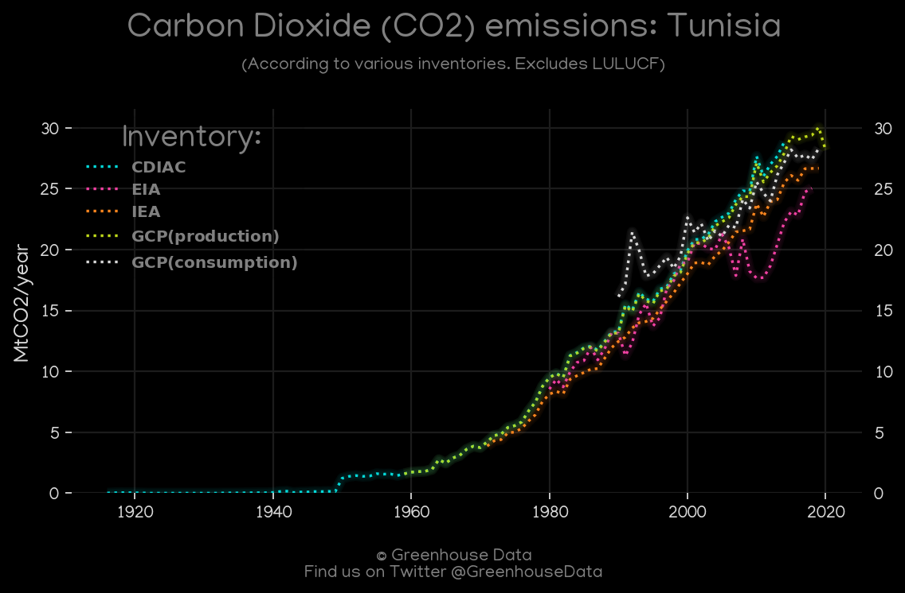
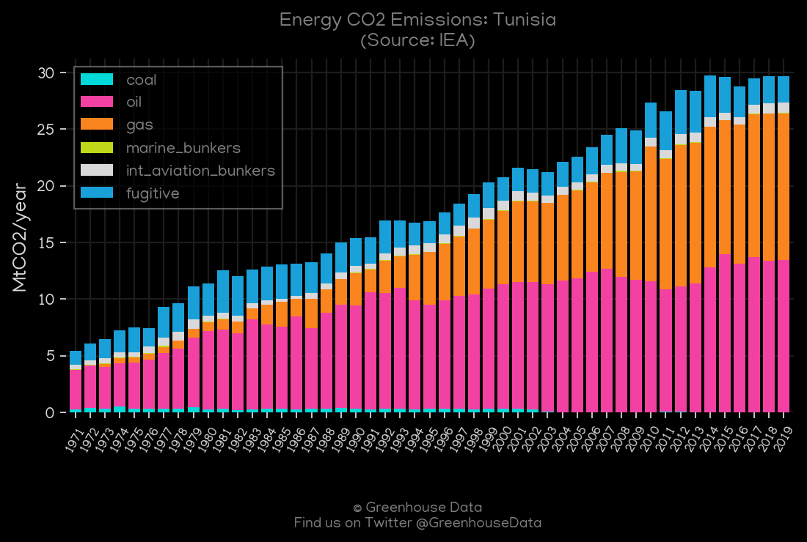
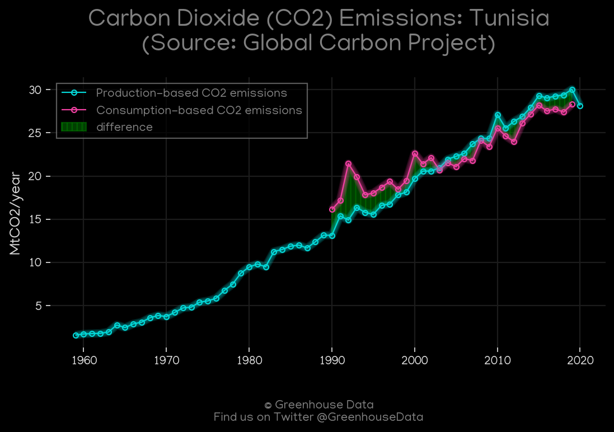
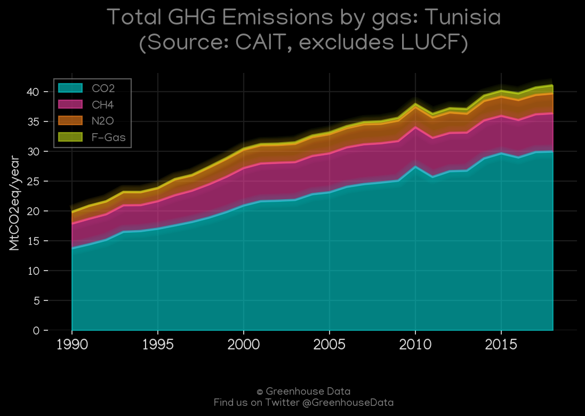
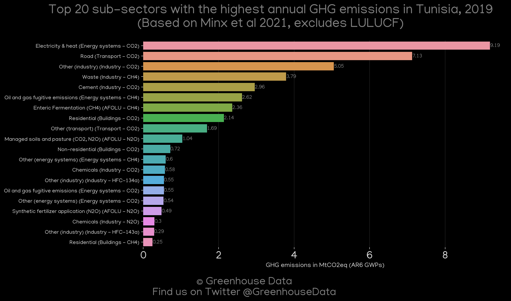
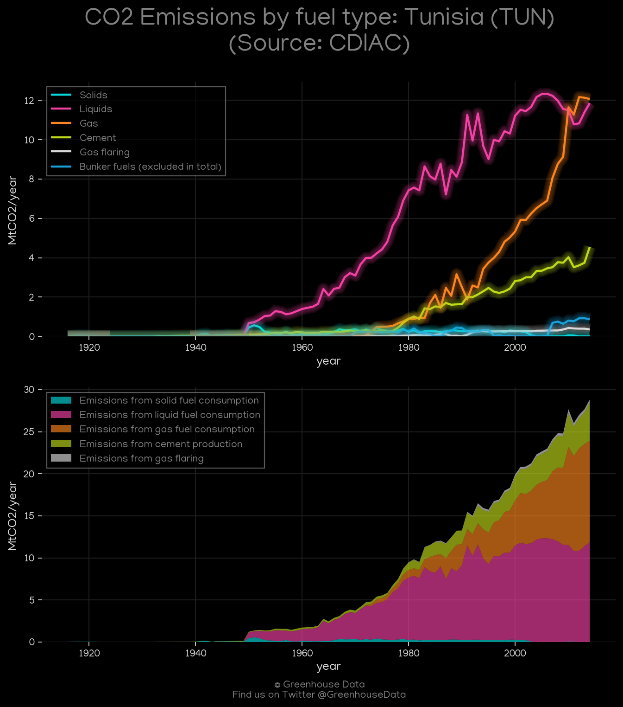

<h1 align="center">
🇹🇳🇹🇳🇹🇳🇹🇳🇹🇳
 
Tunisia
 
🇹🇳🇹🇳🇹🇳🇹🇳🇹🇳
</h1>
<h2>Datasets:</h2>

<a href="https://github.com/dquintani/GreenhouseData/tree/master/country_data/TUN_Tunisia/data">View on Github</a>
 

<a href="data/TUN_GCP.csv">GCP</a> || <a href="data/TUN_CDIAC.csv">CDIAC</a> || <a href="data/TUN_Minx_2021.csv">Minx_2021</a> || <a href="data/TUN_FAO.csv">FAO</a> || <a href="data/TUN_EPA.csv">EPA</a> || <a href="data/TUN_PRIMAP-hist.csv">PRIMAP-hist</a> || <a href="data/TUN_EIA.csv">EIA</a> || <a href="data/TUN_EDGAR.csv">EDGAR</a> || <a href="data/TUN_GCP_consupmption.csv">GCP_consupmption</a> || <a href="data/TUN_IEA.csv">IEA</a> || <a href="data/TUN_CAIT.csv">CAIT</a>

 

<h1>Figures:</h1><h2>#1 (TUN_CO2_totals)</h2>

<h2>#2 (TUN_IEA_1)</h2>

<h2>#3 (TUN_GCP_1)</h2>

<h2>#4 (TUN_UNFCCC_NAI_1)</h2>

<h2>#5 (TUN_CAIT_gases_1)</h2>

<h2>#6 (TUN_EIA_1)</h2>

<h2>#7 (TUN_Minx_top20_subsectors)</h2>

<h2>#8 (TUN_CDIAC_1)</h2>

