

<h1 align="center">
🇹🇷🇹🇷🇹🇷🇹🇷🇹🇷
 
Turkey
 
🇹🇷🇹🇷🇹🇷🇹🇷🇹🇷
</h1>
<h2>Datasets:</h2>

<a href="https://github.com/dquintani/GreenhouseData/tree/master/country_data/TUR_Turkey/data">View on Github</a>
 

<a href="data/TUR_PRIMAP-hist.csv">PRIMAP-hist</a> || <a href="data/TUR_FAO.csv">FAO</a> || <a href="data/TUR_GCP_consupmption.csv">GCP_consupmption</a> || <a href="data/TUR_EDGAR.csv">EDGAR</a> || <a href="data/TUR_EPA.csv">EPA</a> || <a href="data/TUR_CAIT.csv">CAIT</a> || <a href="data/TUR_Minx_2021.csv">Minx_2021</a> || <a href="data/TUR_EIA.csv">EIA</a> || <a href="data/TUR_BP.csv">BP</a> || <a href="data/TUR_GCP.csv">GCP</a> || <a href="data/TUR_CDIAC.csv">CDIAC</a> || <a href="data/TUR_IEA.csv">IEA</a>

 

<h1>Figures:</h1><h2>#1 (TUR_CAIT_lucf_vs_nolucf)</h2>

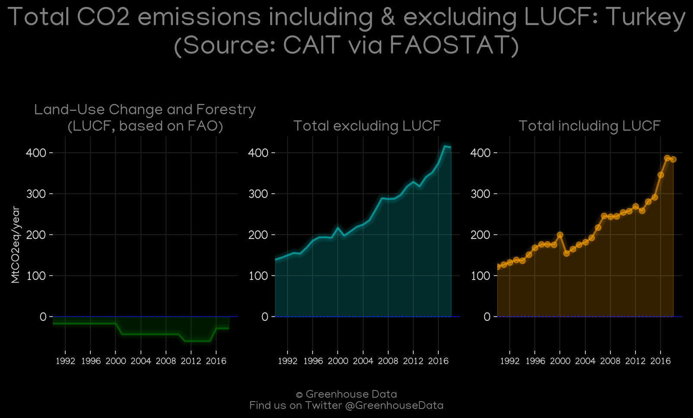
<h2>#2 (TUR_CO2_totals)</h2>

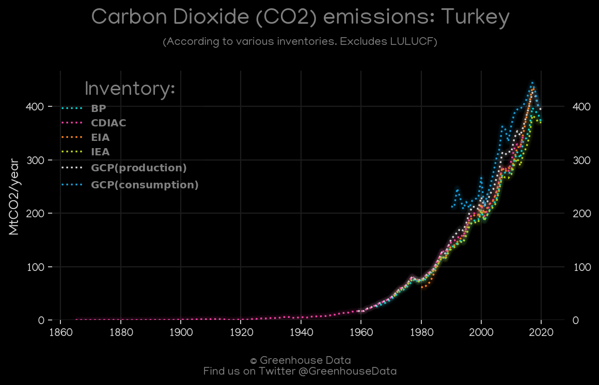
<h2>#3 (TUR_EIA_1)</h2>

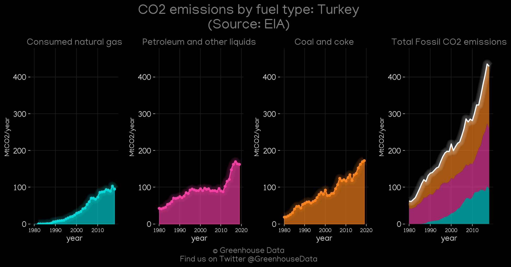
<h2>#4 (TUR_UNFCCC_AI_1)</h2>

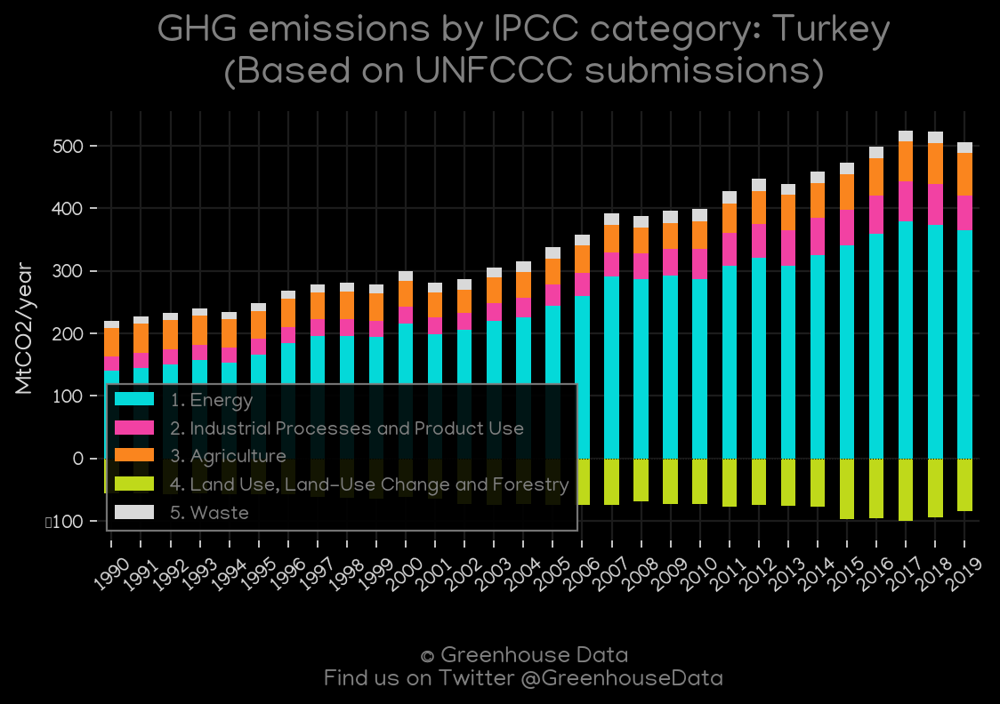
<h2>#5 (TUR_CAIT_gases_1)</h2>

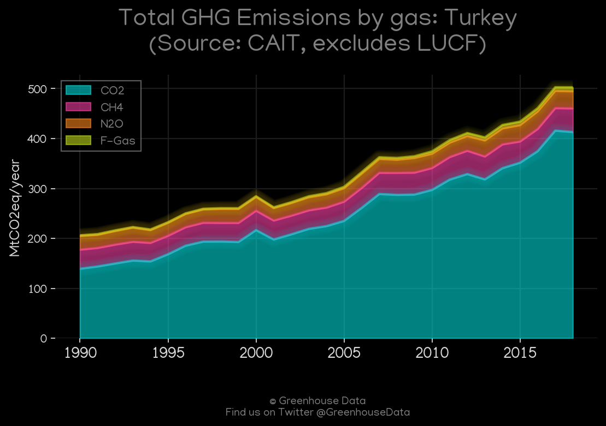
<h2>#6 (TUR_GCP_Country_Highlight)</h2>

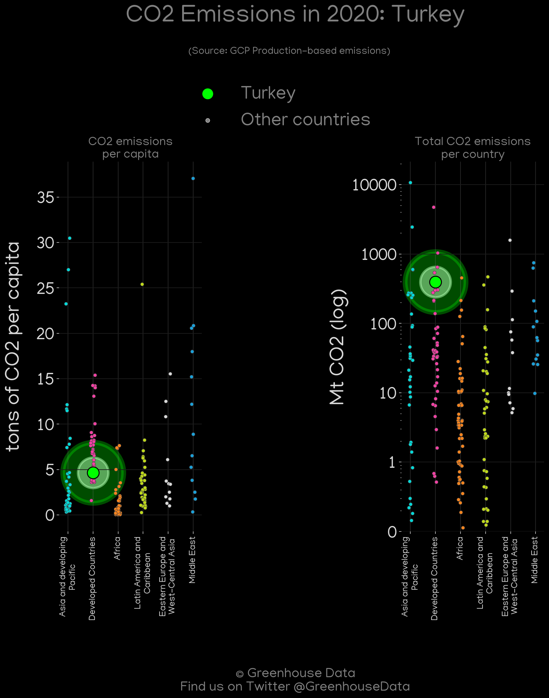
<h2>#7 (TUR_IEA_1)</h2>

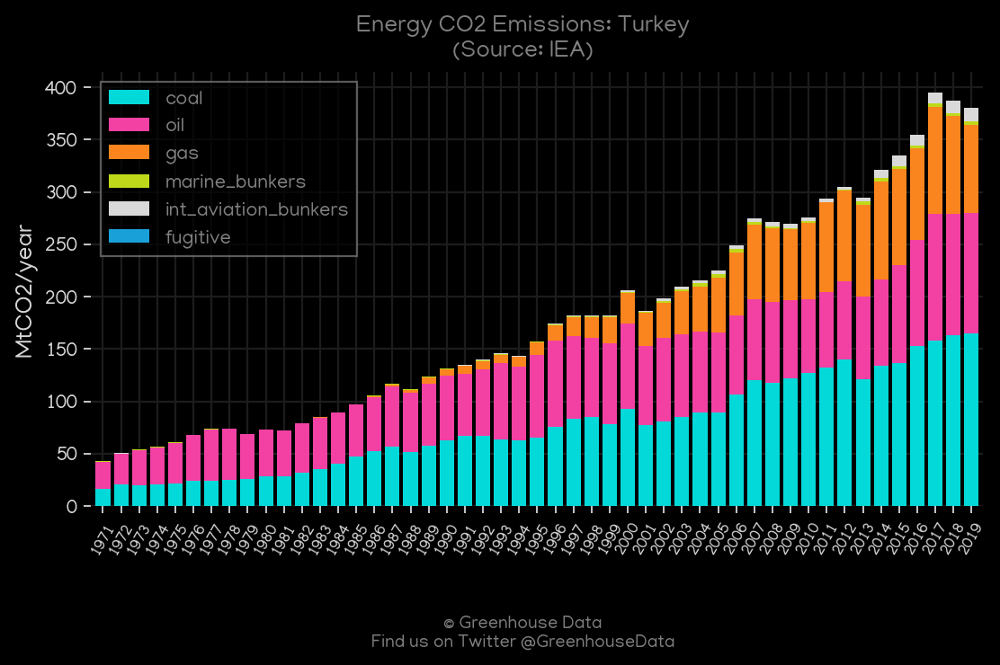
<h2>#8 (TUR_BP_1)</h2>

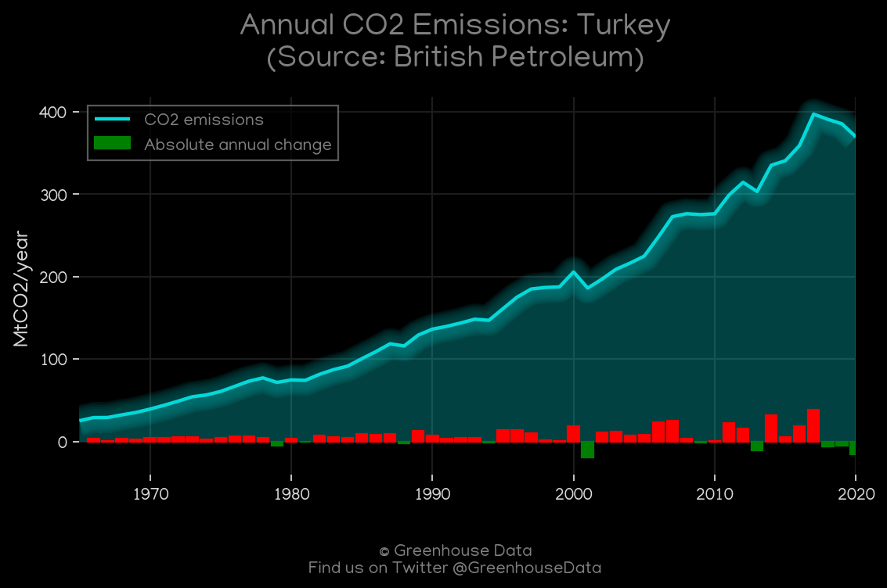
<h2>#9 (TUR_Minx_top20_subsectors)</h2>

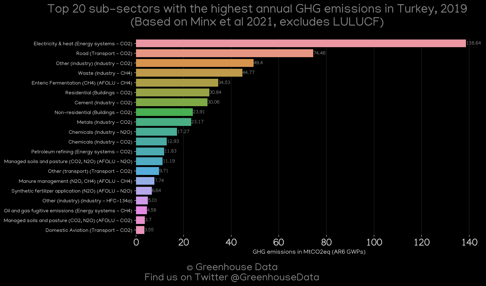
<h2>#10 (TUR_CDIAC_1)</h2>

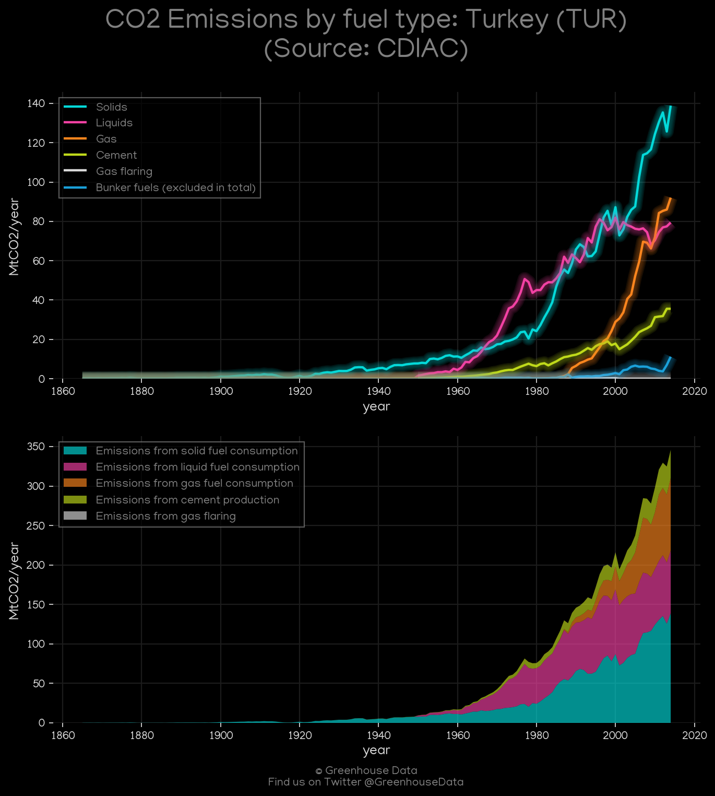
<h2>#11 (TUR_GCP_1)</h2>

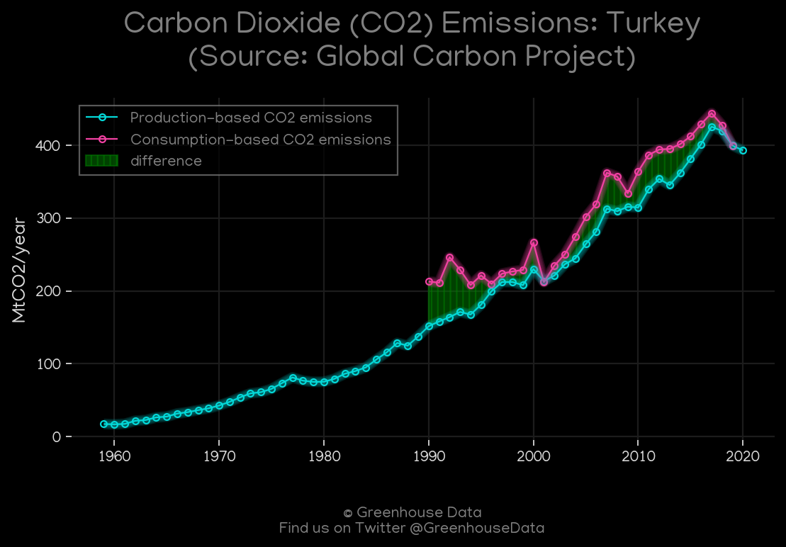
