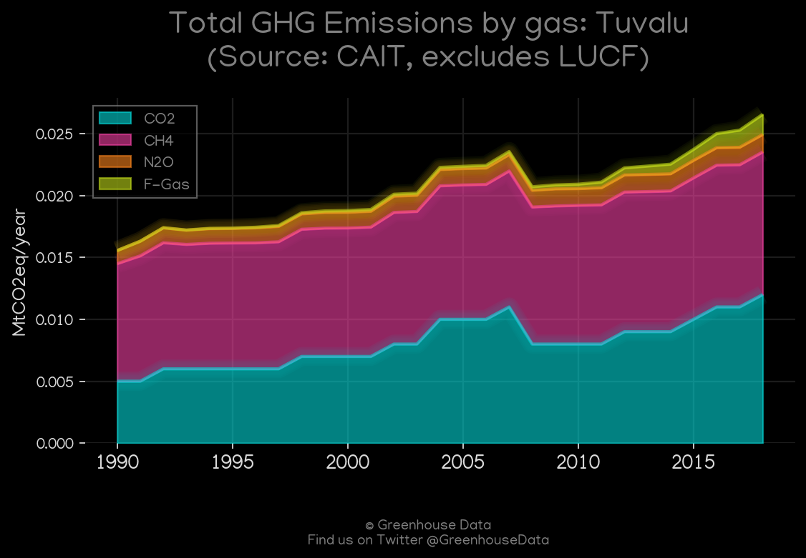
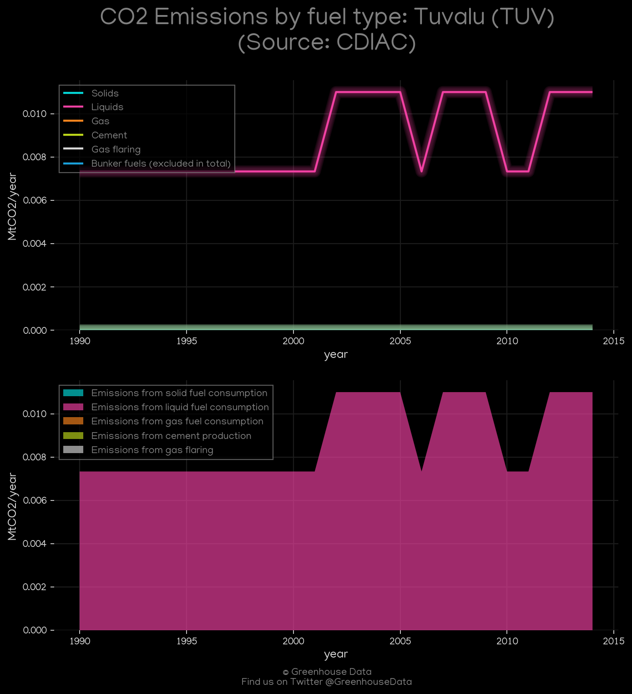
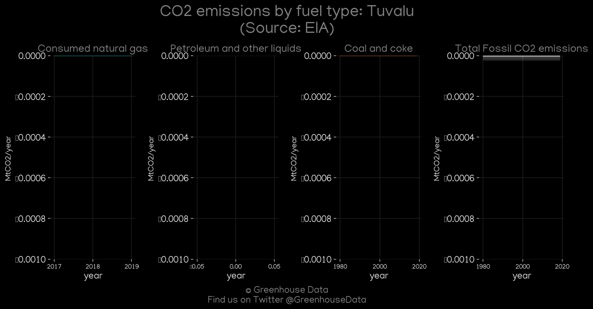
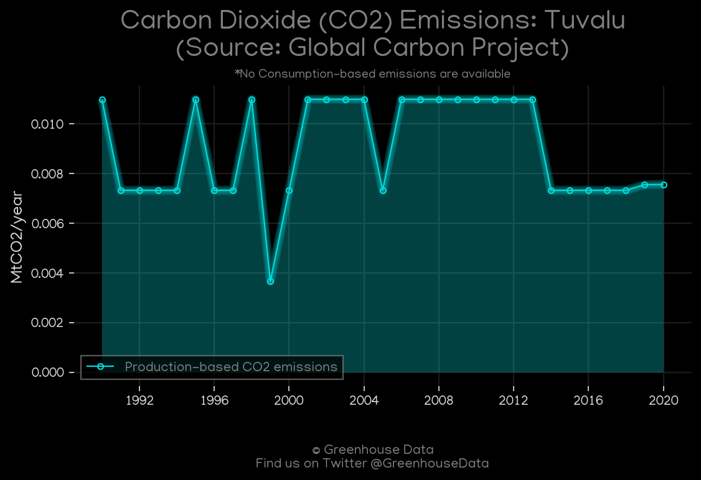
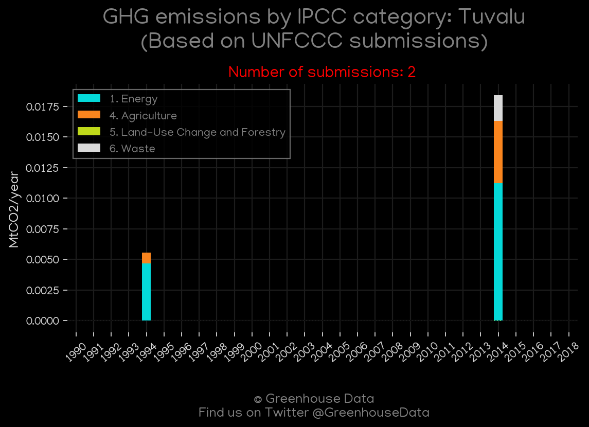
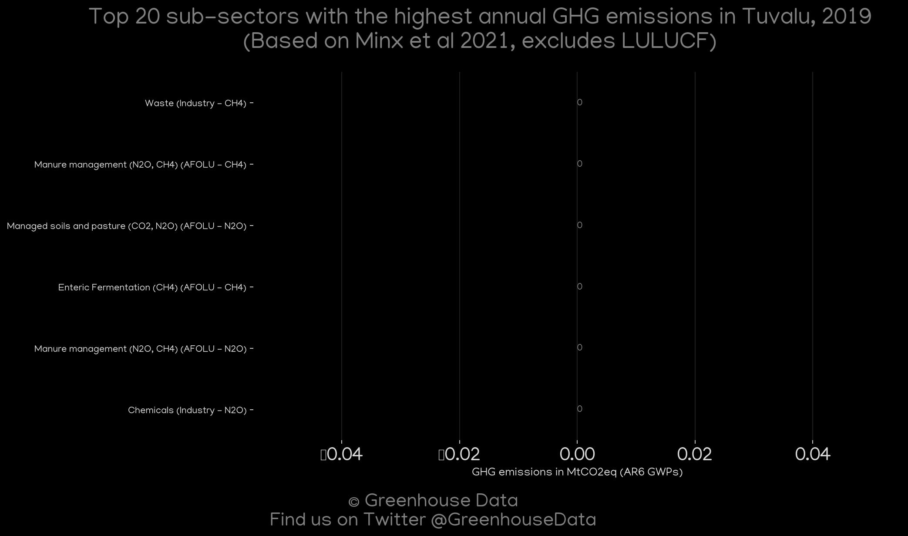
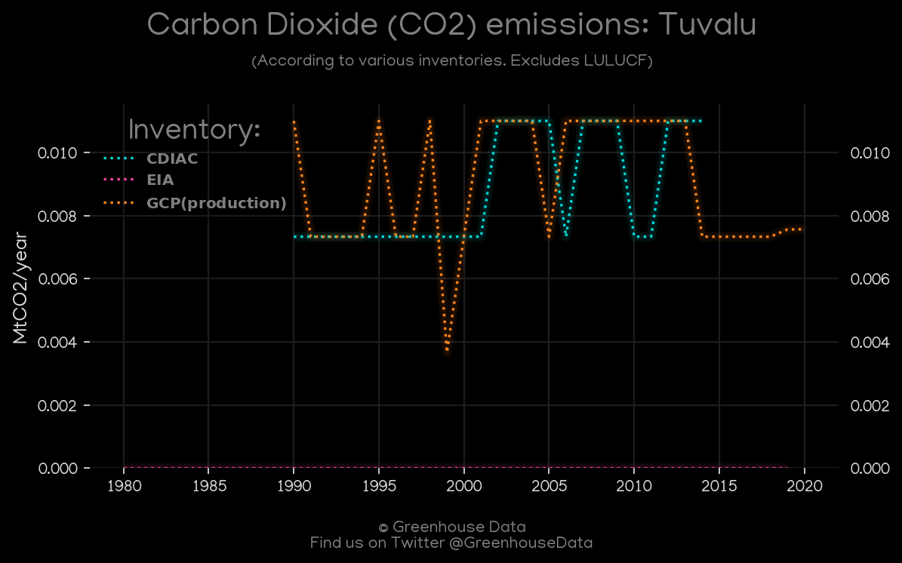

<h1 align="center">
🇹🇻🇹🇻🇹🇻🇹🇻🇹🇻
 
Tuvalu
 
🇹🇻🇹🇻🇹🇻🇹🇻🇹🇻
</h1>
<h2>Datasets:</h2>

<a href="https://github.com/dquintani/GreenhouseData/tree/master/country_data/TUV_Tuvalu/data">View on Github</a>
 

<a href="data/TUV_EDGAR.csv">EDGAR</a> || <a href="data/TUV_GCP.csv">GCP</a> || <a href="data/TUV_Minx_2021.csv">Minx_2021</a> || <a href="data/TUV_PRIMAP-hist.csv">PRIMAP-hist</a> || <a href="data/TUV_EIA.csv">EIA</a> || <a href="data/TUV_EPA.csv">EPA</a> || <a href="data/TUV_CAIT.csv">CAIT</a> || <a href="data/TUV_GCP_consupmption.csv">GCP_consupmption</a> || <a href="data/TUV_CDIAC.csv">CDIAC</a> || <a href="data/TUV_FAO.csv">FAO</a>

 

<h1>Figures:</h1><h2>#1 (TUV_CAIT_gases_1)</h2>

<h2>#2 (TUV_CDIAC_1)</h2>

<h2>#3 (TUV_EIA_1)</h2>

<h2>#4 (TUV_GCP_Country_Highlight)</h2>

<h2>#5 (TUV_GCP_1)</h2>

<h2>#6 (TUV_CAIT_lucf_vs_nolucf)</h2>

<h2>#7 (TUV_UNFCCC_NAI_1)</h2>

<h2>#8 (TUV_Minx_top20_subsectors)</h2>

<h2>#9 (TUV_CO2_totals)</h2>

<h2>#10 (TUV_relative_totals)</h2>

