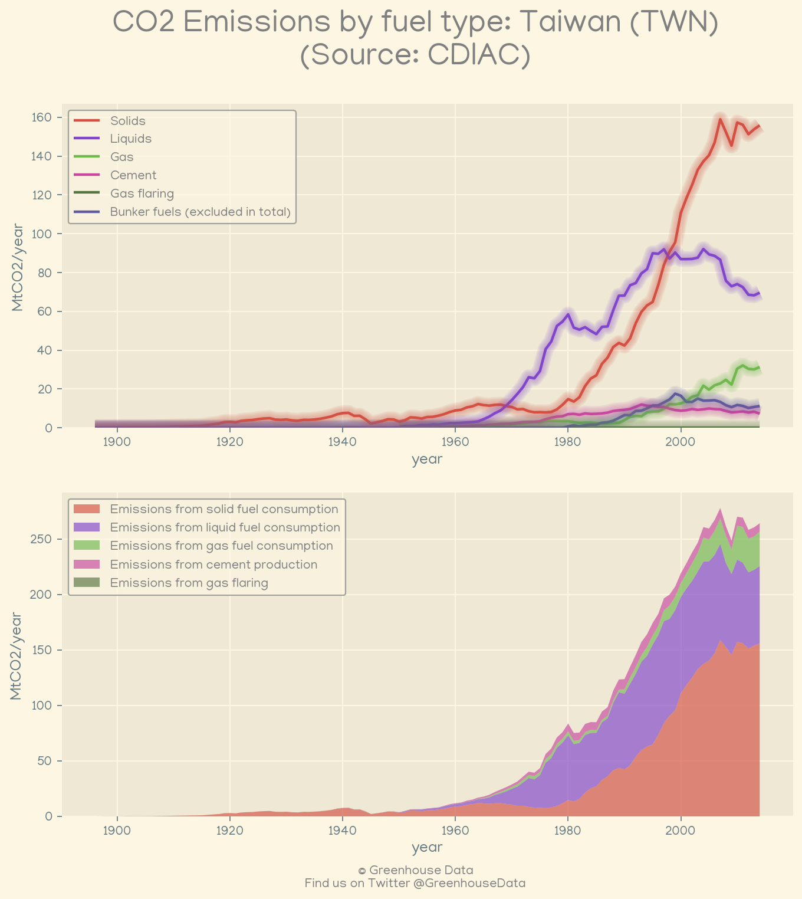
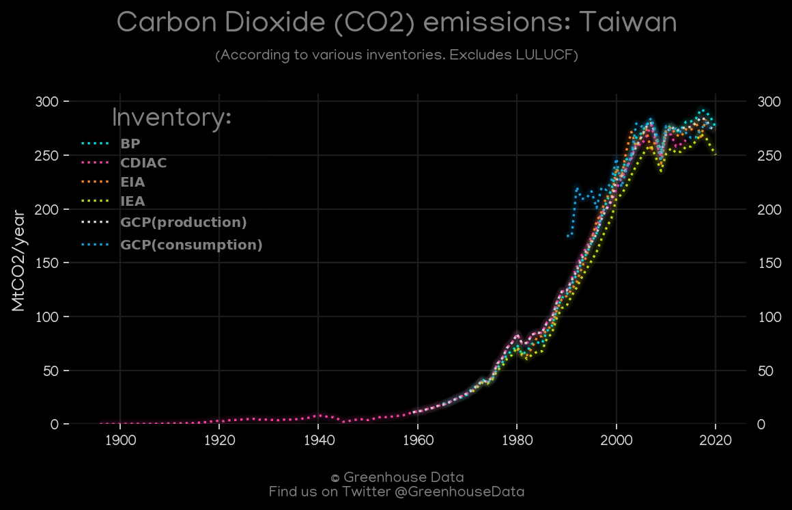
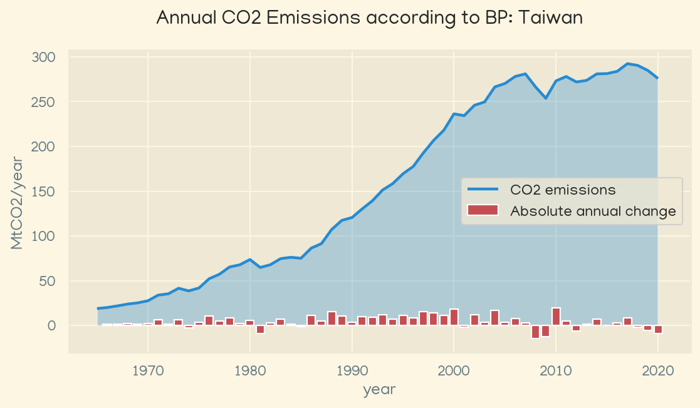
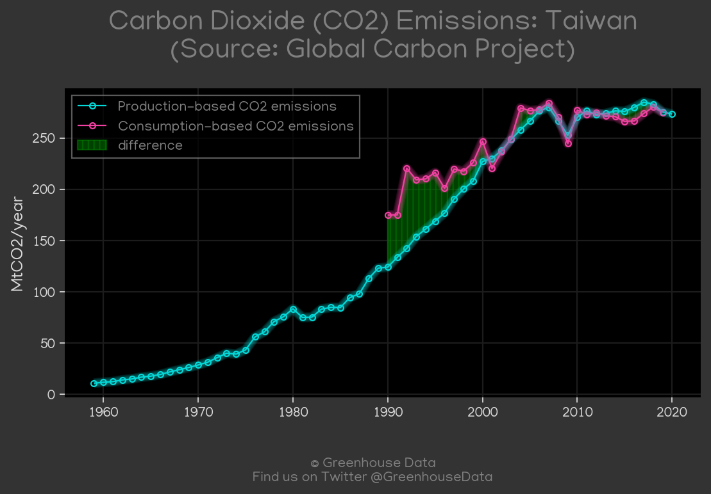
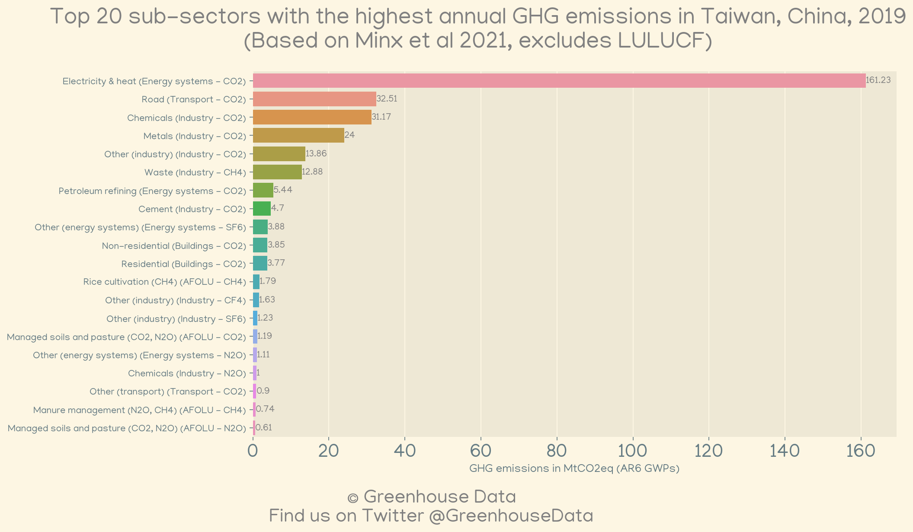
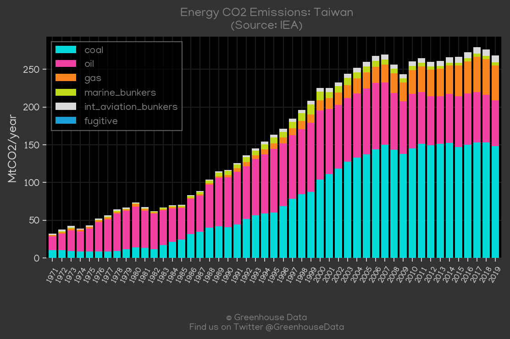
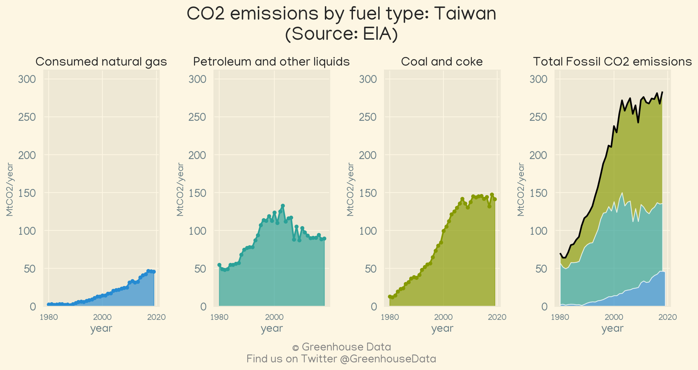

<h1 align="center">
🇹🇼🇹🇼🇹🇼🇹🇼🇹🇼
 
Taiwan
 
🇹🇼🇹🇼🇹🇼🇹🇼🇹🇼
</h1>
<h2>Datasets:</h2>

<a href="https://github.com/dquintani/Greenhouse-Data/tree/master/country_data/TWN_Taiwan/data">View on Github</a>
 

<a href="data/TWN_GCP.csv">GCP</a> || <a href="data/TWN_Minx_2021.csv">Minx_2021</a> || <a href="data/TWN_EIA.csv">EIA</a> || <a href="data/TWN_PRIMAP-hist.csv">PRIMAP-hist</a> || <a href="data/TWN_GCP_consupmption.csv">GCP_consupmption</a> || <a href="data/TWN_IEA.csv">IEA</a> || <a href="data/TWN_EDGAR.csv">EDGAR</a> || <a href="data/TWN_CDIAC.csv">CDIAC</a> || <a href="data/TWN_GCP_cons.csv">GCP_cons</a> || <a href="data/TWN_BP.csv">BP</a>

 

<h1>Figures:</h1><h2>#1 (TWN_CDIAC_1)</h2>

<h2>#2 (TWN_CO2_totals)</h2>

<h2>#3 (TWN_BP_1)</h2>

<h2>#4 (TWN_GCP_1)</h2>

<h2>#5 (TWN_Minx_top20_subsectors)</h2>

<h2>#6 (TWN_IEA_1)</h2>

<h2>#7 (TWN_EIA_1)</h2>

