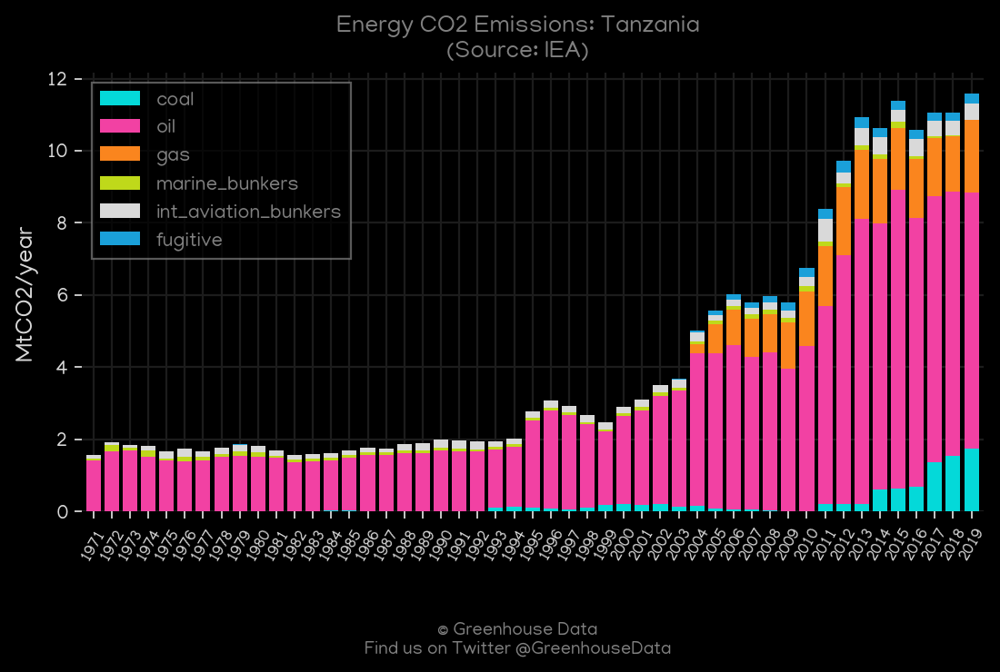
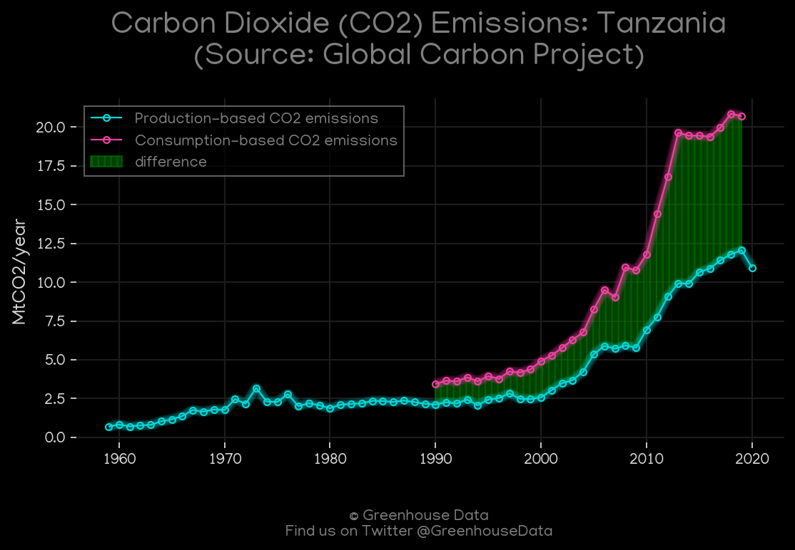
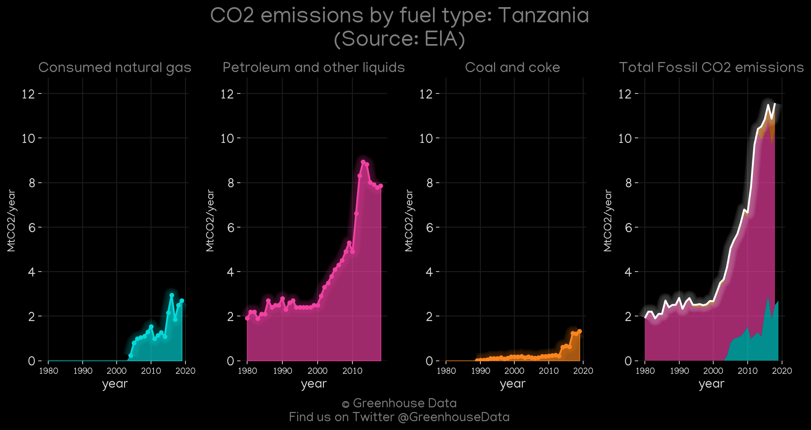
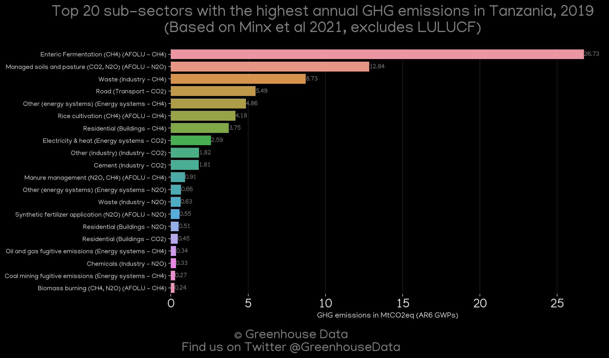
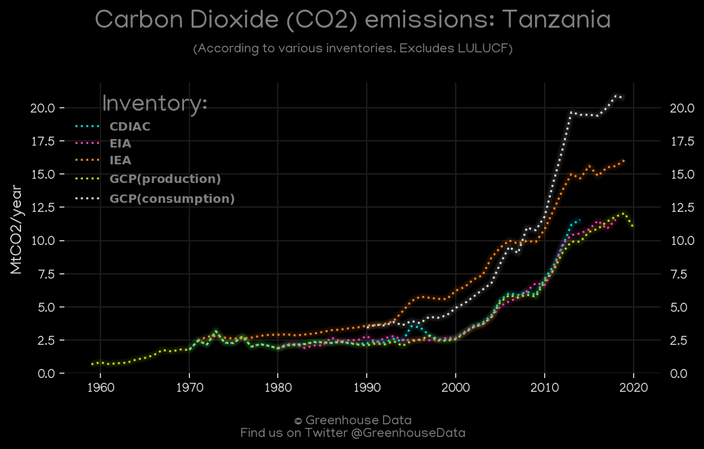
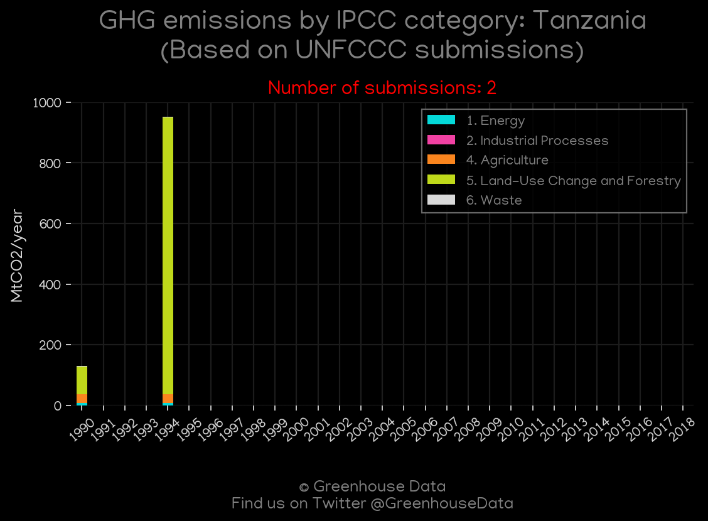
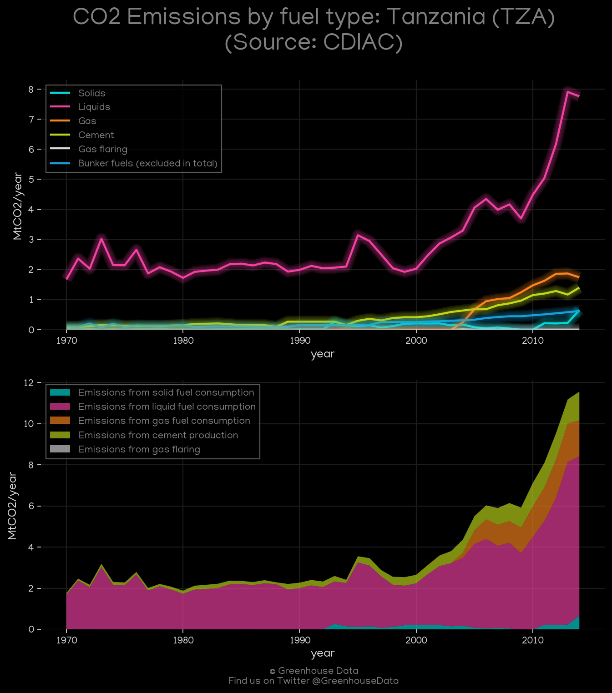
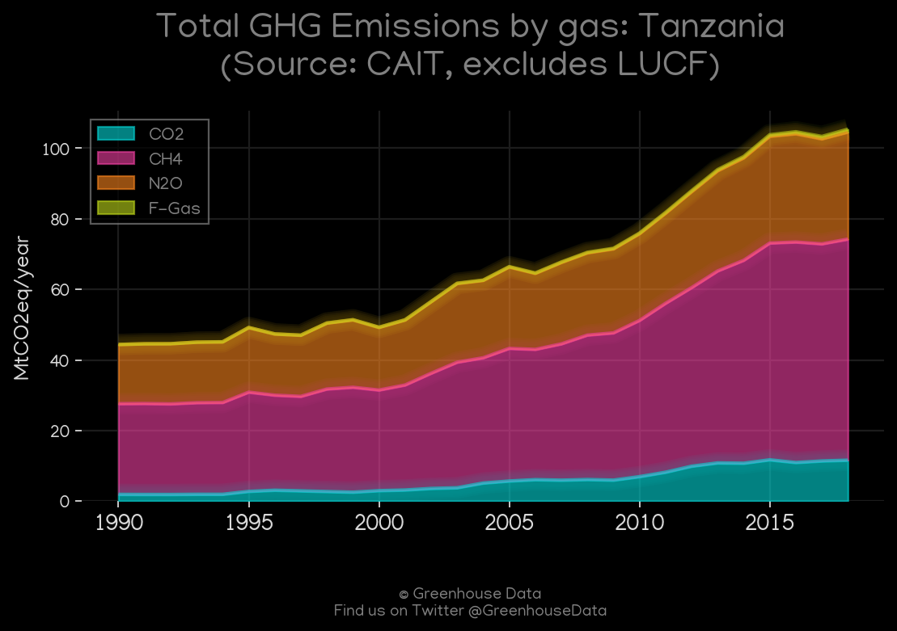

<h1 align="center">
🇹🇿🇹🇿🇹🇿🇹🇿🇹🇿
 
Tanzania
 
🇹🇿🇹🇿🇹🇿🇹🇿🇹🇿
</h1>
<h2>Datasets:</h2>

<a href="https://github.com/dquintani/GreenhouseData/tree/master/country_data/TZA_Tanzania/data">View on Github</a>
 

<a href="data/TZA_CAIT.csv">CAIT</a> || <a href="data/TZA_FAO.csv">FAO</a> || <a href="data/TZA_GCP.csv">GCP</a> || <a href="data/TZA_Minx_2021.csv">Minx_2021</a> || <a href="data/TZA_GCP_cons.csv">GCP_cons</a> || <a href="data/TZA_EPA.csv">EPA</a> || <a href="data/TZA_IEA.csv">IEA</a> || <a href="data/TZA_EIA.csv">EIA</a> || <a href="data/TZA_CDIAC.csv">CDIAC</a> || <a href="data/TZA_GCP_consupmption.csv">GCP_consupmption</a> || <a href="data/TZA_PRIMAP-hist.csv">PRIMAP-hist</a> || <a href="data/TZA_EDGAR.csv">EDGAR</a>

 

<h1>Figures:</h1><h2>#1 (TZA_IEA_1)</h2>

<h2>#2 (TZA_GCP_1)</h2>

<h2>#3 (TZA_EIA_1)</h2>

<h2>#4 (TZA_Minx_top20_subsectors)</h2>

<h2>#5 (TZA_CO2_totals)</h2>

<h2>#6 (TZA_UNFCCC_NAI_1)</h2>

<h2>#7 (TZA_CDIAC_1)</h2>

<h2>#8 (TZA_CAIT_gases_1)</h2>

