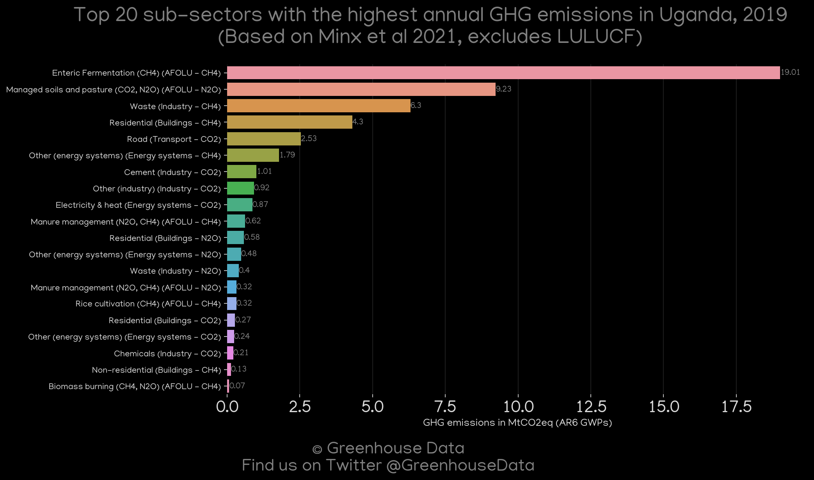
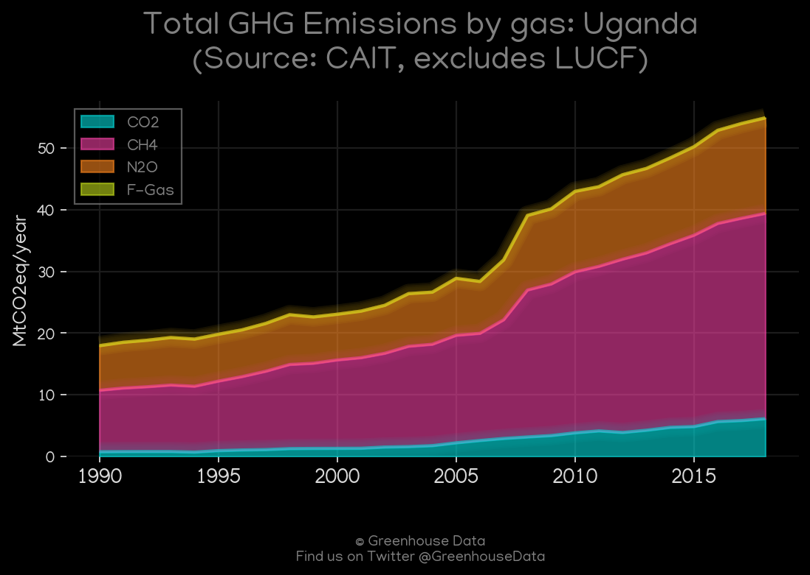
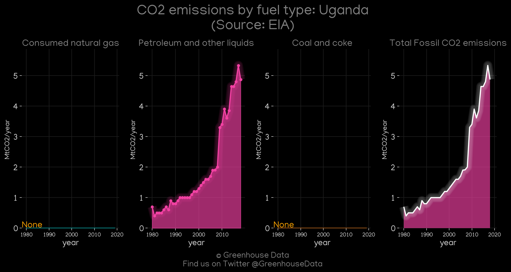
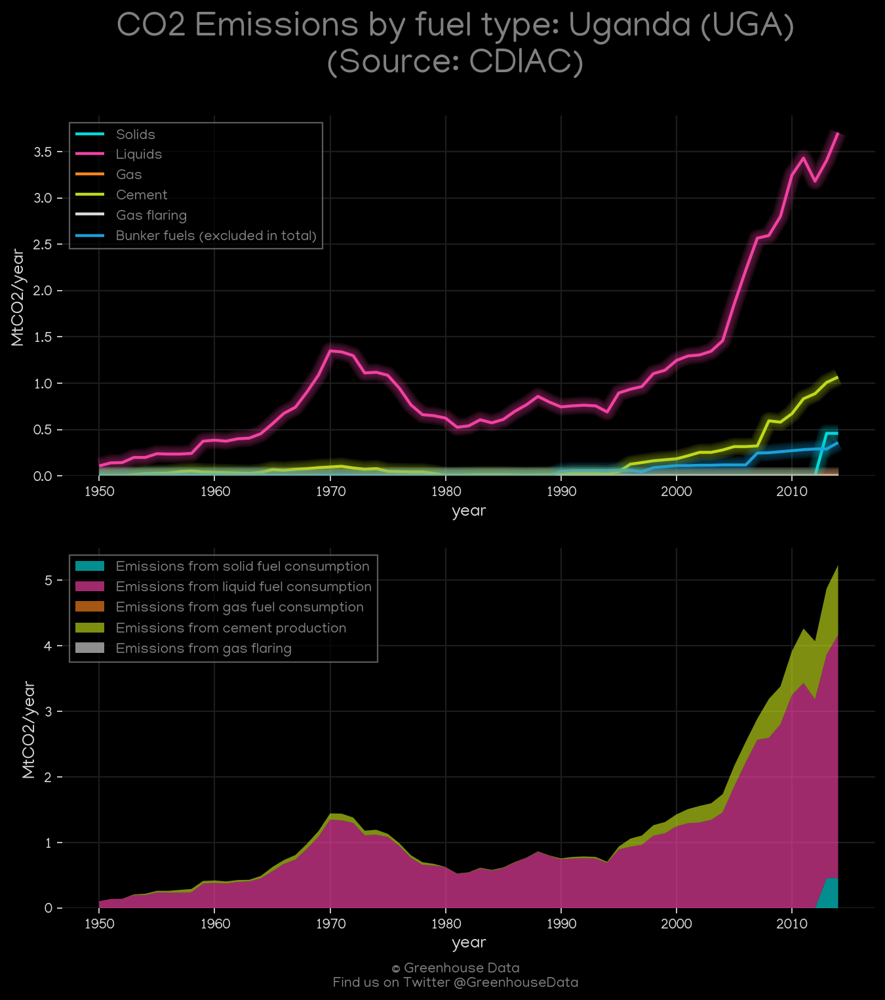
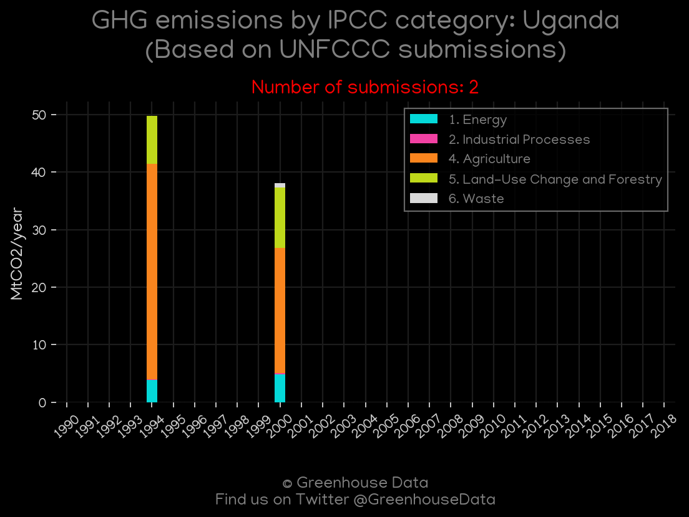
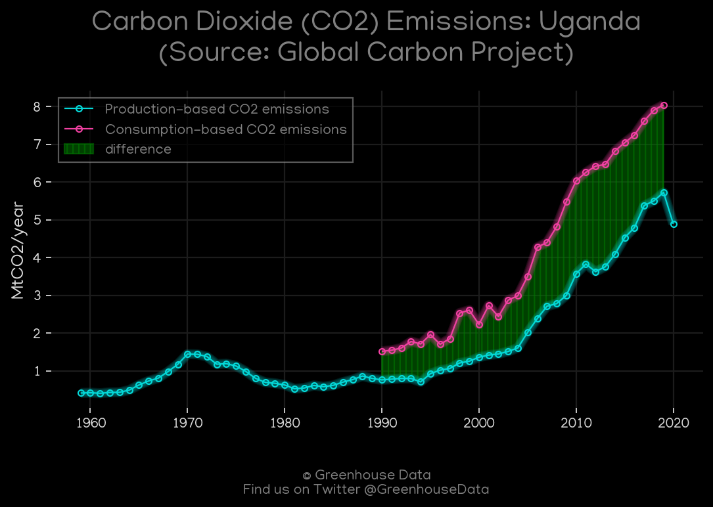
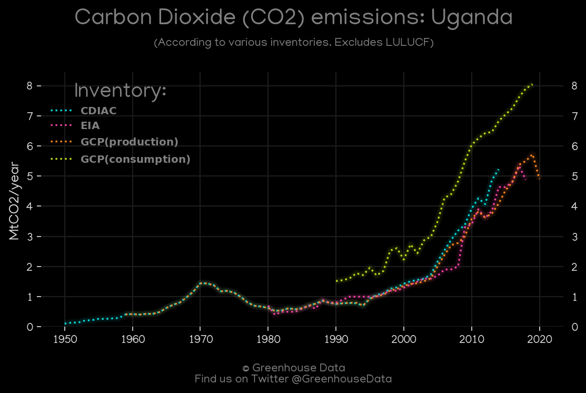

<h1 align="center">
🇺🇬🇺🇬🇺🇬🇺🇬🇺🇬
 
Uganda
 
🇺🇬🇺🇬🇺🇬🇺🇬🇺🇬
</h1>
<h2>Datasets:</h2>

<a href="https://github.com/dquintani/GreenhouseData/tree/master/country_data/UGA_Uganda/data">View on Github</a>
 

<a href="data/UGA_GCP.csv">GCP</a> || <a href="data/UGA_FAO.csv">FAO</a> || <a href="data/UGA_GCP_consupmption.csv">GCP_consupmption</a> || <a href="data/UGA_PRIMAP-hist.csv">PRIMAP-hist</a> || <a href="data/UGA_EPA.csv">EPA</a> || <a href="data/UGA_EIA.csv">EIA</a> || <a href="data/UGA_CAIT.csv">CAIT</a> || <a href="data/UGA_EDGAR.csv">EDGAR</a> || <a href="data/UGA_Minx_2021.csv">Minx_2021</a> || <a href="data/UGA_CDIAC.csv">CDIAC</a>

 

<h1>Figures:</h1><h2>#1 (UGA_Minx_top20_subsectors)</h2>

<h2>#2 (UGA_CAIT_gases_1)</h2>

<h2>#3 (UGA_EIA_1)</h2>

<h2>#4 (UGA_CDIAC_1)</h2>

<h2>#5 (UGA_UNFCCC_NAI_1)</h2>

<h2>#6 (UGA_GCP_1)</h2>

<h2>#7 (UGA_CO2_totals)</h2>

