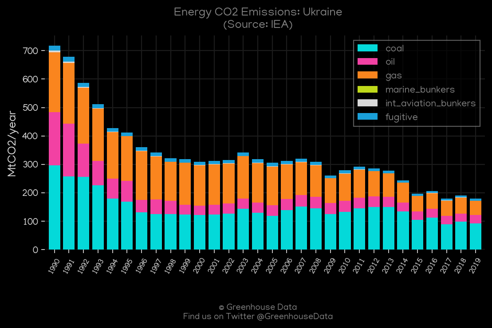
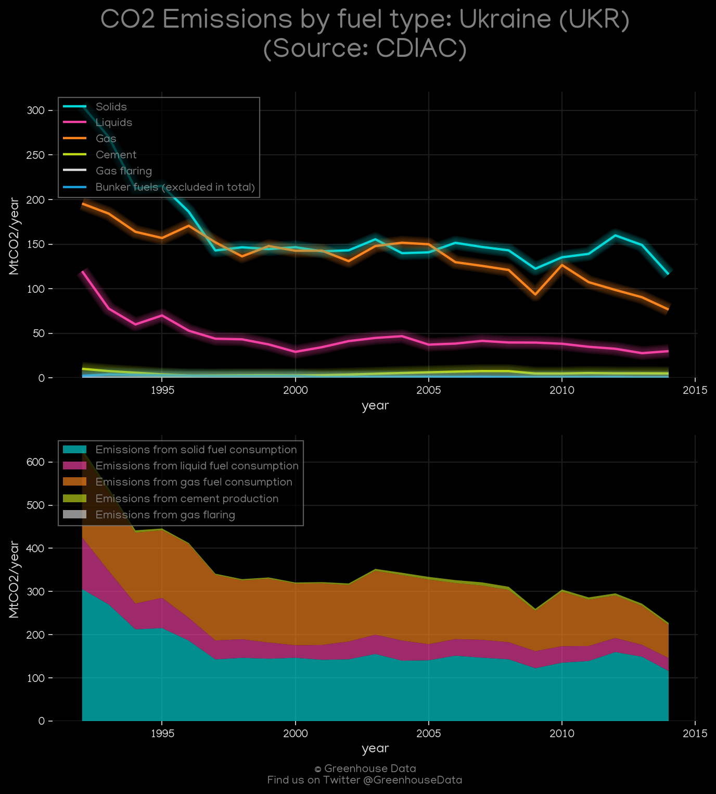
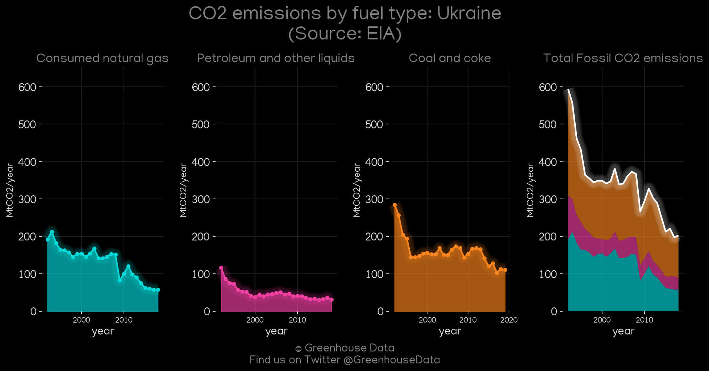
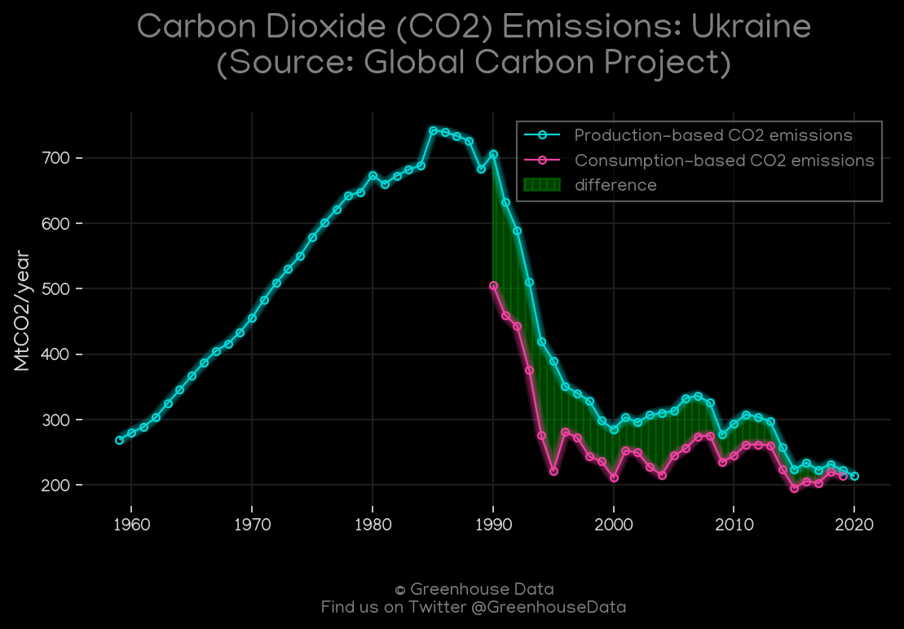
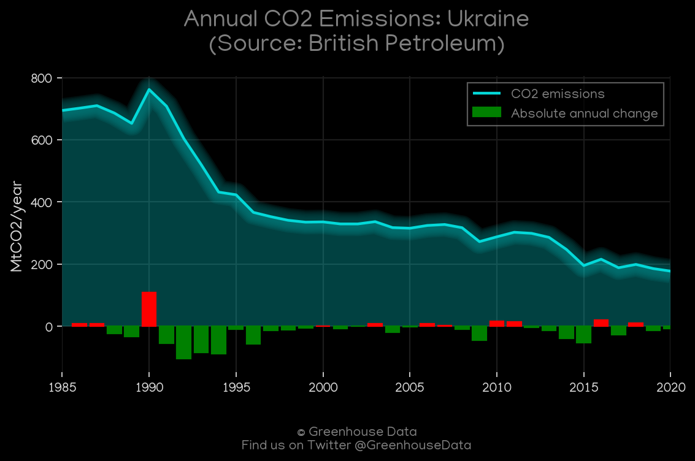
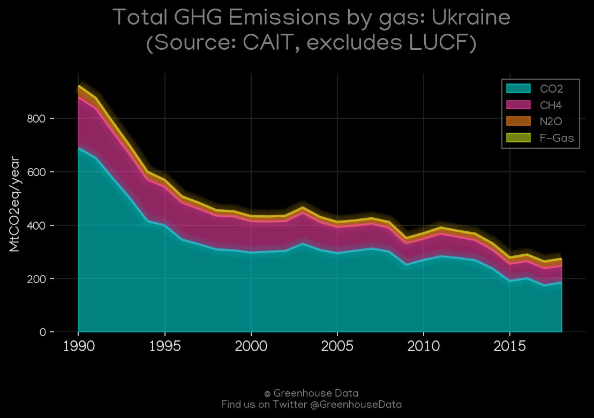
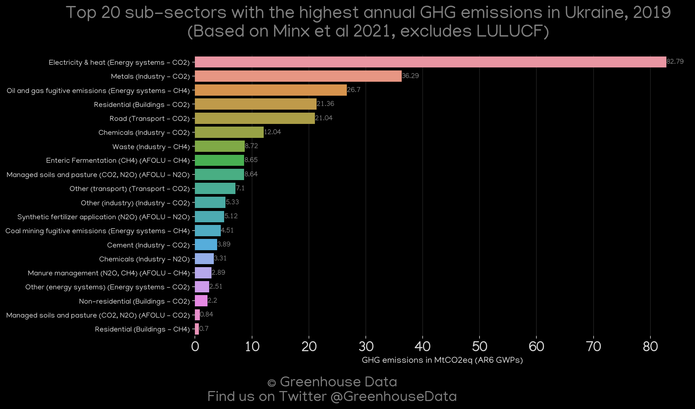
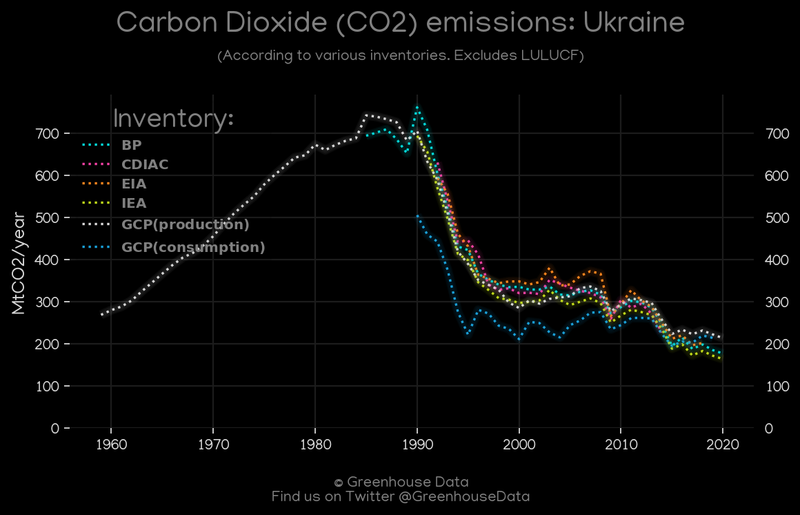
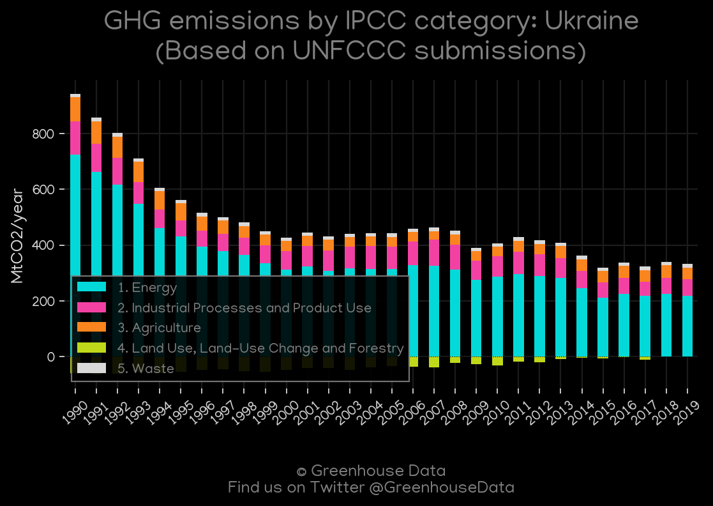

<h1 align="center">
🇺🇦🇺🇦🇺🇦🇺🇦🇺🇦
 
Ukraine
 
🇺🇦🇺🇦🇺🇦🇺🇦🇺🇦
</h1>
<h2>Datasets:</h2>

<a href="https://github.com/dquintani/GreenhouseData/tree/master/country_data/UKR_Ukraine/data">View on Github</a>
 

<a href="data/UKR_EDGAR.csv">EDGAR</a> || <a href="data/UKR_Minx_2021.csv">Minx_2021</a> || <a href="data/UKR_EPA.csv">EPA</a> || <a href="data/UKR_GCP.csv">GCP</a> || <a href="data/UKR_PRIMAP-hist.csv">PRIMAP-hist</a> || <a href="data/UKR_GCP_consupmption.csv">GCP_consupmption</a> || <a href="data/UKR_FAO.csv">FAO</a> || <a href="data/UKR_EIA.csv">EIA</a> || <a href="data/UKR_CAIT.csv">CAIT</a> || <a href="data/UKR_BP.csv">BP</a> || <a href="data/UKR_CDIAC.csv">CDIAC</a> || <a href="data/UKR_IEA.csv">IEA</a>

 

<h1>Figures:</h1><h2>#1 (UKR_IEA_1)</h2>

<h2>#2 (UKR_CDIAC_1)</h2>

<h2>#3 (UKR_EIA_1)</h2>

<h2>#4 (UKR_GCP_1)</h2>

<h2>#5 (UKR_BP_1)</h2>

<h2>#6 (UKR_CAIT_gases_1)</h2>

<h2>#7 (UKR_Minx_top20_subsectors)</h2>

<h2>#8 (UKR_CO2_totals)</h2>

<h2>#9 (UKR_UNFCCC_AI_1)</h2>

