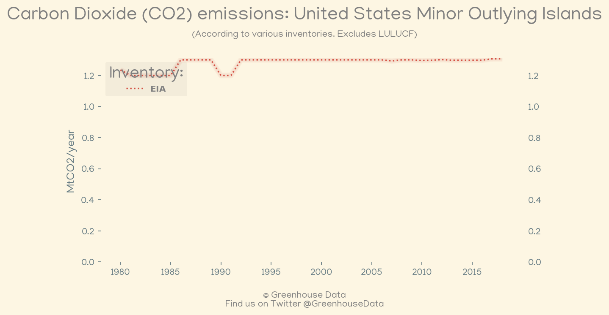
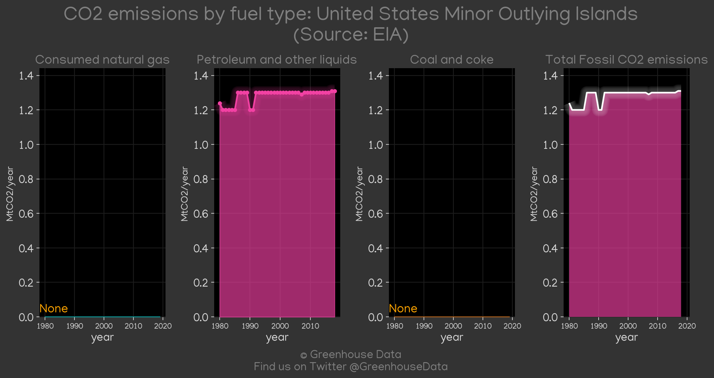

<h1 align="center">
🇺🇲🇺🇲🇺🇲🇺🇲🇺🇲
 
United States Minor Outlying Islands
 
🇺🇲🇺🇲🇺🇲🇺🇲🇺🇲
</h1>
<h2>Datasets:</h2>

<a href="https://github.com/dquintani/GreenhouseData/tree/master/country_data/UMI_United States Minor Outlying Islands/data">View on Github</a>
 

<a href="data/UMI_EIA.csv">EIA</a> || <a href="data/UMI_EDGAR.csv">EDGAR</a> || <a href="data/UMI_Minx_2021.csv">Minx_2021</a>

 

<h1>Figures:</h1><h2>#1 (UMI_CO2_totals)</h2>

<h2>#2 (UMI_EIA_1)</h2>

