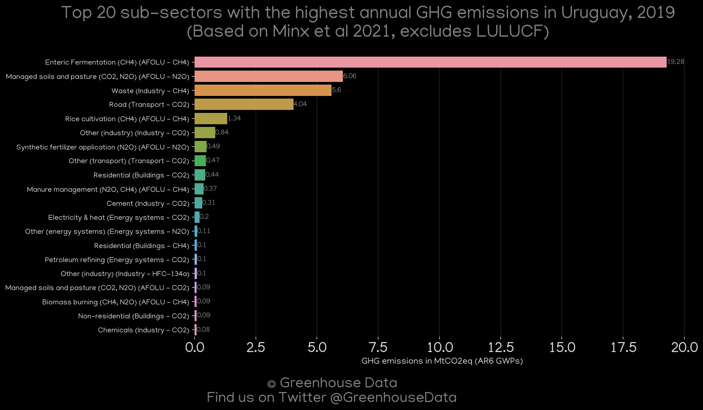
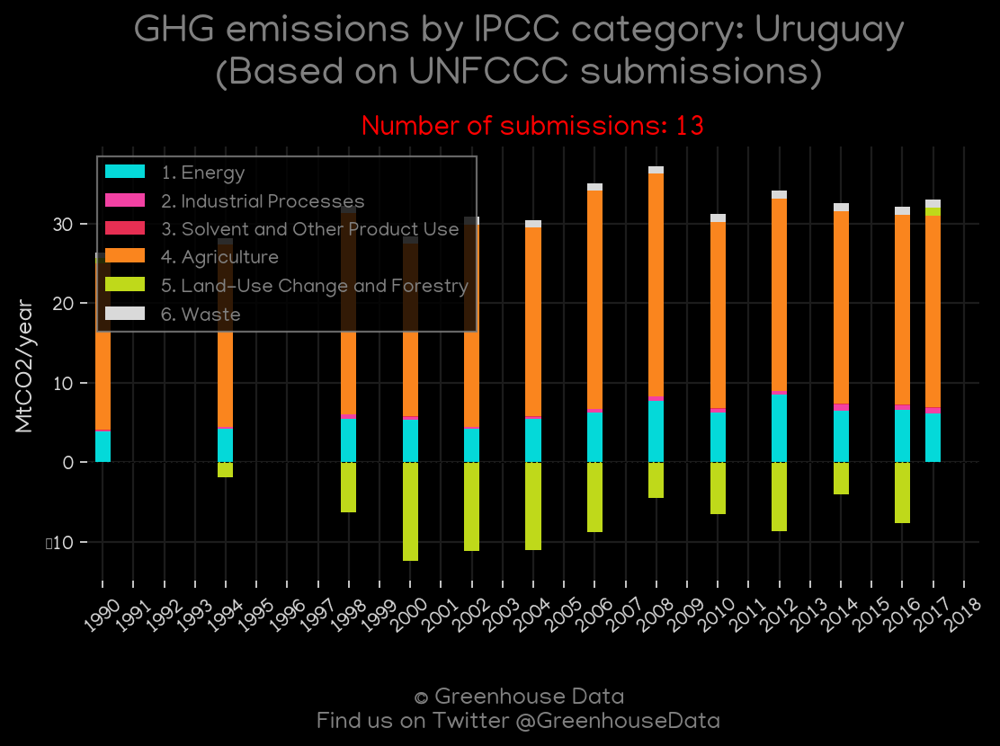
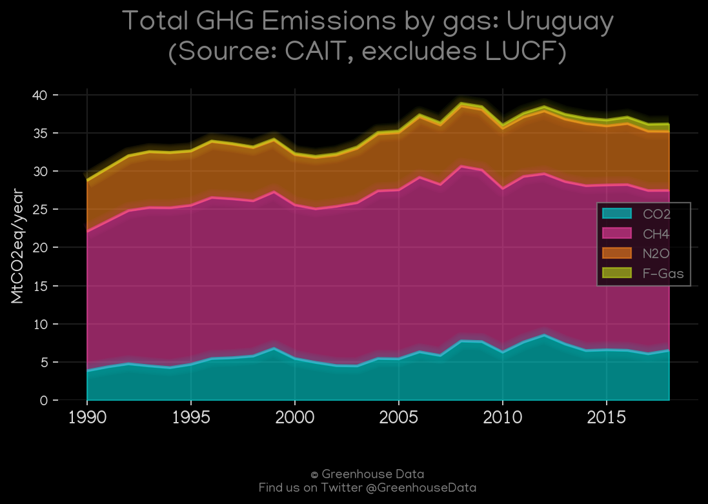
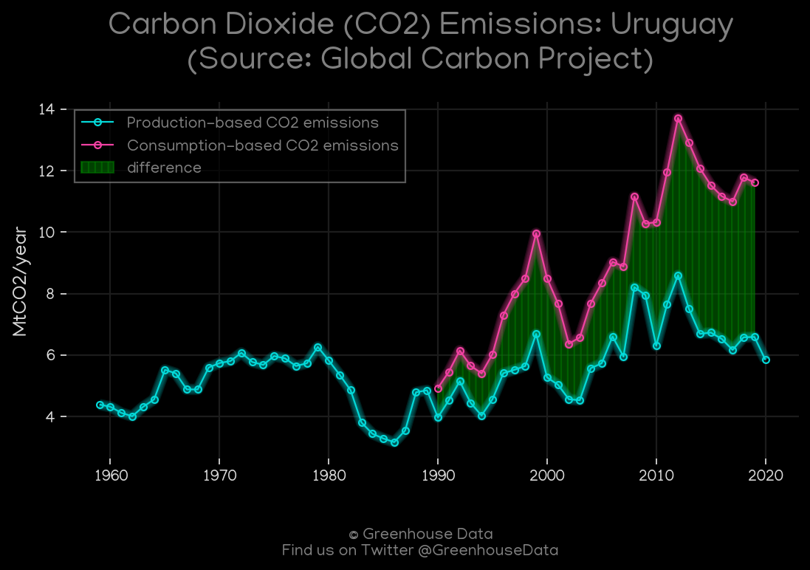
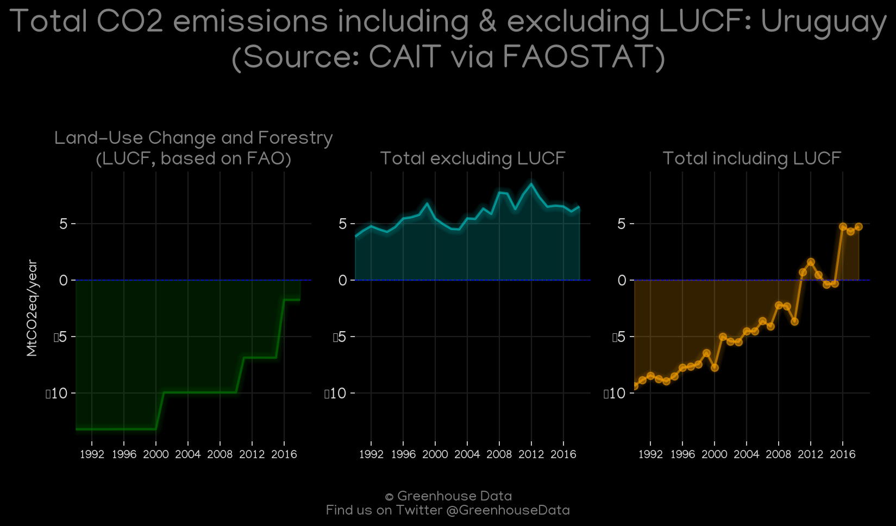
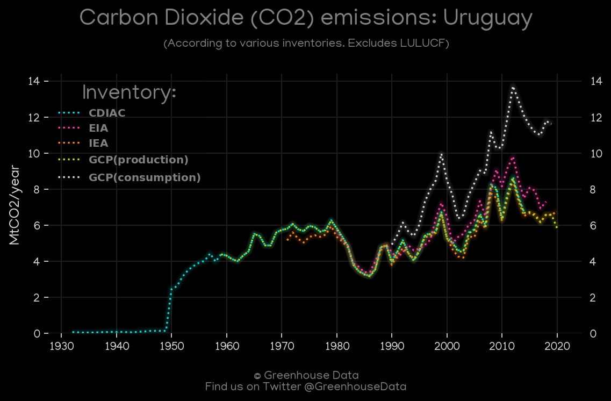

<h1 align="center">
🇺🇾🇺🇾🇺🇾🇺🇾🇺🇾
 
Uruguay
 
🇺🇾🇺🇾🇺🇾🇺🇾🇺🇾
</h1>
<h2>Datasets:</h2>

<a href="https://github.com/dquintani/GreenhouseData/tree/master/country_data/URY_Uruguay/data">View on Github</a>
 

<a href="data/URY_GCP_consupmption.csv">GCP_consupmption</a> || <a href="data/URY_CAIT.csv">CAIT</a> || <a href="data/URY_EIA.csv">EIA</a> || <a href="data/URY_EDGAR.csv">EDGAR</a> || <a href="data/URY_GCP.csv">GCP</a> || <a href="data/URY_FAO.csv">FAO</a> || <a href="data/URY_EPA.csv">EPA</a> || <a href="data/URY_CDIAC.csv">CDIAC</a> || <a href="data/URY_IEA.csv">IEA</a> || <a href="data/URY_PRIMAP-hist.csv">PRIMAP-hist</a> || <a href="data/URY_Minx_2021.csv">Minx_2021</a>

 

<h1>Figures:</h1><h2>#1 (URY_Minx_top20_subsectors)</h2>

<h2>#2 (URY_UNFCCC_NAI_1)</h2>

<h2>#3 (URY_CAIT_gases_1)</h2>

<h2>#4 (URY_GCP_1)</h2>

<h2>#5 (URY_EIA_1)</h2>

<h2>#6 (URY_IEA_1)</h2>

<h2>#7 (URY_CDIAC_1)</h2>

<h2>#8 (URY_CAIT_lucf_vs_nolucf)</h2>

<h2>#9 (URY_CO2_totals)</h2>

