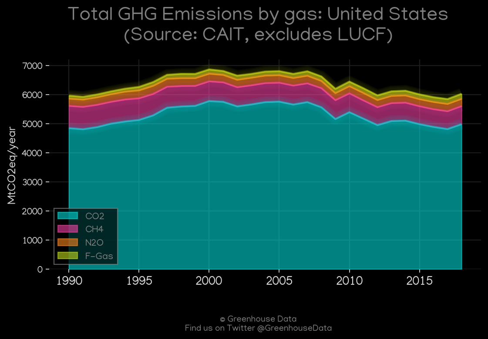
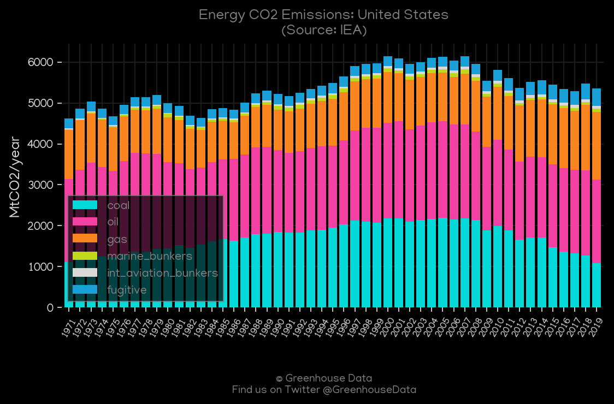
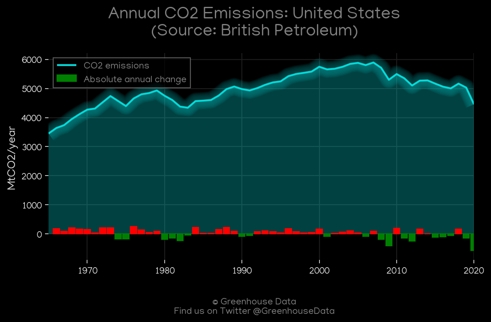
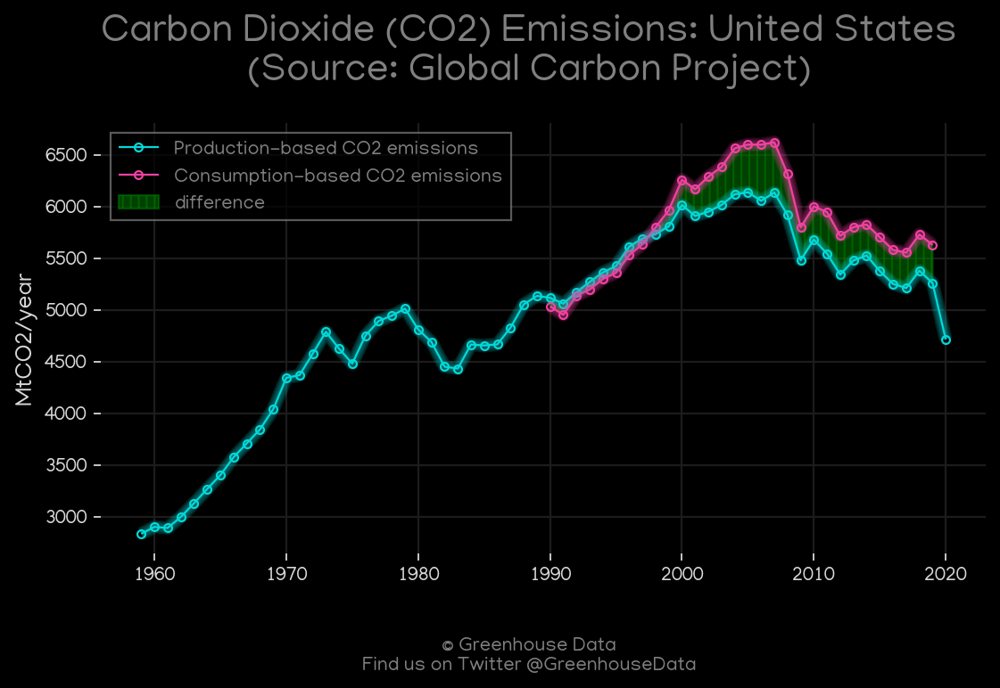
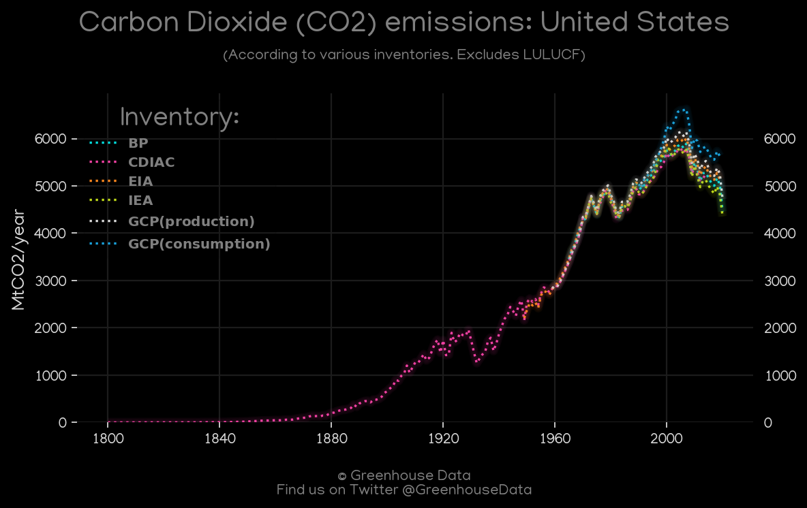
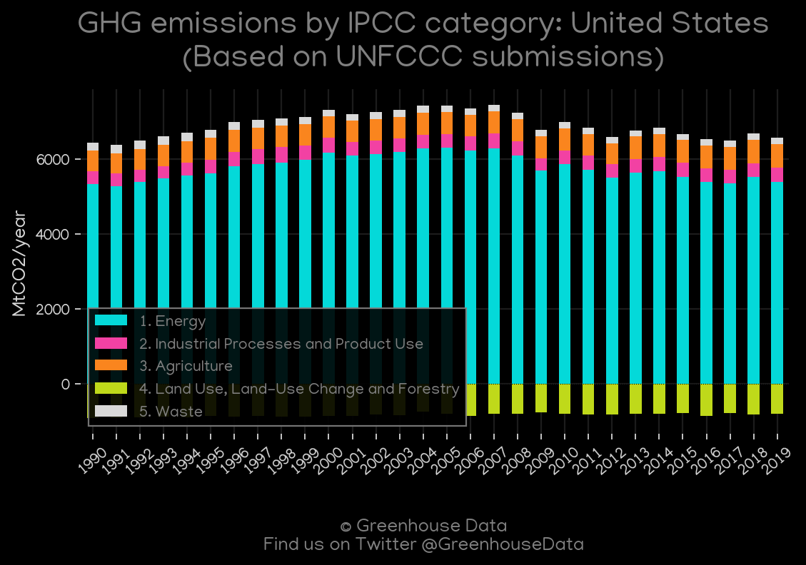
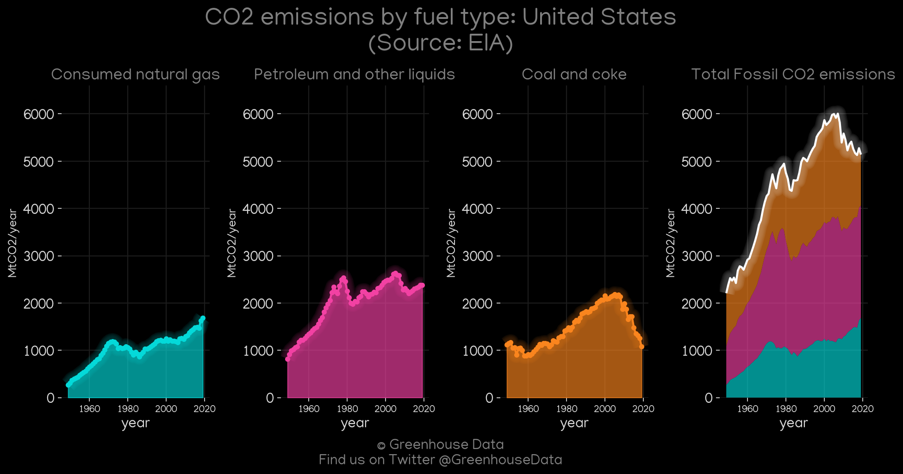
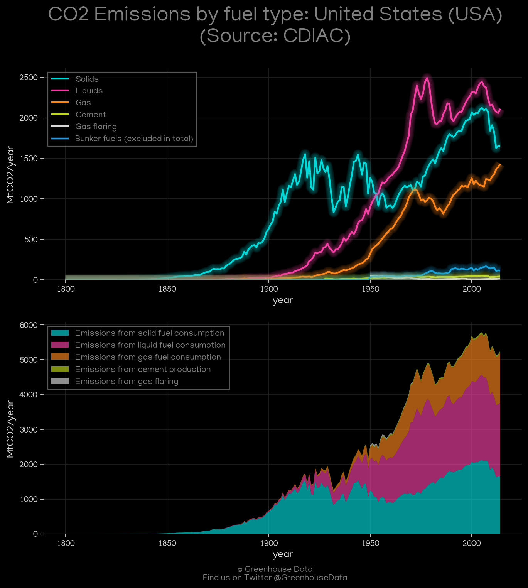

<h1 align="center">
🇺🇸🇺🇸🇺🇸🇺🇸🇺🇸
 
United States
 
🇺🇸🇺🇸🇺🇸🇺🇸🇺🇸
</h1>
<h2>Datasets:</h2>

<a href="https://github.com/dquintani/Greenhouse-Data/tree/master/country_data/USA_United States/data">View on Github</a>
 

<a href="data/USA_GCP_cons.csv">GCP_cons</a> || <a href="data/USA_EPA.csv">EPA</a> || <a href="data/USA_FAO.csv">FAO</a> || <a href="data/USA_GCP_consupmption.csv">GCP_consupmption</a> || <a href="data/USA_EDGAR.csv">EDGAR</a> || <a href="data/USA_EIA.csv">EIA</a> || <a href="data/USA_CDIAC.csv">CDIAC</a> || <a href="data/USA_CAIT.csv">CAIT</a> || <a href="data/USA_PRIMAP-hist.csv">PRIMAP-hist</a> || <a href="data/USA_IEA.csv">IEA</a> || <a href="data/USA_BP.csv">BP</a> || <a href="data/USA_GCP.csv">GCP</a> || <a href="data/USA_Minx_2021.csv">Minx_2021</a>

 

<h1>Figures:</h1><h2>#1 (USA_CAIT_gases_1)</h2>

<h2>#2 (USA_Minx_top20_subsectors)</h2>

<h2>#3 (USA_IEA_1)</h2>

<h2>#4 (USA_BP_1)</h2>

<h2>#5 (USA_GCP_1)</h2>

<h2>#6 (USA_CO2_totals)</h2>

<h2>#7 (USA_UNFCCC_AI_1)</h2>

<h2>#8 (USA_EIA_1)</h2>

<h2>#9 (USA_CDIAC_1)</h2>

