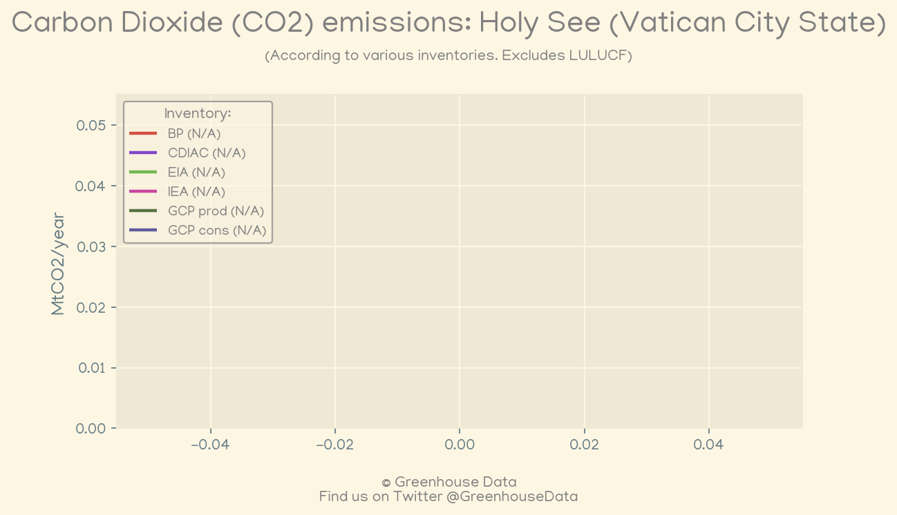
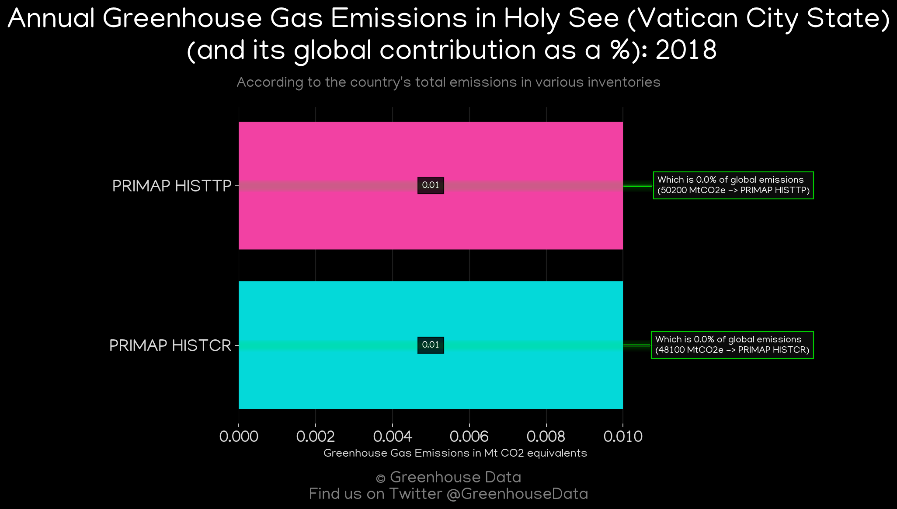

<h1 align="center">
🇻🇦🇻🇦🇻🇦🇻🇦🇻🇦
 
Holy See (Vatican City State)
 
🇻🇦🇻🇦🇻🇦🇻🇦🇻🇦
</h1>
<h2>Datasets:</h2>

<a href="https://github.com/dquintani/GreenhouseData/tree/master/country_data/VAT_Holy See (Vatican City State)/data">View on Github</a>
 

<a href="data/VAT_PRIMAP-hist.csv">PRIMAP-hist</a> || <a href="data/VAT_FAO.csv">FAO</a> || <a href="data/VAT_EPA.csv">EPA</a>

 

<h1>Figures:</h1><h2>#1 (VAT_CO2_totals)</h2>

<h2>#2 (VAT_relative_totals)</h2>

