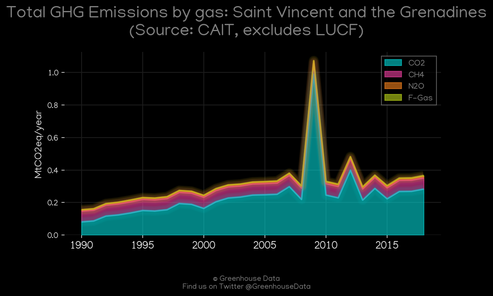
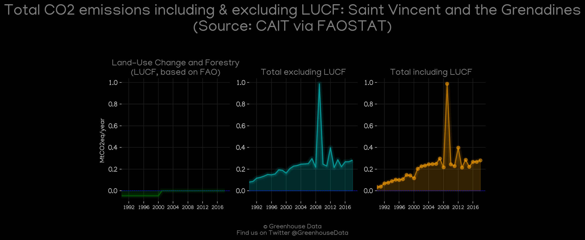
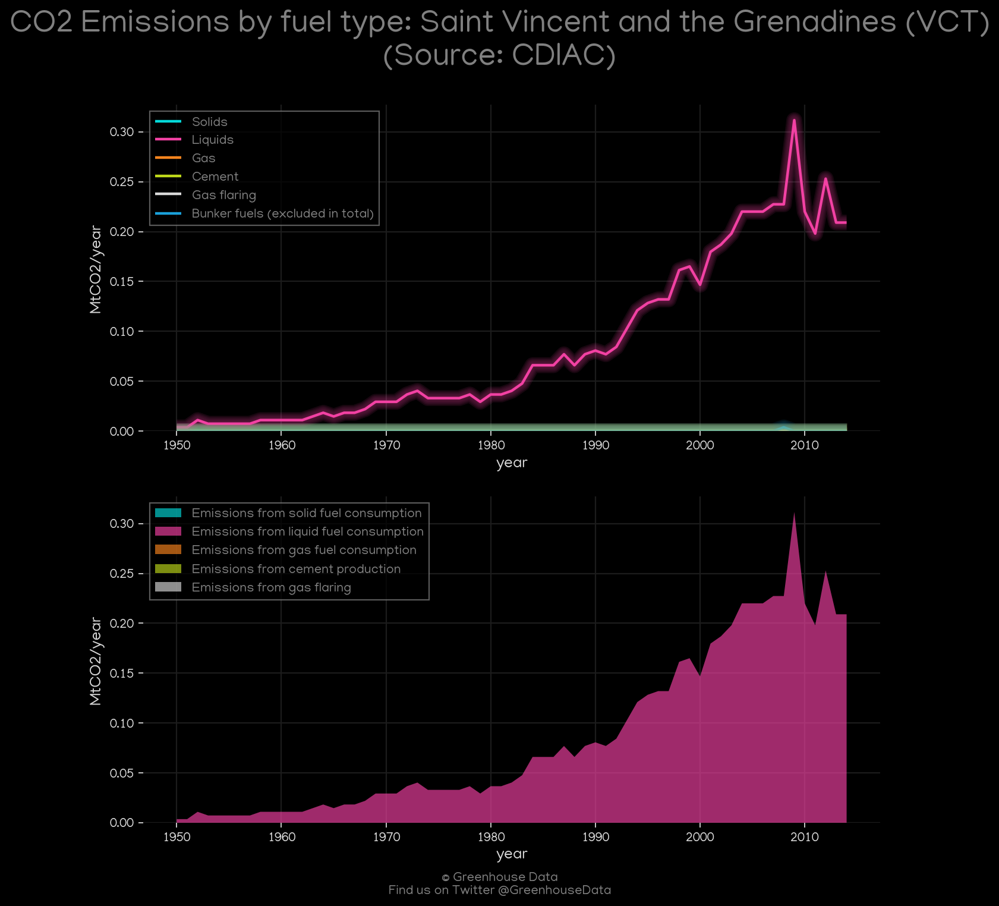
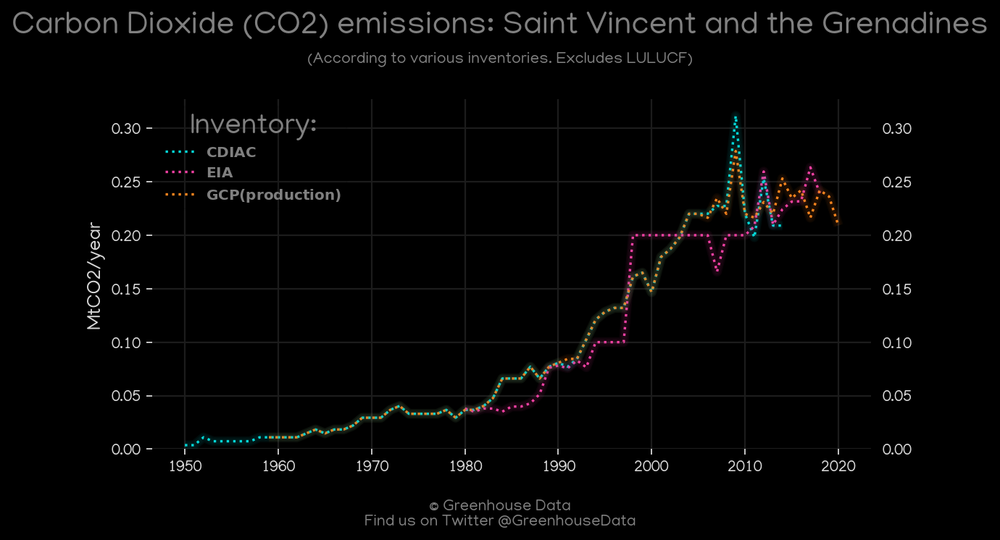
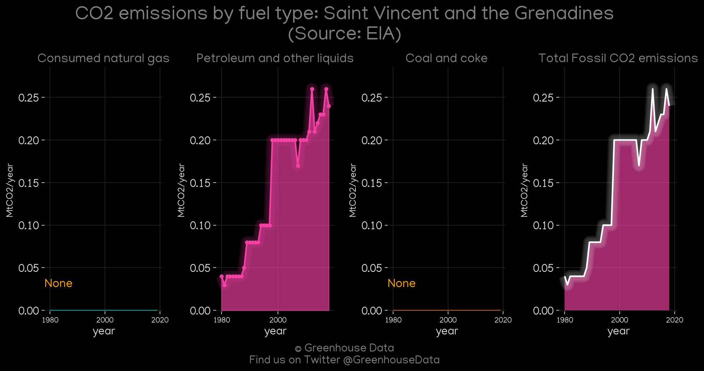
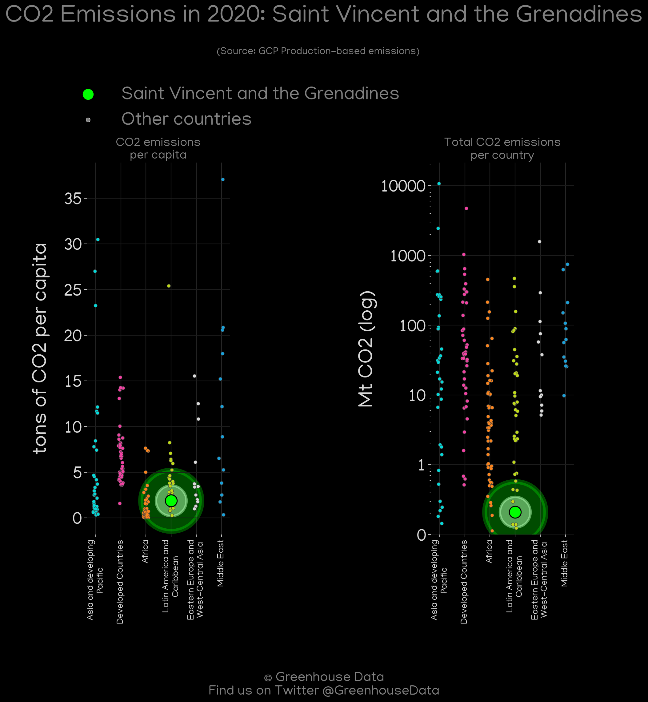
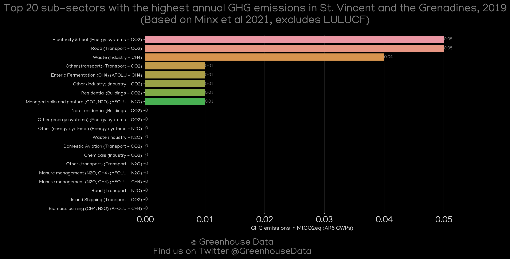
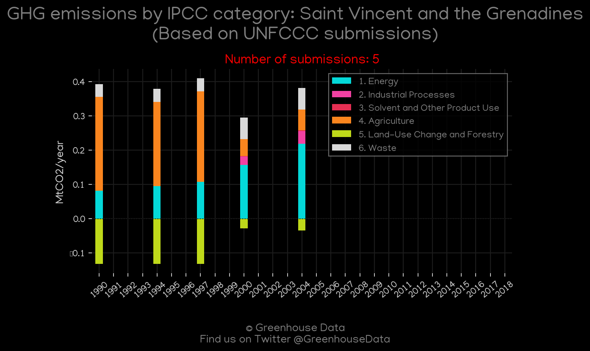

<h1 align="center">
🇻🇨🇻🇨🇻🇨🇻🇨🇻🇨
 
Saint Vincent and the Grenadines
 
🇻🇨🇻🇨🇻🇨🇻🇨🇻🇨
</h1>
<h2>Datasets:</h2>

<a href="https://github.com/dquintani/GreenhouseData/tree/master/country_data/VCT_Saint Vincent and the Grenadines/data">View on Github</a>
 

<a href="data/VCT_CAIT.csv">CAIT</a> || <a href="data/VCT_CDIAC.csv">CDIAC</a> || <a href="data/VCT_EDGAR.csv">EDGAR</a> || <a href="data/VCT_EIA.csv">EIA</a> || <a href="data/VCT_EPA.csv">EPA</a> || <a href="data/VCT_FAO.csv">FAO</a> || <a href="data/VCT_GCP.csv">GCP</a> || <a href="data/VCT_GCP_consupmption.csv">GCP_consupmption</a> || <a href="data/VCT_Minx_2021.csv">Minx_2021</a> || <a href="data/VCT_PRIMAP-hist.csv">PRIMAP-hist</a>

 

<h1>Figures:</h1><h2>#1 (VCT_CAIT_gases_1)</h2>

<h2>#2 (VCT_CAIT_lucf_vs_nolucf)</h2>

<h2>#3 (VCT_CDIAC_1)</h2>

<h2>#4 (VCT_CO2_totals)</h2>

<h2>#5 (VCT_EIA_1)</h2>

<h2>#6 (VCT_GCP_1)</h2>

<h2>#7 (VCT_GCP_Country_Highlight)</h2>

<h2>#8 (VCT_Minx_top20_subsectors)</h2>

<h2>#9 (VCT_relative_totals)</h2>

<h2>#10 (VCT_UNFCCC_NAI_1)</h2>

