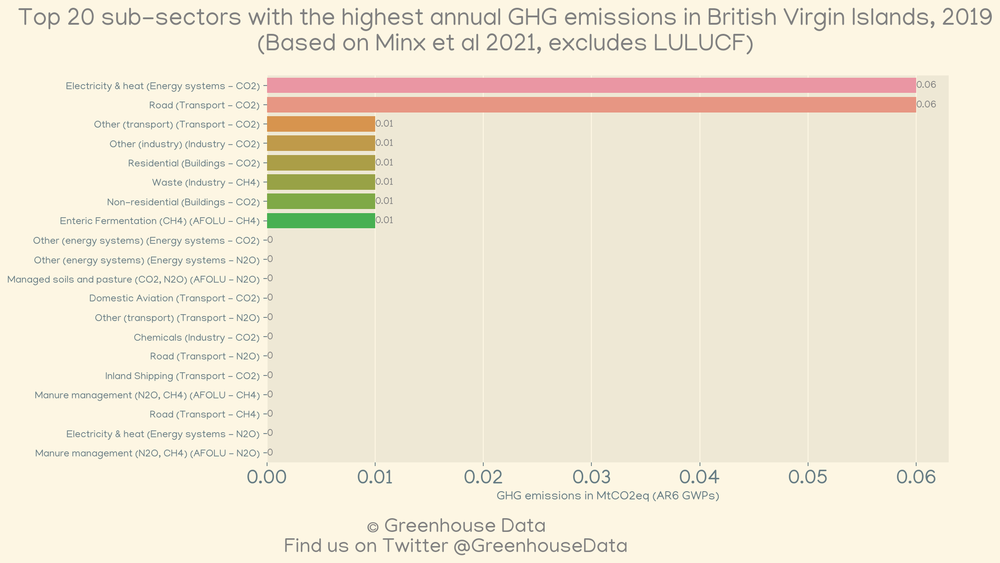
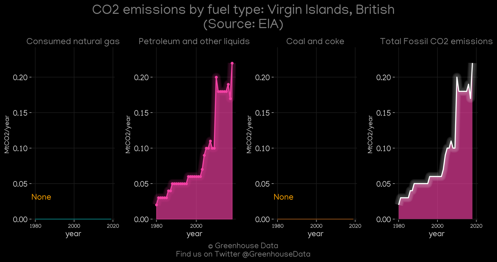
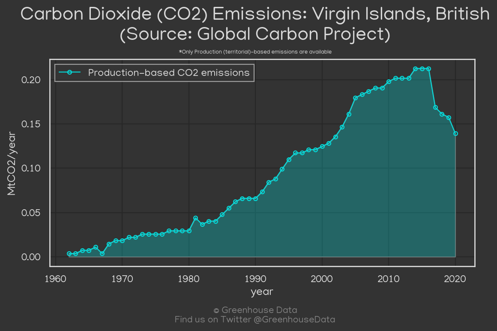
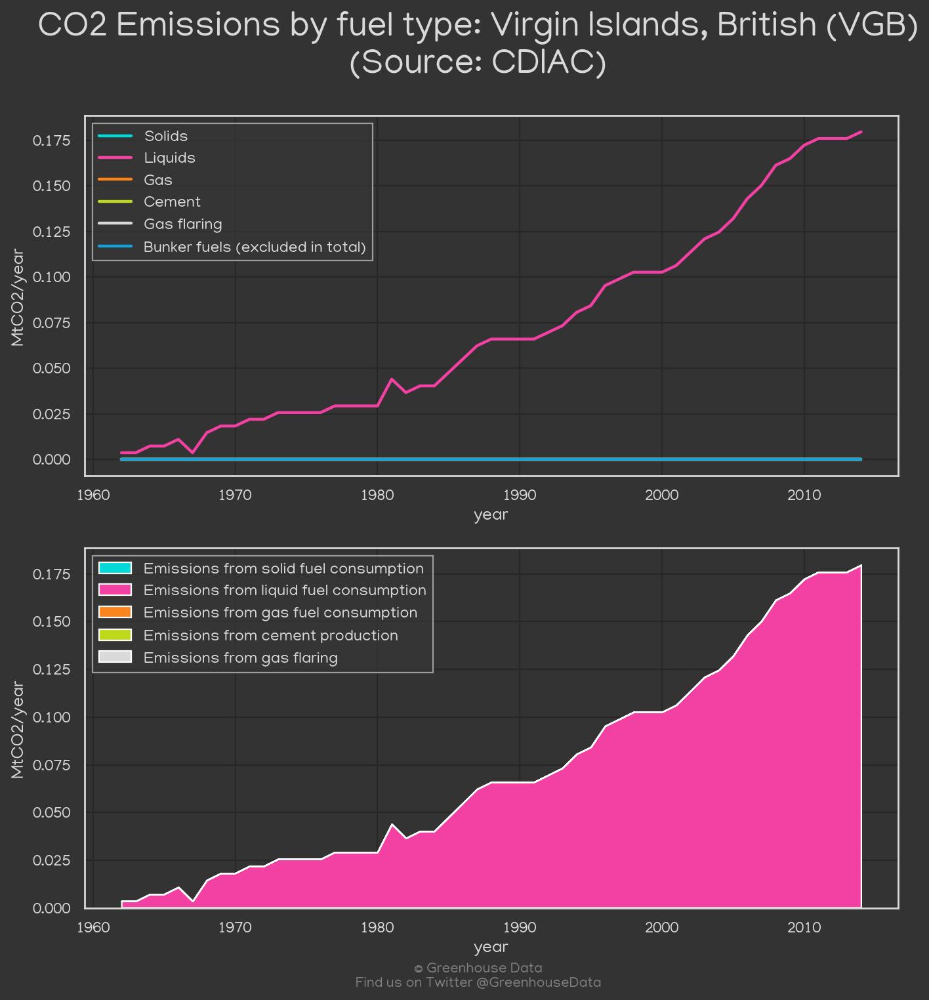
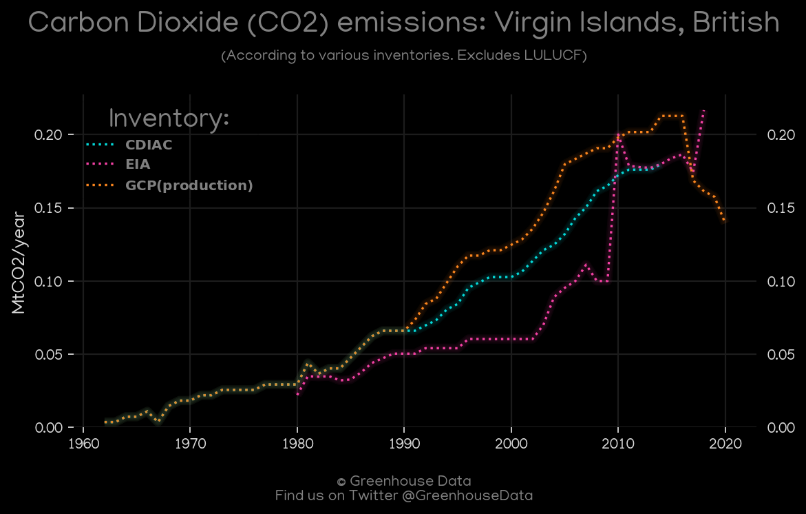
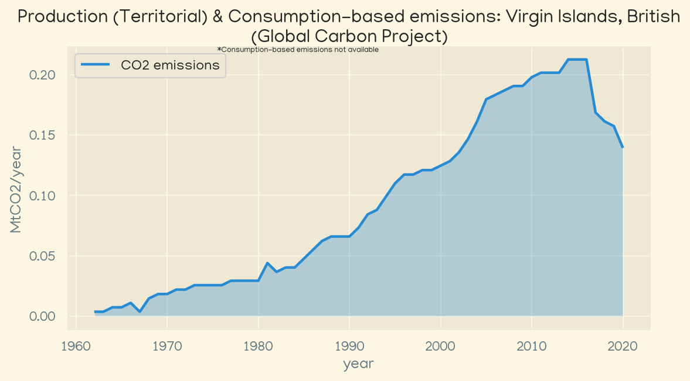

<h1 align="center">
🇻🇬🇻🇬🇻🇬🇻🇬🇻🇬
 
Virgin Islands, British
 
🇻🇬🇻🇬🇻🇬🇻🇬🇻🇬
</h1>
<h2>Datasets:</h2>

<a href="https://github.com/dquintani/GreenhouseData/tree/master/country_data/VGB_Virgin Islands, British/data">View on Github</a>
 

<a href="data/VGB_EIA.csv">EIA</a> || <a href="data/VGB_GCP.csv">GCP</a> || <a href="data/VGB_GCP_consupmption.csv">GCP_consupmption</a> || <a href="data/VGB_CDIAC.csv">CDIAC</a> || <a href="data/VGB_GCP_cons.csv">GCP_cons</a> || <a href="data/VGB_Minx_2021.csv">Minx_2021</a> || <a href="data/VGB_EDGAR.csv">EDGAR</a> || <a href="data/VGB_PRIMAP-hist.csv">PRIMAP-hist</a> || <a href="data/VGB_FAO.csv">FAO</a>

 

<h1>Figures:</h1><h2>#1 (VGB_Minx_top20_subsectors)</h2>

<h2>#2 (VGB_EIA_1)</h2>

<h2>#3 (VGB_GCP_1)</h2>

<h2>#4 (VGB_CDIAC_1)</h2>

<h2>#5 (VGB_CO2_totals)</h2>

<h2>#6 (VGB_BP_1)</h2>

