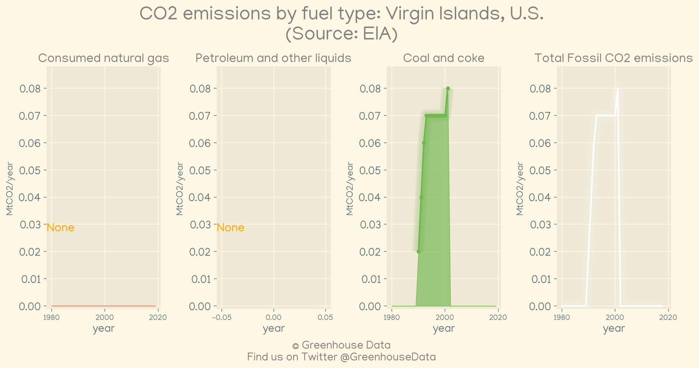
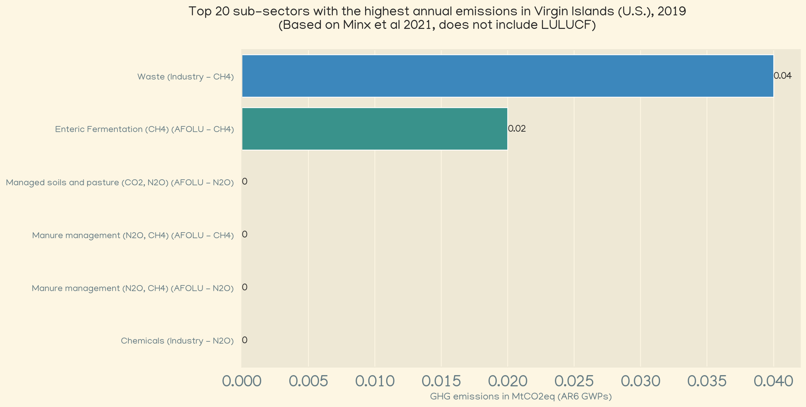
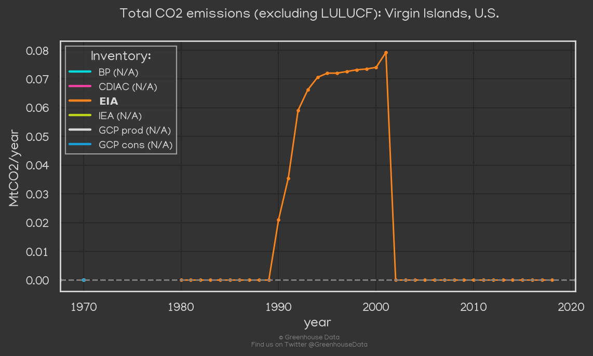

<h1 align="center">
🇻🇮🇻🇮🇻🇮🇻🇮🇻🇮
 
Virgin Islands, U.S.
 
🇻🇮🇻🇮🇻🇮🇻🇮🇻🇮
</h1>
<h2>Datasets:</h2>

<a href="https://github.com/dquintani/Greenhouse-Data/tree/master/country_data/VIR_Virgin Islands, U.S./data">View on Github</a>
 

<a href="data/VIR_EDGAR.csv">EDGAR</a> || <a href="data/VIR_FAO.csv">FAO</a> || <a href="data/VIR_EIA.csv">EIA</a> || <a href="data/VIR_Minx_2021.csv">Minx_2021</a>

 

<h1>Figures:</h1><h2>#1 (VIR_EIA_1)</h2>

<h2>#2 (VIR_Minx_top20_subsectors)</h2>

<h2>#3 (VIR_CO2_totals)</h2>

